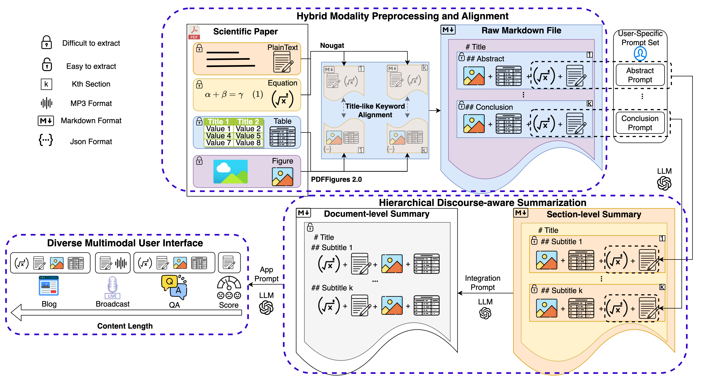
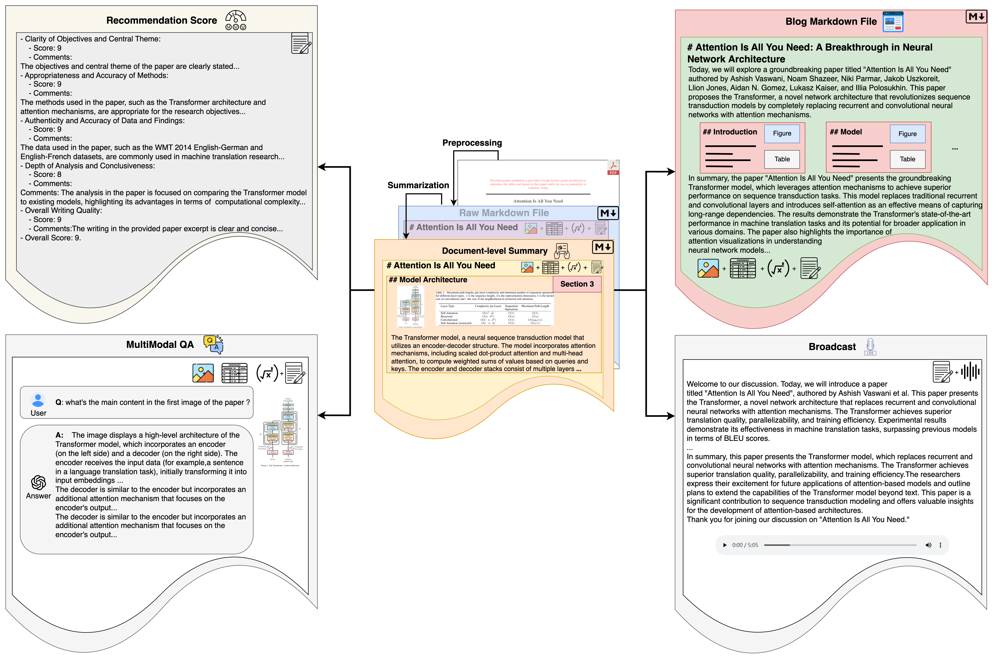
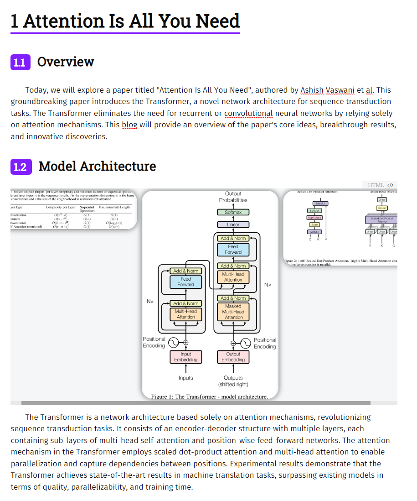

# The repository for Bridging Research and Readers: A Multi-Modal Automated Academic Papers Interpretation System

# ✨ Latest News

- [02/20/2024] : Incorporate updates to Open APIs complete with relevant calling methods in [api_usage.ipynb](client/api_usage.ipynb) 

- [02/05/2024] : Release the code of preprocessing

*   [01/16/2024]: Release the [tech report](https://arxiv.org/abs/2401.09150).

# TODO List

- [x] Open the base code of each part

- [x] Open the API of each part in the whole workflow to convenient user 
- [ ] Optimize the User Intereface(UI) to better improve user's interactive experience
- [ ] Speed up code


# ⚡ Introduction

Welcome to the repository of MMAPIS!

In the contemporary information era, significantly accelerated by the advent of Large-scale Language Models (LLMs), the proliferation of scientific literature is reaching unprecedented levels. Researchers urgently require efficient tools for reading and summarizing academic papers, uncovering significant scientific literature, and employing diverse interpretative methodologies. To address this burgeoning demand, the role of automated scientific literature interpretation systems has become paramount. However, prevailing models, both commercial and open-source, confront notable challenges: they often overlook multimodal data, grapple with summarizing over-length texts, and lack diverse user interfaces. In response, we introduce an open-source multi-modal automated academic paper interpretation system (MMAPIS) with three-step process stages, incorporating LLMs to augment its functionality. Our system first employs the hybrid modality preprocessing and alignment module to extract plain text, and tables or figures from documents separately. It then aligns this information based on the section names they belong to, ensuring that data with identical section names are categorized under the same section. Following this, we introduce a hierarchical discourse-aware summarization method. It utilizes the extracted section names to divide the article into shorter text segments, facilitating specific summarizations both within and between sections via LLMs with specific prompts. Finally, we have designed four types of diversified user interfaces, including paper recommendation, multimodal Q\&A, audio broadcasting, and interpretation blog, which can be widely applied across various scenarios. Our qualitative and quantitative evaluations underscore the system's superiority, especially in scientific summarization, where it outperforms solutions relying solely on GPT-4. We hope our work can present an open-sourced user-centered solution that addresses the critical needs of the scientific community in our rapidly evolving digital landscape.


# 🎯 MMAPIS Architecture
Our system comprises three main parts: (1) Hybrid Modality Preprocessing and Alignment Module; (2) Hierarchical Discourse-Aware Summarization Module; (3) Diverse Multimodal User Interface Module. Firstly, the Hybrid Modality Preprocessing and Alignment Module effectively processes and integrates different types of information from papers separately, including text, images, and tables. Next, the Hierarchical Discourse-Aware Summarization Module utilizes advanced LLMs with special prompts to extract key information from each section of a paper, generating comprehensive and accurate summaries. Lastly, our system features a Diverse Multimodal User Interface Module, designed to meet the specific needs of various user groups, offering multiple interaction modes like paper recommendations, multimodal Q\&A, audio broadcasting, and interpretation blogs.



## 1. Hybrid Modality Preprocessing and Alignment Module
In our Hybrid Modality Preprocessing and Alignment Module, we innovatively combine the strengths of Nougat and PDFFigures 2.0 to transform PDF documents into Markdown format while preserving their essential multimodal content and hierarchical structure. Nougat's transformer-based model is adept at extracting textual content, including plaintext and mathematical formulas, directly from PDFs, ensuring minimal data loss and maintaining the document's inherent structure. Complementarily, PDFFigures 2.0 identifies and extracts critical figures and tables, including their attribution details. This dual approach not only preserves the rich multimodal information of the original document but also facilitates the alignment of these modalities with their respective structural elements, like section titles. The result is a semantically comprehensive and high-quality Markdown document that closely mirrors the original PDF, retaining its key experimental results and concepts, particularly vital in scientific documentation.

## 2. Hierarchical Discourse-Aware Summarization Module
In this module, we tackle the complexity of summarizing long documents through a novel two-stage Hierarchical Discourse-aware Summarization process. Initially, the document is segmented into sections based on hierarchical cues in the Markdown format, moving away from the rigid structure used in previous models like FacetSum. This segmentation allows for concise, section-level summaries that maintain the document's semantic integrity, with the flexibility to exclude non-essential parts such as appendices. Customized prompts, aligned with the generic structure of scientific papers, guide the extraction of key points from each section, while a universal prompt caters to sections without specific prompts. The second stage involves integrating these section-level summaries into a cohesive, document-level summary, emphasizing continuity and enriched with key information like titles and author details identified via NER technology. This method overcomes challenges like semantic fragmentation, offering a comprehensive and contextually rich summary suitable for interpretation systems.

## 3. Diverse Multimodal User Interface Module
Our Diverse Multimodal User Interface Module, built on a Streamlit-based interface, offers four distinct applications tailored for various user needs, based on the Hierarchical Discourse-Aware Summarization Module's output. The module includes a Paper Recommendation feature that evaluates research papers on multiple dimensions using LLM prompts, focusing on both summary and original text for a comprehensive assessment. A Multimodal Q&A feature enhances traditional Q&A by integrating queries about visual elements in papers, leveraging GPT models for precise responses. An Audio Broadcasting option converts summaries into easily digestible audio formats, ideal for quick information consumption, utilizing advanced text-to-speech technology. Lastly, an Interpretation Blog tool transforms summaries into detailed, reader-friendly blogs, offering in-depth exploration and understanding of the papers. This module effectively combines textual and visual data, ensuring a versatile and user-centric experience in engaging with research content.

# 📏Demo



Following is an output example from the *blog generation*, using the pdf of [Attention Is All You Need](https://arxiv.org/pdf/1706.03762.pdf) as the source."



# 📚 Evalution


| Dataset | Summarizer | Informative | Quality | Coherence | Attributable | Overall | Eval Average |
|---------|------------|-------------|---------|-----------|--------------|---------|--------------|
| CS2017  | Ours       | 4.534_0.256 | 4.440_0.297 | 4.518_0.349 | 4.568_0.381 | 4.521_0.240 | 4.516_0.305 |
|         | GPT-4      | 4.392_0.246 | 4.350_0.282 | 4.444_0.330 | 4.554_0.324 | 4.434_0.200 | 4.435_0.276 |
| CS2023  | Ours       | 4.498_0.204 | 4.376_0.344 | 4.455_0.395 | 4.439_0.516 | 4.454_0.250 | 4.444_0.342 |
|         | GPT-4      | 4.363_0.260 | 4.317_0.268 | 4.429_0.263 | 4.460_0.462 | 4.377_0.232 | 4.389_0.297 |


Please refer to [tech report](https://arxiv.org/abs/2401.09150) for more analysis results.

# 📋Project Framework
```
MMAPIS/
├── main.py			     # Main workflow
├── backend.py                # Initiates the backend services and manages the     │       					APIs for each segment
├── res/                      # Output file dir
│
├── config/                   # Configuration files
│   └── config.yaml           # Central configuration file (YAML format)
│   └── config.py             # Main configuration file
│   └── logging.ini           # Main logging format file
│   └── prompts_config.json   # Main prompt file
│
├── data/                     # Houses the input PDF data
│   └── xxx.pdf               
│   └── xxxx.pdf
│
├── tools/                    # Collection of independent tools and utilities
│   ├── arxiv_extractor/      # Tool for fetching documents from arXiv
│   │   ├── arxiv_helper.py
│   │   └── crawler_base.py
│   ├── nougat/               # Nougat tool for rich text and formula extraction
│   │   ├── nougat_main/      # Nougat Model
│   │   └── nougat_helper.py  
│   ├── pdffigure/            # PDFigure tool for image and table extraction
│   │   ├── PDFFigure_Extractor.py
│   │   └── pdf_extract/		# PDFFigure2 Model
│   ├── tts/                  # Text-to-Speech conversion tool
│   │   ├── tts_helper.py
│   │   └── youdao_tts.py
│   └── chatgpt/              # ChatGPT tool for various processing tasks
│   │   ├── chatgpt_helper.py
│   │   └── llm_helper.py
│   └── utils/              # Other tools
│       ├── save_file.py
│       └── llm_helper.py
│
├── server/                   # Main server-side system
│   ├── preprocessing/        # Preprocessing functionalities
│   │   └── alignment.py      # Script for aligning different modalities
│   │
│   ├── summarization/        # Two-stage summarization process
│   │   ├── section_summarizer.py # Script for section-level summary
│   │   └── summary_integrator.py # Script for integrating section summaries,i.e.                                                                               │   │						 produce document-level summary
│   │
│   └── downstream/           # Downstream functionalities
│       ├── paper_recommendation/ # Paper recommendation module
│       │   └── recommendation.py
│       ├── multimodal_qa/        # Multimodal Question and Answer module
│       │   ├── user_intent.py
│       │   └── answer_generation.py
│       ├── audio_broadcast/      # Audio broadcast module
│       │   ├── script_conversion.py
│       │   └── tts_integration.py
│       └── blog_generation/      # Blog generation module
│           ├── blog_script.py
│           └── image_integration.py
│
└── client/                   # Client-side visualization interface
    ├── input/                # Input processing
    ├── processing/           # Data processing
    ├── output/               # Output presentation
    └── display/              # UI display elements

```

# 🚀How to Run

1. Install the require python libraries

   ```
   pip install -r requirements.txt
   ```

2. Use [pdffigures2](https://github.com/allenai/pdffigures2) to extract figures and tables from scientific papers you need to configure the java environment.

   ```
   git clone https://github.com/allenai/pdffigures2.git
   cd pdffigures2
   export JAVA_HOME="your/path/to/java"
   ```

3. For spacy to calculate similarity of title-like keyword, you need to download `en_core_web_lg` with the following script:

   ```
   python -m spacy download en_core_web_lg
   ```

4. For Nougat, you need to download the  [Released pretrained weight](https://github.com/facebookresearch/nougat/releases) to the checkpoint path.

5. Make sure to setup your parameters in [config.yaml](config/config.yaml)

6. You can run the whole process by executing [main.py](main.py). The features are: 

   - Raw Markdown File of the PDF with plain text
   - Align figures with corresponding section in the Markdown file(multimodal)
   - Section-level summary markdown file with mulimodal 
   - Document-level summary markdown file with multimodal(based on the Section-level summary, but more focus on fluency and coherence)
   - Downstream Applications:
     - Recommendation Score
     - Broadcast style generation 
     - Blog style generation
     - Multimodal QA(Not open yet)

   ```
   cd path/to/MMAPIS
   python main.py
   ```

   If you process xxx.pdf, you will get output structure diagram:

   ```
   MMAPIS/
   ├── res/                       # Output file dir
   │   ├── xxx/                	 # File name as dirname
   │   │   ├── img/		      # Save dir of markdown image 
   │   │   ├── xxx.md             # Raw output markdown file of xxx.pdf with 	                                                                                   │   │						 plian text
   │   │   ├── xxx_raw_aligned.md # Aligned raw markdown file
   │   │   ├── broadcast.mp3      # the mp3 output of broadcast style generation 
   │   │   ├── broadcast.md       # the text of broadcast style generation 
   │   │   ├── xxx_section_summarized.md  # Section-level summary markdown file
   │   │   ├── xxx_document_summarized.md # Document-level summary markdown file
   │   │   └── xxx_blog.md        # Blog style generation
   ```

   


# Acknowledgement

- Released code of [Nougat](https://github.com/facebookresearch/nougat) and [PdfFigures2](https://github.com/allenai/pdffigures2)


# 📩 Contact

If you have any questions, please feel free to [contact](https://fjiangai.github.io) me. 


# Citation

```
@misc{jiang2024bridging,
      title={Bridging Research and Readers: A Multi-Modal Automated Academic Papers Interpretation System}, 
      author={Feng Jiang and Kuang Wang and Haizhou Li},
      year={2024},
      eprint={2401.09150},
      archivePrefix={arXiv},
      primaryClass={cs.CL}
}
```
We are from the School of Data Science, the Chinese University of Hong Kong, Shenzhen (CUHKSZ), and the Shenzhen Research Institute of Big Data (SRIBD). we welcome aspiring individuals to join our group and contribute to the new era of LLM.
