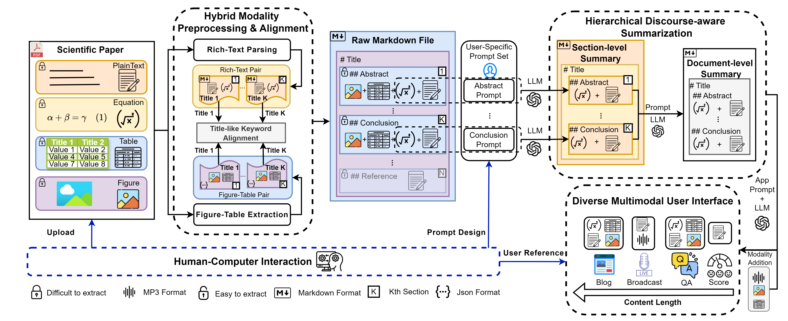

# The repository for Bridging Research and Readers: A Multi-Modal Automated Academic Papers Interpretation System

# ✨ Latest News

- \[10/06/2024]: ***Release Version Update***:
     - Optimized code structure for easier comprehension and secondary development.
     - Introduced a [video demo](#Demo) to enhance understanding of MMAPIS functionalities and usage.
- \[08/06/2024]: *New Pre-Release Version*:
     - **Middle-End Services Added:** This version introduces middle-end services, allowing the file system, API service, and front-end system to operate independently.
     - **Optimized Interactive Experience:** Enhancements have been made to improve the user interaction across all applications.
- [03/26/2024]: Launch of Interactive Functionality in Streamlit.
- [03/26/2024]: Deployment of Multimodal Question Answering (QA) Generation System.
- [02/20/2024] : Incorporate updates to Open APIs complete with relevant calling methods in [api_usage.ipynb](client/api_usage.ipynb) 
- [02/05/2024] : Release the code of preprocessing

*   [01/16/2024]: Release the [tech report](https://arxiv.org/abs/2401.09150).

# TODO List

- [x] Open-source the core code of each component.
- [x] Provide APIs for all components to facilitate user integration.
- [x] Refine the User Interface (UI) for an enhanced interactive experience.
- [x] Improve the Multimodal QA experience
- [x] Boost code execution speed and streamline code architecture.
- [ ] Add a Chinese language version


# TOC
- [The repository for Bridging Research and Readers: A Multi-Modal Automated Academic Papers Interpretation System](#the-repository-for-bridging-research-and-readers-a-multi-modal-automated-academic-papers-interpretation-system)
- [✨ Latest News](#-latest-news)
- [TODO List](#todo-list)
- [TOC](#toc)
- [⚡ Introduction](#-introduction)
- [🎯 MMAPIS Architecture](#-mmapis-architecture)
  - [1. Hybrid Modality Preprocessing and Alignment Module](#1-hybrid-modality-preprocessing-and-alignment-module)
  - [2. Hierarchical Discourse-Aware Summarization Module](#2-hierarchical-discourse-aware-summarization-module)
  - [3. Diverse Multimodal User Interface Module](#3-diverse-multimodal-user-interface-module)
- [Demo](#demo)
- [📚 Evalution](#-evalution)
- [📋Project Framework](#project-framework)
- [🚀How to Run](#how-to-run)
  - [Installation Guide](#installation-guide)
    - [Before Installing Dependent Libraries](#before-installing-dependent-libraries)
    - [Backend](#backend)
    - [Middleware](#middleware)
    - [Client](#client)
  - [Run End-to-End](#run-end-to-end)
  - [Run with Three Servers](#run-with-three-servers)
- [Acknowledgement](#acknowledgement)
- [📩 Contact](#-contact)
- [Citation](#citation)


# ⚡ Introduction

Welcome to the repository of MMAPIS!

In the contemporary information era, significantly accelerated by the advent of Large-scale Language Models (LLMs), the proliferation of scientific literature is reaching unprecedented levels. Researchers urgently require efficient tools for reading and summarizing academic papers, uncovering significant scientific literature, and employing diverse interpretative methodologies. To address this burgeoning demand, the role of automated scientific literature interpretation systems has become paramount. However, prevailing models, both commercial and open-source, confront notable challenges: they often overlook multimodal data, grapple with summarizing over-length texts, and lack diverse user interfaces. In response, we introduce an open-source multi-modal automated academic paper interpretation system (MMAPIS) with three-step process stages, incorporating LLMs to augment its functionality. Our system first employs the hybrid modality preprocessing and alignment module to extract plain text, and tables or figures from documents separately. It then aligns this information based on the section names they belong to, ensuring that data with identical section names are categorized under the same section. Following this, we introduce a hierarchical discourse-aware summarization method. It utilizes the extracted section names to divide the article into shorter text segments, facilitating specific summarizations both within and between sections via LLMs with specific prompts. Finally, we have designed four types of diversified user interfaces, including paper recommendation, multimodal Q\&A, audio broadcasting, and interpretation blog, which can be widely applied across various scenarios. Our qualitative and quantitative evaluations underscore the system's superiority, especially in scientific summarization, where it outperforms solutions relying solely on GPT-4. We hope our work can present an open-sourced user-centered solution that addresses the critical needs of the scientific community in our rapidly evolving digital landscape.


# 🎯 MMAPIS Architecture
Our system comprises three main parts: (1) Hybrid Modality Preprocessing and Alignment Module; (2) Hierarchical Discourse-Aware Summarization Module; (3) Diverse Multimodal User Interface Module. Firstly, the Hybrid Modality Preprocessing and Alignment Module effectively processes and integrates different types of information from papers separately, including text, images, and tables. Next, the Hierarchical Discourse-Aware Summarization Module utilizes advanced LLMs with special prompts to extract key information from each section of a paper, generating comprehensive and accurate summaries. Lastly, our system features a Diverse Multimodal User Interface Module, designed to meet the specific needs of various user groups, offering multiple interaction modes like paper recommendations, multimodal Q\&A, audio broadcasting, and interpretation blogs.



## 1. Hybrid Modality Preprocessing and Alignment Module
In our Hybrid Modality Preprocessing and Alignment Module, we innovatively combine the strengths of Nougat and PDFFigures 2.0 to transform PDF documents into Markdown format while preserving their essential multimodal content and hierarchical structure. Nougat's transformer-based model is adept at extracting textual content, including plaintext and mathematical formulas, directly from PDFs, ensuring minimal data loss and maintaining the document's inherent structure. Complementarily, PDFFigures 2.0 identifies and extracts critical figures and tables, including their attribution details. This dual approach not only preserves the rich multimodal information of the original document but also facilitates the alignment of these modalities with their respective structural elements, like section titles. The result is a semantically comprehensive and high-quality Markdown document that closely mirrors the original PDF, retaining its key experimental results and concepts, particularly vital in scientific documentation.

## 2. Hierarchical Discourse-Aware Summarization Module
In this module, we tackle the complexity of summarizing long documents through a novel two-stage Hierarchical Discourse-aware Summarization process. Initially, the document is segmented into sections based on hierarchical cues in the Markdown format, moving away from the rigid structure used in previous models like FacetSum. This segmentation allows for concise, section-level summaries that maintain the document's semantic integrity, with the flexibility to exclude non-essential parts such as appendices. Customized prompts, aligned with the generic structure of scientific papers, guide the extraction of key points from each section, while a universal prompt caters to sections without specific prompts. The second stage involves integrating these section-level summaries into a cohesive, document-level summary, emphasizing continuity and enriched with key information like titles and author details identified via NER technology. This method overcomes challenges like semantic fragmentation, offering a comprehensive and contextually rich summary suitable for interpretation systems.

## 3. Diverse Multimodal User Interface Module
Our Diverse Multimodal User Interface Module, built on a Streamlit-based interface, offers four distinct applications tailored for various user needs, based on the Hierarchical Discourse-Aware Summarization Module's output. The module includes a Paper Recommendation feature that evaluates research papers on multiple dimensions using LLM prompts, focusing on both summary and original text for a comprehensive assessment. A Multimodal Q&A feature enhances traditional Q&A by integrating queries about visual elements in papers, leveraging GPT models for precise responses. An Audio Broadcasting option converts summaries into easily digestible audio formats, ideal for quick information consumption, utilizing advanced text-to-speech technology. Lastly, an Interpretation Blog tool transforms summaries into detailed, reader-friendly blogs, offering in-depth exploration and understanding of the papers. This module effectively combines textual and visual data, ensuring a versatile and user-centric experience in engaging with research content.

# Demo

We provide two versions of the demo video that showcase what our system can do and how to use it:

- **English Version:**

<figure>
  <iframe width="1000" height="750" src="./example/MMAPIS_demo_en.mp4" frameborder="0" allow="accelerometer; autoplay; clipboard-write; encrypted-media; gyroscope; picture-in-picture" allowfullscreen></iframe>
  <figcaption>
    <p style="text-align:center; font-size:14px; color:#333;">MMAPIS demo</p>
  </figcaption>
</figure>

- **中文版本:**

<figure>
  <iframe width="1000" height="750" src="./example/MMAPIS_demo_zh.mp4" frameborder="0" allow="accelerometer; autoplay; clipboard-write; encrypted-media; gyroscope; picture-in-picture" allowfullscreen></iframe>
  <figcaption>
    <p style="text-align:center; font-size:14px; color:#333;">中文版MMAPIS介绍</p>
  </figcaption>
</figure>


- Application Examples

	To demonstrate the quality of our system, we present two downstream use cases. These examples are based on the PDF of [*Attention Is All You Need*](https://arxiv.org/pdf/1706.03762.pdf) as the core source material:

	- [*Blog Generation*](./example/Attention_Is_All_You_Need_blog.md)
	- [*Speech Generation*](./example/Attention_Is_All_You_Need_speech.md)


# 📚 Evalution

| Model             | Method | Dataset | Informative | Quality | Coherence | Attributable | Overall | Average Score |
| ----------------- | ------ | ------- | ----------- | ------- | --------- | ------------ | ------- | ------------- |
| **GPT-4o**        | MMAPIS | 2017    | **4.708**   | 4.562   | 4.523     | 4.786        | 4.616   | 4.639         |
|                   |        | 2023    | 4.674       | 4.523   | 4.531     | 4.689        | 4.577   | 4.593         |
|                   | Direct | 2017    | 4.633       | 4.505   | 4.508     | 4.631        | 4.560   | 4.567         |
|                   |        | 2023    | 4.611       | 4.496   | 4.506     | 4.618        | 4.548   | 4.556         |
| **GPT-4**         | MMAPIS | 2017    | 4.581       | 4.469   | 4.495     | 4.547        | 4.504   | 4.519         |
|                   |        | 2023    | 4.565       | 4.454   | 4.434     | 4.539        | 4.480   | 4.494         |
|                   | Direct | 2017    | 4.475       | 4.388   | 4.381     | 4.571        | 4.431   | 4.449         |
|                   |        | 2023    | 4.469       | 4.395   | 4.399     | 4.633        | 4.439   | 4.467         |
| **GPT-3.5-Turbo** | MMAPIS | 2017    | 4.515       | 4.391   | 4.381     | 4.519        | 4.439   | 4.449         |
|                   |        | 2023    | 4.499       | 4.393   | 4.383     | 4.500        | 4.426   | 4.440         |
|                   | Direct | 2017    | 4.225       | 4.395   | 4.383     | 4.465        | 4.254   | 4.344         |
|                   |        | 2023    | 4.199       | 4.375   | 4.381     | 4.455        | 4.218   | 4.326         |
| **Mistral**       | MMAPIS | 2017    | 4.367       | 4.213   | 4.217     | 4.289        | 4.260   | 4.269         |
|                   |        | 2023    | 4.366       | 4.227   | 4.223     | 4.258        | 4.259   | 4.267         |
|                   | Direct | 2017    | 4.065       | 3.954   | 3.934     | 4.139        | 3.980   | 4.014         |
|                   |        | 2023    | 3.913       | 3.933   | 3.883     | 3.982        | 3.924   | 3.927         |


Please refer to [tech report](https://arxiv.org/abs/2401.09150) for more analysis results.

# 📋Project Framework
```
MMAPIS/
├── main.py                         # Main workflow orchestrating the application
│
├── middleware/                     # Middleware-side file management
│   ├── config/                     # Configuration files for middleware functionalities
│   │
│   ├── utils/                      # General utility functions for middleware
│   └── middleware.py               # Middleware functions for request handling
│
├── backend/                        # Main server-side system components
│   ├── config/                     # Configuration files for the backend
│   │   ├── templates/              # HTML templates for downstream applications
│   │   ├── __init__.py             # Initialization file for the config module
│   │   ├── config.py               # Main configuration script for backend settings
│   │   ├── config.yaml             # Central configuration file in YAML format
│   │   ├── install.sh              # Installation script for dependencies
│   │   ├── logging.ini             # Main logging configuration file
│   │   ├── prompts_config.json     # Configuration for prompt generation
│   │   └── requirements.txt        # Python package dependencies
│   │
│   ├── pretrained_w/               # Directory for pre-trained models (e.g., Nougat model)
│   │
│   ├── data_structure/             # Data structures for management and organization
│   │
│   ├── preprocessing/              # Preprocessing functionalities for input data
│   │   ├── aligner/                # Scripts for aligning different data modalities
│   │   ├── arxiv_extractor/        # Tool for fetching academic documents from arXiv
│   │   ├── nougat/                 # Tool for rich text and formula extraction
│   │   ├── pdffigure/              # Tool for extracting images and tables from PDFs
│   │   └── __init__.py             # Initialization file for the preprocessing module
│   │
│   ├── summarization/              # Two-stage summarization processes
│   │   ├── Summarizer.py           # Main summarization script
│   │   ├── SectionSummarizer.py    # Script for generating section-level summaries
│   │   └── DocumentSummarizer.py   # Script for integrating section summaries into a document-level summary
│   │
│   ├── downstream/                 # Functionalities for downstream applications
│   │   ├── paper_recommendation/   # Module for recommending academic papers
│   │   │   └── recommendation.py   # Script for executing paper recommendations
│   │   ├── multimodal_qa/          # Multimodal Question and Answering module
│   │   │   ├── user_intent.py      # Script for determining user intent
│   │   │   └── answer_generation.py # Script for generating answers based on user queries
│   │   ├── audio_broadcast/        # Module for audio broadcasting functionalities
│   │   │   ├── script_conversion.py # Script for converting text to audio scripts
│   │   │   └── tts_integration.py   # Integration script for Text-to-Speech capabilities
│   │   └── blog_generation/        # Module for generating blog content
│   │       ├── blog_script.py      # Script for creating blog posts
│   │       └── image_integration.py # Script for integrating images into blog content
│   │
│   └── tools/                      # Various utility tools for application enhancement
│       ├── chatgpt/                # ChatGPT-related tools for processing tasks
│       │   ├── chatgpt_helper.py   # Helper functions for ChatGPT interaction
│       │   └── llm_helper.py       # Helper functions for large language models
│       └── utils/                  # Additional utility functions
│           ├── save_file.py        # Utility for saving files
│           └── llm_helper.py       # Functions aiding large language model operations
│
└── client/                         # Client-side visualization interface
    ├── api_usage.ipynb             # Notebook documenting API usage and examples
    ├── config/                     # Configuration settings for the client
    └── app.py                      # Interactive functionality implemented with Streamlit
```


# 🚀How to Run

## Installation Guide

```bash
$ git clone https://github.com/fjiangAI/MMAPIS.git
$ cd MMAPIS
```

### Before Installing Dependent Libraries

- **Ensure Conda is Installed**: Make sure that Conda is installed on your system and the `conda` command is available in your PATH.
- **Check Permissions**: Ensure you have the necessary permissions to execute the commands.

### Backend

1. **Navigate to the configuration directory**:
   ```bash
   cd path/to/MMAPIS
   cd backend/config
   ```

2. **Make the installation script executable**:
   ```bash
   chmod +x install.sh
   ```

3. **Run the installation script**:
   ```bash
   ./install.sh
   ```

   Alternatively, you can manually execute the following steps:

   1. **Create and activate the Conda environment**:
      ```bash
      conda create -n MMAPIS_backend python=3.11 -y
      conda activate MMAPIS_backend
      ```

   2. **Install dependencies**:
      ```bash
      pip install -r requirements.txt
      ```

4. Use [pdffigures2](https://github.com/allenai/pdffigures2) to extract figures and tables from scientific papers you need to configure the java environment.

   ```bash
   $ export JAVA_HOME="your/path/to/java"
   ```

5. For spacy to calculate similarity of title-like keyword, you need to download `en_core_web_lg` with the following script:

	```bash
	$ python -m spacy download en_core_web_lg
	```

6. Make sure to setup your parameters in [config.yaml](./backend/config/config.yaml)

### Middleware

1. **Navigate to the configuration directory**:
   
   ```bash
   cd path/to/MMAPIS
   cd middleware/config
   ```
   
2. **Make the installation script executable**:
   ```bash
   chmod +x install.sh
   ```

3. **Run the installation script**:
   ```bash
   ./install.sh
   ```

   Alternatively, you can manually execute the following steps:

   1. **Create and activate the Conda environment**:
      ```bash
      conda create -n MMAPIS_middleware python=3.11 -y
      conda activate MMAPIS_middleware
      ```

   2. **Install dependencies**:
      ```bash
      pip install -r requirements.txt
      ```
   
4. Make sure to setup your parameters in [config.yaml](./middleware/config/config.yaml)


### Client

1. **Navigate to the client directory**:
   ```bash
   cd path/to/MMAPIS
   cd client
   ```

2. **Create and activate the Conda environment**:
   ```bash
   conda create -n MMAPIS_client python=3.11 -y
   conda activate MMAPIS_client
   ```

3. **Install dependencies**:
   ```bash
   pip install -r requirements.txt
   ```

4. **Start the client application**:
   ```bash
   streamlit run app.py
   ```

5. Make sure to setup your parameters in [config.yaml](./client/config/config.yaml)


## Run End-to-End

1. To ensure the proper functioning of the system, which primarily relies on the OpenAI API for summarization tasks, it is essential to configure the backend settings before initiating any operations. Specifically, you need to edit the configuration file located at  [config.yaml](backend/config/config.yaml) to include your `api_key` and `base_url`. 

2. <details>
   <summary><strong>Run the Entire Process End-to-End (Click to Expand)</strong></summary>
   <p>You can run the whole process by executing <a href="main.py">main.py</a>.</p>
   <p>The features are:</p>
   <ul>
     <li>Raw Markdown file of the PDF with plain text</li>
     <li>Align figures with corresponding sections in the Markdown file (multimodal)</li>
     <li>Section-level summary Markdown file with multimodal</li>
     <li>Document-level summary Markdown file with multimodal (based on the Section-level summary, but more focused on fluency and coherence)</li>
     <li>Downstream Applications:
       <ul>
         <li>Recommendation Score</li>
         <li>Broadcast Style Generation</li>
         <li>Blog Style Generation</li>
         <li>Multimodal QA (Due to Markdown compatibility issues, QA cannot be generated directly from main.py. Currently, only front-end interactive generation is supported.)</li>
       </ul>
     </li>
   </ul>
   <p>To execute, run:</p>
   <pre><code>
   cd path/to/MMAPIS
   python main.py --pdf &lt;your/pdf1/path&gt; &lt;your/pdf2/path&gt; -s &lt;your/save/dir&gt; --app &lt;your_preference_downstream_application&gt;
   </code></pre>
   <p>For more parameter configuration of main.py, you can run:</p>
   <pre><code>
   $ python main.py --help
   options:                                                                                                                                                                     
     -h, --help            show this help message and exit                                                                                                                      
     -p [PDF ...], --pdf [PDF ...]                                                                                                                                              
                           List of PDF files or directories or Arxiv links                                                                                                      
     -k API_KEY, --api_key API_KEY                                                                                                                                              
                           OpenAI API key                                                                                                                                       
     -b BASE_URL, --base_url BASE_URL                                                                                                                                           
                           Base URL for OpenAI API                                                                                                                              
     -kw KEYWORD, --keyword KEYWORD                                                                                                                                             
                           Keyword for Arxiv search if PDFs are not provided                                                                                                    
     -dt DAILY_TYPE, --daily_type DAILY_TYPE                                                                                                                                    
                           Type of daily Arxiv papers if PDFs are not provided and keyword is not provided                                                                      
     -d, --download        Download PDFs from Arxiv if PDFs are not provided                                                                                                    
     -s SAVE_DIR, --save_dir SAVE_DIR                                                                                                             
                           Directory to save the results                                                                                           
     --recompute           Recompute the results                                                                                                   
     --all                 Process all downstream tasks after summarization, including recommendation, blog, and broadcast                          
     --app {recommendation,blog,broadcast}                                                                                                        
                           Specify the downstream task to run, choose from recommendation, blog, broadcast                                         
   </code></pre>
   <p>If you process <code>xxx.pdf</code>, you will get the following output structure:</p>
   <pre><code>
   MMAPIS/
   ├── your_save_dir/                       # Output file directory
   │   ├── xxx/                   # Directory named after the processed file
   │   │   ├── img/               # Directory for storing images used in Markdown
   │   │   ├── aligned_raw_md_text.md # Raw Markdown file with aligned text
   │   │   ├── broadcast.mp3      # MP3 file for broadcast style generation
   │   │   ├── broadcast.md       # Markdown file for broadcast style generation
   │   │   ├── aligned_section_level_summary.md  # Section-level summary Markdown file with aligned content
   │   │   ├── aligned_document_level_summary.md # Document-level summary Markdown file with aligned content
   │   │   ├── recommendation.md  # Markdown file containing the recommendation score
   │   │   └── blog.md            # Markdown file for blog style generation
   </code></pre>
   </details>


 

## Run with Three Servers

To operationalize the frontend and backend components, initiate your server and client by executing the following procedures:

- For the backend:

  ```bash
  $ cd path/to/MMAPIS
  $ cd backend
  $ uvicorn backend:app --reload --port <your port> --host <your host>
  ```

  If you encounter an `ImportError` stating "No module named MMAPIS", you may need to add the **root directory** to the `PYTHONPATH` in each terminal session. To do this, run the following command:

  ```bash
  $ export $PYTHONPATH=../..
  ```

  This command ensures that Python can locate the `MMAPIS` module by including the parent directory in its search path.

- For middleware, you can start your file server in the following way:

  ```bash
  $ cd path/to/MMAPIS
  $ cd middleware
  $ uvicorn middleware:app --reload --port <your port> --host <your host>
  ```
  
- For the frontend:

  ```bash
  $ cd path/to/MMAPIS
  $ cd client
  $ streamlit run app.py --server.port <your port>
  ```
  

**Notes**：

- **Configuration**: Don't forget to update your [config.yaml](backend/config/config.yaml) file with the correct URLs for **each server**, ensuring that the client, middleware, and backend can communicate with each other.

- **Multimodal QA Generation**:

	- For section-specific questions: Include the specific chapter index in your query. For example:
		- What's the main idea of **chapter 2**? (Chapter index can be found before the section title)
	- For image-specific questions: Include the specific image index in your query. For example:
		- What's the main idea of **image 2**?
		- What's the main idea of **image 2 in chapter 2**?

	The first question uses the global image index, which refers to the third image (**index starts from 0**) in the entire document. The second question uses the image index within a specific chapter, making it easier to locate the target image.


# Acknowledgement

- Released code of [Nougat](https://github.com/facebookresearch/nougat) and [PdfFigures2](https://github.com/allenai/pdffigures2)


# 📩 Contact

If you have any questions, please feel free to [contact me](https://fjiangai.github.io) . 


# Citation

```
@misc{jiang2024bridging,
      title={Bridging Research and Readers: A Multi-Modal Automated Academic Papers Interpretation System}, 
      author={Feng Jiang and Kuang Wang and Haizhou Li},
      year={2024},
      eprint={2401.09150},
      archivePrefix={arXiv},
      primaryClass={cs.CL}
}
```
We are from the School of Data Science, the Chinese University of Hong Kong, Shenzhen (CUHKSZ), and the Shenzhen Research Institute of Big Data (SRIBD). we welcome aspiring individuals to join our group and contribute to the new era of LLM.


