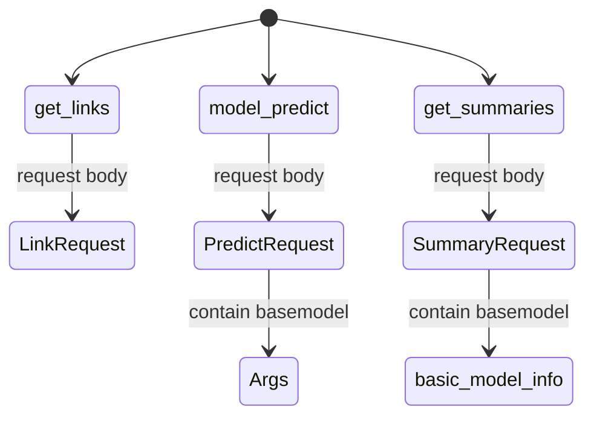

# progress


## fastapi注解

在 `url/docs`网页中，会有具体示例以及说明


目前一共三大模块：


对应关系如下：



可以在页面最下方查看具体request body的每个参数格式：


具体使用与请求方法，见[api_usage.ipynb](./api_usage.ipynb)


## 端到端的例子（本地运行）

本地运行时，具体参数可以再`config.yaml`修改，具体修改参数如下：

```yaml
arxiv:
  proxy:
    http: 'http://127.0.0.1:7890'
    https: 'http://127.0.0.1:7890'
    ftp: 'ftp://127.0.0.1:7890'
    host: 'http://localhost:7890'
  headers:
    "User-Agent": "Mozilla/5.0 (Windows NT 10.0; Win64; x64) AppleWebKit/537.36 (KHTML, like Gecko) Chrome/119.0.0.0 Safari/537.36 Edg/119.0.0.0"
  key_word: "QA"

openai:
  api_key: "sk-xxxxxxxxxxxxx"
  prompts_path:
    './prompts_config.json'
  ignore_title: ["references","appendix"]
  base_url: "https://openai.huatuogpt.cn/v1"


nougat:
  check_point : "./pretrained_w"
  out: "./res"
  pdf : ["./data/222.pdf"] # pdf file path,list
```

当用户自行运行main文件时，具体参数释义如下：

- batchsize：运行的batchsize大小，默认为当前空余显存下最大的batchsize
- checkpoint：权重保存位置，默认`./pretrained_W`
- out：输出的文件存储的文件夹，默认`./out`
- recompute：对于已经跑过的文件（也即已经存过的文件），是否再次运行，默认True
- markdown：是否输出为markdown格式，默认True
- kw：搜索url的关键词，默认为None，也即当天在cs分区下的新提交论文
- num_process：生成摘要时的进程数量，默认为3
- rate_limit：apikey是否受到限制，默认为True，若输入该参数，则会置为False，也即不限于速度限制

```bash
$ python3 main.py -h
usage: main.py [-h] [--batchsize BATCHSIZE] [--checkpoint CHECKPOINT] [--out OUT] [--recompute] [--markdown] [--kw KW [KW ...]] [--pdf PDF [PDF ...]] [--num_process NUM_PROCESS] [--rate_limit]

options:
  -h, --help            show this help message and exit
  --batchsize BATCHSIZE, -b BATCHSIZE
                        Batch size to use.
  --checkpoint CHECKPOINT, -c CHECKPOINT
                        Path to checkpoint directory.
  --out OUT, -o OUT     Output(Full text) directory
  --recompute           Recompute already computed PDF, discarding previous predictions.
  --markdown            Add postprocessing step for markdown compatibility.
  --kw KW [KW ...]      keywords to search arxiv
  --pdf PDF [PDF ...]   PDF(s)/PDF path to process, you can manually input the path of pdf file or the directory of pdf files.
  --num_process NUM_PROCESS, -num_pro NUM_PROCESS
                        num of process to summary
  --rate_limit, -rate   Whether is limited by openai rate limit 3 requests per minute.
```

运行示例：

```bash
$ python main.py --kw LLM CV --rate_limit

2023-11-12 16:42:39 - INFO - main.py:34 - input args: Namespace(batchsize=4, checkpoint=WindowsPath('pretrained_w'), out=WindowsPath('res'), recompute=True, markdown=True, kw=['LLM', 'CV'], pdf=[WindowsPath('data/222.pdf')], num_process=3, rate_limit=False)
```


## 速度优化

当前计算方式：

```python
def get_batch_size():
    if torch.cuda.is_available():
        import pynvml
        pynvml.nvmlInit()
        handle = pynvml.nvmlDeviceGetHandleByIndex(0)
        meminfo = pynvml.nvmlDeviceGetMemoryInfo(handle)
        BATCH_SIZE = int(
            meminfo.free / 1024**3 * 0.3
        )
        # BATCH_SIZE = int(
        #     torch.cuda.get_device_properties(0).total_memory / 1024 / 1024 / 1000 * 0.3
        # )
        logging.info(f"Batch size set to {BATCH_SIZE}")
        if BATCH_SIZE < 1:
            logging.error("Not enough GPU memory, can not load model.")
            sys.exit(1)
    else:
        # don't know what a good value is here. Would not recommend to run on CPU
        BATCH_SIZE = 5
        logging.warning("No GPU found. Conversion on CPU is very slow.")
    return BATCH_SIZE
```

目前发现转化成GB *0.3 后显存占用量大，而计算占用小

- batchsize = 4 --> 14.3GB
- 占用率 13%


## PPT

- 总体介绍图


## streamlit优化

- [x] 上传pdf优化

  当上传的文件支持zip与pdf格式，得到pdf_list，其中上传的zip文件，会最终将内部的pdf都提取出来，拉长成一个子pdf_list，与总的list拼接

  而rar格式，在解压二进制文件时，发生如下错误：
  
  ```python
  Failed to read PDF from 111.pdf in the RAR file.dur to Failed the read enough data: req=1166414 got=52
  ```

  查的的原因：rar压缩包的算法非开源，并不对外公开，所以其它软件想压缩或解压rar文件，必须通过cmd调用rar.exe。所以，怀疑rarfile其实也是调用的rar.exe或unrar.exe

  解决方法：将rar.exe路径添加到环境变量，或者将rar.exe放在所需的py文件目录下
  
  - 目前无效，仍然报错


- [x] abstract与标题格式细节问题
- [ ] 多文件下载问题
	- 将按钮状态按下，可以保证单词查询keyword，多文件下载
		- 原理：按钮状态记下，相当于在此之前所有的步骤都保存在缓存中，当点击下载按钮，尽管是整个文件rerun，但是所有步骤都仅从缓存中提取出来，并没有运行，因此实现了类似效果
		- 缺点：当用户不刷新，继续进行下一个keyword查询（此时，所有的步骤需要更新），但由于按钮状态一直被保存为按下，因此用户选择其中一篇论文进行suammry时，不需要按下`运行模型`按钮，就自动运行
	- 将按钮状态按下，并记录下所有变量信息，使用globals获取当前python文件的命名空间以及变量值，每次rerun时，判断在rerun之前与rerun之后，关键参数是否有变化，没变化说明只是按下了下载按钮，没有与其他组件交互（较为麻烦且费时，没实现）
	- 将用户选择的文件都保存到一个zip，这样用户只需要按一次下载，就可以获取所有文件，并且由于rerun，状态重新变为没按`运行模型`按钮的状态，也即重新搜索keyword的状态


## resuammry优化,resummary准确度，量化指标，可读性等


### Chain of Density理论

引用自：["Chain of Density" prompt aims to improve AI summaries by packing more info into fewer words (the-decoder.com)](https://the-decoder.com/chain-of-density-prompt-improves-ai-summaries-by-packing-more-info-into-fewer-words/#summary)

原始论文：[From Sparse to Dense: GPT-4 Summarization with Chain of Density Prompting](https://arxiv.org/pdf/2309.04269.pdf)

与思维链提示一样，模型随后使用第一个生成的输出作为下一代的模板，**迭代改进**。模型执行此过程的次数越多，相同字符长度的摘要中的信息密度就越大

- 首次生成的摘要是实体稀疏的，只关注1-3个初始实体
- 为了**保持相同的文本长度**，同时**增加涵盖的实体数量**，需要明确鼓励<u>抽象（abstraction）、融合（fusion）和压缩（compression）</u>，而不是从之前的摘要中删除有意义的内容。

将缺失实体（Missing Entity）定义为：

- **相关（Relevant）：**与主体故事相关；
- **具体（Specific）：**描述性但简明扼要（5个字或以下）；
- **新颖（Novel）：**没有出现在之前的摘要中；
- **忠实（Faithful）：**存在于原文中；
- **任何地方（Anywhere）：**可以出现在文章中的任意位置。

> prompts：
>
> > ```markdown
> > Article: {{article}`
> > `You will generate increasingly concise entity-dense summaries of the above article. Repeat the following 2 steps 5 times.
> > Step 1: Identify 1-3 informative entities (delimited) from the article which are missing from the previously generated summary.`
> > `Step 2: Write a new denser summary of identical length which covers every entity and detail from the previous summary plus the missing entities.
> > A missing entity is`
> > `- Relevant: to the main stories.`
> > `- Specific: descriptive yet concise (5 words or fewer).`
> > `- Novel: not in the previous summary.`
> > `- Faithful: present in the article.`
> > `- Anywhere: located in the article.
> > Guidelines:`
> > `- The first summary should be long (4-5 sentences, ~80 words), yet highly non-specific, containing little information beyond the entities marked as missing. Use overly verbose language and fillers (e.g., "this article discusses") to reach ~80 words.`
> > `- Make every word count. Rewrite the previous summary to improve flow and make space for additional entities.`
> > `- Make space with fusion, compression, and removal of uninformative phrases like "the article discusses".`
> > `- The summaries should become highly dense and concise, yet self-contained, e.g., easily understood without the article.`
> > `- Missing entities can appear anywhere in the new summary.`
> > `- Never drop entities from the previous summary. If space cannot be made, add fewer new entities.
> > Remember: Use the exact same number of words for each summary.
> > Answer in JSON. The JSON should be a list (length 5) of dictionaries whose keys are "missing_entities" and "denser_summary".
> > ```
>
> 中文版prompts：
>
> >```markdown
> >文章：{{文章}
> >您将为上述文章生成越来越简洁的实体密集摘要。重复以下 2 个步骤 5 次。
> >步骤 1：从文章中识别出先前生成的摘要中缺少的 1-3 个信息实体（分隔）。
> >步骤 2：编写一个长度相同的新的更密集摘要，其中涵盖先前摘要中的每个实体和细节以及缺失的实体。
> >缺失的实体是
> >
> >- 相关：与主要故事相关。
> >- 具体：描述性且简洁（5 个字或更少）。
> >- 小说：之前的摘要中没有。
> >- 忠实：出现在文章中。
> >- 任何地方：位于文章中。
> >	指南：
> >- 第一个摘要应该很长（4-5 个句子，约 80 个单词），但高度不具体，除了标记为缺失的实体之外，几乎不包含任何信息。使用过于冗长的语言和填充词（例如“本文讨论”）以达到约 80 个单词。
> >- 让每个字都有意义。重写之前的摘要以改进流程并为其他实体腾出空间。
> >- 通过融合、压缩和删除诸如“文章讨论”之类的无信息短语来腾出空间。
> >- 摘要应该变得高度密集和简洁，但又是独立的，例如，在没有文章的情况下也很容易理解。
> >- 缺失的实体可能出现在新摘要中的任何位置。
> >- 切勿删除先前摘要中的实体。如果无法腾出空间，请添加较少的新实体。
> >	请记住：每个摘要使用完全相同的字数。
> >	以 JSON 格式回答。 JSON 应该是一个字典列表（长度为 5），其键为“missing_entities”和“denser_summary”。
> >```

>```
>system": "You are required to generate a preliminary summary and a final summary of the given paper.  
>  
>The preliminary summary should begin with the marker [craft abstract content]. Use general terms and avoid specific details. You can use phrases like "this paper explores."  
>  
>After the preliminary summary, point out possible improvements in the following areas:  
>  
>1. Redundancy: Identify any words or phrases that repeat similar concepts.  
>2. Missing entities: Clearly identify key details about methods, models, datasets, metrics, etc. and avoid ambiguous referents.  
>3. Quantification: Point out where results can be quantified with numbers or metrics rather than generic statements.  
>4. Extraneous details: Determine which topics or sections can be condensed.  
>5. Coherence: Identify where language can be improved for clarity and flow.  
>6. Faithfulness: Identify any statements that contradict or misrepresent the paper's content.  
>  
>Using the feedback provided, generate the final summary with the marker [final summary content].  
>  
>Include all key entities and details from the paper.  
>Quantify results using clear metrics and numbers.  
>Improve coherence and resolve issues from the preliminary summary.  
>Use clear, technical, objective language suitable for expert readers.  
>Avoid repetition, vagueness, and extraneous details.  
>Throughout the process, maintain conciseness while preserving key details necessary to understand the paper's contributions."
>```
>
>

作为人工评估的补充，从5个方面对CoD摘要（1-5）进行评级：信息量（Informative）、质量（Quality）、连贯性（Coherence）、归因（Attributable）和整体性（Overall）。

自动评估摘要的prompts：

```
Article: {{Article}}

Summary: {{Summary}}

Please rate the summary (1=worst to 5=best) with respect to {{Dimension}}.

{{Definition}}
```

其中各个指标（Dimension）的定义为：

- **信息量：**信息量丰富的摘要可以抓住文章中的重要信息，并准确简洁地呈现出来。（An informative summary captures the important information in the article and presents it accurately and concisely.）

- **质量：**高质量的摘要是可理解的。（A high quality summary is comprehensible and understandable.）

- **连贯性：**连贯一致的摘要结构严谨，组织有序。（A coherent summary is well-structured and well-organized.）

- **归因：**摘要中的所有信息是否完全归因文章？（Is all the information in the summary fully attributable to the Article?）

- **总体偏好：**一个好的摘要应该以简洁、逻辑和连贯的方式传达文章的主要观点。（A good summary should convey the main ideas in the Article in a concise, logical, and coherent fashion.）


### 目前prompts

改进方向：

- 仿照COD链，但由于循环改进太慢，且耗费token太多，因此在一次prompt中，尝试实现一次改进过程
- 希望能直接提取出最终的结果
- 明确输出的格式，并且提供示例，强制完形填空模式

实现方法：

- prompts中明确提出了让GPT按照给定的流程
	- 先提出一个高度笼统的summary，用[Craft abstract content] tag标记
	- 随后提出改进措施，tag: [Feedback content]
	- 根据改进措施，给出最终的结果，tag: [Final summary content]

具体见[prompts](./prompts_config.json)

#### prompts中system如下：

```json
"system": 
You possess the specialized ability to distill academic content, and it is imperative to adhere to the following systematic steps:

1. **Generate Preliminary Summary:**
Initiate the creation of a preliminary summary using the marker [craft abstract content].

Encourage the utilization of general terms while discouraging specificity.
Acceptable phrases include 'this paper explores.'


2. **Provide Feedback for Improvement:**
Initiate the creation of feedback for the preliminary summary, marked as [Feedback content].
Identify areas requiring improvement in:

Redundancy: Identify and rectify recurring concepts.
Missing Entities: Clearly specify crucial details regarding methods, models, datasets, metrics, etc., avoiding vague references.
Quantification: Explicitly indicate areas where results can be quantified using numeric values or metrics, rather than relying on general descriptions.
Extraneous Details: Identify topics or sections that can be simplified.
Coherence: Recognize areas where language clarity and fluency can be improved.
Accuracy: Identify statements that contradict or distort the content of the paper.
Generate Final Summary:
Systematically create the final summary based on feedback from the preliminary summary, marked as [final summary content].

Ensure the comprehensive inclusion of all key entities and details.
Quantify results using explicit metrics and numbers.
Enhance coherence based on feedback received during the preliminary summary phase.
Utilize clear, technical, and objective language suitable for expert readers.
Avoid repetition, ambiguity, and unnecessary details.
Maintain Conciseness:

Uphold conciseness throughout the entire process, preserving key details indispensable for a thorough comprehension of the paper's contributions.
```

#### 输出的group summary结果：

```json
## abstract:
[Craft abstract content]
This paper explores the risks and benefits associated with smart contracts in the context of blockchain technology. It highlights the limitations of current approaches that rely on limited contract characteristics for classifying malicious intent. To address this, the paper proposes a two-layered framework for classifying and repairing malicious contracts. The framework combines Slither's vulnerability report with source code and utilizes a pre-trained RandomForestClassifier (RFC) and Large Language Models (LLMs) for classification and repair. Experimental results demonstrate the effectiveness of fine-tuned and prompt-engineered LLMs. The smart contract repair models, built from pre-trained GPT-3.5-Turbo and fine-tuned Llama-2-7B models, significantly reduce the overall vulnerability count. Manual inspection of repaired contracts confirms that the proposed method maintains all retail functionality, making it suitable for automatic batch classification and repair of vulnerabilities in smart contracts.

[Feedback content]
- The preliminary summary provides a clear overview of the paper's main contributions and findings.
- The use of general terms avoids specificity.
- However, the summary could benefit from more specific details regarding the experiments and results. Specify the metrics used for measuring the reduction in vulnerability count.
- Additionally, it would be helpful to include information about the dataset used for experimentation.

[Final summary content]
This paper introduces a two-layered framework for classifying and repairing malicious smart contracts. The framework utilizes Slither's vulnerability report, source code, a RandomForestClassifier (RFC), and Large Language Models (LLMs). It addresses the limitations of existing approaches by leveraging fine-tuned and prompt-engineered LLMs. The proposed method significantly reduces vulnerabilities, achieving a 97.5% reduction with the pre-trained GPT-3.5-Turbo model and a 96.7% reduction with the fine-tuned Llama-2-7B model. The experimental evaluation measures the reduction in vulnerability count but lacks specifics on the metrics used. The approach is shown to preserve the retail functionality of the contracts, making it suitable for automated batch classification and repair. However, further information regarding the dataset used for experimentation is needed for a complete understanding of the paper's contributions.
------------------------------------------
resp:
## intro:
[Craft abstract content]
This introduction sets the stage by highlighting the importance of smart contracts in the blockchain and the vulnerability of weak code to cyberattacks. It emphasizes the need for analysis tools to accurately assess smart contract vulnerabilities. The existing approaches, such as DLVA, MRN-GCN, and peer-to-peer voting, are briefly discussed, along with the limitations and potential of large language models (LLMs). The complexity and limitations of current smart contract security methods are also mentioned. Additionally, the introduction introduces the authors' proposed novel pipeline that combines Slither, RandomForestClassifier, and LLMs for vulnerability detection and repair. The structure of the rest of the paper is outlined.

[Feedback content]
- The preliminary summary provides a good overall understanding of the introduction. However, it can be improved by avoiding specific references to individual authors or papers and focusing on the broader concepts and motivations.

[Final summary content]
This introduction highlights the importance of smart contracts and the vulnerabilities they face. It discusses the need for improved analysis tools to detect and repair smart contract vulnerabilities. Existing approaches, such as DLVA, MRN-GCN, and peer-to-peer voting, are briefly mentioned. The potential of large language models (LLMs) for vulnerability detection and the limitations of current methods are also discussed. The authors propose a novel pipeline that combines Slither, RandomForestClassifier, and LLMs for vulnerability detection and repair. The structure of the rest of the paper is outlined, including the details of the proposed pipeline and the expected results.
------------------------------------------
resp:
## method:
[craft abstract content] This section provides insights into the research models utilized in the study. The authors incorporated a RandomForestClassifier and Large Language Models (LLMs) for classification and repair. The RandomForestClassifier was trained on a dataset of 2,000 smart contracts using features such as source code and impact to classify contracts as malicious or non-malicious. Slither, a static code analyzer, was used to detect vulnerabilities in the smart contracts. The LLMs, specifically the Llama-2-7B model, were used to repair the identified malicious contracts. The authors also utilized OpenAI's GPT-3.5-Turbo for prompt engineering to generate repaired source code. The models were trained and fine-tuned using different techniques to achieve accurate classification and effective repair of smart contracts.

[Feedback content] The feedback for improvement in this section is as follows:
- Redundancy: The information provided regarding the RandomForestClassifier and its training process can be summarized more concisely.
- Missing Entities: It would be helpful to specify the size or composition of the dataset used for training the RandomForestClassifier and the number of vulnerabilities detected by Slither.
- Quantification: It would be beneficial to include metrics quantifying the performance of the RandomForestClassifier and the LLMs, such as accuracy or F1 score, to provide a clearer understanding of their effectiveness.
- Extraneous Details: Some of the details regarding the data collection process and issues faced can be simplified or omitted to maintain conciseness and focus on the main models and techniques utilized.
- Coherence: The descriptions of the RandomForestClassifier and the LLMs can be structured more coherently to enhance readability and clarity.

[final summary content] The study utilized a RandomForestClassifier and Large Language Models (LLMs) for the classification and repair of smart contracts. The RandomForestClassifier was trained on a dataset of 2,000 smart contracts, incorporating features such as source code and impact to classify contracts as malicious or non-malicious. Slither, a static code analyzer, was employed to detect vulnerabilities in the smart contracts. The LLMs, specifically the Llama-2-7B model, were utilized to repair the identified malicious contracts. OpenAI's GPT-3.5-Turbo was employed for prompt engineering to generate repaired source code. The performance of the models was evaluated using metrics such as accuracy or F1 score.
------------------------------------------
resp:
## result:
[Craft abstract content]
This section presents the results of experiments conducted using the RandomForestClassifier (RFC), GPT-3.5-Turbo, and Llama-2-7B error correction models. The RFC achieved an accuracy of 89.6% and an F1 score of 0.76 when tested on 800 contracts, outperforming static analysis tools like Slither. The GPT-3.5-Turbo model repaired 97.5% of vulnerabilities encountered in smart contracts, while the fine-tuned Llama-2-7B model reduced vulnerabilities by 96.7%. Both models retained the functionality of the repaired contracts. The results demonstrate the accuracy and effectiveness of these models in repairing smart contracts, offering significant improvements over existing methods. These state-of-the-art tools have the potential to minimize computational complexity and cost while enhancing contract security.
------------------------------------------
resp:
## conclusion:
[craft abstract content]
This section presents a novel approach for identifying and repairing vulnerabilities in smart contracts. The approach involves utilizing the Solidity source code of smart contracts and a two-tiered flow. First, the Slither static code analyzer and a Random Forest Classifier are used to identify malicious smart contracts and their specific vulnerabilities. These identified smart contracts are then used as parameters in a prompt on two separate language models, GPT-3.5-Turbo and Llama-2-7B, after prompt engineering using Chain of Thought reasoning. The two smart contract repair models, one using pre-trained GPT-3.5-Turbo and the other a fine-tuned Llama-2-7B, successfully reduce the overall vulnerability count by 97.5% and 96.7% respectively. This approach provides state-of-the-art accuracy in screening and repairing smart contracts, mitigating the risk of exploitation by cybercriminals. The framework introduced in this paper offers an accessible and reliable solution for improving the security of smart contracts, enabling businesses and decentralized autonomous organizations (DAOs) to deploy safer smart contracts as the adoption of blockchain technology continues to grow.

[Feedback content]
- The preliminary summary adequately captures the main points of the section.
- The language is concise and the summary does not contain extraneous details.
- The key contributions of this section are not clearly highlighted.

[final summary content]
This section introduces a novel approach for identifying and repairing vulnerabilities in smart contracts. By utilizing the Solidity source code, a two-tiered flow is employed. Initially, the Slither static code analyzer and a Random Forest Classifier are utilized to detect malicious smart contracts and their specific vulnerabilities. These identified contracts are then used in a prompt on two separate language models, namely GPT-3.5-Turbo and Llama-2-7B, after applying Chain of Thought reasoning for prompt engineering. The resulting smart contract repair models, leveraging pre-trained GPT-3.5-Turbo and fine-tuned Llama-2-7B, achieve significant reductions in vulnerability count, with respective percentages of 97.5% and 96.7%. This approach provides cutting-edge accuracy in screening and repairing smart contracts, effectively mitigating the risk of exploitation by cybercriminals. The framework introduced in this paper establishes a user-friendly and reliable solution for enhancing the security of smart contracts, empowering businesses and decentralized autonomous organizations (DAOs) to deploy safer contracts as blockchain technology continues to gain prominence. This research lays the foundation for future advancements in the field, offering avenues for further investigation and refinement of the proposed approach.
------------------------------------------
resp:
## future:
[craft abstract content]
This section discusses the additional research needs identified by the authors and the new questions that arise from this study. The authors suggest exploring different methods of classifiers powered by transformers or neural networks to enhance the identification of malicious smart contracts. They recommend training these classifiers on a larger dataset that includes a wider range of malicious smart contracts. Additionally, the authors propose further fine-tuning of Llama-2-7B, such as increasing the number of hidden layers and using a larger dataset, to improve its error correction rate beyond that of GPT-3.5-Turbo. Although GPT-3.5-Turbo cannot be fine-tuned currently, the authors suggest that if fine-tuning capabilities are developed, future research could focus on fine-tuning GPT-3.5-Turbo for repairing smart contracts. Furthermore, advancements in PEFT and/or QLoRa could potentially enable a less memory-intensive but more accurate LLM for repairing smart contracts.

[Feedback content]
- The preliminary summary provides a good overview of the additional research needs and emerging questions discussed in this section.
- However, it would be beneficial to provide more specific details regarding the dataset size, the number of hidden layers, and the expected improvements in error correction rate.
- Additionally, it would be helpful to clarify what PEFT and QLoRa stand for and how they can contribute to a less memory-intensive and more accurate LLM.

[final summary content]
The authors propose several avenues for further research based on the findings of the study. They suggest exploring different classifiers powered by transformers or neural networks to improve the identification of malicious smart contracts. This can be achieved by training these classifiers on a larger dataset that includes a wider variety of malicious smart contracts. Additionally, they recommend further fine-tuning of Llama-2-7B, including increasing the number of hidden layers and using a larger dataset, to enhance its error correction rate compared to GPT-3.5-Turbo. Although GPT-3.5-Turbo currently lacks fine-tuning capabilities, the authors suggest that future research could focus on fine-tuning it for smart contract repair if such capabilities are developed. Furthermore, advancements in technologies like PEFT and QLoRa could potentially enable the development of a less memory-intensive but more accurate language model for repairing smart contracts.
--------------------
```

#### resumamry结果：

```
[preliminary blog content]

Summary:
This research paper proposes a two-layered framework for classifying and repairing malicious smart contracts. The framework combines Slither's vulnerability report with source code and uses a pre-trained RandomForestClassifier and Large Language Models (LLMs). The effectiveness of fine-tuned and prompt-engineered LLMs is demonstrated through experiments, achieving a significant reduction in vulnerability count. The paper presents an automated approach for detecting and repairing vulnerabilities in smart contracts, making a valuable contribution to the field of blockchain technology.

[Feedback content]

Redundancy Feedback Content:
- The introduction and method sections contain some repetitive information. Consider condensing and eliminating redundancies to improve the overall flow.

Missing Entities Feedback Content:
- The paper does not provide a clear explanation of the Slither tool and its purpose. Include a brief description in the introduction or method section to provide context for readers unfamiliar with it.

Quantification Feedback Content:
- The results section lacks specific numerical data and metrics to support the effectiveness of the proposed framework. Include more quantitative information, such as accuracy rates and reduction percentages, to enhance the credibility of the findings.

Extraneous Details Feedback Content:
- Some extraneous details, such as the challenges faced during data collection, could be omitted or summarized to maintain focus on the main objectives and results.

Coherence Feedback Content:
- The flow between sections can be improved for better coherence. Ensure that each section connects logically to the next, providing a seamless narrative for readers.

Faithfulness Feedback Content:
- The conclusion section is missing in the preliminary blog content. Include a summary of the main findings and implications of the research in the final blog.

[final blog content]

Summary:
This research paper presents a two-layered framework for detecting and repairing vulnerabilities in smart contracts. By combining Slither's vulnerability report with source code, the framework utilizes a pre-trained RandomForestClassifier and Large Language Models (LLMs) for classification and repair tasks. The effectiveness of fine-tuned and prompt-engineered LLMs is demonstrated through experiments, achieving a significant reduction in vulnerability count. The proposed framework offers an automated approach that contributes to enhancing the security of smart contracts in the blockchain industry.

The research begins by highlighting the increasing severity of cyberattacks on smart contracts, leading to significant financial losses. Existing tools and models have limitations in accurately identifying and providing feedback on vulnerabilities, necessitating the development of a more effective pipeline for vulnerability detection and repair. The authors introduce the proposed framework, emphasizing its potential to overcome these limitations.

The methodology section provides a detailed overview of the research models and methods employed. The authors utilize a RandomForestClassifier (RFC) for classification tasks and Large Language Models (LLMs) for repair. The datasets used require essential features, including source code obtained through web scraping. Slither, a static code analyzer, is used to check smart contracts for vulnerabilities. The authors combine the outputs of the RFC and LLMs to repair identified malicious contracts, ensuring accuracy and explanation of the changes made.

The results section presents the outcomes of experiments conducted using different models. The RandomForestClassifier achieves high accuracy and F1 scores when tested on contracts, outperforming the static analysis tool Slither. The GPT-3.5-Turbo and fine-tuned Llama-2-7B models successfully repair a significant percentage of vulnerabilities, eliminating high-impact vulnerabilities and correcting syntax-level errors while preserving contract functionality. The "Two Timin" framework ensures that only malicious contracts are repaired, simplifying computational complexity.

In conclusion, the research paper proposes a two-layered framework that effectively detects and repairs vulnerabilities in smart contracts. The findings demonstrate the state-of-the-art capabilities of Large Language Models in reducing errors and improving security. The authors suggest future research in the field, including the use of different classifiers and further fine-tuning of the Llama-2-7B model. These advancements have significant implications for the security and reliability of smart contracts within the blockchain industry.

Evaluation Criteria:

- Clarity of Theme and Objectives:
  - Score: 9
  - Reason: The paper clearly presents the central theme, objectives, and motivation for the research, providing a concise overview for readers.

- Appropriateness and Granularity of Research Methods:
  - Score: 8
  - Reason: The research methods are adequately described, but some details, such as the Slither tool, could be better explained for better understanding.

- Precision of Data and Results:
  - Score: 7
  - Reason: The results section lacks specific numerical data and metrics, which could have provided more precise and quantifiable evidence of the framework's effectiveness.

- Depth of Discussion and Conclusion:
  - Score: 8
  - Reason: The discussion provides insights into the results and implications of the research, although the preliminary blog content lacks a conclusion section.

- Overall Writing Quality:
  - Score: 9
  - Reason: The writing is clear, concise, and technically sound, with minor areas for improvement in terms of coherence and elimination of redundancies.

- Average Score: 8.2
```


### 存在的部分问题

1. 即使强迫GPT按照给定的流程，GPT可能还是不会完全按照三步骤的流程总结，因此可能会出现3个步骤不一定走完，或者完全不走的情况，也即出现1个tag（[craft abstract content]）或者完全没tag

2. 原本[craft abstract content]可能已经表现较好，但是[Feedback content]中的错误引导，例如上述例子中出现的情况，pipeline本已经列出来了具体内容，但改进中提出`it can be improved by avoiding specific references`，导致又变成笼统的回答（-->指向的内容）

	```
	resp:
	## intro:
	[Craft abstract content]
	This introduction sets the stage by highlighting the importance of smart contracts in the blockchain and the vulnerability of weak code to cyberattacks. It emphasizes the need for analysis tools to accurately assess smart contract vulnerabilities. The existing approaches, such as DLVA, MRN-GCN, and peer-to-peer voting, are briefly discussed, along with the limitations and potential of large language models (LLMs). The complexity and limitations of current smart contract security methods are also mentioned.
	
	
	--> Additionally, the introduction introduces the authors' proposed novel pipeline that combines Slither, RandomForestClassifier, and LLMs for vulnerability detection and repair. The structure of the rest of the paper is outlined.
	
	[Feedback content]
	- The preliminary summary provides a good overall understanding of the introduction. However, it can be improved by avoiding specific references to individual authors or papers and focusing on the broader concepts and motivations.
	
	[Final summary content]
	This introduction highlights the importance of smart contracts and the vulnerabilities they face. It discusses the need for improved analysis tools to detect and repair smart contract vulnerabilities. Existing approaches, such as DLVA, MRN-GCN, and peer-to-peer voting, are briefly mentioned. The potential of large language models (LLMs) for vulnerability detection and the limitations of current methods are also discussed. The authors propose a novel pipeline that combines Slither, RandomForestClassifier, and LLMs for vulnerability detection and repair. 
	
	--> The structure of the rest of the paper is outlined, including the details of the proposed pipeline and the expected results.
	```

	


# 常用代码

> 目前只有5001-5010之间端口开放


## 服务器

```
ssh clouduser@61.241.103.32 -p 20022
```

password：

```
C7#jH9u%##FreeAI@GZW%LLMzoo
```

```
cd workspace/arxiv_summarizer/proj
conda activate code_arxiv_summarizer
```

转移文件：

```bash
$ scp -P 20022  /d/linux/file2/app_stream_copy.py clouduser@61.241.103.32:/home/clouduser/workspace/arxiv_summarizer/proj/app_stream_copy.py
```

```python
$ scp -P 20022  /d/linux/file2/submodule/openai_api/api_usage.py clouduser@61.241.103.32:/home/clouduser/workspace/arxiv_summarizer/proj/submodule/openai_api/api_usage.py
```

使用清华园镜像快速下载：

```bash
$ python3 -m spacy download en_core_web_sm
-i https://pypi.tuna.tsinghua.edu.cn/simple
```

```bash
$ cd path/to/code_arxiv_summarizer
$ streamlit run app_stream_copy.py
```


## 启动后端：

```
uvicorn backend:app --reload --port 8000
```

```
uvicorn backend:app --host 0.0.0.0 --port 5010 --reload
```

```
http://61.241.103.32:5010
```

