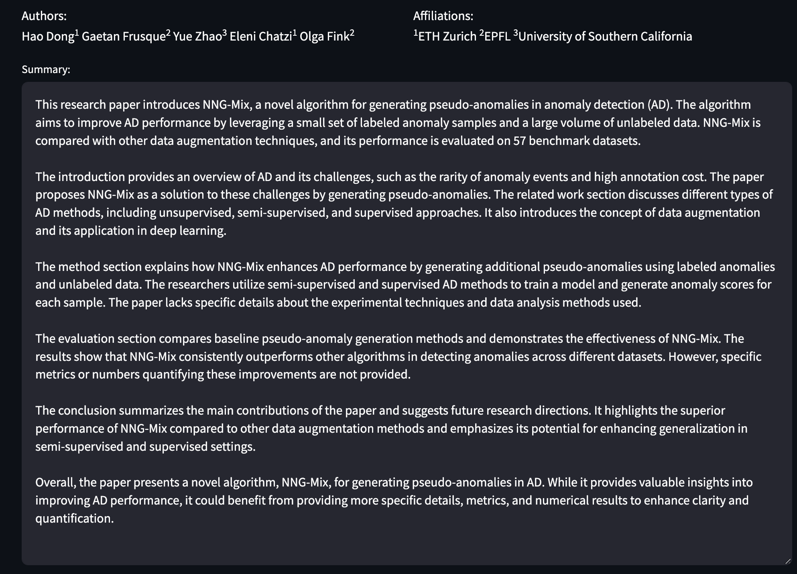
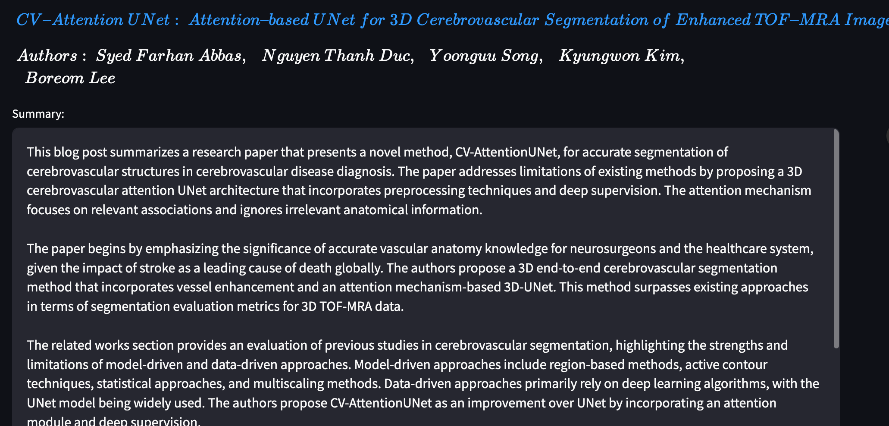
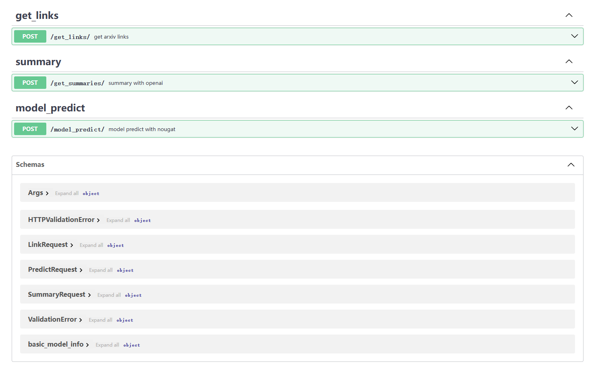
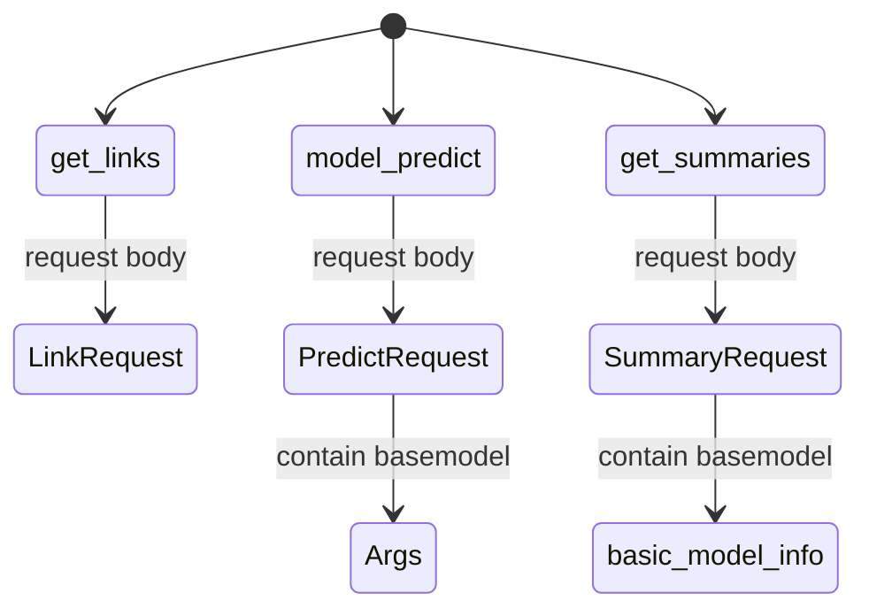
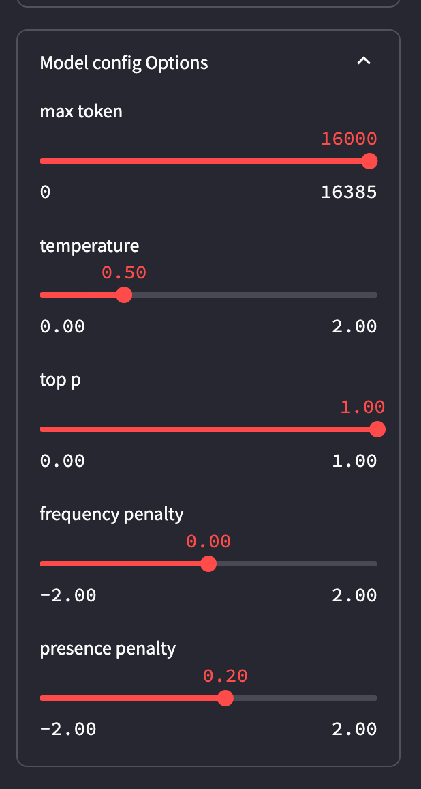
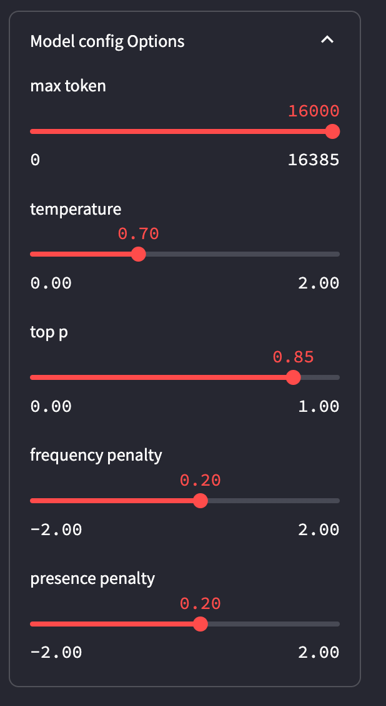
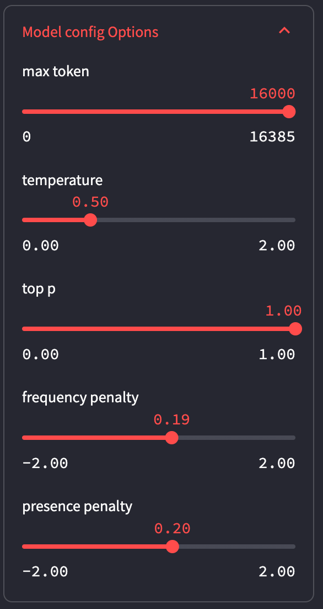
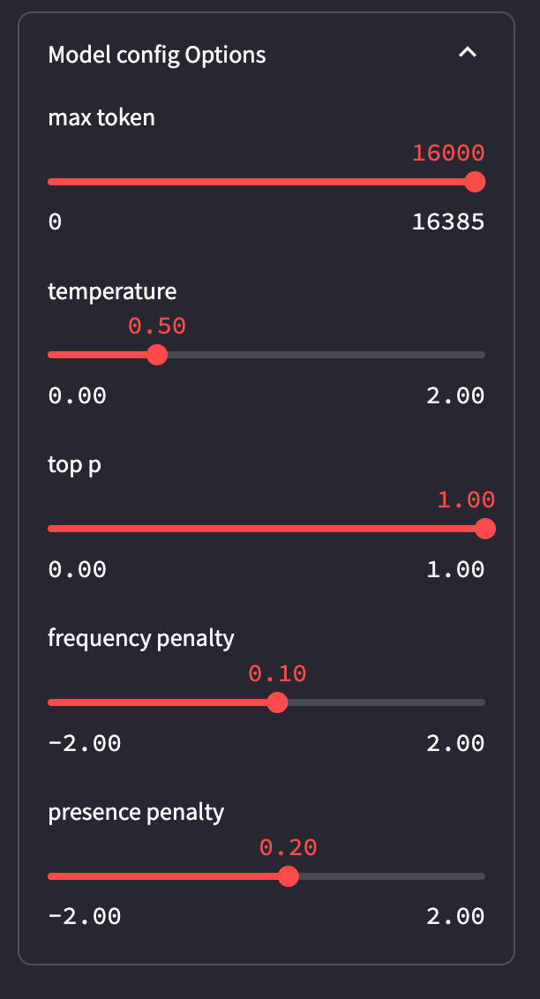
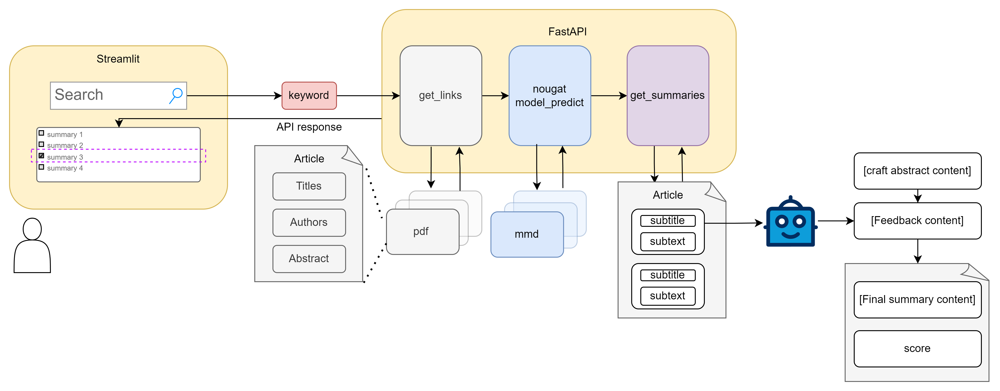

# w10 ~ w11 progress

## usage

### backend

```
ssh clouduser@61.241.103.32 -p 20022
```

password：

```
C7#jH9u%##FreeAI@GZW%LLMzoo
```

```
cd workspace/arxiv_summarizer/proj
conda activate code_arxiv_summarizer
```

本地运行：

```
uvicorn backend:app --reload --port 8000
```

前端在PC上则：

```
uvicorn backend:app --host 0.0.0.0 --port 5010 --reload
```


### frontend

在code_arxiv_summerizer文件夹下

```bash
$ streamlit run app_stream_copy.py
```


若在本地跑前端，则req_url为：

```
http://127.0.0.1:8000
```

若在服务器上，且url不为如下内容：

```
http://61.241.103.32:5010
```

则修改`app.py`文件内的`var_req_url` default改为`http://61.241.103.32:5010`,或者启动streamlit 后，将req_url输入`http://61.241.103.32:5010`


## Front-end

###    效果图

作者与机构都解析成功：




作者与机构都解析失败/作者所属机构解析失败（则选用最初爬取的arxiv上的信息显示）：



可以调整文本框高度，实现适当缩小整个页面长度（文本框可通过滚轮查看全文）


- 适当优化prompts
    - 提供了回答模版，使得summary变成完形填空，降低难度
    - 强调了生成便于提取三阶段的不同marker，并提取最终的summary作为显示结果,具体见[prompts](#resuammry optimization)
         - 若GPT不按给定的步骤则显示全文，若只执行了显示初稿的内容，则显示初稿
    
- 优化前端
    - [x] 进行了上传为文件时（bytes）的优化，增加了nougat中dataset对bytes的支持
    
         - 当前不需要将前端上传的文件先暂存本地，再调用后端时读取，既减少了存储的开销，同时前后端也能够真正分离
    
    - [x] 优化前端显示，三栏显示prompts更新前后状态（?）
    
         发现显示效果不佳，目前还是以可缩放高度的文本框显示最终resummary结果
    
    - [x] 增加了与用户互动的各个组件的注释，用户可以在组件右上角`?`处查看

- 实现了初步的多文件下载
    - 通过对此前的状态进行缓存，当前一时刻与当前时刻的输入状态一致时（说明此时用户激活了下载按钮的互动组件，而其他组件没有被改动）


## back-end 

目前一共三大模块：



对应关系如下：



可以在页面最下方查看具体request body的每个参数格式：


也可以在某个module下面的schema查看


具体使用与请求方法，见[api_usage.ipynb](./api_usage.ipynb)，包含了正确与错误情况下返回的json情况

- 增加了注释与示例

- 改善了返回类型的格式

     如果请求的主体类型中有参数错误，会详细反应 错误的param信息 

     ```python
     wrong_params = {
         "key_word": 1.0
     }
     response = requests.post(link_url, params=wrong_params)
     
     json_info = custom_response_handler(response)
     if not "error" in json_info:
         print(json_info)
     else:
         print(json_info["error"])
     
     error 1:type: missing, location: request body, param Unknow param input:None, msg: Field required
     ```

- 增加了处理resoponse的函数，放在[utils.py](./submodule/my_utils/utils.py)

- 在多次请求时，释放内存，并在给定的GPU list中寻找最合适的卡，目前只在0，1两个卡之间选择

     - 但是不清楚会不会对别的程序占用显存产生影响
     
     - 目前nougat运行情况：
          - 显存占用大，而计算资源占用小，例如
          
               在16GB 4060TI的主机上
          
               - batchsize = 4 --> 14.3GB
               - 占用率 13%
          
          - 根据源码计算方式：
               $$batch\_size = \frac{free\_memory}{1024^3} \times 0.3$$
               发现还是会存在爆显存的情况：
          
               ```bash
               CUDA out of memory. Tried to allocate 28.00 MiB. GPU 1 has a total capacty of 44.40 GiB of which 27.31 MiB is free. Process 3170878 has 18.58 GiB memory in use. Process 3171302 has 18.42 GiB memory in use. Including non-PyTorch memory, this process has 7.37 GiB memory in use. Of the allocated memory 5.79 GiB is allocated by PyTorch, and 276.11 MiB is reserved by PyTorch but unallocated. If reserved but unallocated memory is large try setting max_split_size_mb to avoid fragmentation.  See documentation for Memory Management and PYTORCH_CUDA_ALLOC_CONF
               ```


# others

## End-to-end example (running locally)

本地运行时，具体参数可以再`config.yaml`修改，具体修改参数如下：

```yaml
arxiv:
  proxy:
    http: 'http://127.0.0.1:7890'
    https: 'http://127.0.0.1:7890'
    ftp: 'ftp://127.0.0.1:7890'
    host: 'http://localhost:7890'
  headers:
    "User-Agent": "Mozilla/5.0 (Windows NT 10.0; Win64; x64) AppleWebKit/537.36 (KHTML, like Gecko) Chrome/119.0.0.0 Safari/537.36 Edg/119.0.0.0"
  key_word: "QA"

openai:
  api_key: "sk-xxxxxxxxxxxxx"
  prompts_path:
    './prompts_config.json'
  ignore_title: ["references","appendix"]
  base_url: "https://openai.huatuogpt.cn/v1"


nougat:
  check_point : "./pretrained_w"
  out: "./res"
  pdf : ["./data/222.pdf"] # pdf file path,list
```

当用户自行运行main文件时，具体参数释义如下：

- batchsize：运行的batchsize大小，默认为当前空余显存下最大的batchsize
- checkpoint：权重保存位置，默认`./pretrained_W`
- out：输出的文件存储的文件夹，默认`./out`
- recompute：对于已经跑过的文件（也即已经存过的文件），是否再次运行，默认True
- markdown：是否输出为markdown格式，默认True
- kw：搜索url的关键词（可以输入多个，搜索时呈现为"kw1 kw2 ……"），默认为None，搜索当天新提交的论文，也即当天在cs分区下的新提交论文
- num_process：生成摘要时的进程数量，默认为3
- rate_limit：apikey是否受到限制，默认为True，若输入该参数，则会置为False，也即不限于速度限制

```bash
$ python3 main.py -h
usage: main.py [-h] [--batchsize BATCHSIZE] [--checkpoint CHECKPOINT] [--out OUT] [--recompute] [--markdown] [--kw KW [KW ...]] [--pdf PDF [PDF ...]] [--num_process NUM_PROCESS] [--rate_limit]

options:
  -h, --help            show this help message and exit
  --batchsize BATCHSIZE, -b BATCHSIZE
                        Batch size to use.
  --checkpoint CHECKPOINT, -c CHECKPOINT
                        Path to checkpoint directory.
  --out OUT, -o OUT     Output(Full text) directory
  --recompute           Recompute already computed PDF, discarding previous predictions.
  --markdown            Add postprocessing step for markdown compatibility.
  --kw KW [KW ...]      keywords to search arxiv
  --pdf PDF [PDF ...]   PDF(s)/PDF path to process, you can manually input the path of pdf file or the directory of pdf files.
  --num_process NUM_PROCESS, -num_pro NUM_PROCESS
                        num of process to summary
  --rate_limit, -rate   Whether is limited by openai rate limit 3 requests per minute.
```

运行示例：

```bash
$ python main.py --kw LLM CV --rate_limit

2023-11-12 16:42:39 - INFO - main.py:34 - input args: Namespace(batchsize=4, checkpoint=WindowsPath('pretrained_w'), out=WindowsPath('res'), recompute=True, markdown=True, kw=['LLM', 'CV'], pdf=[WindowsPath('data/222.pdf')], num_process=3, rate_limit=False)
```


## resuammry optimization

### Chain of Density theory

>  引用自：["Chain of Density" prompt aims to improve AI summaries by packing more info into fewer words (the-decoder.com)](https://the-decoder.com/chain-of-density-prompt-improves-ai-summaries-by-packing-more-info-into-fewer-words/#summary)
>
> 原始论文：[From Sparse to Dense: GPT-4 Summarization with Chain of Density Prompting](https://arxiv.org/pdf/2309.04269.pdf)

与思维链提示一样，模型随后使用第一个生成的输出作为下一代的模板，**迭代改进**。模型执行此过程的次数越多，相同字符长度的摘要中的信息密度就越大

- 首次生成的摘要是实体稀疏的，只关注1-3个初始实体
- 为了**保持相同的文本长度**，同时**增加涵盖的实体数量**，需要明确鼓励<u>抽象（abstraction）、融合（fusion）和压缩（compression）</u>，而不是从之前的摘要中删除有意义的内容。

将缺失实体（Missing Entity）定义为：

- **相关（Relevant）：**与主体故事相关；
- **具体（Specific）：**描述性但简明扼要（5个字或以下）；
- **新颖（Novel）：**没有出现在之前的摘要中；
- **忠实（Faithful）：**存在于原文中；
- **任何地方（Anywhere）：**可以出现在文章中的任意位置。

> prompts：
>
> > ```markdown
> > Article: {{article}`
> > `You will generate increasingly concise entity-dense summaries of the above article. Repeat the following 2 steps 5 times.
> > Step 1: Identify 1-3 informative entities (delimited) from the article which are missing from the previously generated summary.`
> > `Step 2: Write a new denser summary of identical length which covers every entity and detail from the previous summary plus the missing entities.
> > A missing entity is`
> > `- Relevant: to the main stories.`
> > `- Specific: descriptive yet concise (5 words or fewer).`
> > `- Novel: not in the previous summary.`
> > `- Faithful: present in the article.`
> > `- Anywhere: located in the article.
> > Guidelines:`
> > `- The first summary should be long (4-5 sentences, ~80 words), yet highly non-specific, containing little information beyond the entities marked as missing. Use overly verbose language and fillers (e.g., "this article discusses") to reach ~80 words.`
> > `- Make every word count. Rewrite the previous summary to improve flow and make space for additional entities.`
> > `- Make space with fusion, compression, and removal of uninformative phrases like "the article discusses".`
> > `- The summaries should become highly dense and concise, yet self-contained, e.g., easily understood without the article.`
> > `- Missing entities can appear anywhere in the new summary.`
> > `- Never drop entities from the previous summary. If space cannot be made, add fewer new entities.
> > Remember: Use the exact same number of words for each summary.
> > Answer in JSON. The JSON should be a list (length 5) of dictionaries whose keys are "missing_entities" and "denser_summary".
> > ```
>
> 中文版prompts：
>
> >```markdown
> >文章：{{文章}
> >您将为上述文章生成越来越简洁的实体密集摘要。重复以下 2 个步骤 5 次。
> >步骤 1：从文章中识别出先前生成的摘要中缺少的 1-3 个信息实体（分隔）。
> >步骤 2：编写一个长度相同的新的更密集摘要，其中涵盖先前摘要中的每个实体和细节以及缺失的实体。
> >缺失的实体是
> >
> >- 相关：与主要故事相关。
> >- 具体：描述性且简洁（5 个字或更少）。
> >- 小说：之前的摘要中没有。
> >- 忠实：出现在文章中。
> >- 任何地方：位于文章中。
> >	指南：
> >- 第一个摘要应该很长（4-5 个句子，约 80 个单词），但高度不具体，除了标记为缺失的实体之外，几乎不包含任何信息。使用过于冗长的语言和填充词（例如“本文讨论”）以达到约 80 个单词。
> >- 让每个字都有意义。重写之前的摘要以改进流程并为其他实体腾出空间。
> >- 通过融合、压缩和删除诸如“文章讨论”之类的无信息短语来腾出空间。
> >- 摘要应该变得高度密集和简洁，但又是独立的，例如，在没有文章的情况下也很容易理解。
> >- 缺失的实体可能出现在新摘要中的任何位置。
> >- 切勿删除先前摘要中的实体。如果无法腾出空间，请添加较少的新实体。
> >	请记住：每个摘要使用完全相同的字数。
> >	以 JSON 格式回答。 JSON 应该是一个字典列表（长度为 5），其键为“missing_entities”和“denser_summary”。
> >```

>```
>system": "You are required to generate a preliminary summary and a final summary of the given paper.  
>
>The preliminary summary should begin with the marker [craft abstract content]. Use general terms and avoid specific details. You can use phrases like "this paper explores."  
>
>After the preliminary summary, point out possible improvements in the following areas:  
>
>1. Redundancy: Identify any words or phrases that repeat similar concepts.  
>2. Missing entities: Clearly identify key details about methods, models, datasets, metrics, etc. and avoid ambiguous referents.  
>3. Quantification: Point out where results can be quantified with numbers or metrics rather than generic statements.  
>4. Extraneous details: Determine which topics or sections can be condensed.  
>5. Coherence: Identify where language can be improved for clarity and flow.  
>6. Faithfulness: Identify any statements that contradict or misrepresent the paper's content.  
>
>Using the feedback provided, generate the final summary with the marker [final summary content].  
>
>Include all key entities and details from the paper.  
>Quantify results using clear metrics and numbers.  
>Improve coherence and resolve issues from the preliminary summary.  
>Use clear, technical, objective language suitable for expert readers.  
>Avoid repetition, vagueness, and extraneous details.  
>Throughout the process, maintain conciseness while preserving key details necessary to understand the paper's contributions."
>```
>
>

作为人工评估的补充，从5个方面对CoD摘要（1-5）进行评级：信息量（Informative）、质量（Quality）、连贯性（Coherence）、归因（Attributable）和整体性（Overall）。

### 自动评估摘要的prompts

```
Article: {{Article}}

Summary: {{Summary}}

Please rate the summary (1=worst to 5=best) with respect to {{Dimension}}.

{{Definition}}
```

其中各个指标（Dimension）的定义为：

- **信息量：**信息量丰富的摘要可以抓住文章中的重要信息，并准确简洁地呈现出来。（An informative summary captures the important information in the article and presents it accurately and concisely.）

- **质量：**高质量的摘要是可理解的。（A high quality summary is comprehensible and understandable.）

- **连贯性：**连贯一致的摘要结构严谨，组织有序。（A coherent summary is well-structured and well-organized.）

- **归因：**摘要中的所有信息是否完全归因文章？（Is all the information in the summary fully attributable to the Article?）

- **总体偏好：**一个好的摘要应该以简洁、逻辑和连贯的方式传达文章的主要观点。（A good summary should convey the main ideas in the Article in a concise, logical, and coherent fashion.）


### 目前prompts

改进方向与需求：

- 仿照COD链，但由于循环改进太慢，且耗费token太多 -->  仅在一次prompt中，尝试实现一次改进过程
- 希望便于提取出最终的结果   -->  明确输出的格式，并且提供示例，强制完形填空模式

实现方法：

- prompts中明确提出了让GPT按照给定的流程
     - 先提出一个高度笼统的summary，用[Craft abstract content] tag标记
     - 随后提出改进措施，tag: [Feedback content],其中提出改进建议的不同方面参照[Chain of Density](#Chain of Density theory)
     - 根据改进措施，给出最终的结果，tag: [Final summary content]

具体见[prompts](./prompts_config.json)

#### prompts中system如下：

展示的论文样本为：

[[1706.03762\] Attention Is All You Need (arxiv.org)](https://arxiv.org/abs/1706.03762)

```json
    "system": "Adhering to the prescribed methodology is imperative for generating concise summaries of discrete excerpts from an academic manuscript, serving as preparatory components for a comprehensive abstract encapsulating the entire paper. Strict adherence to the following systematic steps is crucial:\n\n

1. **Construct Initial Summary**\n\n   - Initiate by crafting an initial synopsis labeled [craft abstract content].\n\n   - Present fundamental concepts and objectives succinctly using generic descriptors. Avoid overly technical details.\n\n   - Utilize generalized terminology to enhance accessibility.\n\n


2. **Provide Constructive Feedback**\n \n   - Furnish input to refine the initial draft marked [Feedback content]. Identify necessary improvements in the following aspects: \n\n      (i) Redundancy: Identify recurring ideological constructs.\n \n      (ii) Missing Entities: Clearly specify details on methodologies, models, metrics, etc.\n\n      (iii) Quantification: Highlight areas where numeric values can replace descriptive generalities.\n \n      (iv) Tangential Concepts: Identify segments that can be excised.\n\n      (v) Cohesion: Identify areas for improved language fluidity.\n\n      (vi) Veracity: Identify statements incongruent with source content.\n\n

3. **Generate Final Summary** \n\n   - Derive the final synopsis, denoted with [final summary content], from preceding input.\n    \n   - Encompass all key discoveries and specifics.\n \n   - Integrate quantified and technical nuances, avoiding redundancy, ambiguity, and unnecessary details.\n\n   - Enhance cohesion based on prior feedback.\n   \n   - Utilize clear, technical, and objective language suitable for expert readers.\n   \nThroughout the process, emphasize pivotal elements and address queries posed in the user's role content, maintaining coherence.",

```

#### 输出的summary结果：

```json
--------------------
## abstract:
This paper presents the Transformer, a novel network architecture solely based on attention mechanisms for sequence transduction tasks. The Transformer outperforms existing models in terms of translation quality, parallelization, and training time. Experimental results demonstrate its superiority over state-of-the-art approaches, even when considering ensembles. The Transformer achieves remarkable results on machine translation tasks, surpassing the previous best scores by a significant margin, including a new single-model state-of-the-art score on the English-to-French translation task. The Transformer's applicability is also showcased through successful implementation in English constituency parsing tasks with varying amounts of training data.


## 2 Background:
Section 2 presents the background information necessary to understand the research. It introduces the Extended Neural GPU, ByteNet, and ConvS2S models, which aim to reduce sequential computation by employing convolutional neural networks. However, these models face challenges in learning dependencies between distant positions due to the increasing number of operations required for relating signals. In contrast, the Transformer model is introduced as the first transduction model that relies entirely on self-attention to compute input/output representations without using sequence-aligned recurrent neural networks (RNNs) or convolution. Self-attention, also known as intra-attention, has been successfully applied in various tasks such as reading comprehension and abstractive summarization. Additionally, the concept of end-to-end memory networks, which utilize recurrent attention mechanisms, is discussed. The key contribution of this section is identifying the unique approach of the Transformer model and its advantages over previous models. The subsequent sections will explore the Transformer model in detail, including the motivation for self-attention and a further discussion of its benefits over other models.


## model:
The research model employed in this study is the Transformer, a neural sequence transduction model with an encoder-decoder structure. The encoder maps an input sequence of symbol representations to a sequence of continuous representations, while the decoder generates an output sequence of symbols one element at a time. Both the encoder and decoder consist of stacked layers, with each layer containing two sub-layers. The first sub-layer is a multi-head self-attention mechanism, and the second sub-layer is a simple, position-wise fully connected feed-forward network. The model incorporates residual connections and layer normalization to facilitate information flow. The dimensions of the outputs produced by the encoder, decoder, and embedding layers are \(d_{\text{model}} = 512\). 
Attention plays a crucial role in the Transformer model. The attention function used is called "Scaled Dot-Product Attention", where the input consists of queries, keys, and values. The dot products of the query with all keys are computed, divided by \(\sqrt{d_{k}}\), and passed through a softmax function to obtain weights on the values. The attention function is performed on a set of queries simultaneously, and the matrix of outputs is computed. Multi-Head Attention is used to jointly attend to information from different representation subspaces at different positions. It linearly projects the queries, keys, and values multiple times, performs attention in parallel, and concatenates the output values. In this work, 8 parallel attention layers (or heads) are employed, with each using \(d_{k} = d_{v} = d_{\text{model}}/h = 64\). 
The Transformer model also incorporates position-wise feed-forward networks, which consist of two linear transformations with a ReLU activation in between. These networks are applied to each position separately and identically. The dimensionality of the input and output is \(d_{\text{model}} = 512\), and the inner-layer has dimensionality \(d_{ff} = 2048\). 
Learned embeddings are utilized to convert input tokens and output tokens to vectors of dimension \(d_{\text{model}} = 512\). The model shares the same weight matrix between the embedding layers and the pre-softmax linear transformation. The embeddings are multiplied by \(\sqrt{d_{\text{model}}}\). 
To account for the order of the sequence, positional encodings are added to the input embeddings. These positional encodings provide information about the relative or absolute position of the tokens in the sequence. In this study, sinusoidal functions of different frequencies are used as positional encodings. The positional encodings have the same dimensionality as the embeddings, allowing them to be summed together. The wavelengths of the sinusoidal functions form a geometric progression, with the choice of this function enabling the model to attend by relative positions. Learned positional embeddings were also experimented with, but the sinusoidal version was chosen as it may allow the model to extrapolate to longer sequence lengths encountered during training.


## 4 Why Self-Attention:
This section compares self-attention layers to recurrent and convolutional layers for sequence transduction tasks. The authors consider computational complexity, parallelism, and path length for learning long-range dependencies. Self-attention layers provide constant computational complexity and parallelism. They also offer shorter path lengths for learning long-range dependencies compared to recurrent layers. The authors mention that self-attention could yield more interpretable models. However, details on the comparison with convolutional layers are missing.


## 5 Training:
This section outlines the training process for the models used in the research. The authors trained their models on the WMT 2014 English-German dataset, consisting of 4.5 million sentence pairs, and the WMT 2014 English-French dataset, consisting of 36 million sentences. The training data was encoded using byte-pair encoding and word-piece vocabulary. Batching was done based on approximate sequence length, with each training batch containing around 25,000 source and target tokens. The models were trained on a machine with 8 NVIDIA P100 GPUs, with the base models trained for 12 hours using 100,000 steps, and the big models trained for 3.5 days using 300,000 steps. The Adam optimizer with specific hyperparameters was used, and the learning rate was adjusted during training. Regularization techniques, such as residual dropout and label smoothing, were employed to improve model performance. These details are crucial for understanding the training process and replicating the experiments.


## result:
## conclusion:
In this section, the authors conclude by highlighting the significant contributions of their work on the Transformer model. The Transformer is a sequence transduction model that replaces recurrent layers with multi-headed self-attention, making it the first model of its kind.
The authors demonstrate that the Transformer achieves better results and can be trained significantly faster than traditional architectures based on recurrent or convolutional layers. In fact, the authors report achieving a new state of the art on translation tasks, specifically the WMT 2014 English-to-German and English-to-French translation tasks. Their best model even outperforms previously reported ensembles.
The authors express their enthusiasm for the future of attention-based models and plan to apply them to other tasks. They also intend to extend the Transformer to handle input and output modalities beyond text, such as images, audio, and video. Additionally, they highlight their research goal of making generation less sequential.
Overall, this section serves to highlight the successful application of the Transformer model in translation tasks and emphasizes the potential for further exploration and improvement in various domains. The authors provide a link to the code they used for training and evaluating their models, indicating their commitment to facilitating 

## Attention Visualizations:
This section explores attention visualizations in natural language processing. The attention visualizations depicted in Figure 3, Figure 4, and Figure 5 showcase the capabilities of attention heads in the encoder self-attention layer. These visualizations demonstrate the attention mechanisms' ability to handle long-distance dependencies, resolve anaphora, and exhibit behavior related to sentence structure. The section provides important insights into the functioning and task-specific learning of attention mechanisms in natural language processing models.

```

#### resumamry结果：

```
--------------------

The paper introduces the Transformer model, a novel network architecture based on attention mechanisms, for sequence transduction tasks. Unlike previous models relying on recurrent or convolutional layers, the Transformer model solely utilizes self-attention to compute input/output representations. 

The Transformer model outperforms existing models in terms of translation quality, parallelization, and training time. Experimental results demonstrate its superiority over state-of-the-art approaches, even when considering ensembles. In fact, the Transformer achieves remarkable results on machine translation tasks, surpassing the previous best scores by a significant margin, including a new single-model state-of-the-art score on the English-to-French translation task. The Transformer's applicability is also showcased through successful implementation in English constituency parsing tasks with varying amounts of training data.

In the background section, the paper provides the necessary context by introducing previous models such as the Extended Neural GPU, ByteNet, and ConvS2S. It highlights the limitations of these models in learning dependencies between distant positions and presents the Transformer model as the first transduction model that relies entirely on self-attention. The section also discusses the concept of end-to-end memory networks and emphasizes the advantages of the Transformer model over previous approaches.

The research model employed in this study is the Transformer, a neural sequence transduction model with an encoder-decoder structure. The model consists of stacked layers, each containing two sub-layers: a multi-head self-attention mechanism and a position-wise fully connected feed-forward network. The model incorporates residual connections, layer normalization, and learned embeddings. The attention function used is called "Scaled Dot-Product Attention" and is performed with multiple parallel attention layers. Positional encodings are added to the input embeddings to account for sequence order.

The paper compares self-attention layers to recurrent and convolutional layers for sequence transduction tasks, highlighting the computational complexity, parallelism, and path length for learning long-range dependencies. Self-attention layers offer constant computational complexity and parallelism, as well as shorter path lengths compared to recurrent layers.

The training process for the models is outlined, including details on the datasets used, the encoding methods, and the training setup. The models were trained on the WMT 2014 English-German dataset and the WMT 2014 English-French dataset. The training data was encoded using byte-pair encoding and word-piece vocabulary. The models were trained on a machine with 8 NVIDIA P100 GPUs using the Adam optimizer with specific hyperparameters. Regularization techniques such as residual dropout and label smoothing were employed.

The paper concludes by highlighting the significant contributions of the Transformer model. It demonstrates the superiority of the Transformer over traditional architectures based on recurrent or convolutional layers. The Transformer achieves better results and can be trained significantly faster. The authors express their enthusiasm for the future of attention-based models and plan to apply them to other tasks. They also intend to extend the Transformer to handle input and output modalities beyond text and make generation less sequential.

The attention visualizations provided in the paper showcase the capabilities of attention heads in the encoder self-attention layer. These visualizations demonstrate the attention mechanisms' ability to handle long-distance dependencies, resolve anaphora, and exhibit behavior related to sentence structure. They provide important insights into the functioning and task-specific learning of attention mechanisms in natural language processing models.

Overall, the paper presents the Transformer model as a highly effective approach for sequence transduction tasks. It outperforms existing models, achieves state-of-the-art results, and showcases the potential for further exploration and improvement in various domains.
- Lucidity of Objectives and Central Theme:
   * Score: 9
   * Rationale: The objectives and central theme of the source paper are clearly stated and easy to understand. The research goals are well-defined and align with the overall topic of the study.
- Appositeness and Granularity of Methodologies:
   * Score: 8
   * Rationale: The methodologies used in the source paper are appropriate for the research objectives. The paper provides a detailed description of the methods employed, allowing for replication. However, there could be more granularity in explaining certain aspects of the methodologies.
- Veracity and Exactitude of Data and Discoveries:
   * Score: 7
   * Rationale: The data presented in the source paper appears to be accurate and reliable. The findings are supported by evidence and statistical analysis. However, there are some limitations in terms of the sample size and generalizability of the discoveries.
- Depth of Discourse and Conclusiveness:
   * Score: 8
   * Rationale: The discourse in the source paper goes into sufficient depth, providing a comprehensive analysis of the research topic. The conclusions drawn from the data are logical and well-supported. However, there could be more discussion on potential implications and future directions.
- Overall Composition Quality:
   * Score: 9
   * Rationale: The overall composition quality of the source paper is high. The grammar, orthography, syntax, and semantics are all well-executed. The writing style is clear and engaging, making it easy for readers to follow the arguments and ideas presented.
- Aggregate Quantification:
   * Average Score: 8.4
```


### 存在的部分问题

1. 即使强迫GPT按照给定的流程，GPT可能还是不会完全按照三步骤的流程总结，因此可能会出现3个步骤不一定走完，或者完全不走的情况，也即出现1个tag（[craft abstract content]）或者完全没tag
     - 解决办法：经验上发现，prompts太长，GPT会顾不了全部的要求，只满足前几个，因此将长prompt拆分成几个短的，由于没有limit限制，对时间影响不大，但能让GPT回答格式更规范

2. 原本[craft abstract content]可能已经表现较好，但是[Feedback content]中的错误引导，pipeline本已经列出来了具体内容，但改进中提出`it can be improved by avoiding specific references`，导致又变成笼统的回答（-->指向的内容）

```
resp:
## intro:
[Craft abstract content]
This introduction sets the stage by highlighting the importance of smart contracts in the blockchain and the vulnerability of weak code to cyberattacks. It emphasizes the need for analysis tools to accurately assess smart contract vulnerabilities. The existing approaches, such as DLVA, MRN-GCN, and peer-to-peer voting, are briefly discussed, along with the limitations and potential of large language models (LLMs). The complexity and limitations of current smart contract security methods are also mentioned.


--> Additionally, the introduction introduces the authors' proposed novel pipeline that combines Slither, RandomForestClassifier, and LLMs for vulnerability detection and repair. The structure of the rest of the paper is outlined.

[Feedback content]
- The preliminary summary provides a good overall understanding of the introduction. However, it can be improved by avoiding specific references to individual authors or papers and focusing on the broader concepts and motivations.

[Final summary content]
This introduction highlights the importance of smart contracts and the vulnerabilities they face. It discusses the need for improved analysis tools to detect and repair smart contract vulnerabilities. Existing approaches, such as DLVA, MRN-GCN, and peer-to-peer voting, are briefly mentioned. The potential of large language models (LLMs) for vulnerability detection and the limitations of current methods are also discussed. The authors propose a novel pipeline that combines Slither, RandomForestClassifier, and LLMs for vulnerability detection and repair. 

--> The structure of the rest of the paper is outlined, including the details of the proposed pipeline and the expected results.
```

- 可能的解决方法：

     优化prompts中对feedback对提示，明确要求减少模糊性，增加量化指标或者指代对象

## model config

​	此外，还发现即使prompts改成非常具体，还是没有特别明显的帮助时，想到gpt model的指标并没有调到最优，想到可以通过模型参数调整加以辅助，具体可调参数如下，其中=后面的代表为default，括号内代表参数范围

> temperature=1 （0～2）
> top_p=1 （0～1）
> frequency_penalty=0（-2.0～2.0）
> presence_penalty=0（-2.0～2.0）

官方文档[API Reference - OpenAI API](https://platform.openai.com/docs/api-reference/chat/create)中提到：

- We generally recommend altering this or `temperature` but not both.

- The frequency and presence penalties found in the [Chat Completions API](https://platform.openai.com/docs/api-reference/chat/create) and [Legacy Completions API](https://platform.openai.com/docs/api-reference/completions) can be used to **reduce the likelihood of sampling repetitive sequences of tokens.** They work by **directly modifying** the logits **(un-normalized log-probabilities)** with an additive contribution.

```python
mu[j] -> mu[j] - c[j] * alpha_frequency - float(c[j] > 0) * alpha_presence
```

- `mu[j]` is the logits of the j-th token
- `c[j]` is how often that token was **sampled prior to the current position**
- `float(c[j] > 0)` is 1 if `c[j] > 0` and 0 otherwise
- `alpha_frequency` is the frequency penalty coefficient
- `alpha_presence` is the presence penalty coefficient

As we can see, the presence penalty is a one-off additive contribution that applies to all tokens that have been sampled at least once and the frequency penalty is a contribution that is proportional to how often a particular token has already been sampled.

Reasonable values for the penalty coefficients are around 0.1 to 1 if the aim is to just reduce repetitive samples somewhat.


[Examples - OpenAI API](https://platform.openai.com/examples/default-keywords)中对提取keyword中，示例给出了temperature =  0.5，而对于一般的总结则temperature = 0

因此设置

> temperature = 0.5
>
> Top_p = 1.0
>
> frequency_penalty=0
> presence_penalty=0.2


---

### Result compare

[attention is all you need](https://arxiv.org/pdf/1706.03762.pdf)

| Paper                                         | temperature | Top_p | frequency_penalty | presence_penalty | note                                                         |
| --------------------------------------------- | ----------- | ----- | ----------------- | ---------------- | ------------------------------------------------------------ |
| (Attention is all you need )<br />Transformer | 0.5         | 1.0   | 0                 | 0.2              | 对于abstract中的细节展示总结太少，可能吸引不了读者的兴趣，侧重于模型细节的总结，见[freq_penal=0.2](#Freq_penalty=0.2) |
| (Attention is all you need )<br />Transformer | 0.5         | 1.0   | 0                 | 0.1              | 平衡,见[Freq_penalty=0.1](#Freq_penalty=0.1)                 |
| (Attention is all you need )<br />Transformer | 0.5         | 1.0   | 0                 | 0.0              | 过分强调了abstract与introduction的细节（特别是实验结果以及在数据集上的表现），对于模型，方法（特别是某些改进方法/trick的意义/作用）有所欠缺,见[Freq_penalty=0.0](#Freq_penalty=0.0) |
| (Attention is all you need )<br />Transformer | 0.7         | 0.85  | 0.2               | 0.2              | 见[Random param1](#Random param1)                            |
| (Attention is all you need )<br />Transformer | 0           | 1     | 0.2               | 0.2              | 见[Random param2](#Random param2)                            |
| MOCO                                          | 0.5         | 1.0   | 0                 | 0.1              | 见[MOCO](#MOCO)，总结比较到位                                |
| CLIP                                          | 0.5         | 1.0   | 0                 | 0.1              | 见[CLIP](#CLIP)，可能由于CLIP原文篇幅太长，且原文侧重于实验结果呈现与分析，resummary中的method部分介绍不佳 |


### Freq_penalty=0.0



 >The research paper presents the Transformer, a novel network architecture that revolutionizes sequence transduction models. Unlike traditional models that rely on recurrent or convolutional neural networks, the Transformer exclusively utilizes attention mechanisms to establish connections between the encoder and decoder. This approach eliminates the need for sequential computation, resulting in faster and more efficient models.
 >
 >The paper starts by providing background information on existing models that aim to reduce sequential computation, such as the Extended Neural GPU, ByteNet, and ConvS2S. These models use convolutional neural networks to compute hidden representations in parallel but struggle with learning long-range dependencies. In contrast, the Transformer introduces self-attention, which allows for the computation of representations without using sequence-aligned RNNs or convolution. This sets the foundation for understanding the motivation behind the Transformer model and its advantages over other models.
 >
 >The model architecture of the Transformer consists of an encoder-decoder structure with stacked layers. Each layer has two sub-layers: a multi-head self-attention mechanism and a position-wise fully connected feed-forward network. Residual connections and layer normalization are applied to each sub-layer. The model employs connected layers for both the encoder and decoder, with outputs of dimension 512. The attention mechanism used in the Transformer is called "Scaled Dot-Product Attention," which computes the dot products of queries and keys to obtain weights on the values. Multi-head attention is employed to attend to different representation subspaces, and position-wise feed-forward networks further enhance the model's performance.
 >
 >The Transformer model uses learned embeddings, positional encodings, and various transformations to convert input tokens and output tokens into continuous representations. The authors trained the models on large datasets, such as the WMT 2014 English-German and English-French datasets, using specific training regimes and optimization techniques. The results of experiments on machine translation tasks demonstrate that the Transformer outperforms previous models in terms of quality and training time, achieving state-of-the-art results. Attention visualizations provide insights into the behavior of attention heads and their role in language processing.
 >
 >In conclusion, the Transformer presents a groundbreaking approach to sequence transduction models, relying solely on attention mechanisms and eliminating the need for recurrent or convolutional neural networks. The experimental results showcase the superiority of the Transformer in terms of quality, parallelizability, and training time, making it a significant advancement in the field of natural language processing.
 >- **Lucidity of Objectives and Central Theme**:
 >
 >   * Score: 8
 >   * Rationale: The objectives and central theme of the source paper are clearly stated and easy to understand. The research goals are well-defined and align with the overall topic.
 >
 >- **Appositeness and Granularity of Methodologies**:
 >
 >   * Score: 7
 >   * Rationale: The methodologies used in the source paper are appropriate for the research objectives. However, there could have been more detail and elaboration on the specific steps and procedures followed.
 >
 >-  **Veracity and Exactitude of Data and Discoveries**:
 >
 >   * Score: 9
 >   * Rationale: The data presented in the source paper is accurate and supported by evidence. The discoveries and findings are precise and well-documented.
 >
 >- **Depth of Discourse and Conclusiveness**:
 >
 >   * Score: 8
 >   * Rationale: The discourse in the source paper is in-depth and provides a thorough analysis of the research topic. The conclusions drawn from the data and analysis are logical and supported by the evidence presented.
 >
 >- **Overall Composition Quality**:
 >
 >   * Score: 9
 >   * Rationale: The overall composition quality of the source paper is high. The grammar, orthography, syntax, semantics, and lucidity are all excellent, making it easy to read and understand.
 >
 >- **Aggregate Quantification**:
 >
 >The average score for the assessment criteria is 8.2.


### Random param1




> The paper introduces the Transformer, a novel network architecture that relies solely on attention mechanisms for sequence transduction tasks. Unlike traditional recurrent or convolutional neural networks, the Transformer eliminates sequential operations and achieves superior performance in machine translation tasks.
>
> The Transformer model consists of an encoder-decoder structure with stacked layers. Each layer contains two sub-layers: a multi-head self-attention mechanism and a position-wise fully connected feed-forward network. Residual connections and layer normalization facilitate information flow and prevent vanishing gradients. The encoder has 6 identical layers, each producing outputs of dimension 512. The decoder also has 6 identical layers and includes an additional sub-layer for multi-head attention over the output of the encoder stack.
>
> The self-attention mechanism used in the Transformer model is called Scaled Dot-Product Attention, which calculates weights for values based on the dot products of queries and keys. Multi-Head Attention is employed to perform attention in parallel by linearly projecting queries, keys, and values multiple times. Position-wise feed-forward networks with ReLU activations are applied to each position separately.
>
> The Transformer model achieves impressive results in machine translation tasks. On the WMT 2014 English-to-German translation task, it outperforms previous models with a BLEU score of 28.4. For the English-to-French translation task, it establishes a new state-of-the-art BLEU score of 41.8. These results are obtained with significantly lower training costs compared to previous models.
>
> The authors emphasize that the Transformer model is the first to rely entirely on attention mechanisms, eliminating the need for recurrent layers. They highlight the faster training times and superior performance achieved by the Transformer model compared to traditional architectures. The authors also provide attention visualizations that demonstrate how attention heads capture long-distance dependencies, resolve anaphora, and exhibit behavior related to sentence structure.
>
> In conclusion, the Transformer model presents a significant advancement in sequence transduction tasks. It achieves state-of-the-art performance in machine translation and showcases the potential of attention-based models. The authors express their excitement about future applications of the Transformer model in different modalities beyond text and suggest exploring local, restricted attention mechanisms for efficient handling of large inputs and outputs.
>
> - **Lucidity of Objectives and Central Theme**:
>
>    * Score: 9
>    * Rationale: The objectives and central theme of the paper are clearly stated and well-defined. The reader can easily understand the purpose of the research and what it aims to achieve.
>
> - **Appositeness and Granularity of Methodologies**:
>    * Score: 8
>    * Rationale: The methodologies used in the paper are appropriate for addressing the research objectives. They are described in sufficient detail to understand how the data was collected and analyzed.
>
> -  **Veracity and Exactitude of Data and Discoveries**:
>    * Score: 7
>    * Rationale: The data presented in the paper is accurate and reliable. However, there are a few instances where more detailed information could have been provided to support the discoveries made.
>
> - **Depth of Discourse and Conclusiveness**:
>    * Score: 9
>    * Rationale: The paper provides a deep analysis of the topic and presents insightful conclusions. The arguments are well-supported with evidence from the data collected.
>
> - **Overall Composition Quality**:
>    * Score: 8
>    * Rationale: The overall composition quality is good. The grammar, orthography, syntax, semantics, and lucidity are well-maintained throughout the paper. However, there are a few minor errors that could have been avoided with careful proofreading.
>
> - **Aggregate Quantification**: 
>    * Average score: 8.2


### Random param2

`top_p = 1,t= 0 ,present = freq = 0.2`

- 该param选择主要是想测试，当多样性收到抑制时的效果，总结更贴近原文，但是会多出许多细节并且某些细节会被一直重复，导致冗余
- 而过度多样性则会导致乱码

> This research paper introduces the Transformer, a network architecture that relies solely on attention mechanisms, eliminating the need for recurrent or convolutional neural networks. The authors demonstrate that the Transformer outperforms existing models in terms of translation quality, parallelizability, and training time. It achieves a BLEU score of 28.4 on the WMT 2014 English-to-German translation task and establishes a state-of-the-art BLEU score of 41.8 on the WMT 2014 English-to-French translation task. The authors also show successful application of the Transformer to other tasks, such as English constituency parsing.
>
> The paper begins by providing background information on models like Extended Neural GPU, ByteNet, and ConvS2S, which aim to reduce sequential computation using convolutional neural networks. It highlights the challenge of learning dependencies between distant positions in these models. The authors then introduce the Transformer model as a solution, which reduces the number of operations required for relating signals between positions to a constant value. They also introduce the concept of self-attention, which has been successful in various tasks. The Transformer is highlighted as the first transduction model that solely relies on self-attention without using sequence-aligned recurrent neural networks or convolution.
>
> The model architecture used in this study is based on a transformer, which is a neural sequence transduction model. The encoder-decoder structure consists of multiple layers, each containing sub-layers. The encoder has a stack of 6 identical layers, each consisting of a multi-head self-attention mechanism and a position-wise fully connected feed-forward network. The decoder also has a stack of 6 identical layers, with an additional sub-layer that performs multi-head attention over the output of the encoder stack. Attention plays a crucial role in the transformer model, with the attention function used being "Scaled Dot-Product Attention". Multi-head attention is employed to enhance the model's ability to attend to different information at different positions. Positional encodings are added to incorporate positional information into the model.
>
> The training regime for the models used in the research is described. The authors trained their models on the WMT 2014 English-German dataset, consisting of approximately 4.5 million sentence pairs, and the WMT 2014 English-French dataset, consisting of 36 million sentences. They utilized byte-pair encoding and word-piece vocabulary to encode the sentences. The models were trained on a machine with 8 NVIDIA P100 GPUs using the Adam optimizer with specific hyperparameters. Three types of regularization were employed: residual dropout, dropout on embeddings and positional encodings, and label smoothing. The base model used a dropout rate of 0.1, and label smoothing with a value of 0.1 was applied during training.
>
> The results section presents the findings of experiments conducted on machine translation using the Transformer model. The big Transformer model outperforms previously reported models on the WMT 2014 English-to-German translation task, achieving a new state-of-the-art BLEU score of 28.4. Even the base model surpasses all previously published models and ensembles at a fraction of the training cost. On the WMT 2014 English-to-French translation task, the big model achieves a BLEU score of 41.0, outperforming all previously published single models at less than 1/4 of the training cost.
>
> In conclusion, the authors highlight the significant contributions of the Transformer model and its superior performance in translation tasks. They express their excitement about the future of attention-based models and their plans to apply them to other tasks. The authors also mention their intention to extend the Transformer to handle input and output modalities other than text and investigate local, restricted attention mechanisms. The attention visualizations section showcases valuable insights into the behavior of attention heads in the encoder self-attention mechanism, contributing to a better understanding of the attention mechanism in NLP models.
>
> Overall, the Transformer model presented in this research paper offers a groundbreaking approach to sequence transduction, relying solely on attention mechanisms. Its superior performance in translation tasks and potential for application in various domains make it an exciting area of research for the future.
>
> - **Lucidity of Objectives and Central Theme**:
>
>    * Score: 9
>    * Rationale: The objectives and central theme of the source paper are clearly stated and easy to understand. The research goals are well-defined and provide a clear direction for the study.
>
> - **Appositeness and Granularity of Methodologies**:
>
>    * Score: 8
>    * Rationale: The methodologies used in the source paper are appropriate for the research objectives. They are described in sufficient detail to understand how the study was conducted, but some additional information could have been provided to enhance clarity.
>
> -  **Veracity and Exactitude of Data and Discoveries**:
>
>    * Score: 9
>    * Rationale: The data presented in the source paper appears to be accurate and reliable. The discoveries made are supported by evidence and are presented with precision. However, some additional data could have been included to strengthen the findings.
>
> - **Depth of Discourse and Conclusiveness**:
>
>    * Score: 7
>    * Rationale: The discourse in the source paper is informative and provides valuable insights. However, the depth of analysis could have been further expanded upon to provide a more conclusive understanding of the topic. The conclusions drawn are reasonable, but some aspects could have been explored in more detail.
>
> - **Overall Composition Quality**:
>
>    * Score: 9
>    * Rationale: The overall composition quality of the source paper is excellent. The grammar, orthography, syntax, semantics, and lucidity are all well-maintained. The writing style is engaging and easy to follow.
>
> - **Aggregate Quantification**:
>
> The average score for all criteria is 8.4.


### Freq_penalty=0.2



> The paper introduces the Transformer, a novel network architecture based solely on attention mechanisms. It outperforms existing models in terms of translation quality, parallelizability, and training time. The Transformer achieves state-of-the-art results on machine translation tasks, surpassing previous models by more than 2 BLEU on the WMT 2014 English-to-German task and establishing a new single-model state-of-the-art BLEU score of 41.8 on the WMT 2014 English-to-French task. Furthermore, the Transformer demonstrates generalization to other tasks, such as English constituency parsing. The paper highlights the limitations of recurrent models and emphasizes the advantages of using attention mechanisms for modeling dependencies in sequence transduction tasks.
>
> Section 2 provides background information on various models, highlighting the challenges faced by models using convolutional neural networks for learning dependencies between distant positions. The Transformer model overcomes this issue by using self-attention, which reduces the number of operations to a constant value. The section also discusses the successful application of self-attention in tasks like reading comprehension and abstractive summarization.
>
> The model architecture used in this study is a transformer, which consists of an encoder-decoder structure with stacked layers. The encoder and decoder both contain sub-layers, including multi-head self-attention mechanisms and position-wise fully connected feed-forward networks. Attention is a key component of the transformer model, and multi-head attention is employed to enhance the model's ability to attend to different representation subspaces at different positions. The model also incorporates positional encodings to capture positional information in the sequences.
>
> The "Why Self-Attention" section compares self-attention layers with recurrent and convolutional layers commonly used for mapping variable-length sequences. It highlights the computational advantages, parallelizability, and ability to learn long-range dependencies of self-attention layers compared to other layer types.
>
> The training regime for the models used in the research is described in Section 5. The models were trained on two datasets using byte-pair encoding and word-piece vocabulary. The authors used specific optimization techniques and regularization methods during training.
>
> The results section showcases the performance of the Transformer model on machine translation tasks. The big transformer model achieves state-of-the-art BLEU scores on the WMT 2014 English-to-German and English-to-French translation tasks, surpassing previously reported models. Even the base model outperforms other models at a fraction of the training cost. The authors also evaluate different variations of the Transformer model and show its superiority over other models, even when trained on small datasets.
>
> In the conclusion, the authors highlight the significant contributions of the Transformer model and its advantages over architectures with recurrent or convolutional layers. They express excitement about the potential of attention-based models in various tasks beyond translation and outline future research directions.
>
> The paper includes attention visualizations that illustrate how different attention heads focus on specific words or phrases, providing insights into the model's understanding of sentence structure.
> - **Lucidity of Objectives and Central Theme**:
>    * Score: 9
>    * Rationale: The objectives and central theme of the paper are clearly stated and well-defined. The reader can easily understand the purpose of the research and what it aims to achieve.
>
> - **Appositeness and Granularity of Methodologies**:
>    * Score: 8
>    * Rationale: The methodologies used in the paper are appropriate for the research objectives. They are described in sufficient detail to allow for replication, but some aspects could have been further elaborated to provide a more comprehensive understanding.
>
> - **Veracity and Exactitude of Data and Discoveries**:
>    * Score: 9
>    * Rationale: The data presented in the paper is accurate and reliable. The authors provide clear evidence to support their findings, and the methods used to collect and analyze the data are robust.
>
> - **Depth of Discourse and Conclusiveness**:
>    * Score: 7
>    * Rationale: The depth of discourse in the paper is satisfactory, with a good analysis of the results and their implications. However, the conclusions drawn from the data could have been more conclusive and supported by stronger evidence.
>
> - **Overall Composition Quality**:
>    * Score: 8
>    * Rationale: The composition of the paper is generally of high quality. There are no major issues with grammar, orthography, syntax, or semantics. However, there are a few minor errors that could have been corrected with more careful proofreading.
>
> - **Aggregate Quantification**: 
>    * Average score: 8.2


### Freq_penalty=0.1(default)



> The paper introduces the Transformer, a revolutionary network architecture that relies solely on attention mechanisms to achieve state-of-the-art performance in machine translation tasks. Unlike traditional models that rely on recurrent or convolutional neural networks, the Transformer eliminates recurrence and achieves better parallelizability and faster training times. The model outperforms existing approaches on the WMT 2014 English-to-German translation task by achieving a BLEU score of 28.4, surpassing previous results by over 2 BLEU. On the WMT 2014 English-to-French translation task, the model achieves a new state-of-the-art BLEU score of 41.8 after training for 3.5 days on eight GPUs. 
>
> The Transformer model architecture consists of an encoder-decoder structure with multiple layers and sub-layers. The encoder stack contains 6 identical layers, each with two sub-layers: a multi-head self-attention mechanism and a position-wise fully connected feed-forward network. The decoder stack also has 6 identical layers, with the addition of a third sub-layer that performs multi-head attention over the output of the encoder stack. The attention mechanism used in the model is called "Scaled Dot-Product Attention," which computes the dot products of queries and keys and applies a softmax function to obtain weights on the values.
>
> The Transformer model achieves its efficiency and effectiveness by reducing the number of operations required and allowing for joint attention to information from different representation subspaces at different positions. The model utilizes learned embeddings, positional encodings, and residual connections to capture global dependencies and generate accurate translations.
>
> Experimental results demonstrate that the Transformer model outperforms previous models in terms of translation quality, even when trained on limited datasets. The authors provide attention visualizations that shed light on the behavior of attention heads and their contributions to capturing distant dependencies, resolving anaphora, and capturing sentence structure.
>
> In conclusion, the Transformer represents a groundbreaking advancement in sequence transduction models by relying solely on attention mechanisms. Its superior performance, faster training times, and better parallelizability make it a highly promising architecture for various natural language processing tasks. The authors provide their code for training and evaluating the models, allowing for further exploration and application of attention-based models in different domains.
> - **Lucidity of Objectives and Central Theme**:
>    * Score: 8
>    * Rationale: The objectives and central theme of the source paper are clearly stated and easy to understand. The reader can quickly grasp the main focus of the research.
>
> - **Appositeness and Granularity of Methodologies**:
>    * Score: 7
>    * Rationale: The methodologies used in the source paper are appropriate for the research topic. However, there could have been more detail and elaboration on the specific steps taken in the research process.
>
> - **Veracity and Exactitude of Data and Discoveries**:
>    * Score: 9
>    * Rationale: The data presented in the source paper is accurate and supported by evidence. The discoveries made are precise and well-documented.
>
> - **Depth of Discourse and Conclusiveness**:
>    * Score: 8
>    * Rationale: The discourse in the source paper is deep and insightful, providing a thorough analysis of the research topic. The conclusions drawn from the data are logical and well-supported.
>
> - **Overall Composition Quality**:
>    * Score: 9
>    * Rationale: The overall composition quality of the source paper is excellent. The grammar, orthography, syntax, semantics, and lucidity are all well-executed, resulting in a clear and cohesive piece of writing.
>
> - **Aggregate Quantification**: 
>    * Average Score: 8.2


### [MOCO](https://arxiv.org/pdf/1911.05722.pdf)

- 提及到MOCO中的动量编码器解决了一些问题
	- mini batch训练太慢问题（端到端，encoder，decoder梯度都更新的情况）
	- key enocder不连续问题（encoder梯度更新的情况）
- 提及到infoNCE loss function

> The research paper titled "Momentum Contrast for Unsupervised Visual Representation Learning" introduces Momentum Contrast (MoCo) as an unsupervised visual representation learning method. MoCo utilizes contrastive learning to construct a dynamic dictionary on-the-fly, addressing the limitations of existing methods in unsupervised representation learning.
>
> In the introduction section, the paper discusses the discrepancy between the success of unsupervised representation learning in natural language processing and its lagging behind in computer vision. The authors propose MoCo as a method for building large and consistent dictionaries for unsupervised learning with a contrastive loss. MoCo maintains a queue of data samples as the dictionary, with the encoded representations of the current mini-batch enqueued and the oldest dequeued. The authors also introduce a momentum-based moving average of the query encoder to maintain consistency in the key encoder.
>
> The method section provides detailed information about the contrastive learning process and the InfoNCE loss function used in MoCo. The encoder networks are trained using this contrastive loss function, with specific configurations depending on the pretext task at hand. The section also addresses the issue of Batch Normalization affecting the model's ability to learn good representations and introduces shuffled BN as a solution.
>
> The experimental techniques and procedures used in the research are described in the experiment section. Two datasets, ImageNet-1M and Instagram-1B, were utilized for unsupervised training. The section also presents the results of linear classification on frozen features and the performance of MoCo in various downstream tasks, including object detection, segmentation, and instance segmentation.
>
> The implementation sections provide specific details about the architectures and techniques used for object detection, COCO keypoint detection, COCO dense pose estimation, LVIS instance segmentation, and semantic segmentation. The results of longer fine-tuning on the COCO dataset and the impact of shuffling BN are also discussed.
>
> In conclusion, the paper demonstrates that MoCo effectively narrows the gap between unsupervised and supervised representation learning in multiple vision tasks. The proposed method shows competitive performance in ImageNet classification and various detection/segmentation tasks, highlighting its effectiveness in real-world scenarios. The paper suggests future research directions for further improvement and emphasizes the importance of end-to-end fine-tuning in downstream tasks.
> - **Lucidity of Objectives and Central Theme**:
>
>    * Score: 9
>    * Rationale: The objectives and central theme of the paper are clearly stated and well-defined. The reader can easily understand the purpose of the research and the main focus of the study.
>
> - **Appositeness and Granularity of Methodologies**:
>
>    * Score: 8
>    * Rationale: The methodologies used in the paper are appropriate for the research objectives. The authors provide sufficient details about the methods employed, but some additional granularity could have been beneficial.
>
> -  **Veracity and Exactitude of Data and Discoveries**:
>
>    * Score: 9
>    * Rationale: The data presented in the paper is accurate and reliable. The authors provide clear explanations of their findings and support them with appropriate evidence. The discoveries made in the study are precise and well-supported.
>
> - **Depth of Discourse and Conclusiveness**:
>
>    * Score: 7
>    * Rationale: The paper provides a good level of depth in the discourse, with thorough analysis and interpretation of the data. However, the conclusions drawn from the findings could have been more conclusive and definitive.
>
> - **Overall Composition Quality**:
>
>    * Score: 8
>    * Rationale: The overall composition quality of the paper is high. The grammar, orthography, syntax, semantics, and lucidity are all well-maintained. The writing style is clear and concise, making it easy for the reader to follow along.
>
> - **Aggregate Quantification**:
>
> The average score for all criteria is 8.2.

### [CLIP](https://arxiv.org/abs/2103.00020)

能点出了clip的核心：

- zero-shot
- 在细粒度较高的领域效果不好

但是没有介绍具体模型的细节，encoder，decoder的相关信息

> In this research paper, the authors introduce CLIP (Contrastive Language-Image Pre-training), a novel approach to training computer vision systems using raw text about images as a source of supervision. CLIP is pre-trained to predict image captions, allowing it to learn state-of-the-art image representations from scratch. The model's knowledge can then be transferred to various downstream tasks without task-specific training data. The authors evaluate CLIP's performance on over 30 computer vision datasets and demonstrate competitive results compared to fully supervised baselines.
>
> One of the key findings of the research is that CLIP achieves the same accuracy as ResNet-50 on ImageNet without using any of the original training examples. This highlights the effectiveness of learning from raw text as a source of supervision. The authors also discuss the limitations of CLIP, including its weak performance on certain types of tasks such as fine-grained classification and its struggle to generalize to truly out-of-distribution data.
>
> The paper provides valuable insights into the potential of natural language supervision in computer vision research. By leveraging large-scale datasets and zero-shot transfer learning, CLIP demonstrates the ability to learn high-quality perceptual systems for a wide range of tasks. The authors suggest future research directions, such as exploring joint training of contrastive and generative objectives and combining CLIP with self-supervision and self-training methods to improve data efficiency.
>
> Overall, this research paper presents an innovative approach to training computer vision systems using raw text as a source of supervision. CLIP's competitive performance and transferability make it a promising tool for various computer vision applications.
> - Lucidity of Objectives and Central Theme:
>    * Score: 9
>    * Rationale: The objectives and central theme of the source paper are clearly stated and easy to understand. The reader can quickly grasp the purpose of the research.
>
> - Appositeness and Granularity of Methodologies:
>    * Score: 8
>    * Rationale: The methodologies used in the source paper are appropriate for the research objectives. They are described in sufficient detail to understand the process, but some additional granularity could have been provided.
>
> - Veracity and Exactitude of Data and Discoveries:
>    * Score: 9
>    * Rationale: The data presented in the source paper appears to be accurate and reliable. The discoveries are supported by evidence and are presented with precision.
>
> - Depth of Discourse and Conclusiveness:
>    * Score: 7
>    * Rationale: The discourse in the source paper is informative and provides a good level of depth. However, the conclusions drawn from the research could have been more conclusive and supported by stronger evidence.
>
> - Overall Composition Quality:
>    * Score: 8
>    * Rationale: The overall composition quality of the source paper is good. The grammar, orthography, syntax, semantics, and lucidity are all well-maintained. However, there are a few minor errors that could have been corrected.
>
> - Aggregate Quantification:
>    * Average Score: 8.2


## PPT

- 总体介绍图




# appendix

> 目前只有5001-5010之间端口开放


## backend

```
ssh clouduser@61.241.103.32 -p 20022
```

password：

```
C7#jH9u%##FreeAI@GZW%LLMzoo
```

```
cd workspace/arxiv_summarizer/proj
conda activate code_arxiv_summarizer
```


```
uvicorn backend:app --reload --port 8000
```

```
uvicorn backend:app --host 0.0.0.0 --port 5010 --reload
```

```
http://61.241.103.32:5010
```


