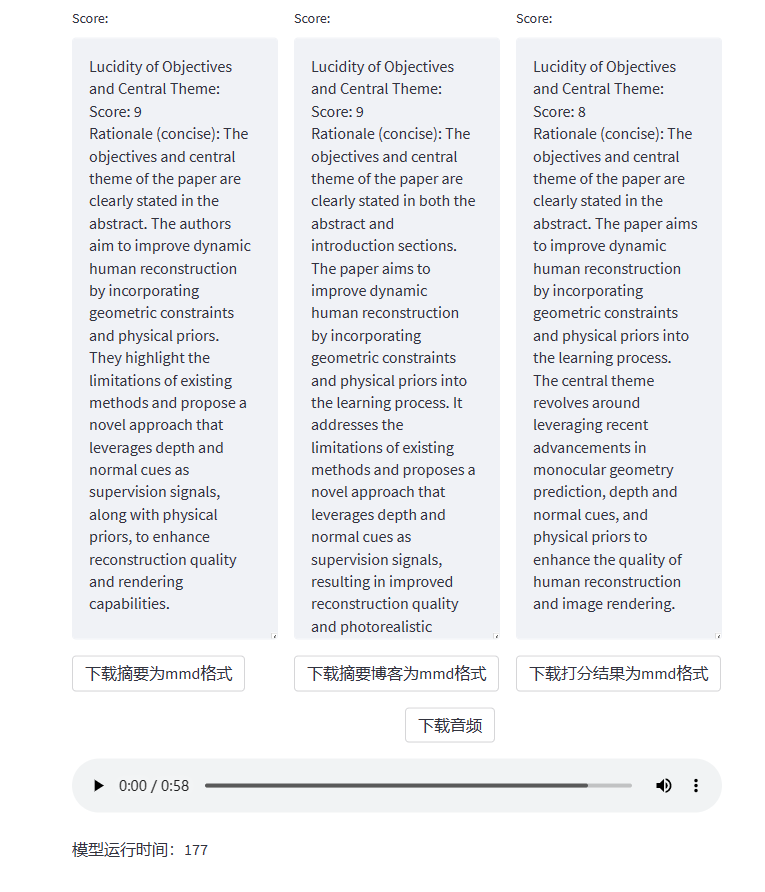
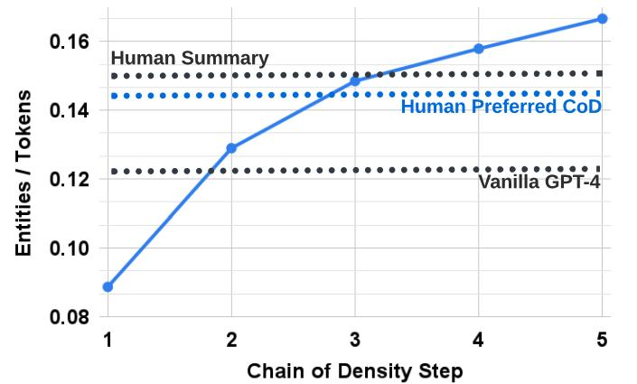
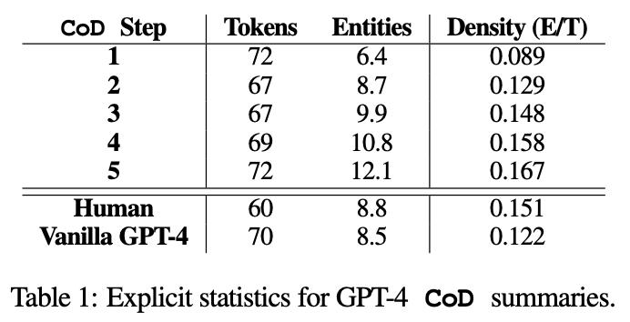

# progress

## prompts

- [x] Score怎么打？

- 原始论文太长，没法打
- 使用summary结果，感觉不太真实？

解决办法：summary与原始论文一起参与评价

```php
**Supplemental Criteria Descriptors:**  

- Lucidity of Objectives and Central Theme: Evaluate clarity of primary research objectives and central subject.

- Appositeness and Precision of Methodologies: Assess suitability and elaboration of utilized systematic approaches. 

- Veracity and Exactitude of Data and Findings: Scrutinize accuracy and precision of presented information.

- Depth of Analysis and Conclusiveness: Analyze insightfulness and cogency of deductions.

- Overall Composition Quality: Evaluate grammar, orthography, syntax, semantics, and lucidity (Note: Due to the given summary result potentially not fully exhibiting genuine composition quality, evaluate the subsequent original paper excerpt (enclosed between ```original paper excerpt``` e.g. ```original paper excerpt\\n[excerpt content]\\n```) for overall composition quality)."
```


---

- [x] 论文部分内容过长，导致摘要注意力过于集中某些部分？

- 迭代修改,若过长，例如设定一个比例，计算每个段落占总长的比例，超过平均值过多的部分或者过低的部分(10%)，都重新迭代生成

$$
\begin{align}
if~| &\frac{ratio(len(section_k)) -avg(ratio)}{avg(ratio)}|>10\% ：
\\~~~~~~&~~~~~~~iter\_reduce(section_k)

\end{align}
$$

- 给定上限字数限制

---

- [x] 最终summary效果不佳？

     借鉴Chain of Density theory，迭代改进

```json
{
     `Article: {xxxx}`
     `previous summary:{xxxx}`
     "system": "You will generate an increasingly concise and entity-dense summary of the article， shown above in the format `Article: {[article content]}`, based on the previously generated summary, displayed as `previous Summary: {[previous summary]}`. . Follow the steps provided to enhance the quality and clarity of the summary.

     

    1. **Provide Ameliorative Feedback**

       - Furnish input to refine the previous summary marked [Feedback content].
       - Identify necessary improvements in the following aspects: 

          1. Redundancy: Identify repeated concepts and suggest alternatives.
          2. Missing entities: Clearly identify 1-3 informative entities (delimited) absent from the previous summary, including key details about methods, models, datasets, metrics, etc.
          3. Quantification: Point out where results can be quantified with numbers or metrics.
          4. Extraneous details: Determine sections that can be condensed without loss of information.
          5. Coherence: Identify areas for language improvement to enhance clarity and flow.
          6. Faithfulness: Point out statements that misrepresent or contradict the paper.

    2. **Generate Enhanced Summary**

       - Incorporate preceding feedback to construct an upgraded summary marked [New Summary Content] 

       - Enhance cohesion and informativeness based on prior feedback. Write a new, denser summary of identical length, covering every entity and detail from the previous summary and incorporating missing entities.

          - Missing entities should be:
            - Relevant: to the main stories.
            - Specific: descriptive yet concise (5 words or fewer).
            - Novel: not in the previous summary.
            - Faithful: present in the article.
            - Anywhere: located in the article.

       - Guidelines:
         - Make every word count. Rewrite the previous summary to improve flow and create space for additional entities.
         - Use fusion, compression, and removal of uninformative phrases.
         - The summaries should be highly dense, concise, yet self-contained.
         - Never drop entities from the previous summary; if space is an issue, add fewer new entities.
         - Utilize clear, technical, and objective language suitable for expert readers.
         - Integrate quantified and technical nuances, avoiding redundancy, ambiguity, and unnecessary details.

    Remember: Ensure the number of words in the previous and updated summaries are close. Adjust as needed for optimal clarity and conciseness.
}

```


## streamlit

- [x] 提供更多可交互操作：

- 给出三个（num_iter）可选择的迭代版本，由用户选择后

- 目前存在的问题：当用户选择其中一个后，无法将其余的部分显示内容删除




```php
    "system": "Adhering to the prescribed methodology is imperative for generating concise summaries of discrete excerpts from an academic manuscript, serving as preparatory components for a comprehensive abstract encapsulating the entire paper. Strict adherence to the following systematic steps is crucial:\n\n1. **Construct Initial Summary**\n\n   - Initiate by crafting an initial synopsis labeled [craft abstract content].\n\n   - Present fundamental concepts and objectives succinctly using generic descriptors. Avoid overly technical details.\n\n   - Utilize generalized terminology to enhance accessibility.\n\n2. **Provide Constructive Feedback**\n \n   
    - Furnish input to refine the initial draft marked [Feedback content]. Identify necessary improvements in the following aspects: \n\n      
    (i) Redundancy: Identify recurring ideological constructs.\n \n      
    (ii) Missing Entities: Clearly specify details on methodologies, models, metrics, etc.\n\n      
    (iii) Quantification: Highlight areas where numeric values can replace descriptive generalities.\n \n      
    (iv) Tangential Concepts: Identify segments that can be excised.\n\n      
    (v) Cohesion: Identify areas for improved language fluidity.\n\n      
    (vi) Veracity: Identify statements incongruent with source content.\n\n
--> (vii) length: if length of initial draft > 
    
    3. **Generate Final Summary** \n\n   - Derive the final synopsis, denoted with [final summary content], from preceding input.\n    \n   - Encompass all key discoveries and specifics.\n \n   - Integrate quantified and technical nuances, avoiding redundancy, ambiguity, and unnecessary details.\n\n   - Enhance cohesion based on prior feedback.\n   \n   - Utilize clear, technical, and objective language suitable for expert readers.\n   \nThroughout the process, emphasize pivotal elements and address queries posed in the user's role content, maintaining coherence.",

```

- resummary生成，按照三个参数迭代三轮，并给出三轮

     

     


## fastapi

- [x] 用户选择好其满意的版本后，将该版本的summary，resummary，score显示出

- [x] 并在用户需要时，生成语音

     - 遇到问题：

          ```python
          {"requestId":"3feb3078-2783-4718-9ea5-e51da3832e3f","errorCode":"2004"}
          ```

          推测可能是长度问题/时间问题导致，同一句话长度为 15，在原长情况（或✖️5）下能正常，但在✖️10之后发现报错如上
          
          

- [ ] 生成博客

     prompts还没有完善完成
     
     
     
- [ ] 不同用户访问，刷新页面


- 3.5 instruct

- 1106（json）

- 口播1~2分钟

- meta（情感）/gpt 音频

- 句/段拆分

	[产品文档-智能语音服务 (youdao.com)](https://ai.youdao.com/DOCSIRMA/html/tts/api/cyyzx/index.html)

	

- 优化界面，三
- 应用层，prompts优化（中文评估）
- 
