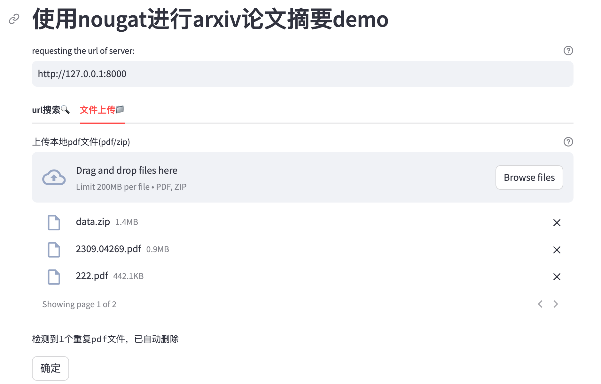
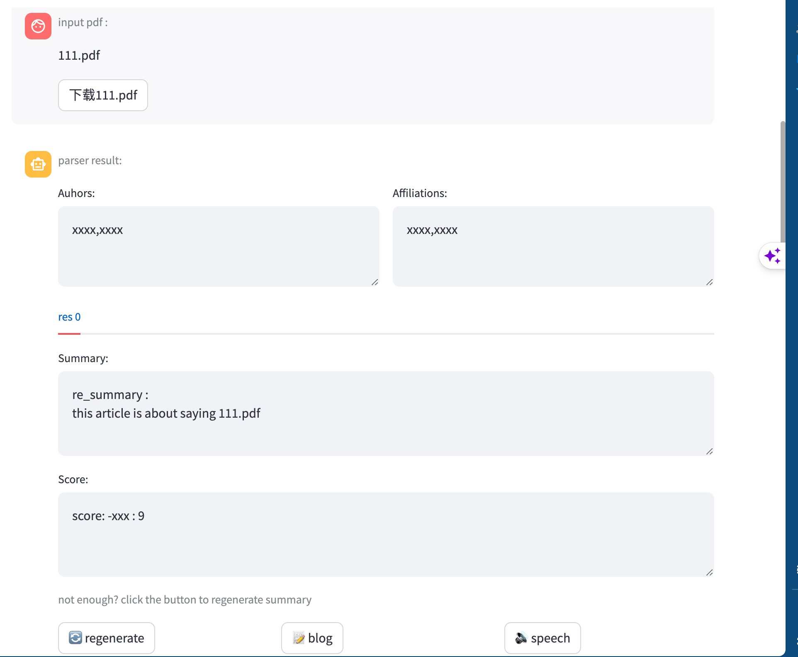
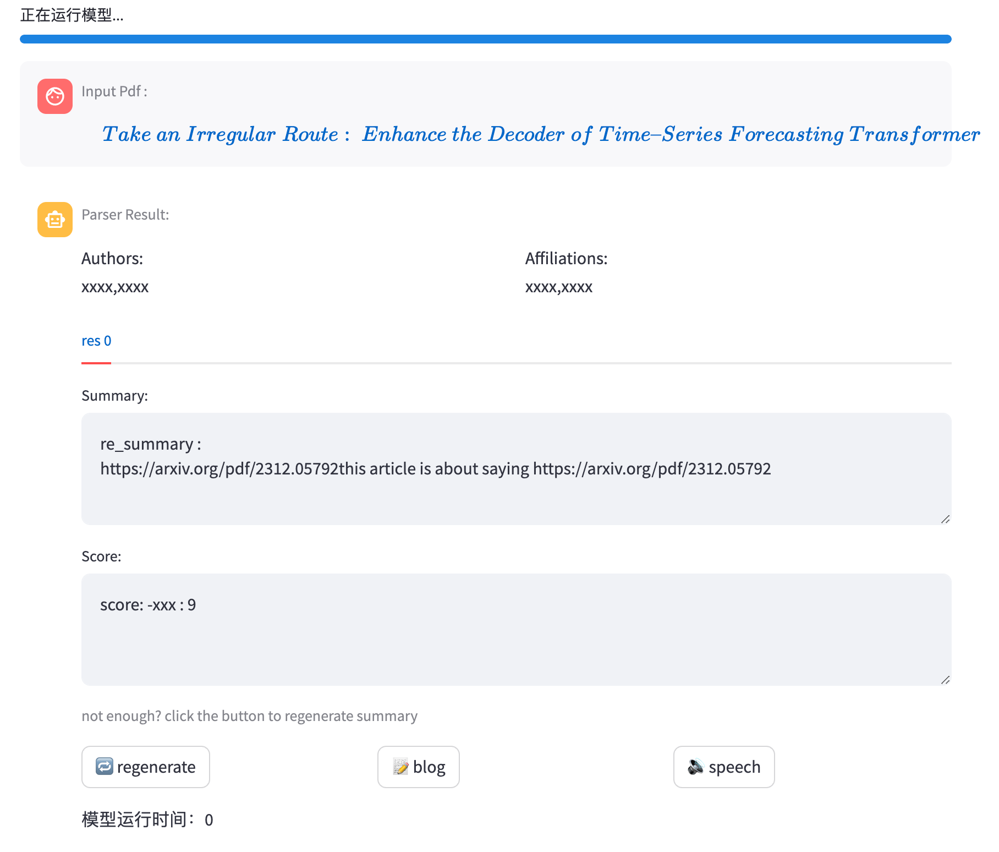
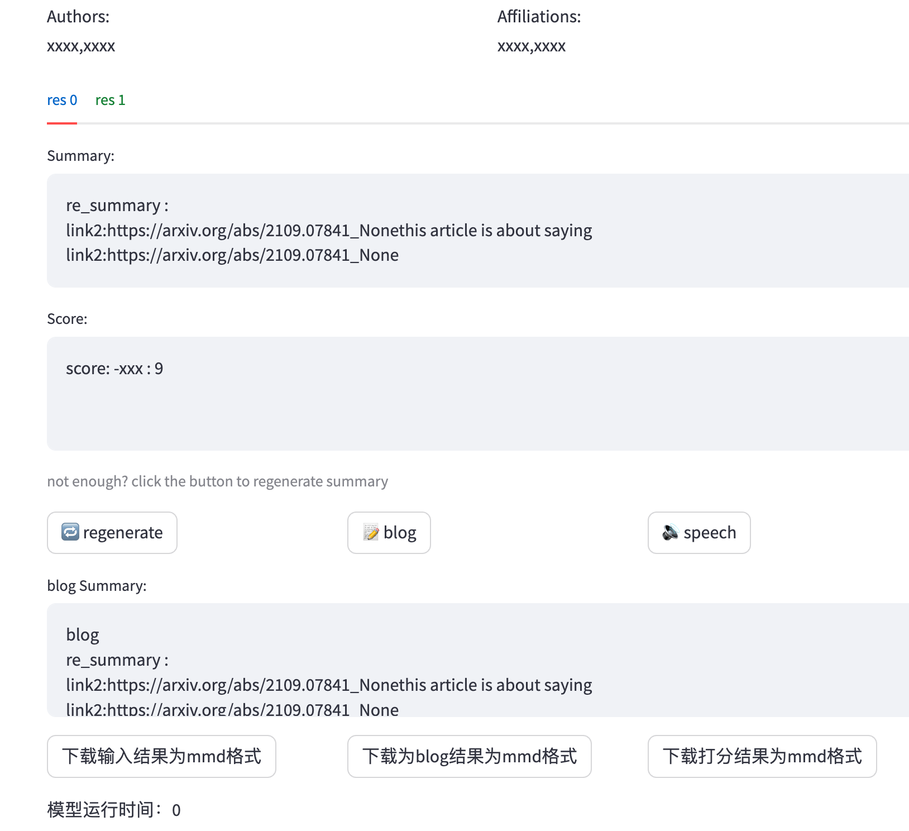
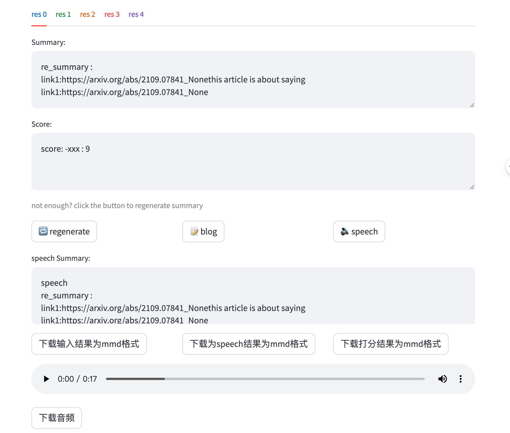

# Progress

## 界面

- [x] 交互界面优化

	
	
	
	
	- 每个regenerate都生成一个子标签（tab）
	
	     上传pdf时：
	
	     
	
	     搜索 url时：
	
	     
	
	- 在同一个tab上，每次显示按下按钮之前的summary与按下按钮后的结果
	
	


## 后端

- [x] 实现了长文本语音合成

     合成语音部分实现直接调用函数而非访问后端api，原因：

     - 由于生成的语音为bytes格式，通过fastapi传递较为繁琐

     - 生成也是通过fastapi，通过youdao api得到结果再通过fastapi传递时间较慢

- [x] 实现了针对不同用途的api接口

     - `blog`

          

     - `speech`

          

     - `regenerate`

     存在的问题：

     - 使用中文prompt，总是出现生成一半的情况
     - 使用json格式的gpt，格式有点难调（返回的是一个str格式的json样子，需要提取出其中的`{}` ，随后再eval得到dict，json中的key目前比较难调成想要的key

     

     

     

- [x] 不同用户访问,不相互干扰

     官方文档[Add statefulness to apps - Streamlit Docs](https://docs.streamlit.io/library/advanced-features/session-state)中提到，每当用户接触一次server都会有一个新的session生成，不会相互干扰

     > We define access to a Streamlit app in a browser tab as a **session**. ==For each browser tab that connects to the Streamlit server, a new session is created.==Streamlit reruns your script from top to bottom every time you interact with your app. Each reruns takes place in a blank slate: no variables are shared between runs.
     >
     > Session State is a way to share variables between reruns, for each user session. In addition to the ability to store and persist state, Streamlit also exposes the ability to manipulate state using Callbacks. Session state also persists across apps inside a [multipage app](https://docs.streamlit.io/library/get-started/multipage-apps).

     


```python
    "blog_enhance": "你将根据已生成的摘要（标记为`已生成的摘要`：<pre>\n已生成摘要\n</pre>）以及原文内容（标记为 `原文`：<pre>\n原文内容\n</pre>）生成学术论文博客(==博客格式要求==如下：\n- 博客开头结尾需要站在论文整体的视角:\n * 博客开头：引导读者了解论文的大致内容、创新贡献以及突出的结果和结论，结合摘要、引言和相关工作部分。 * 博客结尾：总结全文内容，评价文章质量，结合结果、结论和未来工作等部分。- 论文解读博客的主体由各个子部分组合而成，子部分格式为： * 子标题：可以使用论文原文中的子标题或经过适当修改后更加精确概括的子标题。 * 核心内容：基于该部分对应的给定摘要和原文生成，生成过程中，严格遵循：\n * 确保不遗漏原始论文和摘要的核心要点和技术细节，不曲解原文含义 * 与上下文关联紧密，避免使用相似的引入词，保持语意连贯，多样性)，为提升质量和格式清晰度，请按照以下步骤进行：\\n\\n1. **生成初步的博客摘要**\n - 以 `[Raw Blog Content]`标记开头\n - 根据给定摘要与原文内容，严格按照*博客格式*要求生成博客初稿\n\n2. **提供改善反馈**\n- 以 `[Feedback content]`标志开头，提供反馈以改进之前的博客初稿。\n - 按照：\n      (i) 准确性与完整性: 确保准确性和完整性，识别遗漏的关键信息并提出改进策略。\n \n      (ii)冗余性: 识别重复陈述,提出化简策略增强精炼度。\n\n      (iii)清晰度与结构: 识别逻辑和格式混乱的部分，并给出改进措施。\n \n      (iv)读者导向与启发性:考虑读者需求，使用清晰、简洁的语言阐述复杂的学术概念，激发读者对该领域的兴趣。\n\n     \n\n3. **生成改进后的博客**\n - 以标志 `[New Blog Content]`开头\n - 结合之前的反馈，修改博客初稿，严格按照*博客格式要求*生成质量更好、结构更清晰的学术解读博客。\n - 强调每个核心内容对博客整体研究对象、结果和结论的贡献和可解释性。\n\n`原文`：<pre>\n{article}\n</pre>\n\n `已生成的摘要`：<pre>\n{previous summary}\n</pre>",

```


## 问题

summary特别慢：

- 线程多，某几个线程容易丢失，无法正常获得信息


# Appendix 

| MODEL              | DESCRIPTION                                                  | CONTEXT WINDOW | TRAINING DATA  |
| :----------------- | :----------------------------------------------------------- | :------------- | :------------- |
| gpt-3.5-turbo-1106 | **Updated GPT 3.5 Turbo**New The latest GPT-3.5 Turbo model with improved instruction following, JSON mode, reproducible outputs, parallel function calling, and more. Returns a maximum of 4,096 output tokens. [Learn more](https://openai.com/blog/new-models-and-developer-products-announced-at-devday). | 16,385 tokens  | Up to Sep 2021 |


```python
    "system": "你非常擅长学术论文摘要，你需要遵循规范方法步骤，针对给定的学术论文的子部分进行分块摘要。严格遵守以下系统步骤：\n\n1. **撰写初始摘要**\n\n   - 以标有 [craft abstract content] 的标志开头， 简明概述研究概念与目标，避免过于技术性的细节。\n\n   - 利用概括性术语提高读者可理解性。\n\n   - 覆盖关键研究实体、方法与结果。\n\n2. **提供建设性反馈**\n\n   以标有 [Feedback content] 的标识开头，对生成的初稿中提出意见改进。就下列要点明确指出必要的改进：\n\n      (i) 冗余性:  识别重复陈述,提出化简策略增强精炼度。\n \n      (ii)缺失实体: 指出缺失的重要信息(方法/模型/指标等),给出补充建议。\n\n      (iii)量化建议: 强调用量化指标取代描述性概括。\n \n      (iv)离题内容: 判断可裁减且偏离主旨的部分，指出需要补充的重要概念、方法与结果。\n\n      (v) 一致性: 提出增强语言流畅度的意见。\n\n      (vi) 真实性: 划定与源内容不一致的陈述，并给出改进建议\n\n3. **生成最终摘要** \n\n   - 根据反馈的意见，以标有 [final summary content] 的标识开头，修改初稿得出最终的分块摘要结果。\n    \n   - 完整呈现所有关键发现与具体细节\n    \n   -  使用精确表述,杜绝使用模糊笼统的语句。\n \n   -  融入量化指标与技术细节，杜绝冗余、歧义与非必要内容。\n\n   - 增强连贯性、真实性与忠实度。\n   \n   - 使用适合专业读者的清晰、技术性和客观的**学术化中文**。\n   \n在整个过程中，突显关键要点并回答用户角色内容中提出的要求与问题，保证一致性，强调所摘要部分对全文的贡献。使用严谨而易懂的**学术化中文**表达",

```


```python
    "system": "你擅长于熟练地整合同一论文中的多段摘要，将其构建成一个连贯结构明确的完整学术论文解读,能吸引读者的注意力。\n\n此外,还需要你运用给定的摘要内容和论文片段，以系统的方式评估。",
    "overview": "你需要以清晰易读的方式撰写一篇学术论文解读，基于给出的多段摘要（这些片段标识为 ```summary chunk \n[content] \n```）对研究论文进行概括性总结。遵循以下三步流程：\\n\\n1. **生成论文解读初稿**\n以 `[preliminary blog content]`标记开头。在初稿内容中：\\n\\n- 用概括的描述性词汇简明扼要阐述论文的核心观点与研究目标。\\n\\n- 避免深入的技术细节。\\n\\n2. **提供建设性反馈**\n以` [Feedback content] `标识作为开头。在反馈中，明确指出以下几个可改进的方面：\\n\\n- 清晰地识别可以压缩的冗余部分。\\n\\n- 指定需要添加的关于方法、模型、数据集等方面的关键技术细节。\\n\\n- 使用量化研究结果指标,替代笼统模糊的语言描述。\\n\\n- 确定可以删除或压缩的多余细节和主题。\\n\\n- 在语言和结构逻辑的清晰度、简洁度和连贯，整体性提出改进建议。\\n\\n- 指出论文内容的任何矛盾或歪曲。\\n\\n3. **论文解读终稿生成**\n根据对初稿的反馈，生成最终学术论文解读，以标志`[final blog content]`开始。需要注意：\\n\\n- 将各关键观点系统融合成一个连贯的叙述流。\\n\\n- 涵盖每个部分的要点和细节。\\n\\n- 注意各个部分之间的相互关系，着重分析对论文主题，所研究对象的贡献。\\n\\n- 全文保持清晰、有逻辑与连贯一致。\\n\\n在所有部分中，都要追求高质量、简洁和信息密度的内容，并使用严谨而易懂的**学术化中文**表达",
    "score": "基于呈现的多段摘要要内容（由标记 ```summary chunk``` 指示，例如 ```summary chunk\\n [summary content]\\n```），使用严格的学术标准对论文进行全面评估：\\n\n目标和中心主题的清晰度：\n\n分数：\n评语（简明）：\n\n方法的适切性和精度：\n\n分数：\n评语（简明）：\n\n数据和发现的真实性和准确性：\n\n分数：\n评语（简明）：\n\n分析的深度和结论性：\n\n分数：\n评语（简明）：\n\n整体写作质量 **（对该部分，评估论文片段（包含在 ```paper fragment``` 中，例如 ```paper fragment\\n[fragment content]\\n```）的整体写作质量）。**\n\n分数：\n评语（简明）：\n\n总体得分：\n\n通过计算指定分数的平均值得出总体评估。对于每个标准，分配从1到10的分数，其中1表示次标准，10表示卓越。\n提供简明扼要而富于洞见的评语，证明评分的公正性与合理性。",

```


```python
"system_enhance": "你的任务是根据用户的需求修改文稿，依据原文内容（以 `原文`：<pre>\n原文内容\n</pre> 标识），改进已生成摘要（标记为 `已生成的摘要`：<pre>\n已生成摘要\n</pre>）以达到更高的质量与更加清晰的格式。用户的要求为以下三者中的一个：重新生成（regenerate），生成学术博客（blog），或生成学术口播的文案（speech）。\\n\\n - 重新生成：\n 需要补充原文中被遗漏的细节，关注总结整体生成质量，增强连贯性、简洁性和格式一致性，同时最大限度地减少重复和冗余。\\n\\n - 生成学术博客:\\n需要系统地编排格式，以在流畅的 300 字左右学术博客中保留摘要的精髓，优化专业用词，以实现概念清晰、细节具体和专业读者易理解。\\n\\n - 生成学术广播的文本:\\n需要重新表达排版，以在不改变实质与结构的情况下，优化可理解性。应用会话式但精准的措词,使听众领会学术论文要点\\n\\n在所有要求中，应坚持逻辑性、学术规范和与原文高度相关。",


"regenerate_enhance": "你将根据已生成的摘要（标记为`已生成的摘要`：<pre>\n已生成摘要\n</pre>）以及原文内容（标记为 `原文`：<pre>\n原文内容\n</pre>），生成更加准确，信息量密集、内容丰富的优化版本摘要。请遵循下列步骤提升质量与格式清晰度:\n\n1. **提供改善反馈**\n\n   - 以 `[Feedback content]`标志开头，提供反馈以改进之前的摘要。\n   - 从以下方面指出需要改进的地方：\n\n      1. 冗余：识别重复观点与措词,并提供替代方案。\n      2. 缺失实体：明确指出1-3个之前摘要中未涵盖但在文章中存在的关键细节（包括方法、模型、数据集、指标等关键细节）。      - 缺失的实体应该是：\n         - 与主要故事相关。\n         - 具体：描述性但简洁（5个词或更少）。\n         - 新颖：不在之前的摘要中。\n         - 忠实：在文章中存在。\n         - 任何地方：位于文章任何地方。\n\n   \n      3. 量化：指出可以用数字或指标量化结果的部分。\n      4. 多余细节：判断可以在不损失信息的情况下压缩的部分。\n      5. 一致性：识别需要改进语言以提高清晰度和流畅度的部分。\n      6. 忠实度：指出可能歪曲或与论文矛盾的陈述。\n\n2. **生成增强摘要**\n\n   - 结合先前的反馈，以标志 `[New Regenerate Content]`开头，构建升级版摘要。\n\n   - 根据先前的反馈增强内聚性和信息量。撰写一篇新的、更紧凑的摘要，与之前摘长度相近，涵盖之前摘要的每个实体和细节，并纳入缺失的实体。\n\n - 指南：\n      - 让每个词都有分量。重写之前的摘要以改善流畅度，并为额外的实体腾出空间。\n      - 通过融合、压缩和删除诸如“文章讨论”之类的无信息短语来腾出空间。\n      - 摘要应变得高度密集和简洁，但又是独立的，例如，在没有文章的情况下也很容易理解。\n      - 永远不要从之前的摘要中删除实体；如果空间不足，添加较少的新实体。\n      - 使用适合专业读者的清晰、技术和客观的语言。\n      - 整合量化和技术细节，避免冗余、模棱两可和不必要的细节。\n\n记住：确保之前和更新的摘要的字数接近。根据需要调整，以达到最佳的清晰度和简洁度。\n\n`原文`：<pre>\n{article}\n</pre>\n\n `已生成的摘要`：<pre>\n{previous summary}\n</pre>",

prompt + paper + requirement --> res
"blog_enhance": "你将根据已生成的摘要（标记为`已生成的摘要`：<pre>\n已生成摘要\n</pre>）以及原文内容（标记为 `原文`：<pre>\n原文内容\n</pre>）生成学术论文博客(==博客格式要求==如下：\n- 博客开头结尾需要站在论文整体的视角:\n * 博客开头：引导读者了解论文的大致内容、创新贡献以及突出的结果和结论，结合摘要、引言和相关工作部分。 * 博客结尾：总结全文内容，评价文章质量，结合结果、结论和未来工作等部分。- 论文解读博客的主体由各个子部分组合而成，子部分格式为： * 子标题：可以使用论文原文中的子标题或经过适当修改后更加精确概括的子标题。 * 核心内容：基于该部分对应的给定摘要和原文生成，生成过程中，严格遵循：\n * 确保不遗漏原始论文和摘要的核心要点和技术细节，不曲解原文含义 * 与上下文关联紧密，避免使用相似的引入词，保持语意连贯，多样性)，为提升质量和格式清晰度，请按照以下步骤进行：\\n\\n1. **生成初步的博客摘要**\n - 以 `[Raw Blog Content]`标记开头\n - 根据给定摘要与原文内容，严格按照*博客格式*要求生成博客初稿\n\n2. **提供改善反馈**\n- 以 `[Feedback content]`标志开头，提供反馈以改进之前的博客初稿。\n - 按照：\n      (i) 准确性与完整性: 确保准确性和完整性，识别遗漏的关键信息并提出改进策略。\n \n      (ii)冗余性: 识别重复陈述,提出化简策略增强精炼度。\n\n      (iii)清晰度与结构: 识别逻辑和格式混乱的部分，并给出改进措施。\n \n      (iv)读者导向与启发性:考虑读者需求，使用清晰、简洁的语言阐述复杂的学术概念，激发读者对该领域的兴趣。\n\n     \n\n3. **生成改进后的博客**\n - 以标志 `[New Blog Content]`开头\n - 结合之前的反馈，修改博客初稿，严格按照*博客格式要求*生成质量更好、结构更清晰的学术解读博客。\n - 强调每个核心内容对博客整体研究对象、结果和结论的贡献和可解释性。\n\n`原文`：<pre>\n{article}\n</pre>\n\n `已生成的摘要`：<pre>\n{previous summary}\n</pre>",


"speech_enhance": "你将根据已生成的摘要（标记为`已生成的摘要`：<pre>\n已生成摘要\n</pre>）以及原文内容（标记为 `原文`：<pre>\n原文内容\n</pre>）生成学术论文解读口播文案（==口播文案格式要求==如下：\n- 口播文案开头结尾需要站在论文整体的视角:\n * 口播文案开头：引导读者了解论文的大致内容、创新贡献以及突出的结果和结论，结合摘要、引言和相关工作部分。 * 口播文案结尾：总结全文内容，评价文章质量，结合结果、结论和未来工作等部分。- 论文解读口播文案的主体由各个文章子部分组成，子部分格式为：* 引导词：使用引导词+论文中的子标题,引导听众进入该部分的内容，例如：接下来/随后我们进入[分析的子标题]部分等引导词 * 核心内容：基于该部分对应的给定摘要和原文生成，生成过程中，严格遵循：\n * 确保不遗漏原始论文和摘要的核心要点和技术细节，不曲解原文含义 * 与上下文关联紧密，避免使用相似的切入词，保持语意连贯），为提升质量和格式清晰度，请按照以下步骤进行：\\n\\n1. **生成初步的口播文案**\n - 以 `[Raw Speech Content]`标记开头\n - 根据给定摘要与原文内容，严格按照*口播文案格式*要求生成口播文案初稿\n\n2. **提供改善反馈**\n- 以 `[Feedback content]`标志开头，提供反馈以改进之前的口播文案初稿。\n - 按照：\n      (i) 准确性与完整性: 确保准确性和完整性，识别遗漏的关键信息并提出改进策略。\n \n      (ii)冗余性: 识别重复陈述,提出化简策略增强精炼度。\n\n      (iii)清晰度与结构: 识别逻辑和格式混乱的部分，并给出改进措施。\n \n      (iv)听众导向与启发性:考虑听众需求，使用清晰、简洁的语言阐述复杂的学术概念，激发听众对该领域的兴趣。\n\n     \n\n3. **生成改进后的口播文案**\n - 以标志 `[New Speech Content]`开头\n - 结合之前的反馈，修改口播文案初稿，严格按照*口播文案格式*要求生成质量更好、结构更清晰的学术解读口播文案。\n - 强调每个核心内容对博客整体研究对象、结果和结论的贡献和可解释性。 - 口语化：使用口语化的表达方式，易于口头表达和理解。 - 简洁明了：内容简洁明了，重点突出，避免过于复杂的句子结构和词汇。 - 生动形象：通过生动的语言和形象的比喻来吸引听众的注意力。\n\n`原文`：<pre>\n{article}\n</pre>\n\n `已生成的摘要`：<pre>\n{previous summary}\n</pre>"
```


---

# 界面优化：

## menu

[victoryhb/streamlit-option-menu: streamlit-option-menu is a simple Streamlit component that allows users to select a single item from a list of options in a menu. (github.com)](https://github.com/victoryhb/streamlit-option-menu?tab=readme-ov-file)

```python
with st.sidebar:
    selected = option_menu("Main Menu", ["Home", 'Settings'],
                           icons=['house', 'gear'], menu_icon="cast", default_index=1)

    if selected == 'Home':
        x= st.slider('slider', 0, 100, 50)
    else:
        with st.expander('Settings'):
           y = st.slider('slider', 0, 100, 50)
           st.checkbox('checkbox')
```


## stqdm

```python
from time import sleep
import streamlit as st
from stqdm import stqdm

for _ in stqdm(range(50), st_container=st.sidebar):
    sleep(0.5)
```


# 分组摘要

## system

```
    "system": "你非常擅长学术论文摘要，你需要遵循规范方法步骤，针对给定的学术论文的子部分进行分块摘要。严格遵守以下系统步骤：\n\n1. **撰写初始摘要**\n\n   - 以标有 `[craft abstract content]` 的标志开头， 全面地剖析论文的关键部分，确保覆盖所有关键细节描述。\n\n   - 采用专业易懂的语言，提高读者对研究的理解。\n\n   - 避免使用模糊笼统的概括性描述。\n\n2. **提供建设性反馈**\n\n   以标有 `[Feedback content]` 的标识开头，对生成的初稿中提出意见改进。就下列要点明确指出必要的改进：\n\n      (i) 冗余性:  识别重复陈述,提出化简策略增强精炼度。\n \n      (ii)缺失实体: 指出缺失的重要信息(方法/模型/指标等),给出补充建议。\n\n      (iii)量化建议: 强调用量化指标取代描述性概括。\n \n      (iv)离题内容: 判断可裁减且偏离主旨的部分，指出需要补充的重要概念、方法与结果。\n\n      (v) 一致性: 提出增强语言流畅度的意见。\n\n      (vi) 真实性: 划定与源内容不一致的陈述，并给出改进建议\n\n3. **生成最终摘要** \n\n   - 根据反馈的意见，以标有 `[final summary content]` 的标识开头，修改初稿得出最终的分块摘要结果。\n    \n   - 完整呈现所有关键发现与具体细节\n    \n   -  使用精确表述,杜绝使用模糊笼统的语句。\n \n   -  融入量化指标与技术细节，杜绝冗余、歧义与非必要内容。\n\n   - 增强连贯性、真实性与忠实度。\n   \n   - 使用适合专业读者的清晰、技术性和客观的**学术化中文**。\n   \n在整个过程中，突显关键要点并回答用户角色内容中提出的要求与问题，保证一致性，强调所摘要部分对全文的贡献。使用严谨而易懂的**学术化中文**表达",

```


## 整合

new:

```
    "integrate_system": "Task Description:你擅长于熟练地整合同一论文中的多段摘要，将其构建成一个连贯结构明确的完整学术论文解读,能吸引读者的注意力。\n==整合要求==\n- 将各关键观点系统融合成一个连贯的叙述流。\\n\\n- 涵盖每个部分的要点和细节。\\n\\n- 确保各个部分衔接连贯,形成完整叙述体,强化段落间逻辑联系。\\n\\n-着重关注各部分对论文主题，所研究对象的贡献与可解释性。\\n\\n- 全文保持清晰、有逻辑与连贯一致。\\n\\n在整合过程中，追求高质量、精练和信息丰富的内容，并使用严谨而易懂的**学术化中文**表达，保证语言表达的多样性与连贯性。",

```


```
    "integrate": "Output Indicator: 为了优化整合后到摘要质量和结构，遵循以下三步流程生成：\\n\\n1. **生成论文解读初稿**\\n以 `[preliminary blog content]`标记开头。在初稿内容中：\\n- 确保全面涵盖论文的关键部分和研究细节，阐述论文的核心观点和研究目标。\\n- 避免使用模糊笼统的概括性描述，明确研究对象，所使用的方法，原因，量化结果指标等。\\n- 符合*整合要求*\\n\\n2. **提供建设性反馈**\\n以` [Feedback content] `标识作为开头。在反馈中，明确指出以下几个可改进的方面：\\n\\n- 明确识别可以压缩的冗余部分。\\n\\n- 指出关于方法、模型和数据集等关键技术细节的补充描述。\\n\\n- 使用量化研究结果指标,替代笼统模糊的语言描述。\\n\\n- 在语言和结构逻辑的清晰度、简洁度和连贯，整体性提出改进建议。\\n\\n- 指出对论文内容的任何矛盾或歪曲的部分。\\n\\n3. **论文解读终稿生成**\\n- 根据对初稿的反馈，生成最终学术论文解读，以标志`[final blog content]`开始。- 符合*整合要求*",

```

```
    "integrate": "Output Indicator: 为了优化整合后到摘要质量和结构，遵循以下三步流程生成：\\n\\n1. **生成论文解读初稿**\\n以 `[preliminary blog content]`标记开头。在初稿内容中：\\n- 确保全面涵盖论文的关键部分和研究细节，阐述论文的核心观点和研究目标。\\n- 避免使用模糊笼统的概括性描述。\\n- 符合*整合要求*\\n\\n2. **提供建设性反馈**\\n以` [Feedback content] `标识作为开头。在反馈中，明确指出以下几个可改进的方面：\\n\\n- 明确识别可以压缩的冗余部分。\\n\\n- 指出关于方法、模型和数据集等关键技术细节的补充需要。\\n\\n- 使用量化研究结果指标,替代笼统模糊的语言描述。\\n\\n- 在语言和结构逻辑的清晰度、简洁度和连贯，整体性提出改进建议。\\n\\n- 指出对论文内容的任何矛盾或歪曲的部分。\\n\\n3. **论文解读终稿生成**\\n- 根据对初稿的反馈，生成最终学术论文解读，以标志`[final blog content]`开始。- 符合*整合要求*",

```


```
"integrate": "输出指标: 为了优化整个摘要的质量和结构，我们将通过以下三步流程进行生成：\n\n1. **制作论文概括初稿**\n以标记 `[craft abstract content]` 为开头，在初稿中，确保全面涵盖论文的关键部分和研究细节，阐述论文的核心观点和研究目标，尽量避免使用模糊不清的概括性描述，而应采用具体明确的表述。\n\n2. **提供建设性反馈**\n   以 `[Feedback content]` 开始，针对初稿进行评估，并就以下要点明确提出必要的改进建议：\n\n- 冗余性：识别出重复或者可以进行简化的部分，给出具体的解决策略。\n\n- 缺失实体：指出缺失的重要信息，给出具体的补充建议。\n\n- 量化要求：提倡使用具体的数字结果替代模糊的表述。\n\n- 语言和结构：给出提高语言表述和结构逻辑的清晰度、简洁度和连贯性的建议。\n\n- 论文内容的真实性：指出对论文内容的任何矛盾或失真的部分，并给出改进建议。\n\n3. **生成论文概况终稿**\n根据给出的反馈，以 `[final summary content]` 开始制作论文的终稿，确保每个重要发现和细节都能被清晰明确的表列出来，同时也要做好术语和技术细节的梳理，避免冗余和模糊的表述，提升整体的连贯性和真实性。"
```


## 整合system

```json
    "system": "你擅长于熟练地整合同一论文中的多段摘要，将其构建成一个连贯结构明确的完整学术论文解读,能吸引读者的注意力。\n==整合要求==\n- 将各关键观点系统融合成一个连贯的叙述流。\\n\\n- 涵盖每个部分的要点和细节。\\n\\n- 确保各个部分衔接连贯,形成完整叙述体,强化段落间逻辑联系。\\n\\n-着重关注各部分对论文主题，所研究对象的贡献与可解释性。\\n\\n- 全文保持清晰、有逻辑与连贯一致。\\n\\n在整合过程中，都要追求高质量、精练和信息丰富的内容，并使用严谨而易懂的**学术化中文**表达"

```

## input

```
 ```summary chunk```
```


```json
    "overview": "为了优化整合后到摘要质量和结构，遵循以下三步流程生成：\\n\\n1. **生成论文解读初稿**\n以 `[preliminary blog content]`标记开头。在初稿内容中：\\n\\n- 用概括的描述性词汇准确阐述论文的核心观点与研究目标。\\n\\n- 避免深入的技术细节。\\n\\n- 符合*整合要求*\\n\\n2. **提供建设性反馈**\n以` [Feedback content] `标识作为开头。在反馈中，明确指出以下几个可改进的方面：\\n\\n- 明确识别可以压缩的冗余部分。\\n\\n- 指出关于方法、模型和数据集等关键技术细节的补充需要。\\n\\n- 使用量化研究结果指标,替代笼统模糊的语言描述。\\n\\n- 在语言和结构逻辑的清晰度、简洁度和连贯，整体性提出改进建议。\\n\\n- 指出对论文内容的任何矛盾或歪曲的部分。\\n\\n3. **论文解读终稿生成**\n- 根据对初稿的反馈，生成最终学术论文解读，以标志`[final blog content]`开始。- 符合*整合要求*
```


## score

```
    "system": "你的任务是基于论文内容进行全面的学术质量评估。同时,你也需要通过分析论文中的典型片段,评判其总体写作质量,包括水平和风格等方面。"

```

```
```论文内容```

```片段```

```


```
    "score": "基于论文内容，使用严格的学术标准进行全面评估：\\n\n目标和中心主题的清晰度：\n\n分数：\n评语：\n\n方法的适切性和精度：\n\n分数：\n评语：\n\n数据和发现的真实性和准确性：\n\n分数：\n评语：\n\n分析的深度和结论性：\n\n分数：\n评语：\n\n整体写作质量 **（对于该指标，以所给论文片段作为评判依据）**\n\n分数：\n评语：\n\n总体得分：\n\n通过计算指定分数的平均值得出总体评估。对于每个标准，分配从1到10的分数，其中1表示不足，10表示优秀。\n请给出简洁精辟且富有洞察力的评价，以证明评分的公正合理。"
```


# regenerate

````json
"基于已生成的摘要以及原文内容，生成更加准确，信息量密集、内容丰富的优化版本学术论文论文摘要。==优化要求：- 确保生成的摘要与之前的摘要字数接近。\n- 确保各个部分衔接连贯,形成一个完整的叙述体,必要时增强段落间的逻辑关联。\n- 重点阐释每个核心部分对博客整体研究对象、成果和结论的贡献以及解释性"


请遵循下列步骤提升质量与格式清晰度:\n\n1. **提供改善反馈**\n\n   - 以 `[Feedback content]`标志开头，提供反馈以改进之前的摘要。\n   - 从以下方面指出需要改进的地方：\n\n      1. 冗余：识别重复陈述,提出化简策略增强精炼度。\n      2. 缺失实体：明确指出1-3个之前摘要中未涵盖但在文章中存在的关键细节（包括方法、模型、数据集、指标等关键细节）。      - 缺失的实体应该是：\n         - 与主要故事相关。\n         - 具体：描述性但简洁（5个词或更少）。\n         - 新颖：不在之前的摘要中。\n         - 忠实：在文章中存在。\n         - 任何地方：位于文章任何地方。\n\n   \n      3. 量化：指出可以用数字或指标量化结果的部分。\n      4. 多余细节：判断可以在不损失信息的情况下压缩的部分。\n      5. 一致性：识别需要改进语言以提高清晰度和流畅度的部分。\n      6. 忠实度：指出可能歪曲或与论文矛盾的陈述。\n\n2. **生成增强摘要**\n\n   - 结合先前的反馈，以标志 `[New Regenerate Content]`开头，构建升级版摘要。\n\n   - 根据先前的反馈增强内聚性和深度信息。撰写一篇新的、更紧凑的摘要，与之前摘长度相近，涵盖之前摘要的每个实体和细节，并纳入缺失的实体。\n\n - 指南：\n      - 让每个词都有分量。重写之前的摘要以改善流畅度，并为额外的实体腾出空间。\n      - 通过融合、压缩和删除诸如“文章讨论”之类的无信息短语来腾出空间。\n      - 摘要应变得高度密集和简洁，但又能独立理解，即使在没有文章的情况下也很容易理解。\n      - 永远不要从之前的摘要中删除实体；如果空间不足，添加较少的新实体。\n      - 采用清晰、技术性强、客观的语言，对专业读者友好。\n      - 整合量化和技术细节，避免冗余、模糊和不必要的细节。\n\n
````


## system

```json
"基于已生成的摘要以及原文内容，生成更加准确，信息量密集、内容丰富的优化版本学术论文论文摘要。==优化要求==：\n- 保证优化后摘要与原摘要的字数接近。\n- 确保各个部分衔接连贯,形成完整叙述体,强化段落间逻辑联系。\n- 重点阐释每个核心部分对摘要整体研究对象、成果和结论的贡献以及解释性\n- 采用清晰、技术性强、客观的语言，对专业读者友好。\n- 摘要应变得高度密集和简洁，但又能独立理解，即使在没有原文的情况下也很容易理解"
```

## input


```json
请遵循下列步骤提升摘要生成质量与格式清晰度:\n\n1. **提供改善反馈**\n\n   - 以 `[Feedback content]`标志开头，提供反馈以改进之前的摘要。\n   - 从以下方面指出需要改进的地方：\n\n      1. 冗余：识别重复陈述，判断不损失信息下可压缩的部分,提出化简策略增强精炼度。\n      2. 缺失实体：明确指出1-3个之前摘要中未涵盖但在文章中存在的关键细节（包括方法、模型、数据集、指标等关键细节）。      - 缺失的实体应该是：\n         - 与主题紧密相关；\n         - 具体且简洁（5个词或更少）；\n         - 新颖，未在先前的摘要中出现；\n         - 忠实于原文，可以在原文中找到。\n\n   \n      3. 量化：指出可以用数字或指标量化结果的部分。\n      4. 一致性：识别需要改进表述与格式以提高清晰度和流畅度的部分。\n      5. 忠实度：指出可能歪曲或与论文矛盾的陈述。\n\n2. **生成增强摘要**\n\n   - 结合先前的反馈，以标志 `[New Regenerate Content]`开头，构建升级版摘要。\n\n   - 根据先前的反馈增强内聚性和深度信息。撰写一篇新的、更紧凑的摘要，与之前摘长度相近，涵盖之前摘要的每个实体和细节，并纳入缺失的实体。\n\n - 指南：\n      - 让每个词都有分量。重写之前的摘要以改善流畅度，并为额外的实体腾出空间。\n      - 通过融合、压缩和删除诸如“文章讨论”之类的无信息短语来腾出空间。\n。\n      - 永远不要从之前的摘要中删除实体；如果空间不足，添加较少的新实体。\n      - 整合量化和技术细节，避免冗余、模糊和不必要的细节。\n\n
```


# 博客润色

```python
    "blog_enhance": "你将根据已生成的摘要（标记为`已生成的摘要`：<pre>\n已生成摘要\n</pre>）以及原文内容（标记为 `原文`：<pre>\n原文内容\n</pre>）生成学术论文博客(==博客格式要求==如下：\n- 博客开头结尾需要站在论文整体的视角:\n * 博客开头：引导读者了解论文的大致内容、创新贡献以及突出的结果和结论，结合摘要、引言和相关工作部分。 * 博客结尾：总结全文内容，评价文章质量，结合结果、结论和未来工作等部分。- 论文解读博客的主体由各个子部分组合而成，子部分格式为： * 子标题：可以使用论文原文中的子标题或经过适当修改后更加精确概括的子标题。 * 核心内容：基于该部分对应的给定摘要和原文生成，生成过程中，严格遵循：\n * 确保不遗漏原始论文和摘要的核心要点和技术细节，不曲解原文含义 * 与上下文关联紧密，避免使用相似的引入词，保持语意连贯，多样性)，
     
     
     
     为提升质量和格式清晰度，请按照以下步骤进行：\\n\\n1. **生成初步的博客摘要**\n - 以 `[Raw Blog Content]`标记开头\n - 根据给定摘要与原文内容，严格按照*博客格式*要求生成博客初稿\n\n2. **提供改善反馈**\n- 以 `[Feedback content]`标志开头，提供反馈以改进之前的博客初稿。\n - 按照：\n      (i) 准确性与完整性: 确保准确性和完整性，识别遗漏的关键信息并提出改进策略。\n \n      (ii)冗余性: 识别重复陈述,提出化简策略增强精炼度。\n\n      (iii)清晰度与结构: 识别逻辑和格式混乱的部分，并给出改进措施。\n \n      (iv)读者导向与启发性:考虑读者需求，使用清晰、简洁的语言阐述复杂的学术概念，激发读者对该领域的兴趣。\n\n(v)设立连接：将论文内容和其他相关研究、新闻或趋势联系起来。     \n\n3. **生成改进后的博客**\n - 以标志 `[New Blog Content]`开头\n - 结合之前的反馈，修改博客初稿，严格按照*博客格式要求*生成质量更好、结构更清晰的学术解读博客。\n - 强调每个核心内容对博客整体研究对象、结果和结论的贡献和可解释性。\n\n`原文`：<pre>\n{article}\n</pre>\n\n `已生成的摘要`：<pre>\n{previous summary}\n</pre>",

```

## system

```json
{
"text": "任务描述: 基于原论文内容和已生成的摘要，你需要进行学术论文博客的创作。\\n\\n==博客格式要求==：\\n- 博客的开头和结尾需能体现对论文整体的理解：\\n * 开头：以清晰简洁的引导语开始，例如: '今天，我们将探讨一篇题为[paper title]的论文，作者包括:[paper author/orgnization]。' 在开头部分，应对摘要、引言以及相关工作进行概述，以便向读者展示论文的核心思想、突破性成果以及创新发现。\\n * 结尾：对全文内容进行全面汇总，评价文章的质量，并对结果、结论及未来工作进行总结。\\n- 博客的主体部分应由不同的子部分组成，每个部分应包括：\\n * 子标题：选择适合的子标题，可以使用原论文中的子标题，或者创新出更能概括内容的子标题。\\n * 核心内容：生成该部分内容时，需要严格遵循以下准则：\\n  * 确保完全和准确地阐述原论文和摘要中的核心要点和技术细节，避免任何可能导致误解的表达\\n  * 保持整体语境的连贯统一，尽量使用多样的过渡词，提升语意的连贯性和多样性。"
}
```

```json
"你将根据已生成的摘要（标记为`已生成的摘要`：<pre>\n已生成摘要\n</pre>）以及原文内容（标记为 `原文`：<pre>\n原文内容\n</pre>）生成学术论文博客(==博客格式要求==如下：\n- 博客开头结尾需要站在论文整体的视角:\n * 博客开头：引导读者了解论文的大致内容、创新贡献以及突出的结果和结论，结合摘要、引言和相关工作部分。 * 博客结尾：总结全文内容，评价文章质量，结合结果、结论和未来工作等部分。- 论文解读博客的主体由各个子部分组合而成，子部分格式为： * 子标题：可以使用论文原文中的子标题或经过适当修改后更加精确概括的子标题。 * 核心内容：基于该部分对应的给定摘要和原文生成，生成过程中，严格遵循：\n * 确保不遗漏原始论文和摘要的核心要点和技术细节，不曲解原文含义 * 与上下文关联紧密，避免使用相似的引入词，保持语意连贯，多样性)，
```


## input：


```json
      {"text": "为了优化博客的质量和结构,请遵循以下步骤:\\n\\n**1.撰写博客初稿**\\n - 以 `[Raw Blog Content]`标记开头\\n - 基于给定的摘要和原文内容,按照*博客格式*生成博客初稿\\n\\n2.**提供改善反馈**\\n - 以 `[Feedback content]`标志开头,评估初稿内容与结构,提出改进策略\\n - 反馈内容参照以下方向:\\n\\n(i) 准确性和完整性:检验初稿内容是否准确、全面，与论文核心内容是否有出路,并提出改进建议\\n(ii) 冗余性:识别重复、多余陈述,提出化简策略增强精炼度\\n(iii) 结构的清晰性:确保博客逻辑和表达格式的清晰，必要时给出调整意见\\n(iv) 读者导向和启发性:以清晰易懂语言来呈现复杂的学术概念，适当使用专业术语，激发读者的兴趣\\n3.**生成改进后的博客**\\n - 以标志 `[New Blog Content]`开头\\n - 结合先前的反馈，修改并优化初稿，生成结构清晰、行文流畅且符合*博客格式*的最终文稿。\\n - 重点阐释每个核心内容对博客整体研究对象、成果和结论的贡献以及可解释性"
```

Raw:

```json
Output Indicator:为提升博客生成质量和格式清晰度，请按照以下步骤进行：\\n\\n1. **生成初步的博客摘要**\n - 以 `[Raw Blog Content]`标记开头\n - 基于原文与摘要内容，严格按照*博客格式*要求生成博客初稿\n\n2. **提供改善反馈**\n- 以 `[Feedback content]`标志开头，对初稿结构与内容进行评估反馈以改进之前的博客初稿。\n - 按照：\n      (i) 准确性与完整性: 确保生成内容的准确性和完整性，识别遗漏的关键信息并提出改进策略。\n \n      (ii)冗余性: 识别重复陈述,提出化简策略增强精炼度。\n\n      (iii)清晰度与结构: 识别逻辑和格式混乱的部分，并给出改进措施。\n \n      (iv)读者导向与启发性:考虑读者需求，使用清晰、简洁的语言阐述复杂的学术概念，激发读者对该领域的兴趣。\n\n(v)设立连接：将论文与相关研究、新闻或趋势结合，突出其关联性。     \n\n3. **生成改进后的博客**\n - 以标志 `[New Blog Content]`开头\n - 结合先前的反馈，修改并优化初稿，生成结构清晰、行文流畅且符合*博客格式*的最终文稿。\n - 强调每个核心内容对博客整体研究对象、结果和结论的贡献和可解释性。",
```

# 口播润色


```markdown

"system":
Task Description：按照原文内容和已生成的摘要，你需要将学术论文解读初稿精炼为格式精准的学术早报的口播文稿。
==口播文案格式要求== 如下：
     - 口播文案开头结尾需要站在论文整体的视角:\n 
          * 口播文案开头：以一句引入词开场，如：
          '大家好，在今天的播报中，我们来看看这篇名为[paper title]的论文，其主要作者有：[paper author/orgnization]，让我们一起探索它的主题、独特贡献以及关键发现。'
          引导读者了解论文的大致内容、创新贡献以及突出的结果和结论，结合摘要、引言和相关工作部分。 
          * 口播文案结尾：全面概述论文内容，评价文章质量，整合结果、结论和未来工作等部分。

     - 论文解读口播文案的主体由各个文章子部分组成，子部分格式为：
          * 引导词：以引导词+子标题的形式，引领听众进入新的部分，例：“下面的内容，我们将深入浅出地讲解[subtitle]部分。
          * 核心内容：基于对该部分的摘要和原文的理解，生成过程中，严格遵循：\n 
               * 确保完整表述原始论文和摘要的核心要点和技术细节，避免误解 
               * 与上下文关联紧密，避免使用相似的切入词，保持语意连贯与多样性
	     
     
Current Input:     
     标记已生成的摘要和原文内容如下：
      - `已生成的摘要`：<pre>\n{previous summary}\n</pre>
      - `原文`：<pre>\n{article}}\n</pre>


Output Indicator:
     请严格按照如下生成流程：
     1. **生成初步的口播文案**
         - 以 `[Raw Speech Content]`标记开头
         - 建立一个友好的早晨环境，简明扼要地介绍论文的主题、关键发现和其意义。
         - 遵循口播文案的格式要求，生成口播文案初稿。

     2. **提供改善反馈**
         - 以 `[Feedback content]`标志开头,提供反馈以改进之前的口播文案初稿。
         - 反馈建议参考如下：
         		(i) 准确性与完整性: 确保准确性和完整性，识别遗漏的关键信息并提出改进策略。
         		(ii)冗余性: 识别重复陈述,提出化简策略增强精炼度。
         		(iii)清晰度与结构: 识别逻辑和格式混乱的部分，并给出改进措施
         		(iv)听众导向与启发性:考虑听众需求，使用清晰、简洁的语言阐述复杂的学术概念，激发听众对该领域的兴趣。
         		(v)设置节奏：标记出需要停顿、强调的地方，保持广播稿的节奏感。


     3. **生成改进后的口播文案**
         - 在 `[New Speech Content]` 开头
         - 结合反馈，深化优化口播文案，确保内容精准生动、结果清晰且适合口头解读。
         - 强调每个核心内容对博客整体研究对象、结果和结论的贡献和可解释性。 
         - 调整语言风格：使用亲切、口语化的表达方式来陈述论文的内容，避免复杂的句子结构和词汇。
         - 简洁明了：内容简洁明了，重点突出，避免过于复杂的句子结构和词汇。 
         - 生动形象：在篇幅不超过300字情况下，适当在内容中添加一些轻松的元素， 通过生动的语言和形象的比喻来吸引听众的注意力。 

```

## system

```json
{
     "text": "任务描述: 基于原论文内容和已生成的摘要，你需要将学术论文解读初稿精炼为学术早报口播文稿。\\n\\n==口播文案格式要求==：\\n- 口播文案的开头和结尾应呈现出对整篇论文全面的理解：\\n * 开头：用引导语开场，例如:'欢迎收听，今天我们要向您介绍一篇名为[paper title]的论文，主要作者有:[paper author/orgnization]。'. 其中，要精炼地概述摘要、引言和相关工作部分，向听众展示论文的核心内容、显著结果和创新贡献与发现。\\n * 结尾：全面回顾论文内容，评价文章质量，并整合结果、结论及未来工作等内容。\\n- 论文解读口播文案的主体部分要分段组织，每个部分包含：\\n * 引导语：用一个引导性的短语引领听众进入新的部分，例如: '我们接下来要深入地探讨[subtitle]。' \\n * 核心内容：在生成该部分内容时，严格遵照如下准则：\\n  * 确保对原始论文和摘要中的核心要点和技术细节的完整和准确阐述，避免任何误解\\n  * 保持上下文的连贯性，避免使用相同的切入词，力求语意的连贯性和多样性"
}
```

原始：

```json
Task Description：按照原文内容和已生成的摘要，你需要将学术论文解读初稿精炼为格式精准的学术早报的口播文稿。
==口播文案格式要求== 如下：
     - 口播文案开头结尾需要站在论文整体的视角:\n 
          * 口播文案开头：以一句引入词开场，如：
          '大家好，在今天的播报中，我们来看看这篇名为[paper title]的论文，其主要作者有：[paper author/orgnization]，让我们一起探索它的主题、独特贡献以及关键发现。'
          引导读者了解论文的大致内容、创新贡献以及突出的结果和结论，结合摘要、引言和相关工作部分。 
          * 口播文案结尾：全面概述论文内容，评价文章质量，整合结果、结论和未来工作等部分。

     - 论文解读口播文案的主体由各个文章子部分组成，子部分格式为：
          * 引导词：以引导词+子标题的形式，引领听众进入新的部分，例：“下面的内容，我们将深入浅出地讲解[subtitle]部分。
          * 核心内容：基于对该部分的摘要和原文的理解，生成过程中，严格遵循：\n 
               * 确保完整表述原始论文和摘要的核心要点和技术细节，避免误解 
               * 与上下文关联紧密，避免使用相似的切入词，保持语意连贯与多样性
```


## input：

```python
{"text": "Current Input: 已生成的摘要和原文内容如下:\n- `已生成的摘要`:<pre>\n{previous summary}\n</pre>\n- `原文`:<pre>\n{article}}\n</pre>\n\n


Output Indicator: 请严格按照如下生成流程:\n1. **生成初步的口播文案**\n   - 以 `[Raw Speech Content]`标记开头\n   - 建立一个友好的早晨环境,简明扼要地介绍论文的主题、关键发现和其意义。\n   - 遵循口播文案的格式要求,生成口播文案初稿。\n\n2. **提供改善反馈** \n   - 以 `[Feedback content]`标志开头,提供反馈以改进之前的口播文案初稿。\n   - 反馈建议参考如下:\n      (i) 准确性与完整性: 确保准确性和完整性,识别遗漏的关键信息并提出改进策略。\n      (ii)冗余性: 识别重复陈述,提出化简策略增强精炼度。\n      (iii)清晰度与结构: 识别逻辑和格式混乱的部分,并给出改进措施\n      (iv)听众导向与启发性:考虑听众需求,使用清晰、简洁的语言阐述复杂的学术概念,激发听众对该领域的兴趣。\n      (v)设置节奏:标记出需要停顿、强调的地方,保持广播稿的节奏感。\n\n3. **生成改进后的口播文案**\n   - 在 `[New Speech Content]` 开头\n   - 结合反馈,深化优化口播文案,确保内容精准生动、结果清晰且适合口头解读。 \n   - 强调每个核心内容对博客整体研究对象、结果和结论的贡献和可解释性。\n   - 调整语言风格:使用亲切、口语化的表达方式来陈述论文的内容,避免复杂的句子结构和词汇。\n   - 简洁明了:内容简洁明了,重点突出,避免过于复杂的句子结构和词汇。\n   - 生动形象:在篇幅不超过300字情况下,适当在内容中添加一些轻松的元素, 通过生动的语言和形象的比喻来吸引听众的注意力。"}
```

Raw:

```json
"text": "Current Input: 以下是已生成的摘要和原文内容:\n- `已生成的摘要`:<pre>\n{previous summary}\n</pre>\n- `原文`:<pre>\n{article}}\n</pre>\n\nOutput Indicator: 请按照以下流程生成:\n1. **构建初步的口播文稿**\n   - 以 `[Raw Speech Content]`标记开头\n   - 引导听众进入早晨学术环境，简洁明了地介绍论文主题、关键发现及其意义。\n   - 严格遵循口播文稿的格式要求，创建初步版本。\n\n2. **给出改进反馈** \n   - 以 `[Feedback content]`标志开头，对初稿进行评价和改进指导。\n   - 反馈建议参考如下：\n      (i) 准确性与完整性: 指出可能产生误解或遗漏的地方\n      (ii)冗余性: 观察并消除重复，将句子进行简化和精练\n      (iii)清晰度与结构: 揭示逻辑混乱或格式错误，并给出改进措施\n      (iv)听众导向与启发性: 考虑听众需求，用清晰、简洁的语言阐述复杂的学术概念，激发听众兴趣\n      (v)节奏感: 注意文案节奏，标记需要停顿和强调的地方。\n\n3. **生成改进后的口播文稿**\n   - 以 `[New Speech Content]`开头\n   - 结合反馈,深化优化口播文案，保证其内容精准生动、结构清晰、并适合口头解说。\n   - 着重描述每个部分对论文整体主题、结果和结论的贡献及可解释性\n   - 自然亲切: 采用自然、口语化的表述方式，避免复杂的语法和词汇\n   - 简明扼要: 要点突出，语言简洁、明确，避免使用复杂的句子结构和词汇\n   - 生动有趣: 在不多于300字的篇幅内，添加轻松的元素，采用生动的语言和比喻吸引听众。"

```


- ==json.dumps格式，loads --> json==
- 评估结果（~100篇）
  - 两两比较（GPT-4（bias（顺序……））, SOTA model）
  - 22年之前,之后 性能效果
- prompt 编写框架
- 架构设计
  - 动机
  - 设计思路（组成）
  - 实现过程
  - 结果展示（流程图，展示结果）
  - 性能比较
  - 分析（系统泛化性，api局限性，不同来源……）

- ==chapter 5~6==

- 进程数~4000
