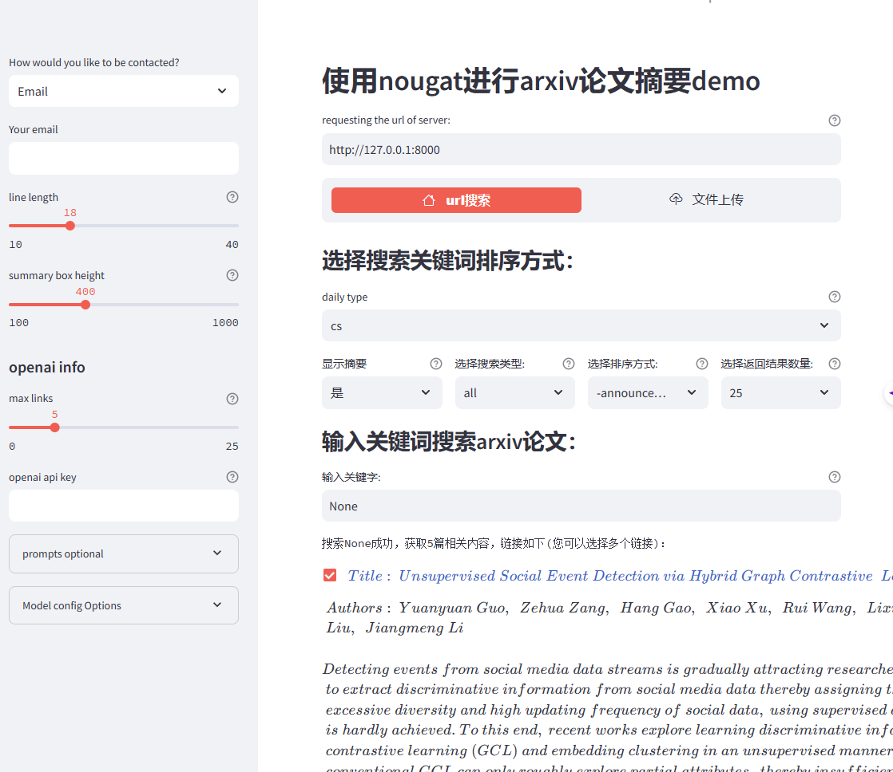
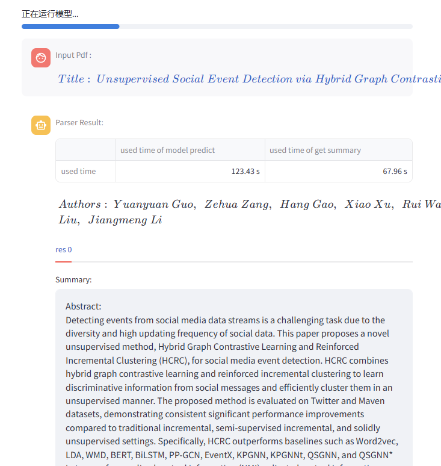
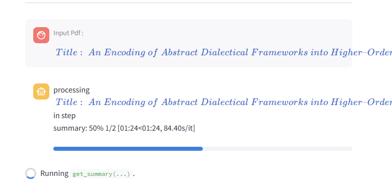
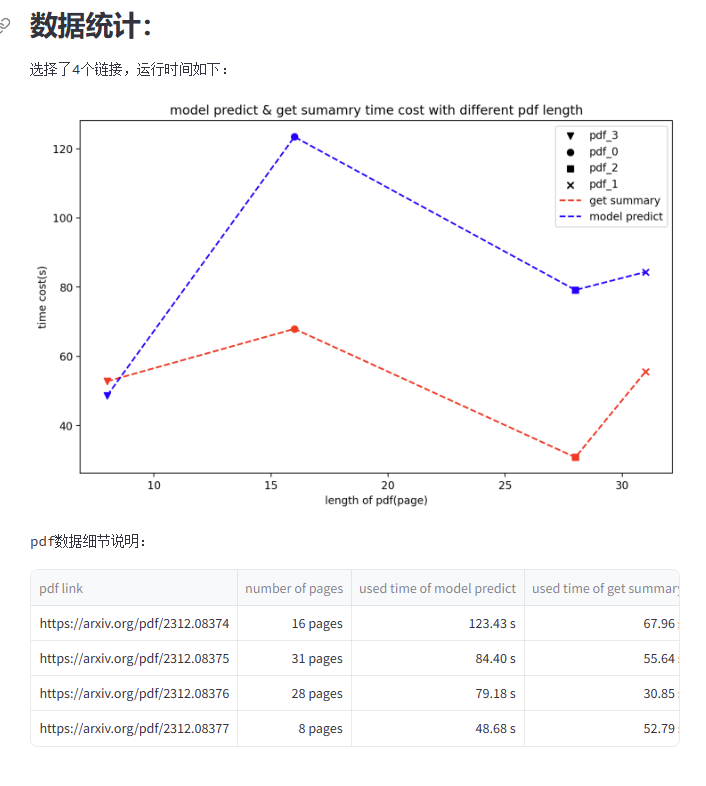
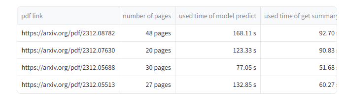

# progress

## 界面优化：

### menu

[victoryhb/streamlit-option-menu: streamlit-option-menu is a simple Streamlit component that allows users to select a single item from a list of options in a menu. (github.com)](https://github.com/victoryhb/streamlit-option-menu?tab=readme-ov-file)

```python
with st.sidebar:
    selected = option_menu("Main Menu", ["Home", 'Settings'],
                           icons=['house', 'gear'], menu_icon="cast", default_index=1)

    if selected == 'Home':
        x= st.slider('slider', 0, 100, 50)
    else:
        with st.expander('Settings'):
           y = st.slider('slider', 0, 100, 50)
           st.checkbox('checkbox')
```


### stqdm

```python
from time import sleep
import streamlit as st
from stqdm import stqdm

for _ in stqdm(range(50), st_container=st.sidebar):
    sleep(0.5)
```


## 目前的结果



大进度条主要呈现PDF总体运行情况，也即运行到1/4的进度



小进度条呈现对于该pdf处理的进度




增加最终运行时间结果呈现：




## prompt设计

- prompt流程：
	- 任务定义（Task Description）
	- 用户输入（Current Input）
		- 论文原文
		- 以生成的摘要
	- 输出提示（Output Indicator）
		- 生成初稿
		- 优化润色
		- 生成终稿


- 之前的prompt：

	`messages = [{'system':"任务定义"},{"user":"用户输入+输出提示"}]`

	存在的问题：

	- prompt过长且要求严格，GPT无法精确处理生成
	- 一次性输入流程过多，GPT无法很好区分

- 改进后prompt 

	`messages = [{'system':"任务定义"},{'system':'输出提示'},{"user":"用户输入"}]`

	优点：

	- 将三个部分区分清楚，分工比较明确
	- 每个部分较短，大概300字左右，便于GPT严格遵循
	- 经实测部分样本，发现` [{'system':"任务定义"},{'system':'输出提示'},{"user":"用户输入"}]`，比` [{'system':"任务定义"},{'user':'输出提示'},{"user":"用户输入"}]`，`[{'system':"任务定义"},{"user":"用户输入"},{'user':'输出提示'}]`效果更好

- 用途：
	- `generate`:生成的summary或者regenerate的resummary都是最初始的形式，也即按子标题进行摘要的结果，适当增加一些段落之间的联系，因此特点为：==长而详细==
	- `blog`: 在generate模板基础上，开头结尾增加引入词以及对全文的总结，主体部分增强段落之间的关联，得到解读博客，特点：==中等长度且流畅==
	- `speech`：在generate基础上，开头结尾增加欢迎词，口播常用引入词等，段落之间关联加强的同时，减少长难句的出现，使用口语化词汇，特点为：==短而口语化，易于理解==


- 摘要生成质量不好的原因：

	- 摘要生成流程:

	```mermaid
	stateDiagram
	[*] --> original_text
	original_text --> section_summary1
	original_text --> 
	section_summary2
	
	section_summary1 --> summary_text :integrate
	section_summary2 --> summary_text :integrate
	summary_text --> renegerate: bad
	renegerate --> summary_text
	summary_text --> speech : good
	summary_text --> blog : good
	```

	- 生成的关键：合并section summary得到的summary_text结果要==尽可能精炼且格式明确==


## 目前耗时：




- `model predict`影响因素：
	- pdf pages
		- img：img越多，信息越密集，放到T5中处理速度越慢
		- text
		- table
		- ……

- `get summary`影响因素：
	- 段落数
		- 段落长度
	- API时段，峰值略慢，且容易丢失


- `regenerate`，`speech`，`blog `大概20s左右生成，`speech`更长，需要转换成语音，影响因素：
	- 初版摘要长度
	- API请求速度


## 评估

评估指标与标准化prompt呈现，目前正在参考

> 1. [Automatic text summarization: A comprehensive survey - ScienceDirect](https://www.sciencedirect.com/science/article/pii/S0957417420305030)
> 2. [SummEval: Re-evaluating Summarization Evaluation | Transactions of the Association for Computational Linguistics | MIT Press](https://direct.mit.edu/tacl/article/doi/10.1162/tacl_a_00373/100686/SummEval-Re-evaluating-Summarization-Evaluation)
> 3. [Review of automatic text summarization techniques & methods - ScienceDirect](https://www.sciencedirect.com/science/article/pii/S1319157820303712)
> 4. [Pre-train, Prompt, and Predict: A Systematic Survey of Prompting Methods in Natural Language Processing | ACM Computing Surveys](https://dl.acm.org/doi/full/10.1145/3560815)


- OPENAI TTS

- 3~5 min

- GPT4 打分（~10篇 对比）

	

- 论文形式展示

	- introduction：

		- 研究背景，对象
		-  研究现状与存在的问题（动机）
		- 研究方法
		- 效果与贡献

	- related work

		- 摘要
		- 系统
		- 其他

	- 系统（方法）

		- 组成部分，每一步的实现过程

	- 实验与结果分析

		- 实验配置
		- 结果分析（GPT4,流畅度等 指标）
		- demo展示（3~5 个例子，blog，speech特色）

	- conclusion

		

