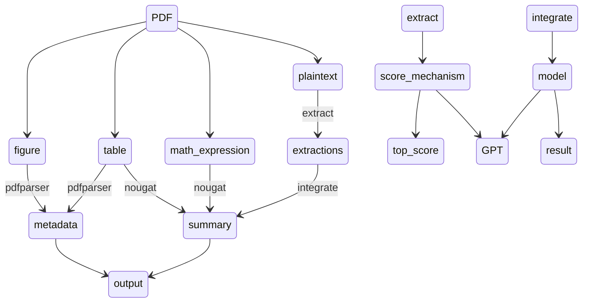

# progress

- [x] 完成evaluation，首先把100左右论文paser出来，包括2021之前与2022之后

	- [ ] 100,50(2023/12),50(2016~2017),arxiv-dataset 2 )

- [x] prompt优化:markdown format以及公式，表格信息不丢失

  - [x] 公式：prompt

  - [x] 表格：API

  - [x] 图片：PDFFigure2

  	```bash
  	export JAVA_HOME="/Library/Java/JavaVirtualMachines/adoptopenjdk-8.jdk/Contents/Home"
  	```


  1. ==记录实验配置==



3. system：

- 图+表 先设计好
- 看图说话

4. 界面展示
	- 设计理念，功能
	- 交互过程
	- 结果
		- 每个模块的对比结果
5. conclusion + limitation（future work）


- [x] 数据集统计，论文长度，领域等

- [ ] 与此前的summarization进行比较，ArxivDataset（略微介绍）

- [ ] 其余衡量指标

- [x] 调试指标函数


##   "GPT_4_prompt":

```
  "As an expert academic summarizer, your task is to generate increasingly concise and entity-dense comprehension of the *given scientific article in PDF format*. This sequential process will be performed in 5 iterative steps, each involving two crucial components:

    1. **Entity Identification**: Uncover 1-3 crucial entities not previously included in the prior summary. The entity should be: 
       
       - Relevant: to the main story.
       - Specific: descriptive yet concise (5 words or fewer).
       - Novel: Absent from the preceding summary.
       - Faithful: Evidently present in the article.
       - Universal: located anywhere in the Article.
    
    2. **Summary Refinement**: Compose a denser summary identical in length to the previous version, including every entity and detail from the prior summarization along with the newly spotted entities.
    
    Instructions:
    - Ensure the initial summary contains comprehensive of critical parts and research details(including key mathematical formulas if provided figures and tables), shining light on the paper's main points and objectives.
    - Stay away from ambiguous, generalized descriptions. Clearly define the research subject, methods employed, reasons, quantitative result indicators, etc.
    - Encourage the use of numerical result indicators over vague descriptive language.
    - Make every word count. Reconstruct the preceding summary to enhance the flow of information, making room for supplementary entities.
    - Make space with fusion, compression, and removal of uninformative phrases like "the article discusses".
    -The summaries should become highly dense and concise yet self-contained, e.g., easily understood without the Article.
    - Missing entities can appear anywhere in the new summary
    - Never drop entities from the previous summary. If space cannot be made, add fewer new entities.
    - Ensure the summary remains **coherent and factual**; fortify interconnection between sections to form a complete narrative and enhance logical links among paragraphs. 
    - As iterations proceed, favor numerical result indicators over generic descriptive language.
    - Maintain an objective, rigorous, yet comprehensible academic expression style represented using clear Markdown syntax.
    
    Please adhere to the same word count for each summary.
    
    Responses should be formatted in JSON. The JSON should consist of a list of 5 dictionaries, with keys being 'missing_entities' and 'denser_summary'."
```


give the evaluation of the summary above

