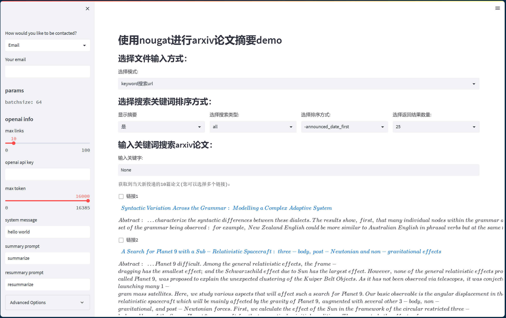
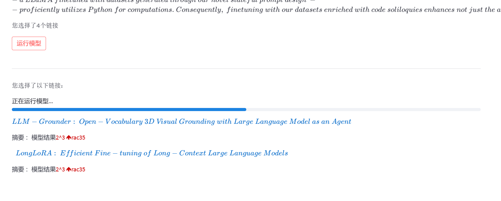
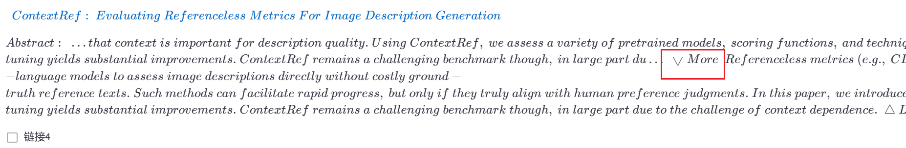
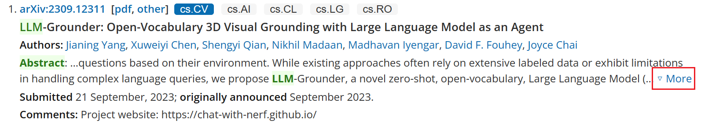

# W4 Readme

# progress

1. 完成初步的界面设计（所有文字描述都比较随意）

   

   **work flow**:

   ```mermaid
   stateDiagram-v2
   [*] --> user
   user --> init_info :api_key,pdf_path
   user -->  url+title+abs:keyword(if search url)
   url+title+abs --> prefer_links : user select
   prefer_links --> summary : prompt
   init_info --> summary
   ```

   - 默认输出当天新提交论文，若用户输入keyword，则搜索该keyword下的links（包括标题+摘要），用户进行多选感兴趣的links
   - 当按下运行模型，会根据已选的links进行summary（此处summary是<u>自己随便设定</u>的，用于检测`st.markdown`输出公示的效果）

   

2. 对不同级别标题进行划分，进行分组，目前的思路是：

   1. 将title跟authors提取出来`title_pattern = re.compile(r'(#+\s+.*?)\n+(.*?)#+',re.DOTALL)`,难点在于`re.DOTALL`，由于需要group出title跟author，而author中包括很多`\n`导致不开启dotall，`.`无法越过`\n`，以下为一个raw text示例：

      ```
      '# Using Large Language Model to Solve and Explain Physics Word Problems Approaching Human Level\n\nJingzhe Ding\n\nColumbia University\n\njd4001@columbia.edu\n\nYan Cen Xinyuan Wei\n\nFudan University\n\n{yancen,xinyuanwei}@fudan.edu.cn\n\n###### Abstract\n\nOur work demonstrates
      ```

      

   2. 随后提取出所有subtitle，`subtitle_pattern = re.compile(r'\n+(#+\s+.*?)\n')`，与之前的区别主要在于`#`前面会有`\n`，也即markdown判断标题级别的方法，先对所有二级标题分组，也即类似于markdown的大纲，所有二级标题包括的内容（包括其下的三级标题四级标题……内容）都分到其父目录（二级标题），其中使用`re.split`进行划分，但这样也包括了subtitle，为了进一步区别subtitle与subtext，通过标题最长的长度作为阈值判断(**使用len，而非计算num_token**，主要原因是，有些标题较短，但其wordpiece较长（也即token偏向于char级别，而有的正文子部分subtext较长，但是token都是word级别，导致还是会判断错该部分是否为text or title）)

   3. 将每个subtext都分到其对应的subtitle的group里，计算此时的subtext最大长度man_len

   4. 若max_len大于max_token的2/3(比例待定)，则父目录的级别降低到三级标题，直到找到一个级别，使得其包含的所有内容都＜threshold

   最终结果为：

   [(group_id,subtitle,subtext)]，目前想法：以subtitle为key，text为value，根据group_id相同的分到同一组，与prompt的key与对应的value prompt进行问答，主要问题在于[对齐问题](#alignment)

   ```
   (7, '## 7 Ethical Impacts', 'The problems in PhysQA are collected from educational and test paper websites and they are only used for academic research. The copyright of problems belong to original websites.')
   ```

3. 爬取links，此前由于爬取links时，只爬了links，导致用户没法预览标题与摘要，因此对于从新提交的网页以及从keyword网页两种模式下分别写了不同的爬取规则（由于两者网页的格式不同），最终使用markdown格式显示，(标题)[links],格式，难点在于有些论文标题会带部分latex格式，例如

   ……$S_8$……，因此需要爬取不同格式下的纯文本，然后拼接，以达到还原的目的


# problems

## length and split

* [ ]  长度问题：文本按照section划分+每个部分可以对应特定的question。

  * [x] 问题：如何根据#评定标题级别,在==特殊情况处中卡了很久==
  
  * [ ]  过程：
  
    raw text:
    
    此处出现的情况为，为了节省时间，将model输出的结果输出到console中，保存为txt格式，由于console本身展示宽度不够大（本身该字符串应该是一长串，不会换行，console中由于在一行中输出不完，导致自动加入换行符，复制到txt中再读取时，会出现多余的换行符，此外，由于源文本是`\n`,读取后为了表达准确含义，python自动替换为`'\\n'`）
  
    ```
    \\n\\n## 2 Analysis of Deep Residual Networks\\n\\nThe ResNets developed in [1] are					<--here
    _modularized_ architectures that stack building blocks of the same connecting shape. In this pap
    er we call these blocks "_Residual\\n\\nFigure 1
    ```
    
    ```
    re.compile(r'#+\s+(.*)[\\n\\\\n]+')
    ```
    
    发现匹配到的时：On the Importance of Identity Skip Connections\\n\\nLet
    
    希望匹配到的时：On the Importance of Identity Skip Connections
    
    此前一直卡在这，后来发现是`.*`的贪婪匹配，导致了过长匹配，直到以`\\n`结尾,取消贪婪之后，得到理想结果
    
    ```
    re.compile(r'(#+\s+.*?)\\n+')
    ```
    
    心得：
    
    1. `r'(str)'`->raw string,得到源文本，也即`\`不再表示转义，而作为一个普通字符`\`，`\\n*`->`(\n)*`（其中换行符\n为单个字节，而非`\+n`）,`r'\\n*'`->`'\+\+n+*'`
    2. 在正则表达式中：使用r的作用为：声明了引号中的内容表示该内容的**原始含义**，避免了多次转义造成的<u>反斜杠困扰</u>。也即不需要使用`'\\\\'->'\\'`,可以直接`r'\\'`
    
    2. 字符串在匹配等操作时，保留原格式，**只有在输出到console或者文本编辑器中，才会进行转义操作**
    3. 因此需要**pattern（转义后）**与**待匹配的string（转义前）**进行匹配
    
    其中下面pattern中由于不是raw，因此匹配的含义为`（\n）*`,text1为`\+n`两个字节，而text2没有raw模式,因此为换行符`\n`一个字节，可以匹配
    
    ```
    text1 = r'123\nnnnnndsa'
    text2 = '123\nnnnnndsa'
    pattern = re.compile('\d*(\\n*)(.*)')
    # text1-> [('', '\\nnnnnndsa'), ('', '')]
    # text2-> [('\n', 'nnnnndsa'), ('', '')]
    ```
    
    此时，pattern改成r，因此`\\n->\+\n`,此时`r'\d*(\n*)(.*)'='\d*(\\n*)(.*)'`,**`\`不再需要额外的转义**，
    
    * [ ] 但目前还是没弄懂为什么？感觉是是不是因为r'123\nnnnnndsa'中`'\'`被`'\\'->'\'`捕获，后续捕获任意数量的n，而结果中出现的`\\`，是为了在输出的时候的时候不被转义而导致匹配到的`\`输出成`\\`
    
    ```
    text1 = r'123\nnnnnndsa'
    pattern = re.compile(r'\d*(\\n*)(.*)')
    text2 = '123\nnnnnndsa'
    # text1-> [('\\nnnnnn', 'dsa')]
    # text2-> []
    ```
    
    发现无法匹配下文中的`## Discussions`,以为是上述的转义方面细节弄错了，出现`\\n`与`\n`导致正则表达式识别混乱，
    
    ```
    ror (y-axis on the right), and dashed lines denote training loss (y-axis on the left).\n\n### Di\nscussions\n\n
    txt形式为：
    ror (y-axis on the right), and dashed lines denote training loss (y-axis on the left).\n\n### Di
    scussions\n\n
    ```
    
    后来发现并不是`\n`对正则表达式的干扰，而是`.*`在没有开启re.DOTALL之前，`.`无法匹配`\n`,导致无法越过\n，匹配后续内容
    
    ```
    pattern = re.compile(r'\d*(\\n*)(.*)')
    ```
    
    再后来发现出现上述单词被分隔开的主要原因是，我<u>把输出的string显示在console，console显示位置不够，自动添加了`\n`，复制到txt文件中，才出现上述问题</u>（起初是因为跑出一次结果特别慢，希望能把输出的string保存一下），走了很多弯路


## alignment

* [ ] prompt与不同的子标题匹配的问题，例如有些地方是model,有些地方是method，有些地方是experiment，有些地方是empirical analysis，如果单纯使用全等`==`或者n-gram,很多语义相同但单词相差很大的时候是无法很好匹配
  - 无法全等或者n-gram无法匹配时，使用general-prompt，而不是使用introduction等特有prompt(目前简单采用全等方法)
  - 使用word2vec等简单训练一个小模型，存储时是字典，从字典中寻找两个词的向量表示再进行cos相似度匹配


## interaction

* [ ] streamlit的展示以及人机可交互界面的构建。

  * [ ] 摘要与标题过长，导致标题与摘要显示过长，混乱问题(且大部分摘要都会有类似于展开按钮，爬取纯文本时，目前没有过滤，需要完全复现该功能？)

    

    

  * [x] 有些部分为latex数学公式格式（重写正则表达式，不使用beautifulsoup库的content）

  * [X]  有部分文档只有abstract，没有pdf版（由于每个文档有三部分：标题，摘要，与link，为了对齐，没有pdf链接的地方link=None,转成pd->dropna+dropduplicates）

* [ ] 将https://arxiv.org改成 http://xxx.itp.ac.cn

  * [ ]  **problem**: 发现url换了之后浏览器可以打开，但是requests无法打开？(暂时没改)

## 参考链接：

a. https://fjiang.blog.csdn.net/article/details/128386021

b. https://streamlit.io/

c. https://github.com/victoryhb/streamlit-option-menu

d. https://github.com/JohnSnowLabs/nlu

e. https://streamlit.io/components
