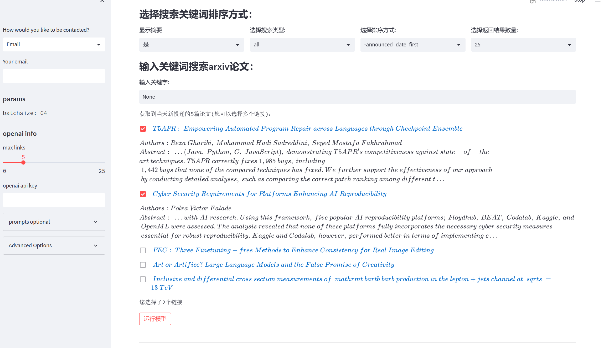
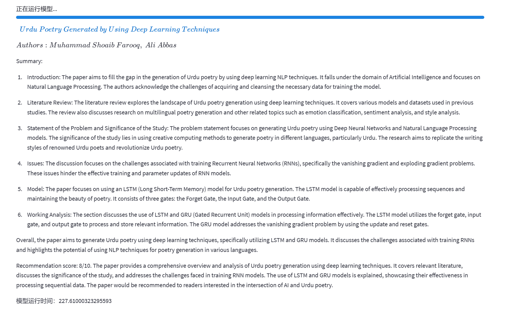
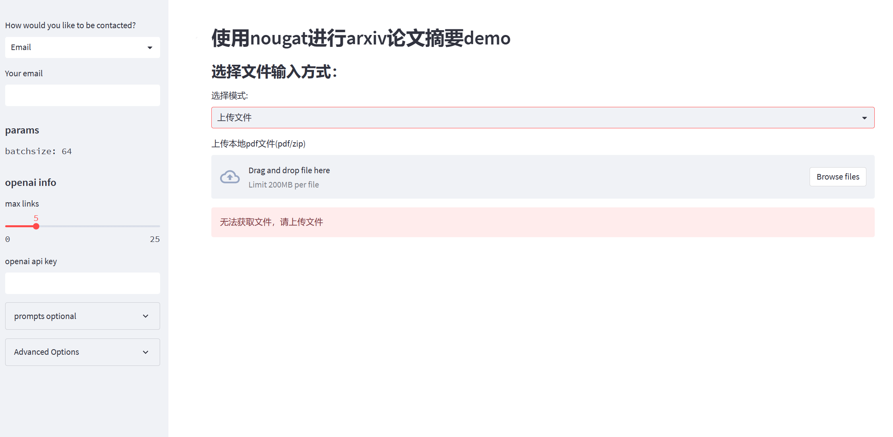
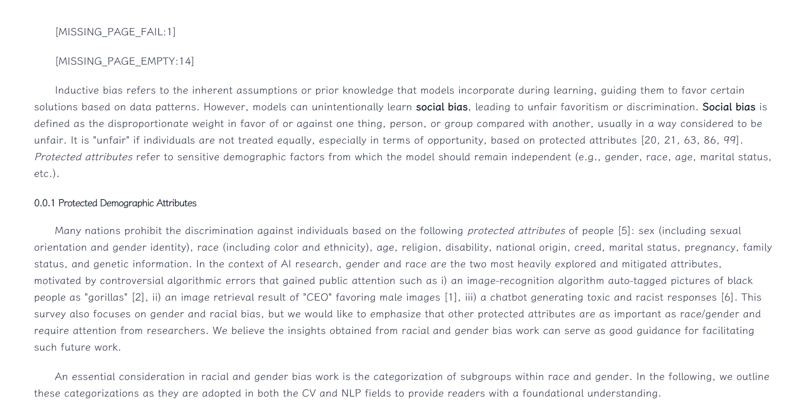
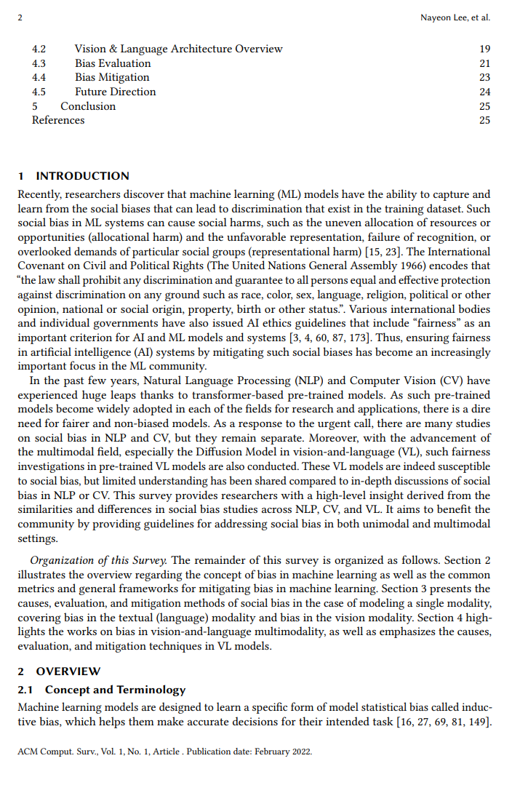
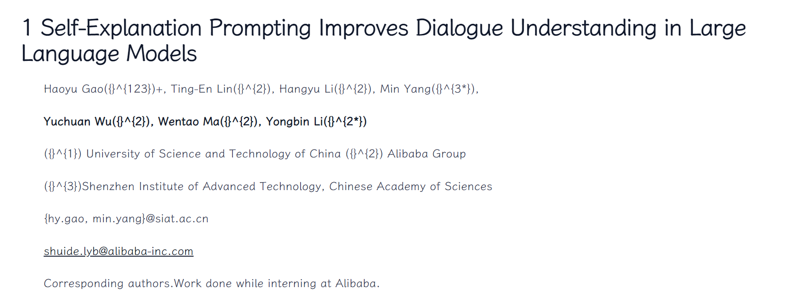
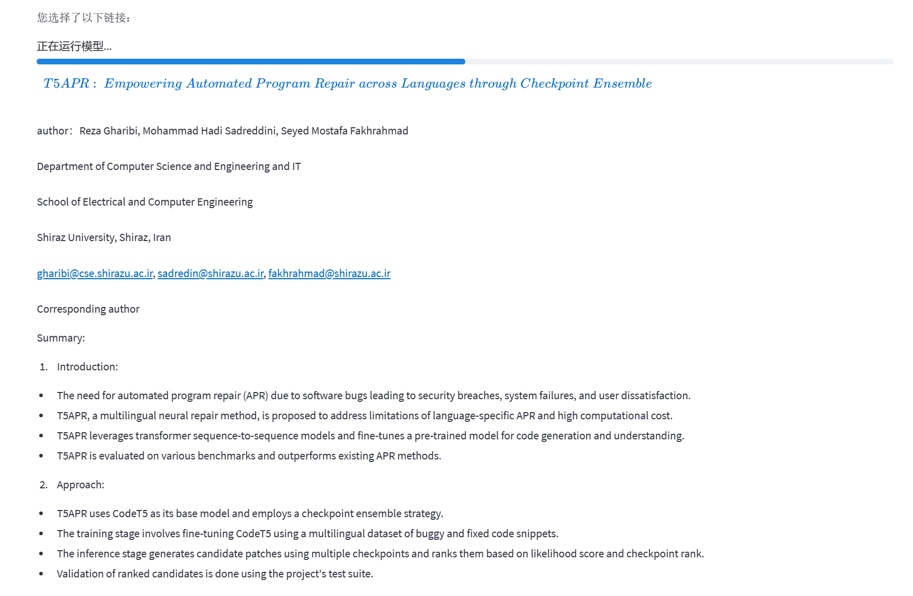
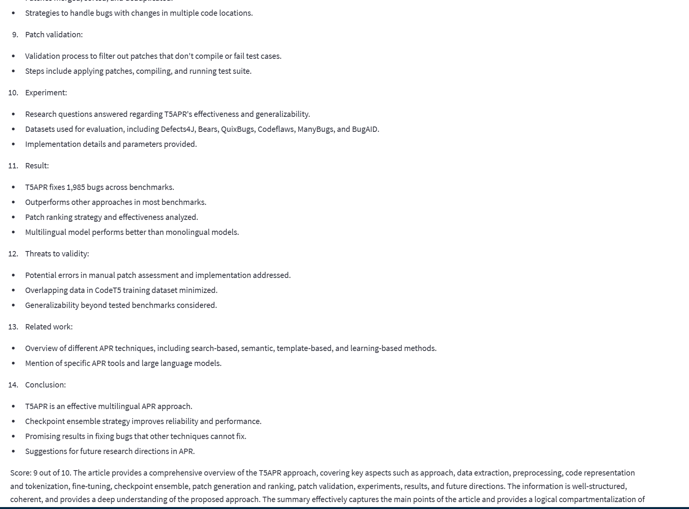

# progress

百川2 - 53B

12-15号

1. 本周主要把此前分离子标题以及其对应正文内容的面向过程的函数改成了类与方法，具体在[split_text.py](./submodule/openai_api/split_text.py)中，主要思路是更新了正则表达式pattern，使得文本与子标题能够看成一个整体的两个部分抽取

2. 对模型运行结果以及网页显示部分进行补充，考虑到要显示作者信息，增加了对作者的爬取，并且由于pdf经nougat解析后，会显示出更多作者信息（作者的贡献，几作），因此增加了一部分用于提取作者信息并转化为md格式显示的功能，但发现并非所有pdf作者信息格式都一致，且nougat在解析过程中，作者的贡献时有时无，在[problems/problems of author ](#author)中详细解释

3. 对出现公式的标题与摘要进行了一定的微调，使格式正确

4. 对prompt进行了调整，对特殊部分询问得更有针对性，详见[propt.json](./prompts_config1.json),先对各个部分进行prompt，得到的结果与其对应的subtitle拼接，使得GPT更有目的性，随后overview，此时输出的结果会带subtitle，更加有条理，并对一些极端情况增加了控制，例如当一个子标题无法细分并且扔超过maxtoken情况下，进行截断等操作

5. 增加了上传文件进行读取并摘要的部分，适当完善了keyword搜索部分的功能（当选择好点击确认后，未被选择的部分，摘要会隐藏），由于目前title，author来源有两个，pdf解析以及网页爬取，取两者效果最好的那个，title为爬取最好，author为解析最好,摘要结果见下图，问题见[摘要问题](#layout)

6. 摘要内容取舍？由于第一遍对于section进行摘要已获得比较详细内容，随后再summary时，只需要一段整体总结加评分还是每个section进行简短的总结？典型示例见[summary example](./res/summary_mmd/2310_03003.mmd)，与[resummary e.g.](./res/re_summary_mmd/2310_03003.mmd)，resummary还有一些其他格式[resummary e.g.2](./res/re_summary_mmd/2310_02953.mmd)，与[resummary e.g.3](./res/re_summary_mmd/2310_02977.mmd)，[resummary e.g.4](./res/re_summary_mmd/2310_03026.mmd)等（即使是同一prompt得到的结果格式也是不同的，上述均为同一prompt结果，除了只有一段的样例），具体prompt如下：

   > sys:<u>you are a wise assistant who is very helpful in recap of all sections. Based on the previous summary below, I need you to re-summarize and logically compartmentalized into different sections for a more structured and coherent output.\\n\\n</u> 
   >
   > overview: <u>Craft a comprehensive summary drawing from the distinct segments of the original abstract, and provide a summarization of the entire content. Additionally, assign a specific score (out of 10 points) to the article, serving as a recommendation guide for potential readers.\\n\\n\n\n</u>+summary

   

7. 增加了对于requests访问url的最大尝试次数，避免一次访问失败导致无法运转（实测过程中，几次成功中夹杂着一次访问失败，因此能一定程度缓解）

   








# problems

## [MISSING_PAGE_FAIL]

遇到的[MISSING_PAGE_FAIL:1]，[MISSING_PAGE_EMPTY:14]的问题：



[MISSING_PAGE_FAIL:1]对应原pdf为：


[MISSING_PAGE_EMPTY:14]对应的原pdf内容为：



出现原因：此前也提到过该问题，

- `model_output["repeats"][j] > 0`--> `[MISSING_PAGE_FAIL:{page_num}]`
- `model_output["repeats"][j] = 0`--> `[MISSING_PAGE_EMPTY:{i*args.batchsize+j+1}]`

```
if model_output["repeats"][j] is not None:
    if model_output["repeats"][j] > 0:
        # If we end up here, it means the output is most likely not complete and was truncated.
        logging.warning(f"Skipping page {page_num} due to repetitions.")
        predictions.append(f"\n\n[MISSING_PAGE_FAIL:{page_num}]\n\n")
    else:
        # If we end up here, it means the document page is too different from the training domain.
        # This can happen e.g. for cover pages.
        predictions.append(
            f"\n\n[MISSING_PAGE_EMPTY:{i*args.batchsize+j+1}]\n\n"
        )
```

进而查看源码：

`output["repeats"]` 的可能取值有三种：None、idx 或者 0。

1. `None`：这是最常见的情况，当以下任何一种情况发生时，都会将 `None` 追加到 `output["repeats"]` 中：
   - 序列的长度小于10。
   - 如果生成的句子包含 `<eos>` 并且长度小于 `seq_len`。
   - 如果变异的变异小，但小变异的长度不超过1或者小变异（`small_var`）之间的差异大于1，我们认为没有重复。
   - 即使发现重复，但在满足一定条件下（`idx / N > 0.9` 或者 `small_var[0] < 30`），也将 `None` 追加到 `output["repeats"]`。
2. `idx`：在检测到序列有重复性，并且该重复性在特定条件下（即，重复区块的开始位置对应的 `small_var` 指数大于30，且该位置对应的 `idx` 相对于整个序列长度的占比不超过90%）时，将 `idx` 追加到 `output["repeats"]`。
3. `0`：如果检测到序列有重复性，但重复区块的开始位置对应的 `small_var` 指数小于30，即使 `idx / N` 超过90%，也将0追加到 `output["repeats"]`。

`small_var` 是一个 numpy 数组，存储了那些满足变异的变异 (`varvar`)小于0.045的序列位置的索引。本质上，这是对判断序列中是否存在重复性的一种策略：如果一个序列中的某个区块的元素的变异性很小（即，区块中的元素非常接近），那么很可能这个区块就是重复的。`small_var` 指数是指这个数组中特定元素的位置。

`N` 是序列中非填充（pad）元素的数量，`idx` 是实际确定为重复区块的开始位置。因此，`idx / N` 表示重复区块开始位置相对于实际序列长度的位置。例如，如果 `N = 20`，且经由 `idx` 计算后结果为 `18`，则 `idx / N = 0.9`，即重复区块在整个序列中的位置接近末端。

```
       for b in range(batch_size):
            # mask = [sequence_length]
            mask = indices[b] != self.decoder.tokenizer.pad_token_id
            N = mask.sum().item()
            # var = [sequence_length] -> [sequence_length - 15]
            var = np.array(
                [np.var(s) / len(s) for s in batch(values[b, mask].float().numpy())]
            )
            # if the sequence is too short, we cannot detect repetitions
            if len(var) < 10:
                output["repeats"].append(None)
                continue
            # varvar = [sequence_length - 15] -> [sequence_length - 15 - 10]
            # var = [1,2,3,4,5] subdiv(var[::-1]) = [[5,4,3],[5,4,3,2],[5,4,3,2,1]]
            varvar = np.array([np.var(v) for v in subdiv(var[::-1])][::-1])
            minlen = 120
            # if the generated sentence include the <eos> and length < seq_len
            if (
                indices[b] == self.decoder.tokenizer.eos_token_id
            ).any() and N + 1 < indices.shape[1]:
                # there is an end to the generation, likely no repetitions
                output["repeats"].append(None)
                continue
            # if the variance of variance is small, we assume that there is a repetition
            ## get the small_var index(np.array),shape[num_small_var]
            small_var = np.where(varvar < 0.045)[0]
            if len(small_var) > 1:
                if np.all(np.diff(small_var) < 2):
                    idx = int(min(max(small_var[0], 1) * 1.08 + minlen, 4095))
                    if idx / N > 0.9:  # at most last bit
                        output["repeats"].append(None)
                        continue

                    elif small_var[0] < 30:
                        idx = 0
                    logging.warn("Found repetitions in sample %i" % b)
                    output["repeats"].append(idx)
                    output["sequences"][b, idx:] = self.decoder.tokenizer.pad_token_id
                    output["repetitions"][b, :idx] = self.decoder.tokenizer.pad_token_id
                else:
                    output["repeats"].append(None)
            else:
                output["repeats"].append(None)
```


### 目前的解决办法

由于出现该情况会导致解析出来的author与title信息丢失，因此在总结时，会加入"parser error"等字样，在resummary时，告诉GPT部分内容解析失败


## load error

```
    dataloader = torch.utils.data.DataLoader(
        ConcatDataset(datasets),
        batch_size=args.batchsize,
        shuffle=False,
        collate_fn=LazyDataset.ignore_none_collate,
    )
```

dataloader 中出现了None

```
2023-10-05 15:43:00 INFO predict.py :117 Loaded https://arxiv.org/pdf/2309.16293,len(dataset): 10
  0%|          | 0/10 [00:25<?, ?it/s]
┌───────────────────── Traceback (most recent call last) ─────────────────────┐
│ D:/Github/code_arxiv_summarizer(local)/code_arxiv_summarizer/main.py:143 in │
│ <module>                                                                    │
│                                                                             │
│   140 │   # full_text,file_names = test()                                   │
│   141 │   # print('file_names',file_names,len(file_names))                  │
│   142 │                                                                     │
│ > 143 │   full_text, file_names = nougat_predict(args)                      │
│   144 │   logger.info(f"Processing {len(full_text)} PDF(s),inculding :\n {f │
│   145 │   print('full_text', full_text)                                     │
│   146 │   #                                                                 │
│                                                                             │
│ D:\Github\code_arxiv_summarizer(local)\code_arxiv_summarizer\submodule\noug │
│ at_main\predict.py:144 in nougat_predict                                    │
│                                                                             │
│   141 │   # sample: [batch_size,num_channels(3),h,w],is_last_page = [batch_ │
│   142 │   full_text = []                                                    │
│   143 │   file_names = []                                                   │
│ > 144 │   for i, (sample, is_last_page) in enumerate(tqdm(dataloader)):     │
│   145 │   │   model_output = model.inference(image_tensors=sample)          │
│   146 │   │   # check if model output is faulty                             │
│   147 │   │   # output [batch_Size,decoder_seq_len]                         │
└─────────────────────────────────────────────────────────────────────────────┘
TypeError: cannot unpack non-iterable NoneType object

Process finished with exit code 1
```

出现None的原因：

将得到的pdf（Path/url）经过rasterize_paper函数，分解成[img],其中img为pdf每页内容的图像

```
    self.dataset = None
    self.init_fn = partial(rasterize_paper, pdf)
	[img]
    def __getitem__(self, i):
        if i == 0 or self.dataset is None:
            self.dataset = ImageDataset(self.init_fn(), self.prepare)
        if i <= self.size and i >= 0:
            # return the img , if last img return the name
            return self.dataset[i], self.name if i == self.size - 1 else ""
        else:
            raise IndexError
     
    @staticmethod
    def ignore_none_collate(batch):
        if batch is None:
            return
        try:
            _batch = []
            for i, x in enumerate(batch):
                image, name = x
                if image is not None:
                    _batch.append(x)
                elif name:
                    if i > 0:
                        _batch[-1] = (_batch[-1][0], name)
                    elif len(batch) > 1:
                        _batch.append((batch[1][0] * 0, name))
            if len(_batch) == 0:
                return
            return torch.utils.data.dataloader.default_collate(_batch)
        except AttributeError:
            pass
```

rasterize_paper函数如下：推测可能的原因是`urllib.request.urlopen`失败，导致直接except，return none了

```
def rasterize_paper(
    pdf: [Path,str],
    outpath: Optional[Path] = None,
    dpi: int = 96,
    return_pil=False,
    pages=None,
) -> Optional[List[io.BytesIO]]:
    pils = []
    if outpath is None:
        return_pil = True
    try:
        if isinstance(pdf, str) and 'http' in pdf:
            pdf_content = urllib.request.urlopen(pdf).read()
            pdf = fitz.open(stream=pdf_content, filetype="pdf")

        elif isinstance(pdf, Path):
            pdf = fitz.open(pdf)

        if pages is None:
            pages = range(len(pdf))
        for i in pages:
            page_bytes: bytes = pdf[i].get_pixmap(dpi=dpi).pil_tobytes(format="PNG")
            if return_pil:
                pils.append(io.BytesIO(page_bytes))
            else:
                with (outpath / ("%02d.png" % (i + 1))).open("wb") as f:
                    f.write(page_bytes)
    except Exception:
        pass
    if return_pil:
        return pils
```

使用`http://xxx.itp.ac.cn/pdf/2306.15103.pdf`格式的链接，即使加入header也打不开（此前request打不开，但是浏览器上打得开，目前浏览器也打不开？）

## author

除了上述问题，会导致起始页直接变成[MISSING_PAGE_FAIL]，主标题与作者信息直接消失之外，author解析结果的格式也是比较多样的，比较难以处理，例如目前有的格式为：

1. 比较正规的title与author一起，并且author具有几作信息，对于该种格式，目前已经实现用`<sup>`格式替换，用markdown使之变成上标（仅限于对nougat输出的后处理结果，因为爬取过程中，并没有作者对文字贡献的详细信息，例如几作）



目前实现：通过替换等办法，使显示格式符合markdown格式：

'Zhe Ni<sup>\\dagger</sup>, Xiao-Xin Deng<sup>\\dagger</sup>, Cong Tai<sup>\\dagger</sup>, Xin-Yue Zhu, Xiang Wu, Yong-Jin Liu, Long Zeng


2. 无贡献信息，但有作者的联系信息，此种情况没有作处理
3. 作者信息在abstract之下的，此处情况在代码中会把作者信息归结到abstract处，导致summary的时候，出现某些无关信息


### 解决方法

对于格式众多的author信息，目前没有特殊的解决，全部输出，导致作者的信息占空间较大


## layout

如上文所述，作者信息会占用很多地方，以及在prompt中，反复强调希望其能对每个部分总结，并给出一个overview与评分，会导致其对出现的每个部分，例如result，introduction，以及作者自己定义的一些标题进行总结，最后给出一个结论，整体内容会比较长，页面也很长





### 解决办法

目前想到但还没尝试的方法：

1. prompt修改，例如限制其挑最重要的5个部分进行resummary，但是似乎GPT对于数字不敏感，其不会精确控制5个部分进行summary
2. 增加忽视的subtitle部分，目前忽视的subtitles有appendix以及reference部分，这两部分会经过判断后完全摒弃（不会进入第一步部分summary，因此也不会进入summary之后overview（也即对部分summary合并再resummary））


## score

评分prompt：

```
Additionally, assign a specific score (out of 10 points) to the article, serving as a recommendation guide for potential readers.
```

在试验的过程中，几乎都是打9分（满分10分）

## running time

以下为页数以及段落都较多的样本：（页数25页，其中图较多）


| section             | time/s        |
| --------------------- | --------------- |
| overall             | 720(12 min)   |
| get link and raster | 13            |
| nougat_model        | 533(8min 53s) |
| openai              | 81            |
| other               | 93            |

一般的pdf：页数19


| section             | time/s         |
| --------------------- | ---------------- |
| overall             | 417(6 min 57s) |
| get link and raster | 6              |
| nougat_model        | 282(4min 42s)  |
| openai              | 81             |
| other               | 93             |

### 解决方法

1. 换一个prompt，详细的告知GPT评分规则，目前问的比较笼统，或者给出对照
2. 换一种指标，目前还没想好

