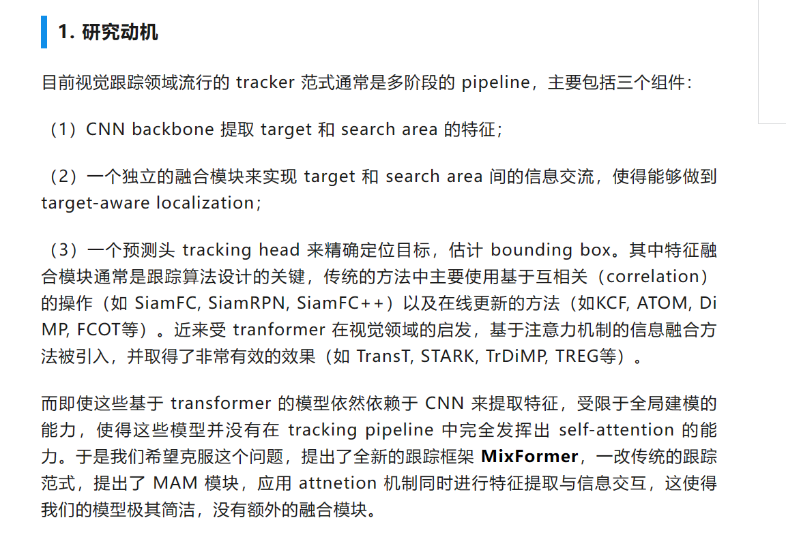
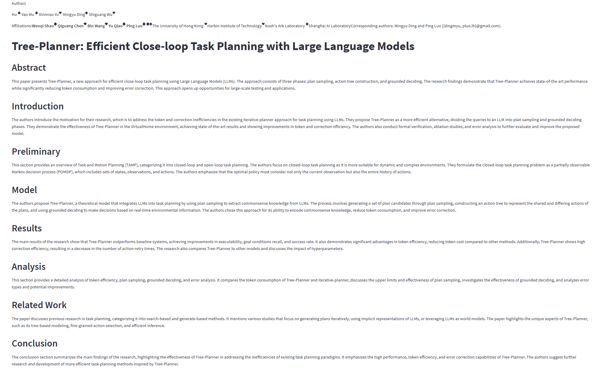
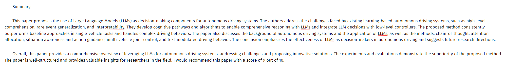
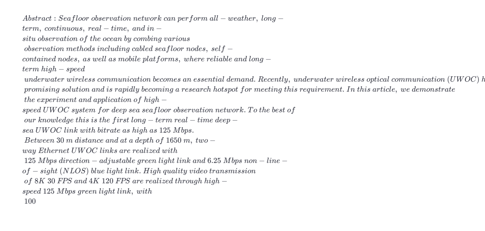
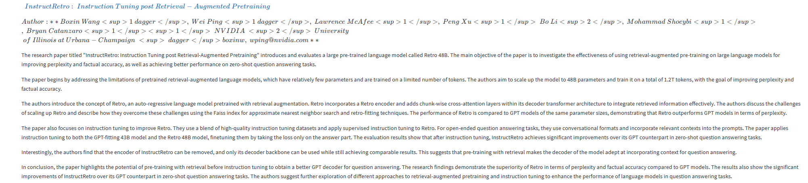
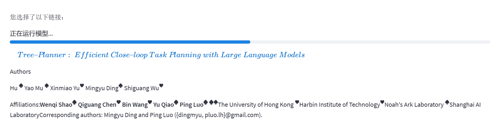
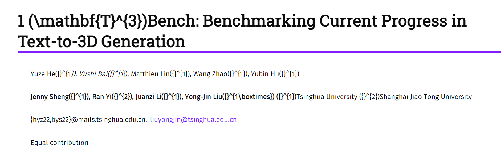
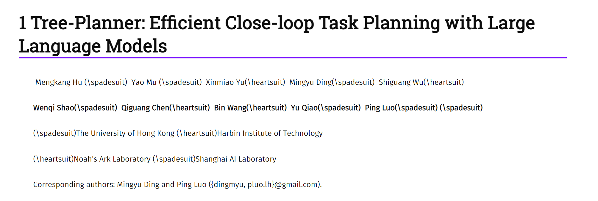
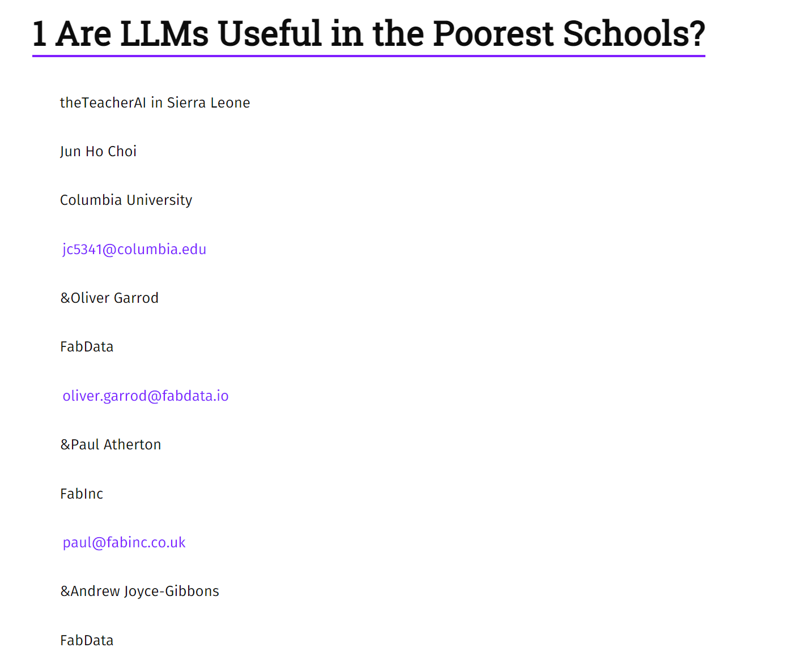

# progress

## prompt & overview and download

**提示技巧**：

- [Include details in your query to get more relevant answers](https://platform.openai.com/docs/guides/gpt-best-practices/tactic-include-details-in-your-query-to-get-more-relevant-answers)
- [Ask the model to adopt a persona](https://platform.openai.com/docs/guides/gpt-best-practices/tactic-ask-the-model-to-adopt-a-persona)
- [Use delimiters to clearly indicate distinct parts of the input](https://platform.openai.com/docs/guides/gpt-best-practices/tactic-use-delimiters-to-clearly-indicate-distinct-parts-of-the-input)
- [Specify the steps required to complete a task](https://platform.openai.com/docs/guides/gpt-best-practices/tactic-specify-the-steps-required-to-complete-a-task)
- [Provide examples](https://platform.openai.com/docs/guides/gpt-best-practices/tactic-provide-examples)
- [Specify the desired length of the output](https://platform.openai.com/docs/guides/gpt-best-practices/tactic-specify-the-desired-length-of-the-output)

​	


```
{
  "block summary": {
    "system": "you are a wise assistant who is very helpful in summarizing the text.\\n\\n",
    "abstract": "Regarding the abstract, could you explain the main objectives and research findings of the paper?\\n\\n",
    "intro": "In relation to the introduction, what is the main motivation or background study of the authors?\\n\\n",
    "related work": "What previous research has been done that ties into this paper? How does this paper build upon the work of previous researchers?\\n\\n",
    "model": "Could you summarize the theoretical model or the approach of the research, and explain why the authors chose this method?\\n\\n",
    "method": "What research methods and techniques are applied in the methods section of this paper? Could you outline the main steps of data collection and analysis described in the methods section?\\n\\n",
    "conclusion": "What are the main conclusions and findings mentioned in the conclusion section of this paper? Based on the conclusions, what further directions for research do the authors suggest?\\n\\n",
    "result": "What were the main results or findings of the research?\"\nDiscussion: \"How do the authors interpret their results? How do these results compare to previous research, and what implications do they have?\\n\\n",
    "discussion": "How do the authors interpret their results? How do these results compare to previous research, and what implications do they have?\\n\\n",
    "future": "According to the authors, what additional research needs to be conducted or what new questions have emerged from this study?\\n\\n",
    "experiment": "What were the main experimental techniques or procedures employed in the research?\\n\\n",
    "dataset": "What data has been used in this study? Could you describe its features and how it was collected or generated?\\n\\n",
    "limit": "What limitations in the research or methodology are indicated in the paper? With regard to the limitations section of the paper, what recommendations for improvements or possible solutions do the authors put forward? \\n\\n",
    "general_summary": "Please summarize the section of the paper that you have been assigned,the title of the section is [title_to_replace]\\n\\n"
  },
  "global summary": {
    "system": "You are an experienced article summarizer and rewriter proficient in consolidating various sections.\\n\\n",
    "overview": "Given a series of summaries, your task is to logically reorganize and refine them into an engaging narrative. The summaries are encapsulated within backticks (`), and your role is to extract, reorder, and reshape the content to generate a superior quality article overview in markdown format . This task goes beyond merely piecing together the sections; you are required to transform them into a  coherent and smoothly flowing storyline, while preserving the main essence of the original content.\\n\\n",
    "old_overview": "Craft a comprehensive summary drawing from the distinct segments of the original abstract, and provide a summarization of the entire content. Additionally, assign a specific score (out of 10 points) to the article, serving as a recommendation guide for potential readers.\\n\\n",
    "resummary": "Small sections of the paper have already been summarised for you, given between triple backticks in an array. Unite these summaries into a larger complete summary.\\n\\n",
    "score": "Hello, ChatGPT. I have a paper that requires your evaluation. Please assess it based on the following main criteria: clarity of the paper's theme and objectives, appropriateness and detail of the research methods, accuracy of the data and results, depth of the discussion and conclusion, and overall writing quality (including grammar, spelling, clarity, etc.). Please provide a score from 1-10 for each criterion, with 1 being very poor and 10 being excellent. Then, calculate the average of all scores to give an overall rating for the paper. "
  }
}
```


看了几个优质的公众号的论文解读博客，例如paper weekly以及量子位等，发现主要的论文解读框架还是按照不同的section进行分别解读：



- 因此也许可以将summary作为用户下载的主要文件，summary与一般的论文解读逻辑一致，都针对不同部分，带着一些问题去解读，但是人解读时，会围绕一个博主自己感兴趣的方向（主要在**摘要**或者**引言**最后部分，作者提出的目前问题现状以及作者的主要贡献）不断深究作者的研究动机以及解决过程，特别是针对于模型的流程图或者各种数据结果表格，比较论文结果与此前结果的优劣，这也是目前进行分块summary所缺失的，目前的解决办法是，输入原文对应部分的同时，也将在此部分之前，所得到的部分summary也放入到prompt中，以提醒GPT在导言或者摘要部分中关注的主要导向。
- 而resummary在summary的基础上，即使是硬性要求分块总结，其结果也十分简短，因此也许可以利用resummary简短而完整的特性，作为整篇论文的overview+score评分，让读者能简单快速的了解论文大致内容，随后提供下载按钮供读者进行下载summary内容。

整体效果：

```python
\'# Tree-Planner: Efficient Close-loop Task Planning with Large Language Models\\n\\n Mengkang Hu \\\\(\\\\spadesuit\\\\)  Yao Mu \\\\(\\\\spadesuit\\\\)  Xinmiao Yu\\\\(\\\\heartsuit\\\\)  Mingyu Ding\\\\(\\\\spadesuit\\\\)  Shiguang Wu\\\\(\\\\heartsuit\\\\)\\n\\n**Wenqi Shao\\\\(\\\\spadesuit\\\\)  Qiguang Chen\\\\(\\\\heartsuit\\\\)  Bin Wang\\\\(\\\\heartsuit\\\\)  Yu Qiao\\\\(\\\\spadesuit\\\\)  Ping Luo\\\\(\\\\spadesuit\\\\) \\\\(\\\\spadesuit\\\\)**\\n\\n\\\\(\\\\spadesuit\\\\)The University of Hong Kong \\\\(\\\\heartsuit\\\\)Harbin Institute of Technology\\n\\n\\\\(\\\\heartsuit\\\\)Noah\\\'s Ark Laboratory \\\\(\\\\spadesuit\\\\)Shanghai AI Laboratory\\n\\nCorresponding authors: Mingyu Ding and Ping Luo ({dingmyu, pluo.lh}@gmail.com).\\n\\n
```


- 多轮对话







与人工博客比较：

[CVPR 2022｜打破传统的跟踪范式！南大开源MixFormer：端到端目标检测新模型 (qq.com)](https://mp.weixin.qq.com/s?__biz=MzI5MDUyMDIxNA==&mid=2247597828&idx=3&sn=34fde9a364c94c715799c4ffb978a4c5&chksm=ec1d92fddb6a1beb5fc1292f62a8b6502f33895d26e504b1fdac719bb44a1dca7aa07da1db1b#rd)


## format of titles and authors

* [x] 修改摘要内容格式问题：

  目前遇到的问题：abstract在出现'-'时，超过一定长度会自动换行，导致与自己定义长度阈值换行交替，整体内容时长时短

  ```
  text = '$Abstract:Seafloor~observation~network~can~perform~all-weather,~long-term,~continuous,~real-time,~and~in-situ~observation~of~the~ocean~by~combing~various\\\\~observation~methods~including~cabled~seafloor~nodes,~self-contained~nodes,~as~well~as~mobile~platforms,~where~reliable~and~long-term~high-speed\\\\~underwater~wireless~communication~becomes~an~essential~demand.~Recently,~underwater~wireless~optical~communication~(UWOC)~has~emerged~as~a~highly\\\\~promising~solution~and~is~rapidly~becoming~a~research~hotspot~for~meeting~this~requirement.~In~this~article,~we~demonstrate\\\\~the~experiment~and~application~of~high-speed~UWOC~system~for~deep~sea~seafloor~observation~network.~To~the~best~of\\\\~our~knowledge~this~is~the~first~long-term~real-time~deep-sea~UWOC~link~with~bitrate~as~high~as~125~Mbps.\\\\~Between~30~m~distance~and~at~a~depth~of~1650~m,~two-way~Ethernet~UWOC~links~are~realized~with\\\\~125~Mbps~direction-adjustable~green~light~link~and~6.25~Mbps~non-line-of-sight~(NLOS)~blue~light~link.~High~quality~video~transmission\\\\~of~8K~30~FPS~and~4K~120~FPS~are~realized~through~high-speed~125~Mbps~green~light~link,~with\\\\~100%~peak~signal-to-noise~ratio~(PSNR)~agreement,~showing~the~capability~of~transmitting~high-quality~videos~lossless.~The~30-day~long-term~measurement\\\\~results~show~that~the~BER~performance~of~both~125~Mbps~and~6.25~Mbps~links~is~lower~than~10-5,\\\\~proving~the~stability~and~reliability~of~this~UWOC~system~at~depth~of~1650~m.~The~maximum~transmission~distance\\\\~for~the~green~and~blue~light~links~are~estimated~to~be~117.7~and~128.3~m~with~considering~the\\\\~geometry~loss,~which~can~be~extended~to~231.6~and~337.5~m~without~geometry~loss.~As~the~first~long-term\\\\~and~real-time~UWOC~system~in~deep~sea,~we~believe~this~demonstration~can~provide~val-uable~ex-perience~for~further~UWOC\\\\~studies~and~converged~ocean~observation~networking~with~cabled~and~cable-less~observation~platforms.$'
  
  st.markdown(text,unsafe_allow_html=True)
  ```

  

  - [x] 发生原因以及解决办法：

  - 在Markdown中，公式块通常使用LaTeX语法表示数学表达式，而连字符（hyphen）在LaTeX中有特殊的含义，Streamlit在处理Markdown时默认会将连字符（hyphen）作为断行符进行处理。

  - 可以使用LaTeX中的非断行连字符（`en dash`）或破折号（`em dash`）来表示：

    ```markdown
    `mind–set`
    ```


* [ ] 修改摘要标题等级的问题：

  有些论文解析出来标题不一定是6级，也可能是四级


* [x] 作者信息解析格式问题

  author栏处由于使用了`$$`进行格式输出，导致`<sup>ds</sup>`等html语言被解析成latex格式：

  ​	

  

  因此取消了`$$`，并且部分论文中出现了`dagger`符，

  > Boxin Wang<sup>1 dagger</sup>, Wei Ping<sup>1 dagger</sup>, Lawrence McAfee<sup>1</sup>, Peng Xu<sup>1</sup> Bo Li<sup>2</sup>, Mohammad Shoeybi<sup>1</sup>, Bryan Catanzaro<sup>1</sup> <sup>1</sup> NVIDIA <sup>2</sup> University  of Illinois at Urbana−Champaign <sup> dagger</sup>boxinw, wping@nvidia.com∗∗

  替换成其正确表示:

  > Boxin Wang<sup>1 &dagger;</sup>, Wei Ping<sup>1 &dagger;</sup>, Lawrence McAfee<sup>1</sup>, Peng Xu<sup>1</sup>, Bo Li<sup>2</sup>, Mohammad Shoeybi<sup>1</sup>, Bryan Catanzaro<sup>1</sup> <sup>1</sup> NVIDIA <sup>2</sup> University of Illinois at Urbana−Champaign <sup>&dagger;</sup>boxinw, wping@nvidia.com∗∗<sup>&dagger;</sup>

  

  ​	

* [x] 实现实体命名效果以区分作者与机构

  实现了初步正则表达式分隔作者与机构，并且使用`spacy`进行NER过滤的效果：

  - 先根据一般的作者与机构分界线将两者分开，得到作者信息列表以及机构列表
  - 随后根据NER判别，如果判断到某些部分存在着不属于该部分的类别，则过滤掉

  > 作者：
  >
  > Listwise Ranking in Large Language Models<br><br> Raphael Tang,<sup>1</sup> Xinyu Zhang<sup>*2</sup> Xueguang Ma<sup>2</sup> Jimmy Lin<sup>2</sup> Ferhan Ture<sup>1</sup>
  > affiliation: <sup>1</sup>Comcast Applied AI <sup>2</sup>University of Waterloo<br>
  >
  > 机构：
  >
  > <br><sup>1</sup>{raphael_tang, ferhan_ture}@comcast.com <sup>2</sup>{x978zhang, x93ma, jimmylin}@uwaterloo.ca<br><br>Equal contribution.

  

  

  

  


# problems

## format problems

- [ ] arxiv上不同部分的格式较为混乱，难以使用某个特定的正则表达式或者函数进行很好的分块

例如，标题与作者的格式有

1. 格式规范的（作者与机构都有贡献度顺序）：



2. 以不同字母（latex格式，无法直接在md格式中展示的格式）区分贡献度



3. 无明显贡献度声明，且格式为：一个作者声明好（所有信息都列出）随后再另一个作者



- [ ] 解决办法：

  - 目前主要是讲前两者进行一定程度的实现，规范格式以及使用特殊字母比较好实现

  - 如果出现无法使用识别规范格式的正则表达式区分的，根据换行符把所有元素分隔，随后**仅用实体判别作为依据**，判断各个部分所属类别

    - 该判断依据主要逻辑是：由于目前为二分类问题，如果判断某个元素不属于作者，那就会被归类到机构，因此中文名很容易被分类到机构中去

  - author与title来源有两个：
  
    - 使用nougat解析
    - 若从arxiv上爬取的，其基本信息也能获取

    通过比较两者优劣，title为爬取的信息更加精准（解析可能有误，且解析没有对应的link），author则以nougat的为准，其能涵盖更多的贡献度信息等
  
  - 有些author与title甚至都用nougat解析不出的，则用爬取信息替代


- [ ] NER失误或者可能中文名不出现在vocab中

  当NER无法准确地识别时，会容易误分类，特别是格式不规范的论文，只能凭借NER分类，而当判别list中每个元素不属于作者类时，就会被归类到机构类，因此中文名特别容易被分类到机构类中	


```python
t = """
Listwise Ranking in Large Language Models<br><br> Raphael Tang,<sup>1</sup> Xinyu Zhang<sup>*2</sup> Xueguang Ma<sup>2</sup> Jimmy Lin<sup>2</sup> Ferhan Ture<sup>1</sup>
affiliation: <sup>1</sup>Comcast Applied AI <sup>2</sup>University of Waterloo<br><br><sup>1</sup>{raphael_tang, ferhan_ture}@comcast.com <sup>2</sup>{x978zhang, x93ma, jimmylin}@uwaterloo.ca<br><br>Equal contribution.
"""
doc = nlp(t)
for ent in doc.ents:
    print(ent.text, ent.start_char, ent.end_char, ent.label_)
    
>>>
Listwise Ranking 1 17 PERSON
Large Language Models 21 42 WORK_OF_ART
Raphael Tang,<sup>1</sup 51 75 PERSON
Xinyu Zhang 77 88 PERSON
Xueguang Ma 102 113 PERSON
Jimmy Lin 126 135 PERSON
x93ma 334 339 ORG


t = """
Haoyu Gao<sup>123</sup>+, Ting-En Lin<sup>2</sup>, Hangyu Li<sup>2</sup>, Min Yang<sup>3*</sup>,<br><br>**Yuchuan Wu<sup>2</sup>, Wentao Ma<sup>2</sup>, Yongbin Li<sup>2*</sup>**<br><br><sup>1</sup> University of Science and Technology of China <sup>2</sup> Alibaba Group<br><br><sup>3</sup>Shenzhen Institute of Advanced Technology, Chinese Academy of Sciences<br><br>{hy.gao, min.yang}@siat.ac.cn<br><br>shuide.lyb@alibaba-inc.com<br><br>Corresponding authors.Work done while interning at Alibaba.
"""

>>>
Gao 7 10 PERSON
Ting-En 27 34 PERSON
Hangyu Li 52 61 PERSON
Yang 79 83 PERSON
Wu 115 117 PERSON
Wentao Ma 131 140 PERSON
Yongbin Li 154 164 PERSON
University of Science and Technology of China 200 245 ORG
Alibaba Group 259 272 ORG
Shenzhen Institute of Advanced Technology 292 333 ORG
Chinese Academy of Sciences 335 362 ORG
Alibaba 492 499 GPE
```


## openai error

```python
openai.error.RateLimitError: Rate limit reached for gpt-3.5-turbo-16k-0613 in organization org-P0kkQJu5UDJiXIxR2g2PBT4q on requests per min. Limit: 3 / min. Please try again in 20s. Contact
 us through our help center at help.openai.com if you continue to have issues. Please add a payment method to your account to increase your rate limit. Visit https://platform.openai.com/acc
ount/billing to add a payment method.
```

设置了每三次停一下，等待到60s


## code problem


```
def get_daily_links(proxies = None,
                    max_num = 10,
                    show_meta_data = False,
                    line_length :int = 15,
                    daily_type:str = 'cs',
                    header = None,
                    max_retry = 3,
                    wait_fixed = 1000):
     @retry(stop_max_attempt_number=max_retry, wait_fixed=wait_fixed)
     def _get_response(url: str, proxies=None, header=None):
          """Get response."""
          response = requests.get(url, proxies=proxies, headers=header)
          if response.status_code != 200:
               raise Exception(f'HTTP error, status = {response.status_code}')
               return response
```

- [ ] 想设置retry的次数，但是修饰器又不在调用函数内部，因此只能使用嵌套函数，这样导致每个需要访问url的地方，都需要重复定义同一个函数，不知道有什么可以改进的地方？


-->全局变量/class


# note

## @retry 用法

```python
@retry(stop_max_attempt_number=max_retry, wait_fixed=wait_fixed)
def _get_response(url: str, proxies=None, header=None):
     """Get response."""
     response = requests.get(url, proxies=proxies, headers=header)
     if response.status_code != 200:
          raise Exception(f'HTTP error, status = {response.status_code}')
          return response
```

常用的参数有：

1、**stop_max_attempt_number**：在停止之前尝试的最大次数，最后一次如果还是有异常则会抛出异常，停止运行，默认为5次

2、**stop_max_delay**：比如设置成10000，那么从被装饰的函数开始执行的时间点开始，到函数成功运行结束或者失败报错中止的时间点，只要这段时间超过10秒，则停止重试（单位是毫秒）

3、**wait_fixed**：设置在两次retrying之间的停留时间，单位毫秒

4、**wait_random_min**和**wait_random_max**：用随机的方式产生两次retrying之间的停留时间。**wait_random_min**停留最短时间，默认为0，单位毫秒。**wait_random_max**停留最长时间，默认为1000，单位毫秒

5、**retry_on_result**：指定一个函数，如果指定的函数返回True，则重试；否则抛出异常退出（指定要在得到哪些结果的时候去retry，retry_on_result传入一个函数对象,在执行get_result成功后，会将函数的返回值通过形参result的形式传入retry_if_result_none函数中，如果返回值是None那么就进行retry，否则就结束并返回函数值）

```python
def retry_if_result_none(result):
    return result is None
 
@retry(retry_on_result=retry_if_result_none)
def get_result():
    print 'Retry forever ignoring Exceptions with no wait if return value is None'
    return None
```

6、**retry_on_exception**: 指定一个函数，如果此函数返回指定异常，则会重试；如果不是指定的异常，则会退出

7、**wait_exponential_multiplier**和**wait_exponential_max**：以指数的形式产生两次retrying之间的停留时间，产生的值为2^previous_attempt_number * wait_exponential_multiplier， previous_attempt_number是前面已经retry的次数，如果产生的这个值超过了wait_exponential_max的大小，那么之后两个retrying之间的停留值都为wait_exponential_max


## spaCY

`spaCy` 是一个用于自然语言处理 (NLP) 的开源库，它提供了许多常用的函数和方法来处理文本数据。以下是一些 `spaCy` 中常用的函数：

### 1. **`spacy.load(model_name)`**

- **输入参数：**
  - `model_name` (字符串): 指定要加载的预训练语言模型的名称。

- **输出格式：**
  - 返回一个 `Language` 对象，该对象包含了加载的语言模型。

**例子：**
```python
import spacy

# 加载英文的预训练语言模型
nlp = spacy.load("en_core_web_sm")

# 处理文本
text = "spaCy is an open-source software library for advanced NLP in Python."
doc = nlp(text)

# 打印文本的分词结果
for token in doc:
    print(token.text)
```

nlp(text)相当于对text进行分词等一系列操作

### 2. **`Token.text`**

- **输入参数：**
  - 无

- **输出格式：**
  - 返回该 token 的原始文本字符串。

**例子：**
```python
# 使用 spaCy 分词后，获取单词的文本
doc = nlp("spaCy is a powerful library for NLP.")
for token in doc:
    print(token.text)
# 输出：spaCy is a powerful library for NLP .
```

### 3. **`Token.lemma_`**

- **输入参数：**
  - 无

- **输出格式：**
  - 返回该 token 的**基本形式（词干形式）**。

**例子：**
```python
# 获取单词的基本形式
doc = nlp("running runs runner")
for token in doc:
    print(token.text, token.lemma_)
# 输出：running run runner
```

### 4. **`Token.pos_`**

- **输入参数：**
  - 无

- **输出格式：**
  - 返回该 token 的词性标签。

**例子：**
```python
# 获取单词的词性标签
doc = nlp("spaCy is a great tool")
for token in doc:
    print(token.text, token.pos_)
# 输出：spaCy PROPN is VERB a DET great ADJ tool NOUN
```

### 5. **`Doc.ents`**

- **输入参数：**
  - 无

- **输出格式：**
  - 返回一个包含文档中所有命名实体的列表。

**例子：**
```python
# 获取文档中的命名实体
doc = nlp("Apple Inc. was founded by Steve Jobs in Cupertino.")
for entity in doc.ents:
    print(entity.text, entity.label_)
# 输出：Apple Inc. ORG, Steve Jobs PERSON, Cupertino GPE
```

这些是一些常用的 `spaCy` 函数和方法，它们可以帮助你进行文本处理、分词、词性标注和命名实体识别等任务。注意，在使用这些函数之前，你需要先安装 `spaCy` 并下载相应的语言模型。


## 常见作者贡献度

在学术论文的作者贡献度描述中，除了\(\spadesuit\)符号外，还有一些常用的特殊符号，它们用来表示不同的作者贡献或角色。以下是一些常用的特殊符号及其作用：

1. **\(\dagger\) （Dagger）**
   - **作用：** 表示第一个作者或主要作者。
   - **示例：** 作者\(\dagger\)负责了实验设计和数据分析。

2. **\(\ddagger\) （Double Dagger）**
   - **作用：** 表示第二位作者或次要作者。
   - **示例：** 第二位作者\(\ddagger\)负责了文献综述和实验方法。

3. **\(\ast\) （Asterisk）**
   - **作用：** 通常用于标记通讯作者，即接受读者来信的作者。
   - **示例：** 通讯作者\(\ast\)，Email: example@example.com。

4. **\(\S\) （Section Sign）**
   - **作用：** 表示共同作者或平等贡献的作者。
   - **示例：** 共同作者\(\S\)，平等贡献。

5. **\(\P\) （Pilcrow）**
   - **作用：** 表示这个作者为论文的项目负责人或团队负责人。
   - **示例：** 项目负责人\(\P\)，Email: example@example.com。

6. **\(\clubsuit\) （Clubsuit）**
   - **作用：** 表示该作者为主要研究者或项目领导。
   - **示例：** 主要研究者\(\clubsuit\)，负责实验设计和数据分析。

7. **\(\heartsuit\) （Heartsuit）**
   - **作用：** 表示该作者为独立贡献者，可能是合作伙伴或来自其他机构的独立研究者。
   - **示例：** 独立贡献者\(\heartsuit\)，负责实验验证和结果解释。

8. **\(\diamondsuit\) （Diamondsuit）**
   - **作用：** 通常用于表示该作者为实验室成员或研究助手，为项目提供实验支持。
   - **示例：** 实验室成员\(\diamondsuit\)，负责实验操作和数据采集。

这些符号通常用于多个作者共同撰写的论文中，用来清晰地表示不同作者的贡献程度和角色。在使用这些符号时，确保在论文中的某个地方提供相应的脚注或说明，以便读者能够理解这些符号的含义。


每个符号转化成正确显示，都需要更改成`&XXX;`,例如\ast->&ast;,\clubsuit->&clubsuit;

