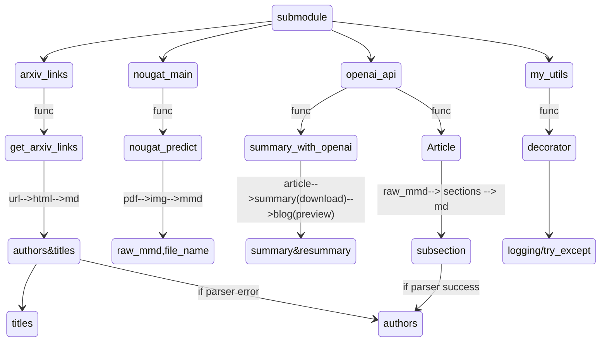

# Progress

## Fastapi

- [x] 实现fastapi

  ```
  uvicorn backend:app --reload
  ```

  

  - [x] 获取links

    ```python
   "POST /get_links/ HTTP/1.1" 422 Unprocessable Entity
    ```
    
    参数传递错误，经过检查以及搜索资料，大部分原因是格式问题，起初以为是None值在json中是null导致的读取问题，但是发现在在fastapi的docs交互界面（`[FastAPI - Swagger UI](http://127.0.0.1:8000/docs#/default/fetch_links_get_links__post)`）中，使用函数的输入json传入，发现用户端response code是200，但是在python中进行request时，则依旧出现上述报错：

    ```python
  def get_links(keyword, proxy,max_num=10,line_length=15,searchtype='all',show_abstract='show',
                  order='-announced_date_first',size=50,show_meta_data=True,daily_type = 'cs',headers = None):
        url = "http://127.0.0.1:8000/get_links/"
        params = {
            "key_word": keyword,
            "proxies": proxy,
            "max_num": max_num,
            "line_length": line_length,
            "searchtype": searchtype,
            "abstracts": show_abstract,
            "order": order,
            "size": size,
            "show_meta_data": show_meta_data,
            "daily_type": daily_type,
            "headers": headers
        }
        if keyword is None:
            params.pop("key_word")
        params = json.dumps(params)
        logger.info(f"get links params: {params}")
        response = requests.post(url, json=params)
        logger.info(f"get links status code: {response.status_code},response: {response}")
        if response.status_code == 200:
            json_info = response.json()
            return json_info['links'], json_info['titles'], json_info['abstract'], json_info['authors']
        else:
            logging.error(f"get links error, status code: {response.status_code}")
            return None,None,None,None
    ```
    
    后发现服务器端有报错：`500 Undocumented Error: Internal Server Error[Value Error Raises Internal Server Error]`

    发现是 `params = json.dumps(params)`处出现了问题，发现是json.dumps将params进行序列化，也即转化成str格式：

    ```
  '{"proxies": {"http": "http://127.0.0.1:7890", "https": "http://127.0.0.1:7890", "ftp": "ftp://127.0.0.1:7890", "host": "http://localhost:7890"}, "max_num": 5, "line_length": 19, "searchtype": "all", "abstracts": "show", "order": "-announced_date_first", "size": 25, "show_meta_data": true, "daily_type": "cs", "headers": {"User-Agent": "Mozilla/5.0 (Windows NT 10.0; Win64; x64) AppleWebKit/537.36 (KHTML, like Gecko) Chrome/119.0.0.0 Safari/537.36 Edg/119.0.0.0"}}'
    
    ```
    
    而`requests.post()` 方法的 `json` 参数也用于将 Python 对象自动序列化为 JSON，并设置请求的 Content-Type 为 `application/json`。

    因此，需要传入的是一个直接的 Python 对象dict，而非已经序列化的 JSON 字符串。

  - [x] 获取predict

    传递参数过程中无法兼容argparse.Namespace，可以自定义一个类，实现类似于argparse效果

  - [x] 获取summary

---

## streamlit

- [ ] 实现上传文件模式 & 多摘要同时下载

  - [x] 修改了文件上传模式的部分，使之能上传多个文件

    当服务器闲置较久时，有些时候会出现：

    ```
    AxiosError: Request failed with status code 403
    ```

    

  - [ ] 多摘要同时下载

    > 难点：由于按钮点击后，经过任意一个互动组件的互动，都会重置，这就导致了点击下载其中一个，此前运行的进度全都消失
    >
    > 原因如下：
    >
    > - 目前的用户动作流程为：
    >   - 输入keyword
    >   - 选择keyword对应的文章进行摘要，并**点击** *确定按钮*
    >   - 得到文章摘要以及下载按钮
    >   - 用户点击其中一个下载按钮（互动组件），导致此前点击确定*确定按钮*的记录消失（重置）
    > - 解决办法（未成功）：
    >   - 将确定按钮与下载按钮分离开，两者没有先后顺序（不在某一个if之后，另一个才执行），这样的话，就可以通过select_box进行选择，而select_box选择是永久性保存的（因为每次rerun时，select_box会保存是否被选择的记录），这样就可以通过对选择的select_box，筛选出想要的摘要内容
    >   - 问题：同样面临此前的问题，也即选择select_box时，会重置*确认按钮*状态，而由于两者分离，因此不需要先后按下，只需要通过缓存此前的数据，以实现效果，但是发现：如果使用`@st.cache_data`缓存此前所有步骤的结果，在函数输入参数同为args，但是args值改变，缓存会误认为参数不变，导致直接输出存好的结果，使得每个论文对应的摘要都一样

## project

- [ ] 适当修改了整体框架

  ```
  ── code_arxiv_summarizer/
     ├── data/
     ├── submodule/
     │   ├── arxiv_links/
     │   │   ├── get_links.py
     │   ├── nougat_main/
     │   │   ├── nougat/
     │   │   ├── predict.py
     │   ├── openai_api/
     │   │   ├── api_usage.py
  -->│   ├── my_utils/
     │   │   ├── decorators.py
     │   │   ├── loggers.py
     ├── res/
     │   ├── raw_mmd/
     │   ├── summary_mmd/
     ├── README.md
     ├── config.yaml
     ├── main.py
     ├── img/
     ├── pretrained_w/
  -->├── backend.py
  ```

  增加了修饰器，以及后端的基本代码并修改了部分代码

  `raw_mmd`-->`sections  `(`titles+authors+affiliation+subtitle+subtext`)



---

## prompt

- [ ] prompts 问题：暂时没改


### summary

- summary阶段（对每个sectionsummary）：对于每个section，prompt为 `section summary['system']`+`section summary[section]` +` subtitle `+ 对应的part的源文本内容`subtext`

  - 具体prompt对应summary的逻辑为：得到一个子标题subtitle，然后判断section summary中的key 是否 in subtitle
    - 如果in 则使用该key对应的value作为`user prompt + key + subtext`
    - 如果不在，则使用general_summary对应的value作为`user prompt + subtitle`（也即论文中原子标题，而非section summary中的key） + `subtext`

  ```mermaid
  stateDiagram
  [*] --> summary_prompts
  [*] --> resummary_prompts
  
  
  resummary_prompts --> [system]re_prompts
  resummary_prompts --> [overview]re_prompts
  
  summary_prompts --> [system]prompts
  summary_prompts --> [section]prompts:func(assgin_prompts)
  summary_prompts --> [content]prompts
  
  [system]prompts --> summary
  [section]prompts --> summary
  [content]prompts --> summary
  summary --> [content]re_prompts
  summary --> blog : save as mmd
  
  
  [system]re_prompts --> result
  [overview]re_prompts --> result
  [content]re_prompts --> result
  
  
  ```
  
  

```json
 {
  "section summary": {
    "system": "you are a wise assistant who is very helpful in summarizing the text.\\n\\n",
    "abstract": "Regarding the abstract, could you explain the main objectives and research findings of the paper?\\n\\n",
    "intro": "In relation to the introduction, what is the main motivation or background study of the authors?\\n\\n",
    "related work": "What previous research has been done that ties into this paper? How does this paper build upon the work of previous researchers?\\n\\n",
    "model": "Could you summarize the theoretical model or the approach of the research, and explain why the authors chose this method?\\n\\n",
    "method": "What research methods and techniques are applied in the methods section of this paper? Could you outline the main steps of data collection and analysis described in the methods section?\\n\\n",
    "conclusion": "What are the main conclusions and findings mentioned in the conclusion section of this paper? Based on the conclusions, what further directions for research do the authors suggest?\\n\\n",
    "result": "What were the main results or findings of the research?\"\nDiscussion: \"How do the authors interpret their results? How do these results compare to previous research, and what implications do they have?\\n\\n",
    "discussion": "How do the authors interpret their results? How do these results compare to previous research, and what implications do they have?\\n\\n",
    "future": "According to the authors, what additional research needs to be conducted or what new questions have emerged from this study?\\n\\n",
    "experiment": "What were the main experimental techniques or procedures employed in the research?\\n\\n",
    "dataset": "What data has been used in this study? Could you describe its features and how it was collected or generated?\\n\\n",
    "limit": "What limitations in the research or methodology are indicated in the paper? With regard to the limitations section of the paper, what recommendations for improvements or possible solutions do the authors put forward? \\n\\n",
    "general_summary": "Please summarize the section of the paper that you have been assigned,the title of the section is [title_to_replace]\\n\\n"
  },
  "global summary": {
    "system": "You are an experienced article summarizer and rewriter proficient in consolidating various sections.\\n\\n",
    "overview": "Given a series of summaries, your task is to logically reorganize and refine them into an engaging narrative. The summaries are encapsulated within backticks (`), and your role is to extract, reorder, and reshape the content to generate a superior quality article overview in markdown format . This task goes beyond merely piecing together the sections; you are required to transform them into a  coherent and smoothly flowing storyline, while preserving the main essence of the original content.\\n\\n",
    "old_overview": "Craft a comprehensive summary drawing from the distinct segments of the original abstract, and provide a summarization of the entire content. Additionally, assign a specific score (out of 10 points) to the article, serving as a recommendation guide for potential readers.\\n\\n",
    "resummary": "Small sections of the paper have already been summarised for you, given between triple backticks in an array. Unite these summaries into a larger complete summary.\\n\\n",
    "score": "Hello, ChatGPT. I have a paper that requires your evaluation. Please assess it based on the following main criteria: clarity of the paper's theme and objectives, appropriateness and detail of the research methods, accuracy of the data and results, depth of the discussion and conclusion, and overall writing quality (including grammar, spelling, clarity, etc.). Please provide a score from 1-10 for each criterion, with 1 being very poor and 10 being excellent. Then, calculate the average of all scores to give an overall rating for the paper. "
  }
}
```

具体prompt如下（其中chunks为list，每个元素也即对应的subsection，chunk[0]为subsection中的subtitle，chunk[1]为对应subtext，通过assgin_prompts得到对应的prompt以及subtitle，如果section summary中的key 是否 in subtitle，则subtitle=key 否则subtitle = 原论文中的subtitle，此处也可以看出，<u>当用的是原论文中的subtitle时（markdown格式，会带#）在summary.mmd中会出现## ## subtitle的情况，而使用section summary中的key时，与## 结合，没有多余的#</u>）：

```python
for i,chunk in enumerate(chunks):
     subtitle,summary_prompt = assgin_prompts(prompts,chunk[0])
     input_prompt = summary_prompt + chunk[1]
     resp = chat_with_openai(input_prompt,messages,model,temperature,max_tokens,top_p,
                             frequency_penalty,presence_penalty,response_only=True,prompt_factor=prompt_factor)

     respons.append('\n## ' + subtitle + ':\n' + resp)
```


### re_summary

re_summary阶段：目前使用的prompt是 `global summary['system'] `+` global summary['overview'] `+ 所有summary拼接 , score的prompt为此前的`message + global summary['score']`

具体代码如下图所示（`respons`的每个元素为每个部分得到的subtitle+section summary,`titles`为经过nougat得到的论文总标题）：

```python
full_resp = ''.join(respons)
messages = init_messages('system',resummry_prompt['system'])

prompt = resummry_prompt['overview'] + '\n\n ```' + titles + full_resp + '```'

re_respnse = chat_with_openai(prompt,messages,model,temperature,max_tokens,top_p,
                              frequency_penalty,presence_penalty,response_only=True,
                              prompt_factor=prompt_factor,reset_messages=False)
score = chat_with_openai(resummry_prompt['score'],messages,model,temperature,max_tokens,top_p,
                         frequency_penalty,presence_penalty,response_only=True,
                         prompt_factor=prompt_factor,reset_messages=False)
logging.info(f'finished resummry the article,with the titles:{titles},authors:{authors}')
```


### results

> raw_mmd: [2310_03026.mmd](.\res\raw_mmd\2310_03026.mmd) 
>
> summary_mmd:  [2310_03026.mmd](.\res\summary\2310_03026.mmd) 
>
> resummary_mmd: [2310_03026.mmd](.\res\resummary_mmd\2310_03026.mmd) 

>  raw_mmd:  [2310_08102.mmd](.\res\raw_mmd\2310_08102.mmd) 
>
>  summary_mmd:   [2310_08102.mmd](.\res\summary\2310_08102.mmd) 
>
>  resummary_mmd: [2310_08102.mmd](.\res\resummary_mmd\2310_08102.mmd)

>  raw_mmd:   [2310_08365.mmd](.\res\raw_mmd\2310_08365.mmd) 
>
>  summary_mmd:   [2310_08365.mmd](.\res\summary\2310_08365.mmd) 
>
>  resummary_mmd:  [2310_08365.mmd](.\res\resummary_mmd\2310_08365.mmd) 

> raw_mmd:   [2310_08582.mmd](.\res\raw_mmd\2310_08582.mmd) 
>
> summary_mmd:   [2310_08582_202310151900.mmd](.\res\summary\2310_08582_202310151900.mmd) 
>
> resummary_mmd:  [2310_08582_202310151900.mmd](.\res\resummary_mmd\2310_08582_202310151900.mmd) 

​	


#  problems to solve

- [ ] 多文件下载

- [ ] abstract的标题级数不为6的情况

- [ ] save成mmd时的格式问题：

  <u>当用的是原论文中的subtitle时（markdown格式，会带#）在summary.mmd中会出现## ## subtitle的情况，而使用section summary中的key时，与## 结合，没有多余的#</u>）：

  ```python
  for i,chunk in enumerate(chunks):
       subtitle,summary_prompt = assgin_prompts(prompts,chunk[0])
       input_prompt = summary_prompt + chunk[1]
       resp = chat_with_openai(input_prompt,messages,model,temperature,max_tokens,top_p,
                               frequency_penalty,presence_penalty,response_only=True,prompt_factor=prompt_factor)
  
       respons.append('\n## ' + subtitle + ':\n' + resp)
  ```

- [ ] streamlit服务器问题：

  当服务器闲置较久时，有些时候会出现：

  ```
  AxiosError: Request failed with status code 403
  ```

- [ ] prompts问题

  修改prompt方向：

  - 1-shot / few-shot
  - 复杂的prompt
    - 任务描述
    - 标准制定
    - 操作对象输入

- [ ] 鲁棒性问题：

  使用my_utils中的decorator以解决报错直接中止的问题，并想出给用户的提示方案

- [ ] 技术架构，思路（流程图（内部，时间流）/架构图（宏观，模块联系））

- [ ] github完善（多余代码删除，使用文档攥写）

- [ ] 团队项目，了解

- [ ] GPT --> Instruct GPT（turbo - instruct-16k）,请求 --> 要求


cur:

- [ ] github --> org
- [ ] prompt  优化 COT
- [ ] API 多线程请求
- [ ] FastAPI部署测试，解耦
- [ ] 代码整理，前端优化
- [ ] instrcut GPT 模型修改
