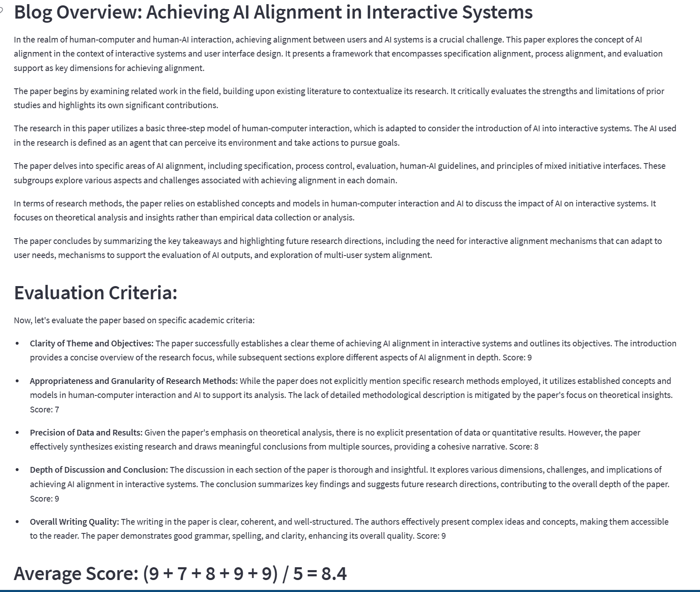
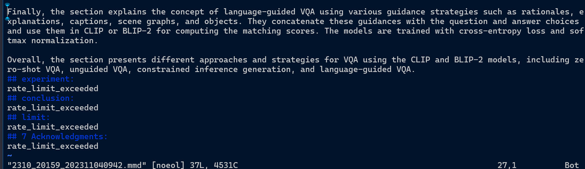

[TOC]

# progress

- [x] 服务器部署服务

  具体的实例以及结果见[api_usage.ipynb](./api_usage.ipynb)

- [ ] 多文件下载

  按钮问题？目前还没有解决办法

  > - 无法解决的原因在于：
  >
  >   当用户按下按钮后，按钮置1，输出摘要以及下载文件，当用户按下下载文件的组件，按钮置0
  >
  > - 一个比较极端的解决办法：
  >
  >   当用户按下一次按钮后，将该按钮的状态永远记住为1，因此当用户按下下载的组件，也能正常运行

- [x] abstract的标题级数不为6的情况

  [split_text.py](.\submodule\openai_api\split_text.py)

- [x] save成mmd时的格式问题：

  <u>当用的是原论文中的subtitle时（markdown格式，会带#）在summary.mmd中会出现## ## subtitle的情况，而使用section summary中的key时，与## 结合，没有多余的#</u>）：

  ```python
  for i,chunk in enumerate(chunks):
       subtitle,summary_prompt = assgin_prompts(prompts,chunk[0])
       input_prompt = summary_prompt + chunk[1]
       resp = chat_with_openai(input_prompt,messages,model,temperature,max_tokens,top_p,
                               frequency_penalty,presence_penalty,response_only=True,prompt_factor=prompt_factor)
  
       respons.append('\n## ' + subtitle + ':\n' + resp)
  ```

- [ ] streamlit服务器问题：

  当服务器闲置较久时，有些时候会出现：

  ```
  AxiosError: Request failed with status code 403
  ```

  > Note: 目前几乎不出现了

- [x] prompts问题

  修改prompt方向：

  - 1-shot / few-shot
  - 复杂的prompt
    - 任务描述
    - 标准制定
    - 操作对象输入

  

  

  [最新的prompts](./prompts_config.json),[以往的版本](prompts_config1.json),得到的结果为：

  >  summary:  [e.g.mmd](res/summary_mmd/e.g.mmd) 
  >
  > resummary: [e.g.mmd](res/re_summary_mmd/e.g.mmd) 

  > 存在的问题：
  >
  > 相同的prompts，对于不同的输入text，结果的==格式仍然存在一定差异==
  >
  > ```
  > "overview": "Your task demands the meticulous crafting of a scholarly article overview blog. Integrate the previously summarized subgroups seamlessly, enclosed within triple backticks (```), forming a cohesive narrative that preserves the essence of each section. Ensure a smooth and logical flow for the readers, emphasizing the interconnectedness of these subgroups and their collective impact on the paper's central theme. Adhere to the structure of a research paper summary blog: \n\n- commence with a concise introduction\n- delve into the key findings and methodology\n- explore the implications and conclusions drawn\n- offer a thoughtful reflection on the study's significance. \n\nYour expertise lies in retaining the core points of the summarized subgroups. If the subgroups contain additional content beyond the typical structure, capture the key points of these additional parts. Adapt and expand the overview as necessary to encompass all pertinent details and insights, creating a comprehensive reference blog for academic researchers.",
  >     "score": "Upon presenting the overview, conduct a meticulous evaluation of the paper using specific academic criteria: clarity of theme and objectives, appropriateness and granularity of research methods, precision of data and results, depth of discussion and conclusion, and overall writing quality(including grammar, spelling, and clarity).Assign a score ranging from 1 to 10 for each criterion, where 1 indicates substandard quality and 10 signifies exceptional excellence. Calculate the average score to derive a comprehensive rating for the paper.\n\n**Evaluation Criteria:**\n\n- **Clarity of Theme and Objectives:** Evaluate the clarity of the paper's central theme and research objectives.\n\n- **Appropriateness and Granularity of Research Methods:** Assess the suitability and detailed nature of the research methodologies employed.\n\n- **Precision of Data and Results:** Scrutinize the accuracy and precision of the presented data and results.\n\n- **Depth of Discussion and Conclusion:** Analyze the depth and insightfulness of the discussion and the conclusiveness of the paper's ending.\n\n- **Overall Writing Quality:** Evaluate the overall writing quality, including grammar, spelling, and clarity.\n\n*Note: Please provide all the scores and blog for each criterion in Markdown format.*"
  > ```
  >
  > 

  

- [x] 鲁棒性问题：

  对于OPENAI API 的url获取失败时的返回值，由于返回的主体为空，无法被json解析

  ```ini
  2023-11-05 15:00:36 - ERROR - backend.py:203 - summary_with_openai error: Expecting value: line 1 column 1 (char 0)
  INFO:     39.174.136.3:59435 - "POST /get_summaries/ HTTP/1.1" 500 Internal Server Error
  client_loop: send disconnect: Broken pipe
  ```

  此外，由于在访问失败时，得到的resp不是summary，而是错误码，导致无法想加等问题

  ```python
      multi_resp = ['\n## ' + subtitle + ':\n' + resp for (subtitle,resp) in zip(subtitles,multi_resp)]
    File "/home/clouduser/workspace/arxiv_summarizer/proj/submodule/openai_api/api_usage.py", line 305, in <listcomp>
      multi_resp = ['\n## ' + subtitle + ':\n' + resp for (subtitle,resp) in zip(subtitles,multi_resp)]
  TypeError: can only concatenate str (not "int") to str
  ```

  修改了处理获取失败情况的部分代码，返回为str，避免类型问题

  ```python
      @staticmethod
      def handle_request(url:str,parameters = None,proxy=None, headers = None):
          success = False
          response = None
          try:
              if proxy is None:
                  raw_response = requests.post(url, headers=headers, json=parameters)
              else:
                  raw_response = requests.post(url, headers=headers, json=parameters, proxies=proxy)
  
              raw_response.raise_for_status()
              response = json.loads(raw_response.content.decode("utf-8"))
              content = response["choices"][0]["message"]["content"]
              success = True
          except requests.exceptions.RequestException as e:
              content = f"Request Error: {str(e)}"
          except json.JSONDecodeError as e:
              content = f"JSON Decode Error: {str(e)}"
          except KeyError as e:
              content = f"KeyError: {str(e)}"
          except Exception as e:
              content = f"Unexpected Error: {str(e)}"
  
          return response,content, success
  
  ```

  

  

- [ ] 技术架构，思路（流程图（内部，时间流）/架构图（宏观，模块联系））

- [ ] github完善（多余代码删除，使用文档攥写）

- [ ] 团队项目，了解

- [ ] GPT --> Instruct GPT（turbo - instruct-16k）,请求 --> 要求


# current problems:

- [x] github --> org

- [x] prompt  优化 COT

- [x] FastAPI部署测试，解耦

- [ ] 代码整理，前端优化

  - 各输入参数都通过组件形式呈现在网页
  - 对于显示的resummary，保证格式统一

- [ ] instrcut GPT 模型修改

  instruct只有4k?

  | LATEST MODEL                | DESCRIPTION                                                  | MAX TOKENS    | TRAINING DATA  |
  | :-------------------------- | :----------------------------------------------------------- | :------------ | :------------- |
  | gpt-3.5-turbo               | Most capable GPT-3.5 model and optimized for chat at 1/10th the cost of `text-davinci-003`. Will be updated with our latest model iteration 2 weeks after it is released. | 4,097 tokens  | Up to Sep 2021 |
  | gpt-3.5-turbo-16k           | Same capabilities as the standard `gpt-3.5-turbo` model but with 4 times the context. | 16,385 tokens | Up to Sep 2021 |
  | gpt-3.5-turbo-instruct      | Similar capabilities as `text-davinci-003` but compatible with legacy Completions endpoint and not Chat Completions. | 4,097 tokens  | Up to Sep 2021 |
  | gpt-3.5-turbo-0613          | Snapshot of `gpt-3.5-turbo` from June 13th 2023 with function calling data. Unlike `gpt-3.5-turbo`, this model will not receive updates, and will be deprecated 3 months after a new version is released. | 4,097 tokens  | Up to Sep 2021 |
  | gpt-3.5-turbo-16k-0613      | Snapshot of `gpt-3.5-turbo-16k` from June 13th 2023. Unlike `gpt-3.5-turbo-16k`, this model will not receive updates, and will be deprecated 3 months after a new version is released. | 16,385 tokens | Up to Sep 2021 |
  | gpt-3.5-turbo-0301 (Legacy) | Snapshot of `gpt-3.5-turbo` from March 1st 2023. Unlike `gpt-3.5-turbo`, this model will not receive updates, and will be deprecated on June 13th 2024 at the earliest. | 4,097 tokens  | Up to Sep 2021 |
  | text-davinci-003 (Legacy)   | Can do any language task with better quality, longer output, and consistent instruction-following than the curie, babbage, or ada models. Also supports some additional features such as [inserting text](https://platform.openai.com/docs/guides/gpt/inserting-text). | 4,097 tokens  | Up to Jun 2021 |
  | text-davinci-002 (Legacy)   | Similar capabilities to `text-davinci-003` but trained with supervised fine-tuning instead of reinforcement learning | 4,097 tokens  | Up to Jun 2021 |
  | code-davinci-002 (Legacy)   | Optimized for code-completion tasks                          | 8,001 tokens  | Up to Jun 2021 |

- [x] api返回体格式修改成标准格式

- [ ] 多线程请求openai，速度限制问题？

  多线程的必要性？

  

  使用多线程：
  
  ```python
  	self.requests_per_minute = 3
       self.num_processes = min(self.requests_per_minute,multiprocessing.cpu_count(),num_processes)
       
       def process_batches(self, article_texts,response_only:bool = True,resest_messages:bool = True):
          if self.acquire_mode == 'url':
              logging.info(f"connect openai api through url:{self.base_url}, with {self.num_processes} processes")
          else:
              logging.info(f"connect openai api directly, with {self.num_processes} processes")
  
          results = []
          chat_func = partial(self.chat_with_openai, reset_messages=resest_messages, response_only=response_only,
                              api_key=self.api_key)
          with concurrent.futures.ThreadPoolExecutor(max_workers=self.num_processes) as executor:
              for i in range(0, len(article_texts), self.num_processes):
                  start_time = time.time()
                  batch = article_texts[i:i + self.num_processes]
                  futures = [executor.submit(chat_func, task_obj) for task_obj in batch]
                  concurrent.futures.wait(futures)
                  results.extend([future.result() for future in futures])
                  elapsed_time = time.time() - start_time
                  if elapsed_time < 60:
                      slp_t = int(60 - elapsed_time)+1
                      logging.info(f'due to rate limit,sleep for {slp_t}s')
                      time.sleep(slp_t)  # wait util 60s
          return results
  ```
  
  time: 190.8743772506714

发现不同线程之间，由于要对`self.messages`列表进行操作，导致并发访问共享数据的竞态条件问题，也即同一batch的不同线程之间，分别执行`self.messages.append`，较晚一点的线程中，`self.messages`的输入为前两线程的结果，还是改为`multiprocessing`库，但是由于该库某个线程结束，会立刻执行下一个任务，因此只能对总任务进行分组，保证每个batch在一分钟内只执行3次访问

```python
    def process_batches(self, article_texts:Union[str,List],response_only:bool = True,resest_messages:bool = True):
        if self.acquire_mode == 'url':
            logging.info(f"connect openai api through url:{self.base_url}, with {self.num_processes} processes")
        else:
            logging.info(f"connect openai api directly, with {self.num_processes} processes")
        article_texts = [article_texts] if isinstance(article_texts,str) else article_texts
        results = []
        chat_func = partial(self.chat_with_openai, reset_messages=resest_messages, response_only=response_only,
                            api_key=self.api_key)
        with multiprocessing.Pool(processes=self.num_processes) as pool:
            processing_bar = tqdm(range(0, len(article_texts), self.num_processes))
            for i in processing_bar:
                processing_bar.set_description(
                    f"total {len(article_texts)} section, processing {i}~{i + self.num_processes}")
                start_time = time.time()
                batch = article_texts[i:i + self.num_processes]
                futures = pool.map(chat_func, batch)
                results.extend(futures)
                elapsed_time = time.time() - start_time
                if elapsed_time < 60:
                    slp_t = int(60 - elapsed_time) + 3
                    logging.info(f'due to rate limit, sleep for {slp_t}s')
                    time.sleep(slp_t)  # wait until 60s
        return results
```

## 速度问题

### model predict速度慢

原因：

- 目前只是用了单个GPU跑

- 单个GPU显存部分被占用，并且源码中batch依据如下公式计算，1000与0.3是他们的经验系数？

  ```python
  BATCH_SIZE = int(
       torch.cuda.get_device_properties(0).total_memory / 1024 / 1024 / 1000 * 0.3
  )
  
  ------------------------------
  pynvml.nvmlInit()
  handle = pynvml.nvmlDeviceGetHandleByIndex(0)
  meminfo = pynvml.nvmlDeviceGetMemoryInfo(handle)
  BATCH_SIZE = int(
       meminfo.free / 1024**3 * 0.3
  )
  ```

可能的解决方法：

- 多GPU并行
- 尝试改动上述batch计算的公式
- 降低计算的精度，float16?


### summary速度慢

原因：

- apikey每分钟3次，速度受限
- 某些pdf段落特别多，按照目前的summary逻辑，每个subgroup单独用于summary，所以subtitle越多，时间越长


可能的解决办法：

- 将subgroup中length<max_token的组，与相邻组，尽可能地多组结合
- 多个apikey混用


# 常用代码

## 服务器

```
ssh clouduser@61.241.103.32 -p 20022
```

password：

```
C7#jH9u%##FreeAI@GZW%LLMzoo
```

```
cd workspace/arxiv_summarizer/proj
conda activate code_arxiv_summarizer
```

转移文件：

```bash
$ scp -P 20022  /d/linux/EasyChatGPT.py clouduser@61.241.103.32:/home/clouduser/workspace/arxiv_summarizer/proj/gpt_test.py
```

```python
$ scp -r -P 20022  /d/linux/EasyChatGPT.py clouduser@61.241.103.32:/home/clouduser/workspace/arxiv_summarizer/proj/gpt_test.py
```

使用清华园镜像快速下载：

```bash
$ python3 -m spacy download en_core_web_sm
-i https://pypi.tuna.tsinghua.edu.cn/simple
```

```bash
$ cd path/to/code_arxiv_summarizer
$ streamlit run app_stream_copy.py
```


## 后端：

```
uvicorn backend:app --reload --port 8000
```

```
uvicorn backend:app --host 0.0.0.0 --port 8076 --reload
```

```
https://61.241.103.32/
```


# prompts优化

参考链接：

1. [efficient prompts](https://mp.weixin.qq.com/s/t4q_DC9CgZhyA5MKOT8ptA)
2. [一文总结提示工程框架，除了CoT还有ToT、GoT、AoT、SoT、PoT](https://mp.weixin.qq.com/s/7XunMdZNHkII-6sRgetegw)
3. [4k窗口长度就能读长文](https://mp.weixin.qq.com/s/4YLN6tL61iIorzUsUMALQQ)
4. [哈工大发布大模型思维链推理综述](https://mp.weixin.qq.com/s/tDTJjRpLsPVnEi_LaPPrxQ)

要点总结：

> 1. 明确“好结果”的标准
>
>    - 在大多数情况下，**Prompt的性能上限与我们对“好结果”的理解程度成正比**，只有充分理解了所谓的“好结果”具体好在哪些“点”，我们才能将这些“点”形式化为Prompt，从而把我们的意图更准确地传达给模型。
>    - 也需要牢记**奥卡姆剃刀准则**，即并不是包含的指令越多越好。指令约束应该逐步添加到Prompt中，保证每一条约束都与任务需求本身息息相关，每一条约束的加入都会对生成的结果产生显著的影响，避免任何冗余的指令约束。
>
>    > Good：{document} 使用通俗易懂的语言为以上文章写一篇摘要，摘要应包括一个小结和一个相关要点的列表，同时加粗关键部分以提高可读性。
>    >
>    > Better：{document} 为以上文章写一篇摘要，具体要求如下：
>    >
>    > 1. 使用通俗易懂的语言撰写摘要
>    > 2. 摘要应包括一个小结和一个相关要点的列表
>    > 3. 加粗摘要的关键部分以提高可读性
>
> 2. Prompt还应避免以下问题：
>
>    - 避免使用语法结构过于复杂、语义模糊不清、逻辑混乱的语言。
>    - 避免任何歧义、语病、拼写/标点错误的存在。
>    - 正面描述任务的具体要求，尽量避免使用否定句。
>
>    > Bad：解释提示工程的概念。解释要简短，几句话就行，不要描述得过于专业化。
>    > Good：使用2-3句话向高中生解释提示工程的概念。
>
> 3. **尽量为每一个否定句都设置一个兜底策略**，使大模型识别到不应当做什么的时候，给出预设的回复
>
>    > Bad：
>    > 现在你是一个向客户推荐电影的客服。在此过程中，你不应该询问客户的兴趣和个人信息。
>    > 客户：请根据我的兴趣推荐一部电影。
>    > 客服：
>    > Good：
>    > 现在你是一个向客户推荐电影的客服。在此过程中，你应该避免询问客户的兴趣和个人信息。如果你无法为客户推荐电影，你应该回答“抱歉，我无法为您推荐电影”。
>    > 客户：请根据我的兴趣推荐一部电影。
>    > 客服：
>
> 4. 指定模型所扮演的角色
>
>    > Bad：请帮我写一份能够吸引大量粉丝点赞的青岛旅游攻略
>    > Good：你是一位小红书爆款文案写作大师，请帮我写一份青岛旅游攻略
>
> 5. 指定生成结果的格式
>
>    > 抽取出文本中提到的重要实体，包括人名、地名和机构名。
>    > 返回格式：
>    > **人名**：<人名列表，使用分号分隔>  
>    > **地名**：<地名列表，使用分号分隔>
>    > **机构名**：<机构名列表，使用分号分隔>
>    > 文本：{input}
>
> 6.  增加强调词和强调符号
>
>     - **模型可能会更关心靠前和靠后的指令，忽略中间的指令**。
>
>     - 模型本身存在近期偏见(recency bias)，生成时会关注离当前token更近的文本。因此，**将重要的需求放在前面，并在最后加以重复可以起到强调的作用**。
>     - **text**、「text」、“text”等特殊符号，或者增加注意、务必、严格等词汇来强调需求点的重要程度。
>
> 7.  撰写模块化的Prompt
>
>     当Prompt过长时，我们应当将Prompt划分成**边界清晰的模块**，任务描述、注意事项、样本示例、输入内容之间都应有**明确的分隔符**
>
>     > Bad：
>     > 请抽取出以下简历的关键信息，并以json格式返回结果：
>     > {input}
>     > 你需要抽取的关键信息包括：姓名、电话、毕业院校、科研经历、项目经历、荣誉奖项
>     >
>     > ---
>     >
>     > Good：
>     > 请抽取出以下简历的关键信息，并以json格式返回结果。
>     > 简历：
>     > """
>     > {input}
>     > """
>     > 你需要抽取的关键信息包括：
>     > """
>     >
>     > 1. 姓名
>     > 2. 电话
>     > 3. 毕业院校
>     > 4. 科研经历
>     > 5. 项目经历
>     > 6. 荣誉奖项
>     >    """
>
> 8. **Prompt的设计是一个迭代的过程，需要大量的实验来获得最佳效果**。
>
> 9. 当任务的定义足够明确、清晰时，Prompt的生成结果应该具备一定程度的**稳定性**，即多次生成的结果一致率要足够高。
>
> 10. **思维链可以促使模型将一个复杂的任务分解成一系列简单的任务，并逐个解决，最后汇总为最终的答案。**
>
>     > Bad：
>     > Good：请你帮我计算一下，每一步运算过程都要展示出来，并确保计算的正确性。
>
> 11.  使用Few-shot Prompt
>
>      一般来说，样例选择的基本原则是**尽可能地覆盖真实的样本空间**，一种比较好的样例构建方式是首先给出常见的easy case，然后给出模型可能出错的hard case和corner case，<u>hard/corner case通常来源于开发者对任务本身的理解</u>，以及在实践过程中发现的badcase。
>
>      - **样例的数量和顺序都有可能导致生成结果出现偏差**，因为在生成答案时，大模型会更关注距离输入更近、相对数量更多的样例。
>      - **设置标签分布均匀的样例，并随机打乱样例的顺序通常是一个好的选择**，这可以很好地避免样本选择偏差。
>
> 12. 使用大模型辅助Prompt撰写
>
>     > 你现在是一个提示词生成专家，我想让ChatGPT完成{task}，请帮我写一份优质的提示词。


- [x] fastapi注解
- [ ] 速度优化
- [ ] resuammry优化
- [x] 端到端的例子
- [ ] PPT
- [ ] streamlit优化
- [ ] resummary准确度，量化指标，可读性等

