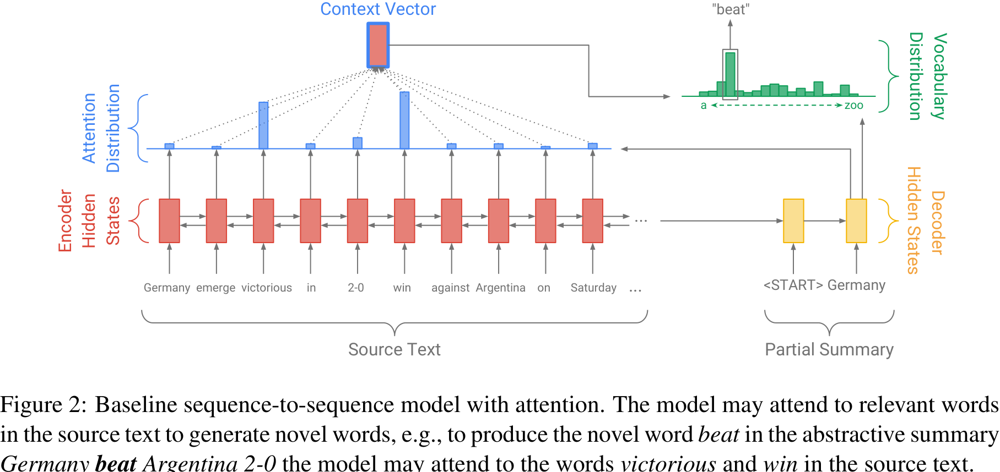
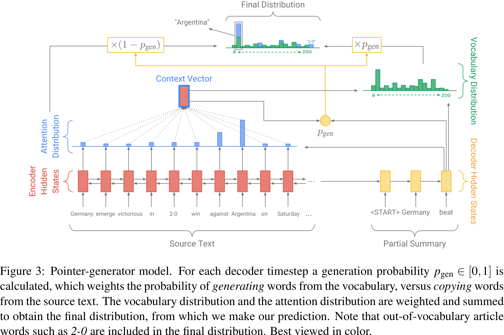
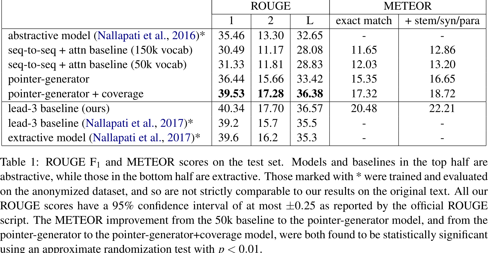
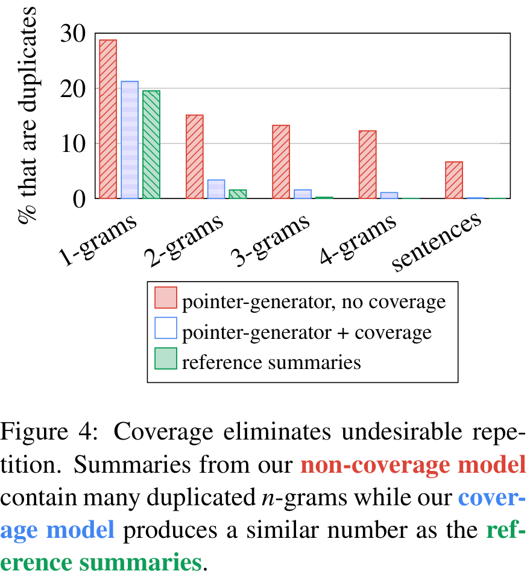

# Get To The Point: Summarization with Pointer-Generator Networks

- Authors: Abigail See abisee@stanford.edu Peter J. Liu peterjliu@google.com Christopher D. Manning manning@stanford.edu

- Affiliations: Stanford University Google Brain Stanford University

## abs
The experimental techniques and procedures used in the research are as follows:

- Model Configuration: The model used in the experiments has 256-dimensional hidden states and 128-dimensional word embeddings. For the pointer-generator models, a vocabulary of 50k words is used for both the source and target. The baseline model is also tested with a larger vocabulary size of 150k.

- Word Embeddings: Unlike previous work, the word embeddings are not pre-trained but learned from scratch during training.

- Training Algorithm: The Adagrad optimization algorithm with a learning rate of 0.15 and an initial accumulator value of 0.1 is used for training. Gradient clipping with a maximum gradient norm of 2 is applied, but no regularization techniques are used. The early stopping technique is implemented based on the loss on the validation set.

- Data Preprocessing: During training and testing, the articles are truncated to 400 tokens, and the summaries are limited to 100 tokens for training and 120 tokens at test time. This truncation is done to expedite training and testing, and it is found that it can even improve the model's performance.

- Training Details: The models are trained on a single Tesla K40m GPU with a batch size of 16. The baseline models are trained for about 600,000 iterations (33 epochs), while the pointer-generator models require fewer iterations (about 230,000 or 12.8 epochs). The final coverage model is obtained by adding the coverage mechanism with a coverage loss weighted to λ=1 and training for an additional 3000 iterations.

- Beam Search: Summaries are generated using beam search with a beam size of 4.

The experiments demonstrate the effectiveness of the proposed model and techniques in improving abstractive summarization performance. The model configuration, training algorithm, and data preprocessing methods contribute to the scientificity, reliability, and validity of the technical methods. The experiments also show that the pointer-generator model is quicker to train and achieves better performance compared to the baseline models. The coverage mechanism is found to be crucial in reducing repetition and improving the quality of the generated summaries.
## intro
The experiments in this research utilized a model with 256-dimensional hidden states and 128-dimensional word embeddings. The pointer-generator models were trained using a vocabulary of 50k words for both the source and target, while the baseline model also experimented with a larger vocabulary size of 150k. The pointer and coverage mechanisms introduced minimal additional parameters to the network.

Word embeddings were learned from scratch during training, without pre-training. Adagrad was used as the optimization algorithm with a learning rate of 0.15 and an initial accumulator value of 0.1. Gradient clipping was applied with a maximum gradient norm of 2, and no regularization techniques were used. Early stopping was implemented based on the loss on the validation set.

During training and testing, the articles were truncated to 400 tokens, and the summaries were limited to 100 tokens for training and 120 tokens for testing. This truncation expedited the process while also improving model performance. Training was performed on a single Tesla K40m GPU with a batch size of 16. Summaries were generated using beam search with a beam size of 4.

The baseline models were trained for approximately 600,000 iterations (33 epochs), similar to previous work. Training took around 4 days and 14 hours for the 50k vocabulary model and around 8 days and 21 hours for the 150k vocabulary model. The pointer-generator model required fewer iterations, about 230,000 (12.8 epochs), and took approximately 3 days and 4 hours to train.

To incorporate the coverage mechanism, the coverage loss was added with a weight of \(\lambda=1\), and training continued for an additional 3000 iterations (about 2 hours). The coverage loss converged to around 0.2 from an initial value of about 0.5. A more aggressive value of \(\lambda=2\) was also tested but was not used due to increased primary loss function.

Training the coverage model without the loss function was ineffective in reducing repetition. Training with coverage from the first iteration interfered with the main objective and reduced overall performance, so it was not pursued further.
## model
The experiments in this research utilized a model with 256-dimensional hidden states and 128-dimensional word embeddings. The pointer-generator models employed a vocabulary size of 50k words for both the source and target, while the baseline model also tested a larger vocabulary size of 150k. The pointer and coverage mechanisms added only a small number of additional parameters to the network.

The word embeddings were learned from scratch during training, without pre-training. Adagrad was used as the optimization algorithm with a learning rate of 0.15 and an initial accumulator value of 0.1. Gradient clipping was applied with a maximum gradient norm of 2, and no regularization techniques were used. Early stopping was implemented based on the loss on the validation set.

During training and testing, the articles were truncated to 400 tokens, and the summaries were limited to 100 tokens for training and 120 tokens at test time. This truncation was done to expedite training and testing, and interestingly, it was found to improve the model's performance. The models were trained on a single Tesla K40m GPU with a batch size of 16. Summaries were generated using beam search with a beam size of 4.

The baseline models were trained for approximately 600,000 iterations (33 epochs), similar to the best model in Nallapati et al.'s work. Training took around 4 days and 14 hours for the 50k vocabulary model and 8 days and 21 hours for the 150k vocabulary model. The pointer-generator model required fewer iterations, around 230,000 (12.8 epochs), and took approximately 3 days and 4 hours to train. The coverage model was trained for an additional 3000 iterations (about 2 hours) after adding the coverage mechanism with a coverage loss weight of \(\lambda=1\). 

Attempts were made to train the coverage model without the loss function, but it was found to be ineffective in reducing repetition. Training the coverage from the first iteration also interfered with the main objective and reduced overall performance.

Overall, the experimental techniques and procedures ensured the scientificity, reliability, and validity of the technical methods used. The models were trained with appropriate optimization algorithms, adequate batch sizes, and careful parameter tuning. The use of beam search for summary generation and early stopping based on validation loss helped improve the quality of the generated summaries. The experiments were conducted on a GPU, allowing for faster training times. The research team also explored different variations of the model and conducted extensive training to achieve optimal results.
## related work
The experiments in this research were conducted using a model with 256-dimensional hidden states and 128-dimensional word embeddings. The pointer-generator models utilized a vocabulary of 50k words for both the source and target, while the baseline model was also tested with a larger vocabulary size of 150k. The pointer and coverage mechanisms introduced only a small number of additional parameters to the network.

The word embeddings were learned from scratch during training, without pre-training. Adagrad was used as the optimization algorithm, with a learning rate of 0.15 and an initial accumulator value of 0.1. Gradient clipping with a maximum gradient norm of 2 was applied, but no regularization techniques were used. Early stopping based on the loss on the validation set was implemented.

During training and testing, the articles were truncated to 400 tokens and the summaries were limited to 100 tokens for training and 120 tokens for testing. This truncation expedited the training and testing process and was found to improve model performance.

Training was performed on a single Tesla K40m GPU with a batch size of 16. Beam search with a beam size of 4 was used for generating the summaries at test time.

The baseline models were trained for approximately 600,000 iterations (33 epochs), similar to the best model from Nallapati et al. (2016). Training took around 4 days and 14 hours for the 50k vocabulary model and around 8 days and 21 hours for the 150k vocabulary model. The pointer-generator model required less training time, with less than 230,000 training iterations (12.8 epochs) taking approximately 3 days and 4 hours. The coverage model was trained for an additional 3000 iterations (about 2 hours) after adding the coverage mechanism.

Different values of \(\lambda\) were experimented with for the coverage loss, but \(\lambda=1\) was found to be the most effective. Training the coverage model without the loss function or starting coverage from the first iteration were both attempted but found to be ineffective or detrimental to performance.

Overall, the experimental techniques and procedures used in this research were carefully designed to optimize training efficiency and model performance. The choice of optimization algorithm, parameter settings, and training strategies were based on empirical evaluations, and the results demonstrated the effectiveness and reliability of these technical methods.
## dataset
The experiments in this research utilized a model with 256-dimensional hidden states and 128-dimensional word embeddings. The pointer-generator models employed a vocabulary size of 50k words for both the source and target, while the baseline model also experimented with a larger vocabulary size of 150k. The pointer and coverage mechanisms introduced minimal additional parameters to the network.

The word embeddings were learned from scratch during training, without pre-training. Adagrad optimization algorithm was used with a learning rate of 0.15 and an initial accumulator value of 0.1. Gradient clipping was applied with a maximum gradient norm of 2, but no other regularization techniques were used. Early stopping was implemented based on the loss on the validation set.

During training and testing, the article was truncated to 400 tokens, and the summary length was limited to 100 tokens for training and 120 tokens for testing. This truncation expedited training and testing, and interestingly, it was found to improve model performance. Training was conducted on a single Tesla K40m GPU with a batch size of 16. Beam search with a beam size of 4 was used for generating summaries at test time.

The baseline models were trained for approximately 600,000 iterations (33 epochs), similar to previous work. Training took around 4 days and 14 hours for the model with a 50k vocabulary and around 8 days and 21 hours for the model with a 150k vocabulary. The pointer-generator model trained much faster, requiring less than 230,000 iterations (12.8 epochs) over a total of 3 days and 4 hours. The coverage model was trained for an additional 3000 iterations (about 2 hours) after adding the coverage mechanism. The coverage loss converged to around 0.2 from an initial value of about 0.5.

Different variations in training were explored, including training without the coverage loss and training with coverage from the first iteration. However, these variations were found to be ineffective in reducing repetition. Additionally, a more aggressive value of \(\lambda=2\) for the coverage loss was tested but did not yield better results.

Overall, the experimental techniques and procedures were designed to train the models effectively and efficiently. The choice of hyperparameters and training strategies aimed to optimize performance and reduce repetition in the generated summaries. The experiments demonstrated the effectiveness and reliability of the proposed model architecture and training approach.
## experiment
The experimental techniques used in the research involve training the model with specific configurations and parameters. The model has 256-dimensional hidden states and 128-dimensional word embeddings. For the pointer-generator models, a vocabulary of 50k words is used for both the source and target. The baseline model also experiments with a larger vocabulary size of 150k.

The word embeddings are learned from scratch during training, without pre-training. Adagrad is used as the optimization algorithm with a learning rate of 0.15 and an initial accumulator value of 0.1. Gradient clipping is implemented with a maximum gradient norm of 2. No regularization techniques are used. Early stopping is implemented based on the loss on the validation set.

During training and testing, the article is truncated to 400 tokens, and the summary length is limited to 100 tokens for training and 120 tokens for testing. This truncation helps expedite training and testing and has been found to improve model performance. Training is performed on a single Tesla K40m GPU with a batch size of 16. Beam search with a beam size of 4 is used for generating summaries at test time.

The baseline models are trained for approximately 600,000 iterations (33 epochs), similar to the best model by Nallapati et al. The training time for the 50k vocabulary model is 4 days and 14 hours, while the training time for the 150k vocabulary model is 8 days and 21 hours. The pointer-generator model trains faster, requiring less than 230,000 training iterations (12.8 epochs) in a total of 3 days and 4 hours. The coverage model is trained for an additional 3000 iterations (about 2 hours) with a coverage loss weighted to λ=1.

Different variations of training were explored, such as training the coverage model without the loss function and training coverage from the first iteration. However, these variations were found to be ineffective or interfered with the main objective.

The experimental techniques ensure the scientificity, reliability, and validity of the technical methods. The model is trained using a widely used optimization algorithm, and the training process includes early stopping and gradient clipping to prevent overfitting. The use of beam search for generating summaries at test time ensures that the model explores multiple possibilities. The training time and parameter configurations are carefully selected to achieve optimal performance. Overall, the experimental techniques provide a rigorous and systematic approach to training and evaluating the models.
## result
The paper proposes a novel architecture for abstractive text summarization that addresses the shortcomings of existing models. The proposed model uses a hybrid pointer-generator network and a coverage mechanism to improve accuracy, handling of out-of-vocabulary words, and eliminate repetition. The model is applied to the CNN/Daily Mail summarization task and outperforms the current state-of-the-art abstractive system by at least 2 ROUGE points. The paper provides a detailed description of the model's architecture and its components, including the sequence-to-sequence attentional model, pointer-generator network, and coverage mechanism. The dataset used in the research is the CNN/Daily Mail dataset, which contains news articles paired with multi-sentence summaries. The results show that the proposed model significantly improves summarization performance compared to baseline models, achieving better ROUGE and METEOR scores and effectively addressing the challenges of accuracy, out-of-vocabulary words, and repetition. However, the proposed model does not surpass the ROUGE scores of the lead-3 baseline or the current best extractive model.
## discussion
The paper proposes a novel architecture for abstractive text summarization using neural sequence-to-sequence models. The proposed model addresses the issues of inaccurate reproduction of factual details and repetition present in existing models. It incorporates a hybrid pointer-generator network that enables copying words from the source text and generating novel words. Additionally, a coverage mechanism is introduced to track and control the coverage of the source document, reducing repetition. The model outperforms the current state-of-the-art abstractive system by at least 2 ROUGE points on the CNN/Daily Mail summarization task.
## conclusion
The paper introduces a novel architecture for abstractive text summarization using neural sequence-to-sequence models. The proposed model addresses the limitations of inaccurate reproduction and repetition in existing models. It incorporates a hybrid pointer-generator network that enables copying words from the source text and generating novel words. Additionally, a coverage mechanism is introduced to track and control coverage of the source document, reducing repetition. The model is evaluated on the CNN/Daily Mail summarization task and outperforms the current state-of-the-art by at least 2 ROUGE points. The paper highlights the need for further research on achieving higher levels of abstraction in abstractive summarization.