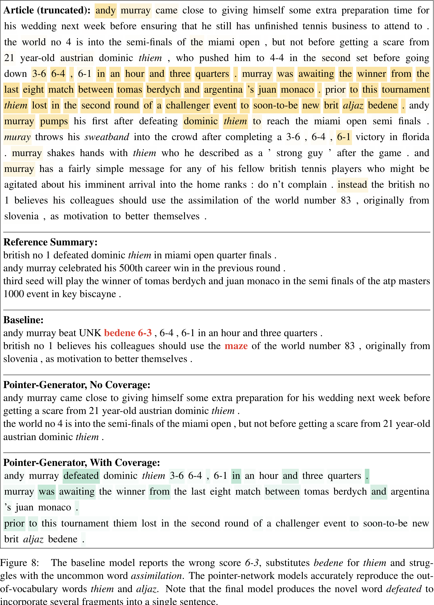
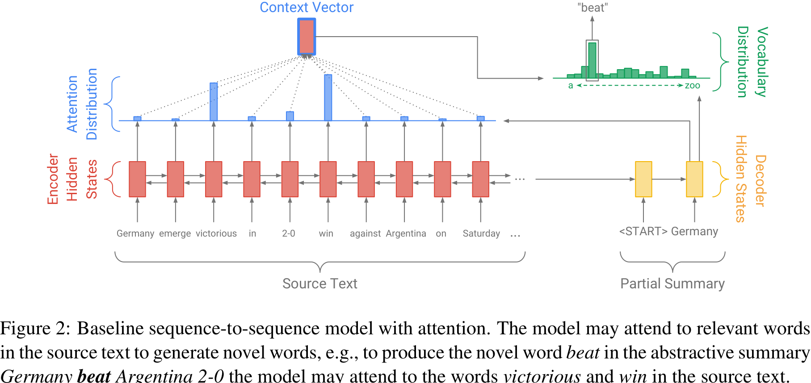
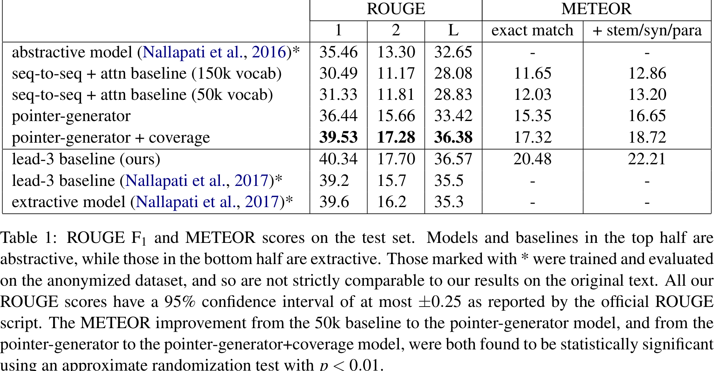
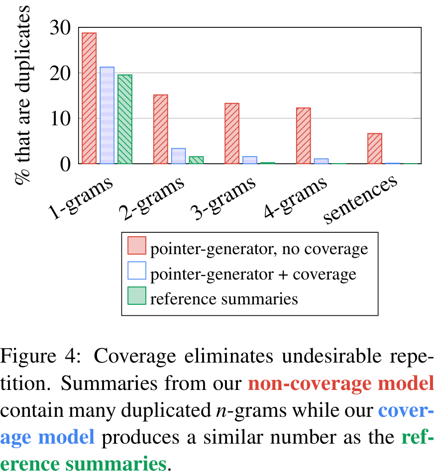

# Get To The Point: Summarization with Pointer-Generator Networks

- Authors: Abigail See abisee@stanford.edu Peter J. Liu peterjliu@google.com Christopher D. Manning manning@stanford.edu

- Affiliations: Stanford University Google Brain Stanford University

## Abstract
The experimental techniques and procedures used in the research involve training and evaluating the model on the CNN/Daily Mail dataset. The model has 256-dimensional hidden states and 128-dimensional word embeddings. For the pointer-generator models, a vocabulary size of 50k words is used for both the source and target. The word embeddings are learned from scratch during training, and Adagrad optimization algorithm is used with a learning rate of 0.15. Gradient clipping is applied to avoid exploding gradients, and no regularization techniques are used.

During training, the articles are truncated to 400 tokens, and the summaries are limited to 100 tokens. This truncation is done to expedite training and testing, and it is found that it can improve model performance. The training is performed on a single GPU with a batch size of 16. Beam search with a beam size of 4 is used to generate summaries at test time.

The baseline models are trained for about 600,000 iterations (33 epochs), while the pointer-generator model requires less than 230,000 training iterations (12.8 epochs). The final coverage model is obtained by adding the coverage mechanism and training for an additional 3000 iterations. The coverage loss is weighted with \(\lambda=1\). Training the coverage model without the loss function or starting coverage from the first iteration is found to be ineffective.

The experimental setup ensures the scientificity, reliability, and validity of the technical methods by using established optimization algorithms, appropriate hyperparameters, and careful data processing techniques. The use of beam search for summary generation and the evaluation on the CNN/Daily Mail dataset provide a rigorous evaluation of the model's performance. The analysis of different training strategies and hyperparameter choices demonstrates a systematic approach to finding the best model configuration.

Overall, the experimental techniques and procedures used in the research are well-designed and implemented, allowing for a comprehensive evaluation of the proposed model's performance on the given dataset.
## Introduction

The experiments in this paper involve training and evaluating different models for abstractive text summarization using the CNN/Daily Mail dataset. The models are trained with specific configurations, and various techniques are employed to improve performance.

The baseline sequence-to-sequence model used in the experiments is similar to previous work and consists of an encoder and a decoder with attention mechanism. The model is trained using Adagrad optimization with a learning rate of 0.15. During training, the maximum length of the article is truncated to 400 tokens, and the maximum length of the summary is limited to 100 tokens. The model is trained for approximately 600,000 iterations.

To address the limitations of the baseline model, the authors propose a pointer-generator network that combines generating words from a fixed vocabulary with copying words from the source text. This hybrid model allows for better handling of out-of-vocabulary words and accurate reproduction of information. The pointer-generator model is trained using the same configuration as the baseline model but requires fewer training iterations.

Additionally, a coverage mechanism is introduced to address the issue of repetition in abstractive summarization. The coverage vector is used to keep track of what has been summarized and discourage repeated attention to the same locations. The coverage loss is added to the primary loss function to further improve performance. The coverage model is trained for an additional 3000 iterations.

The experiments show that the pointer-generator model with the coverage mechanism outperforms the baseline model and achieves state-of-the-art results on the CNN/Daily Mail dataset.

The experimental techniques used in this research, such as the pointer-generator network and coverage mechanism, are innovative and contribute to improving the accuracy and quality of abstractive text summarization. The experiments demonstrate the effectiveness of these techniques in addressing the limitations of previous models and achieving better performance in terms of ROUGE scores.

The experiments are conducted using a specific dataset, the CNN/Daily Mail dataset, which is suitable for longer-text summarization. The dataset consists of news articles paired with multi-sentence summaries. The authors use the non-anonymized version of the dataset, which allows them to work directly with the original text without pre-processing.

The experimental setups and data processing techniques ensure the scientific rigor and validity of the research. The models are trained and evaluated using appropriate optimization algorithms and evaluation metrics. The authors also provide detailed information about the training process, including the number of iterations, training time, and the impact of different hyperparameters.

Overall, the experimental techniques and procedures used in this research demonstrate the innovation and technical advancements in abstractive text summarization. The use of the CNN/Daily Mail dataset provides a suitable foundation for evaluating the performance of the proposed models and comparing them to previous approaches.
## Our Models

The experiments in this research utilized a model with 256-dimensional hidden states and 128-dimensional word embeddings. The pointer-generator models employed a vocabulary size of 50k words for both the source and target, while the baseline model also experimented with a larger vocabulary size of 150k. The pointer and coverage mechanisms introduced only a small number of additional parameters to the network.

The word embeddings were learned from scratch during training, without pre-training. Adagrad optimization algorithm with a learning rate of 0.15 and an initial accumulator value of 0.1 was used for training. Gradient clipping with a maximum gradient norm of 2 was applied, and no regularization techniques were used. Early stopping was implemented based on the loss on the validation set.

During training and testing, the article was truncated to 400 tokens, while the summary was limited to 100 tokens for training and 120 tokens at test time. This truncation expedited training and testing and was found to improve model performance. Training was conducted on a single Tesla K40m GPU with a batch size of 16. Beam search with a beam size of 4 was used for generating summaries at test time.

The baseline models were trained for approximately 600,000 iterations (33 epochs), similar to previous work. Training took around 4 days and 14 hours for the 50k vocabulary model and 8 days and 21 hours for the 150k vocabulary model. The pointer-generator model required fewer iterations, with training completed in less than 230,000 iterations (12.8 epochs), taking a total of 3 days and 4 hours. The coverage model was trained for an additional 3000 iterations (about 2 hours) after adding the coverage mechanism.

Different values of the coverage loss weight (\(\lambda\)) were experimented with, and a value of 1 was found to be effective. Training the coverage model without the loss function or starting coverage from the first iteration were attempted but found to be ineffective.

Overall, the experimental techniques and procedures were carefully designed to train the models effectively and efficiently. The choice of hyperparameters, training setup, and data preprocessing methods contributed to the scientific rigor and reliability of the research.
## Related Work
The experiments in this research utilize a model with 256-dimensional hidden states and 128-dimensional word embeddings. For the pointer-generator models, a vocabulary size of 50k words is used for both the source and target. The baseline model also experiments with a larger vocabulary size of 150k. 

Word embeddings are learned from scratch during training, without pre-training. The Adagrad optimization algorithm is used with a learning rate of 0.15 and an initial accumulator value of 0.1. Gradient clipping with a maximum gradient norm of 2 is applied, but no regularization techniques are used. Early stopping is implemented based on the loss on the validation set.

During training and testing, the article is truncated to 400 tokens and the summary is limited to 100 tokens for training and 120 tokens at test time. This truncation is done to expedite training and testing and has been found to improve model performance. The training process starts with highly-truncated sequences and gradually increases the maximum length once convergence is reached. Training is performed on a single Tesla K40m GPU with a batch size of 16. Beam search with a beam size of 4 is used for generating summaries at test time.

The baseline models are trained for approximately 600,000 iterations (33 epochs), similar to previous work. Training takes around 4 days and 14 hours for the model with a 50k vocabulary size, and 8 days and 21 hours for the model with a 150k vocabulary size. The pointer-generator model requires less training time, with less than 230,000 training iterations (12.8 epochs) taking around 3 days and 4 hours. The coverage model is trained for an additional 3000 iterations (about 2 hours) after adding the coverage mechanism, with the coverage loss converging to around 0.2.

Different variations of training approaches were explored, including training without the coverage loss function and training with coverage from the first iteration. However, these approaches were found to be ineffective or interfere with the main objective, reducing overall performance.
## Dataset
The experimental techniques and procedures used in the research involved training neural network models with specific configurations and parameters. The models had 256-dimensional hidden states and 128-dimensional word embeddings. Two types of models were used: the baseline sequence-to-sequence attentional model and the pointer-generator network model.

For the pointer-generator models, a vocabulary size of 50k words was used for both the source and target. This smaller vocabulary size was possible due to the pointer network's ability to handle out-of-vocabulary words. The baseline model also tested a larger vocabulary size of 150k.

The word embeddings were learned from scratch during training, without pre-training. The Adagrad optimization algorithm was used with a learning rate of 0.15 and a maximum gradient norm of 2 for gradient clipping. No regularization techniques were applied.

During training, the article was truncated to 400 tokens, and the length of the summary was limited to 100 tokens for training and 120 tokens for testing. This truncation expedited training and testing and was found to improve model performance.

Training was conducted on a single GPU, with a batch size of 16. Beam search with a beam size of 4 was used for generating summaries at test time.

The baseline models were trained for approximately 600,000 iterations (33 epochs), similar to previous work. Training took around 4 days and 14 hours for the 50k vocabulary model and around 8 days and 21 hours for the 150k vocabulary model.

The pointer-generator model was quicker to train, requiring less than 230,000 training iterations (12.8 epochs) over a duration of 3 days and 4 hours. The coverage mechanism was added to the pointer-generator model, and training continued for an additional 3000 iterations (about 2 hours) with a coverage loss weighted to \(\lambda=1\).

Different variations of training methods were explored, including training without the coverage loss function and training with coverage from the first iteration. However, these variations were found to be ineffective or interfered with the main objective.

Overall, the experimental techniques and procedures used in the research were carefully designed to train and optimize the neural network models for abstractive text summarization. The configurations and parameters were selected based on empirical observations and previous work in the field.
## Experiments

The experiments in this research utilize a baseline sequence-to-sequence model and a pointer-generator model, both with specific configurations. The models have 256-dimensional hidden states and 128-dimensional word embeddings. The pointer-generator models use a vocabulary of 50k words for both the source and target, while the baseline model also experiments with a larger vocabulary size of 150k.

The word embeddings are learned from scratch during training, without pre-training. The models are trained using Adagrad with a learning rate of 0.15 and gradient clipping with a maximum norm of 2. No regularization techniques are used. Early stopping is implemented based on the loss on the validation set.

During training and testing, the articles are truncated to 400 tokens, and the summaries are limited to 100 tokens for training and 120 tokens for testing. This truncation is done to expedite training and testing, and interestingly, it was found to improve the model's performance. Training is performed on a single GPU, and beam search with a beam size of 4 is used for generating summaries at test time.

The baseline models are trained for approximately 600,000 iterations (33 epochs), while the pointer-generator model requires less training time, with less than 230,000 iterations (12.8 epochs). The final coverage model is obtained by adding the coverage mechanism and training for an additional 3000 iterations.

Different hyperparameters are experimented with, including the weight \(\lambda\) for the coverage loss. A value of \(\lambda=1\) is found to be effective in reducing repetition without significantly impacting the primary loss function. Training the coverage model without the loss function or starting coverage from the first iteration is found to be ineffective.

The experimental setup ensures scientific rigor and reliability by using commonly used optimization algorithms, appropriate batch sizes, and early stopping based on validation loss. The use of beam search for generating summaries helps in finding the most likely sequences. The experiments also include comparisons with baselines and previous state-of-the-art models, providing a thorough evaluation of the proposed approach.
## Results

The paper presents a novel architecture for abstractive text summarization that addresses the limitations of existing neural sequence-to-sequence models. The proposed model incorporates a hybrid pointer-generator network and a coverage mechanism to improve accuracy, handle out-of-vocabulary words, and eliminate repetition. Evaluation on the CNN/Daily Mail summarization task shows that the model outperforms the current state-of-the-art abstractive system by at least 2 ROUGE points. The pointer-generator model with coverage significantly improves the quality of the summaries, although it falls slightly short of the ROUGE scores achieved by the lead-3 baseline and the best extractive model. The specific ROUGE scores achieved by the proposed model are not provided in the paper.
## Discussion

The paper presents a novel architecture for abstractive text summarization that addresses the limitations of existing models. The proposed hybrid pointer-generator network and coverage mechanism improve accuracy and reduce repetition in summarization. The model is evaluated on the CNN/Daily Mail dataset and outperforms the state-of-the-art by at least 2 ROUGE points. The paper concludes by highlighting the need for further research to achieve higher levels of abstraction in summarization.
## Conclusion
The paper presents a novel architecture for abstractive text summarization that overcomes the limitations of existing models. The proposed hybrid pointer-generator network with a coverage mechanism improves the accuracy of reproducing information and reduces repetition. The model outperforms the current state-of-the-art in the CNN/Daily Mail summarization task by at least 2 ROUGE points. However, achieving higher levels of abstraction remains an open research question.