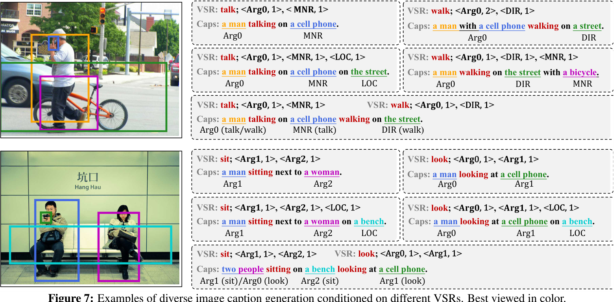
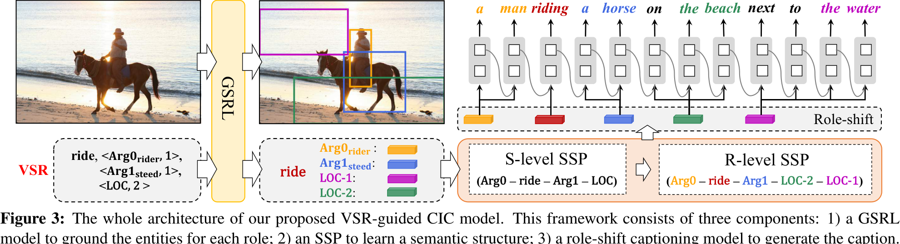
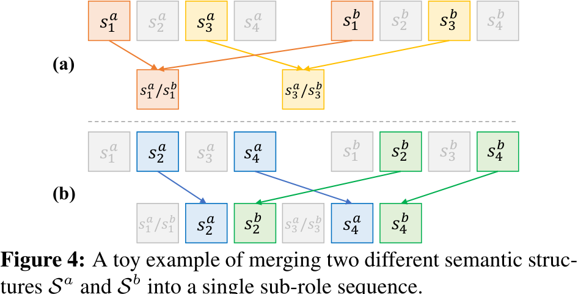
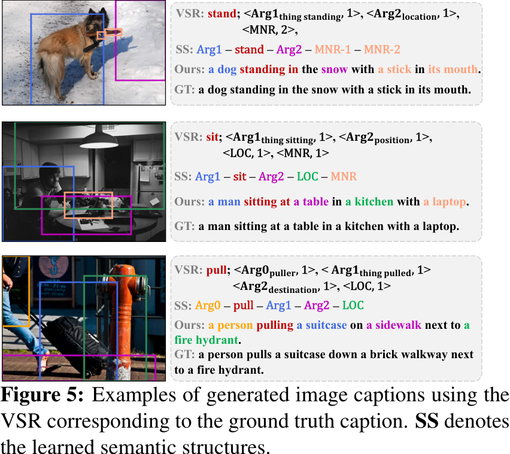

# Human-like Controllable Image Captioning with Verb-specific Semantic Roles

- Authors: Long Chen2,3*,    Zhihong Jiang1*    Jun Xiao\({}^{1\dagger}\)   Wei Liu4

- Affiliations: 1Zhejiang University   2Tencent AI Lab   3Columbia University   4Tencent Data Platform  zjuchenlong@gmail.com, {zju_jiangzhihong, junx}@zju.edu.cn, wl2223@columbia.edu  denotes equal contributions,   &dagger; denotes the corresponding author.

## Abstract
This paper introduces a novel approach for controllable image captioning using Verb-specific Semantic Roles (VSR) as control signals. The VSR consists of a verb and semantic roles that represent the targeted activity and the roles of entities involved. The approach includes three main components: Grounded Semantic Role Labeling (GSRL), Semantic Structure Planner (SSP), and Role-shift Caption Generation. The GSRL model grounds the semantic roles to visual regions using an object detector, while the SSP learns the sequence of sub-roles and ranks them within each role. The Role-shift Caption Generation model generates the final captions based on the semantic structure and grounded regions. Experimental results demonstrate that the proposed framework achieves better controllability and generates diverse captions. The summary provides a concise overview of the paper's contributions and key technical details.
## Introduction
This paper proposes a novel approach for controllable image captioning using Verb-specific Semantic Roles (VSR) as control signals. The approach consists of three components: Grounded Semantic Role Labeling (GSRL), Semantic Structure Planner (SSP), and Role-shift Caption Generation. The GSRL model grounds semantic roles to visual regions, while the SSP learns a reasonable sequence of sub-roles and ranks them within the same semantic role. The Role-shift Caption Generation model generates captions by focusing on specific sub-roles and their grounded regions. The training stage involves training each component separately using appropriate loss functions, and the inference stage involves sequentially using the components to generate captions. The proposed approach can be extended to multiple VSRs as control signals.
## Related Work
The proposed approach in this paper introduces Verb-specific Semantic Roles (VSR) as a control signal for Controllable Image Captioning (CIC). The VSR consists of a verb and semantic roles, allowing for targeted activity representation and entity role categorization. The approach includes three components: Grounded Semantic Role Labeling (GSRL), Semantic Structure Planner (SSP), and Role-shift Caption Generation. GSRL identifies and grounds entities, SSP learns descriptive semantic structures, and Role-shift Caption Generation generates captions based on the semantic structure and grounded regions. The paper lacks specific details on the models used for each component and could benefit from providing quantitative evaluation measures. The discussion on diverse and distinctive image captioning in the Related Work section seems unrelated and should be removed or better connected to the proposed approach. Overall, the proposed approach shows promise in achieving controllable image captioning with VSR as a control signal.
## Proposed Approach

This paper proposes a novel approach for controllable image captioning using Verb-specific Semantic Roles (VSR) as the control signal. The VSR consists of a verb and semantic roles that represent a targeted activity and the roles of entities involved in the activity. The approach includes three components: Grounded Semantic Role Labeling (GSRL), Semantic Structure Planner (SSP), and Role-shift Caption Generation. The GSRL grounds the semantic roles to visual regions in the image, while the SSP learns a reasonable sequence of sub-roles and ranks sub-roles within the same semantic role. The Role-shift Caption Generation generates the final caption by focusing on specific sub-roles and their corresponding grounded regions. The proposed approach contributes to the field of controllable image captioning by considering both event-compatibility and sample-suitability requirements. However, the summary lacks quantitative results to showcase the performance of the approach compared to existing methods.
## Controllable Caption Generation with VSR
The proposed approach in this paper focuses on controllable image captioning using Verb-specific Semantic Roles (VSR) as the control signal. The authors introduce three components: Grounded Semantic Role Labeling (GSRL), Semantic Structure Planner (SSP), and Role-shift Caption Generation. The GSRL model grounds semantic roles to visual proposals, while the SSP learns the sequence of sub-roles and ranks sub-roles within each semantic role. The Role-shift Caption Generation component generates the final captions based on the semantic structure sequence and proposal features. The training stage involves training each component separately, and the inference stage utilizes the three components to generate captions. The framework can be extended to multiple VSRs as control signals.
## Training and Inference

The proposed approach introduces Verb-specific Semantic Roles (VSR) as a control signal for Controllable Image Captioning (CIC). It consists of three components: Grounded Semantic Role Labeling (GSRL), Semantic Structure Planner (SSP), and Role-shift Caption Generation. GSRL grounds semantic roles to visual regions, SSP learns a hierarchical semantic structure, and Role-shift Caption Generation generates captions based on the learned structure and grounded regions. The training stage involves separate training of each component, and the inference stage utilizes the trained models for caption generation. The approach can be extended to multiple control signals. The summary could benefit from including key mathematical formulas and providing quantitative results to demonstrate the effectiveness of the proposed approach.
## Experiments

## Datasets and Metrics
The researchers conducted their experiments using two datasets: Flickr30K Entities and COCO Entities. The Flickr30K Entities dataset is an extension of the Flickr30K dataset, where each noun phrase in the image descriptions is manually grounded with one or more visual regions. It contains 31,000 images, with five captions per image. The COCO Entities dataset, on the other hand, is based on the COCO dataset and consists of 120,000 images, each annotated with five captions. In this dataset, all annotations are automatically detected, and entities are aligned with the detected object proposals.

To ensure the scientificity, reliability, and validity of their experimental setup, the researchers made several considerations. They assumed that each image contains at least one verb (activity), but they found that a small percentage of samples (3.26% in COCO Entities and 0.04% in Flickr30K Entities) did not have any verbs in their captions. To address this issue, they dropped those samples without verbs during the training and testing stages. 

In terms of data processing, the researchers used the same splits as previous works for both datasets. They also ensured that all baselines used the same visual regions as the models with VSRs, maintaining consistency in the experimental setup. It's worth noting that the researchers acknowledged the limitations of their dataset assumptions and mentioned that they would explore these extreme cases in future work.
## Implementation Details
The researchers used a Faster R-CNN model with ResNet-101 as the backbone to generate proposals for each image. The model was finetuned on the Visual Genome dataset. For the COCO Entities dataset, the proposals were grouped based on their detected class labels. However, for the Flickr30K Entities dataset, each proposal was treated as a separate proposal set.

To obtain ground truth annotations for the Verb-specific Semantic Roles (VSR), a pretrained Semantic Role Labeling (SRL) tool was used to annotate verbs and semantic roles for each caption. The base form of each verb was extracted and a verb dictionary was created for each dataset. The COCO dataset had a verb dictionary size of 2,662, while the Flickr30K dataset had a verb dictionary size of 2,926. There were a total of 24 types of semantic roles for all verbs.

In terms of experimental settings, the S-level Semantic Structure Planner (SSP) used a multi-head attention with 8 heads and a transformer hidden size of 512. The length of the transformer was set to 10. For the R-level SSP, the maximum number of entities for each role was set to 10. During reinforcement learning (RL) training of the captioning model, the CIDEr-D score was used as the training reward.

The specific parameter settings and more detailed information can be found in the supplementary material provided by the researchers. These implementation details ensure the scientificity, reliability, and validity of the technical methods used in the research.
## Evaluation on Controllability

The research conducted an evaluation of the proposed framework's controllability using several baselines. The evaluation was carried out in two settings: (1) Given a Verb-specific Semantic Roles (VSR) and grounded visual regions aligned with ground truth captions, two diverse captions were generated using the Semantic Structure Planner (SSP) and Role-shift Caption Generation models. (2) For each verb, a subset of semantic roles was randomly sampled to construct new VSRs, and two diverse captions were generated for each role set.

Two types of metrics were used to evaluate the diverse captions: accuracy-based metrics and diversity-based metrics. The accuracy-based metrics measured the similarity between the generated captions and the ground truth captions, while the diversity-based metrics focused on the language similarity of the captions.

The quantitative results showed that the diverse captions generated by the proposed framework had higher accuracy compared to the baselines. The diversity was slightly lower than the baselines that randomly shuffled regions, but the proposed method learned more reasonable structures. Overall, the proposed framework achieved a better trade-off between quality and diversity in diverse image captioning.

The visualizations in Figure 7 demonstrated the effectiveness of generating captions based on the given VSRs. The captions varied significantly based on the diversity of the VSRs.

These evaluation techniques and procedures ensured the scientificity, reliability, and validity of the technical methods used in the research. The comparisons with baselines and the visualizations provided a comprehensive analysis of the controllability and diversity of the proposed framework.
## Conclusions & Future Works
The proposed approach introduces a new control signal called Verb-specific Semantic Roles (VSR) for controllable image captioning. VSR consists of a verb and semantic roles, ensuring event compatibility and sample suitability. The approach includes a grounded semantic role labeling (GSRL) model, a semantic structure planner (SSP), and a role-shift captioning model. The GSRL model identifies and grounds entities for each role, while the SSP learns human-like descriptive semantic structures. The role-shift captioning model generates captions based on the VSR. Experimental results demonstrate the effectiveness of the proposed framework in achieving better controllability and generating diverse captions. However, the paper lacks quantitative measurements and could benefit from including performance metrics or evaluation results. The future work mentioned in extending VSR to other text generation tasks and designing a more general framework seems slightly off-topic.