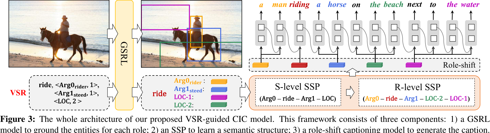

## Abstract

## Introduction

## Related Work

## Proposed Approach

### Controllable Caption Generation with VSR

### Training and Inference

## Experiments

### Datasets and Metrics

### Implementation Details

### Evaluation on Controllability

## Conclusions & Future Works

## References