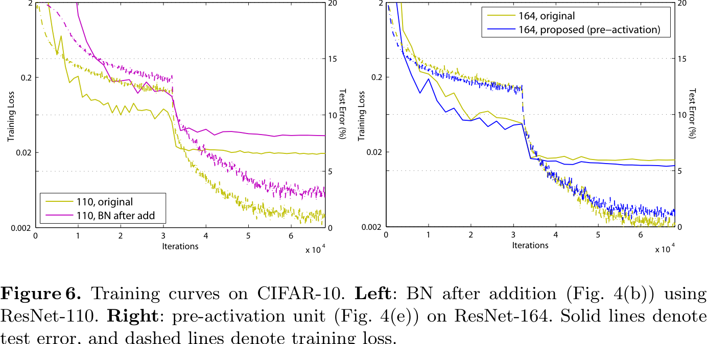
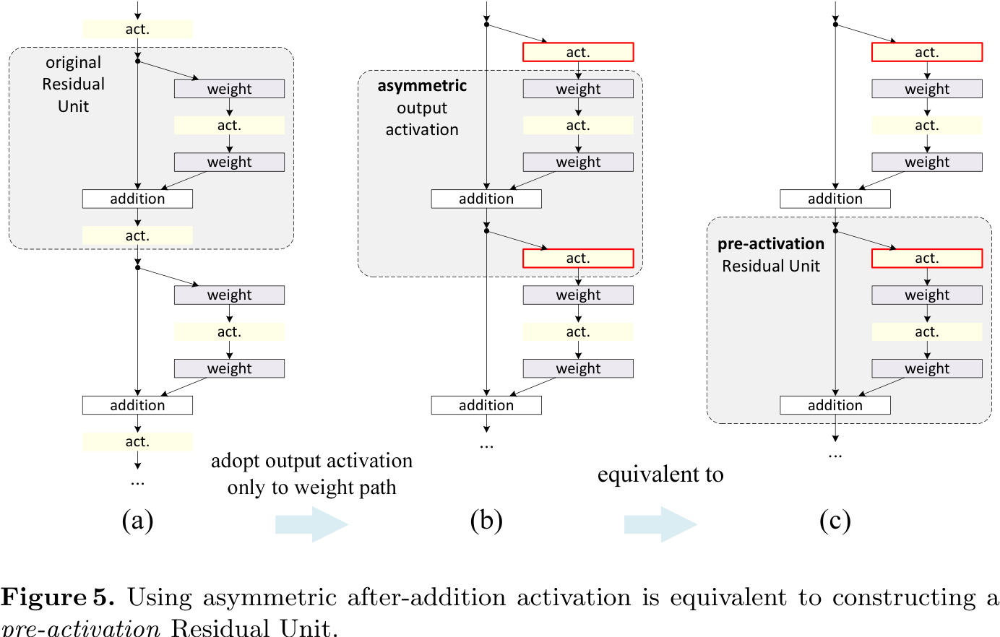
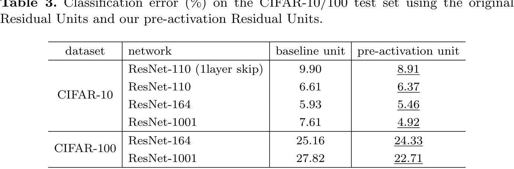
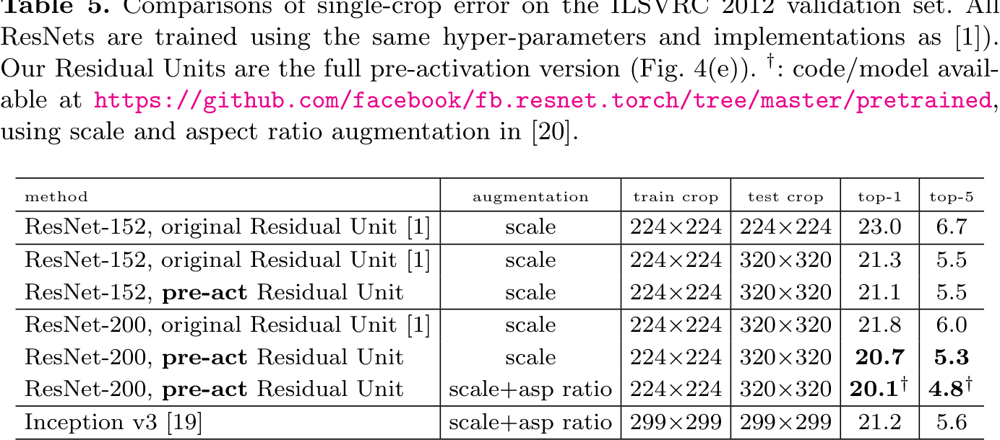
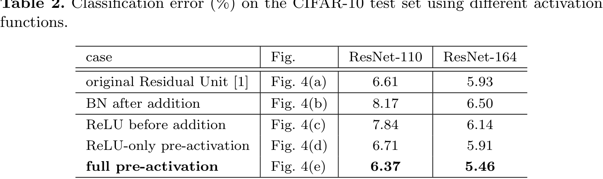
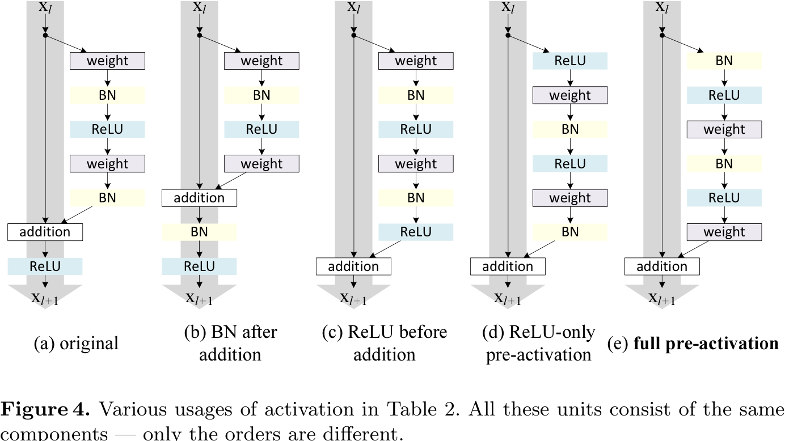
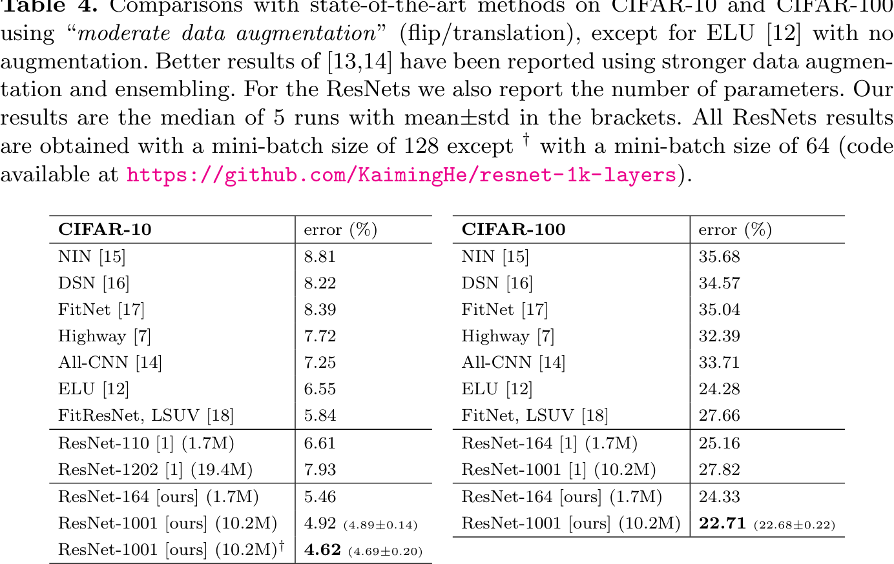

# Analysis of Deep Residual Networks

## Analysis of Deep Residual Networks

In this section, the paper investigates the impact of different activation functions on the performance of deep residual networks. The experiments conducted in the previous section assumed ReLU as the activation function after addition. To explore the effect of different activation functions, the authors rearrange the activation functions in the Residual Unit. The original configuration uses batch normalization (BN) after each weight layer and ReLU after BN, with the last ReLU after element-wise addition. The paper presents alternative configurations and evaluates their performance.
## On the Importance of Identity Skip Connections

In this section, the paper examines the impact of different activation functions on the performance of Residual Networks. The experiments conducted in the previous section were based on the assumption that the after-addition activation is the identity mapping. However, since ReLU was used as the activation function in those experiments, the derived equations were only approximate. The paper investigates the effect of making the activation function an identity mapping by rearranging the activation functions (ReLU and/or BN). Different alternatives are explored and analyzed.
### Experiments on Skip Connections

In the "On the Usage of Activation Functions" section, the paper investigates the impact of different activation functions on deep residual networks. The experiments focus on rearranging the activation functions to make \(f\) an identity mapping. The results demonstrate that this arrangement leads to improved performance in terms of training error and test accuracy. The alternative arrangements considered include using ReLU before BN, removing ReLU after addition, and exploring other activation functions such as sigmoid and tanh.
### Discussions

The "On the Usage of Activation Functions" section investigates the impact of different activation functions in Residual Networks. The experiments analyze the effect of changing the activation function to achieve an identity mapping. The original Residual Unit architecture uses ReLU after Batch Normalization, with the last ReLU after element-wise addition. Alternative configurations are explored to understand the role of activation functions in optimization and information propagation. This analysis contributes to a deeper understanding of activation functions in Residual Networks.
## On the Usage of Activation Functions

In this section, the authors experiment with different activation functions in ResNet-110 and ResNet-164 architectures. They explore the effects of batch normalization (BN) and ReLU on the performance of the models.

First, they investigate the placement of BN in the network. By placing BN after the addition operation, they observe that the signal passing through the shortcut is altered, leading to worse results compared to the baseline.

Next, they consider moving the ReLU activation before the addition operation. However, this results in a non-negative output from the transform function, which contradicts the intuition of a residual function that should take values in the range of (-∞, +∞). Consequently, the forward propagated signal becomes monotonically increasing, leading to inferior performance compared to the baseline.

The authors then explore an asymmetric form of the activation function, where an activation only affects the path involving the transform function. This new design, called pre-activation, is achieved by recasting the activation as the pre-activation of the next Residual Unit. They experiment with two pre-activation designs: one with only ReLU as the pre-activation and another with both BN and ReLU as pre-activations. Surprisingly, the results show significant improvements when both BN and ReLU are used as pre-activations.

The authors report improved performance for various architectures, including ResNet-110, ResNet-164, a modified ResNet-110 with each shortcut skipping only 1 layer, and a 1001-layer bottleneck architecture. These "pre-activation" models consistently outperform their baseline counterparts.

Overall, this section highlights the importance of activation functions and their placement in ResNet architectures. The experiments demonstrate that using both BN and ReLU as pre-activations leads to improved performance compared to other configurations.
## Results

The major findings of the research are as follows:

1. Comparisons on CIFAR-10/100: The paper achieves competitive results on CIFAR-10/100 datasets without specifically tailoring the network width or using regularization techniques. The results demonstrate the potential of going deeper in neural networks to achieve better performance.

2. Comparisons on ImageNet: Preliminary experiments on ImageNet with non-identity shortcut networks show higher training error compared to the original ResNet. However, due to limited resources, the training was halted. The results on ImageNet are in line with the results on CIFAR, indicating the optimization difficulties faced by non-identity shortcut networks.

3. Computational Cost: The computational complexity of the models is linear with respect to depth. For example, a 1001-layer net is approximately 10 times more complex than a 100-layer net. The training time for ResNet-1001 on CIFAR is around 27 hours on 2 GPUs, while ResNet-200 on ImageNet takes about 3 weeks to train on 8 GPUs, which is comparable to VGG nets.

These findings validate the effectiveness of deep residual networks in achieving improved performance on image classification tasks. The experiments demonstrate that increasing the depth of the network can lead to better results, and even though non-identity shortcut connections introduce more parameters, they suffer from optimization difficulties. The research contributes to the understanding of the importance of identity skip connections in deep residual networks and provides insights into the challenges and benefits of increasing network depth.
## Conclusions

The "On the Importance of Identity Skip Connections" section of the paper emphasizes the significance of identity skip connections in deep residual networks. The authors discuss the direct propagation of information through these connections and the conditions required for smooth information flow. They experiment with various modifications to the skip connections and find that these modifications hinder information propagation and lead to optimization problems. The authors conclude that identity skip connections and identity after-addition activation are crucial for ensuring smooth information propagation in deep residual networks. Their findings contribute to understanding the importance of identity skip connections in deep learning architectures.