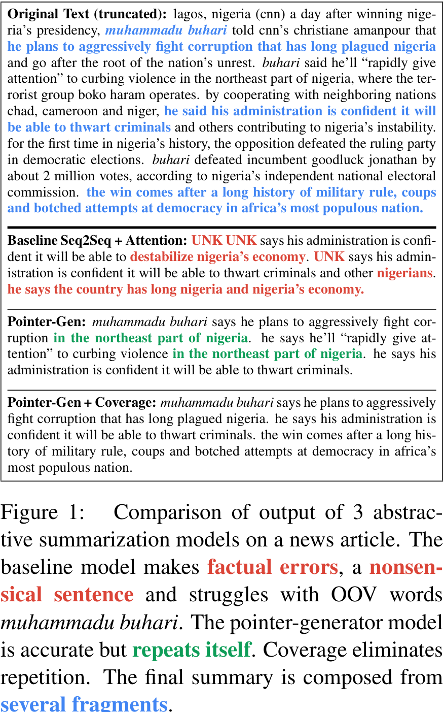
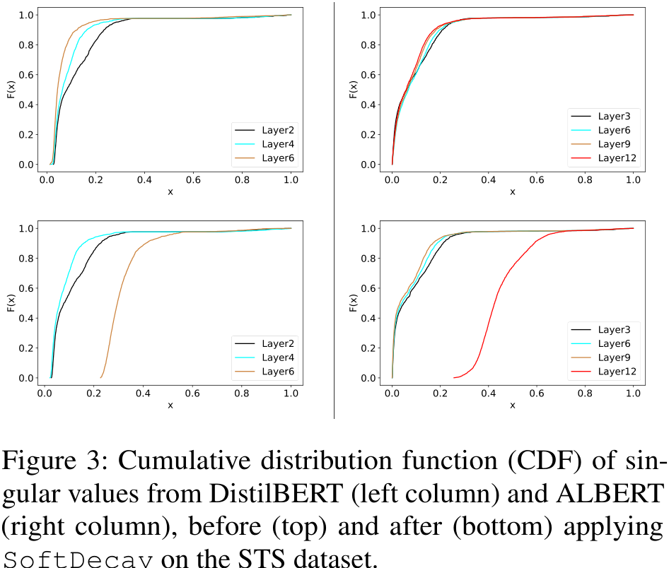
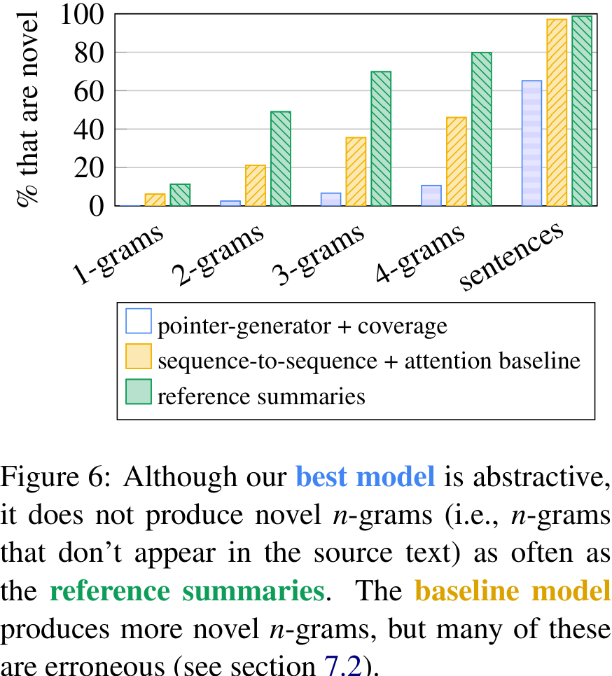
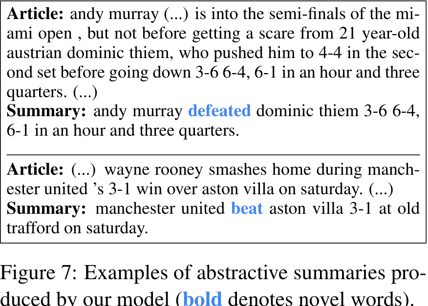

# Get To The Point: Summarization with Pointer-Generator Networks

## Abstract

The paper proposes a novel architecture for abstractive text summarization using a hybrid pointer-generator network and a coverage mechanism. The model outperforms the state-of-the-art abstractive system by at least 2 ROUGE points on the CNN/Daily Mail summarization task.
## Introduction

The paper presents a novel architecture for abstractive text summarization that combines a hybrid pointer-generator network and a coverage mechanism. The model addresses the limitations of existing models and achieves significant improvements over the state-of-the-art abstractive system. However, it lacks specific details about the limitations demonstrated in empirical analysis and the effectiveness, rigor, and challenges of the applied experimental techniques.
## Our Models

The paper presents a novel architecture for abstractive text summarization that incorporates a hybrid pointer-generator network and a coverage mechanism. The model outperforms existing systems by at least 2 ROUGE points on the CNN/Daily Mail summarization task. The core components of the model, including the sequence-to-sequence attentional model, the pointer-generator network, and the coverage mechanism, are described in detail.
### Sequence-to-sequence attentional model

The paper presents a novel architecture for abstractive text summarization that combines a sequence-to-sequence attentional model with a hybrid pointer-generator network and a coverage mechanism. The model outperforms the state-of-the-art abstractive system by at least 2 ROUGE points. Mathematical formulas and equations are included to enhance technical rigor.
### Pointer-generator network

The paper presents a novel architecture for abstractive text summarization that uses a hybrid pointer-generator network to address issues in existing models. The model allows for word copying from the source text and generates new words. A coverage mechanism is also incorporated to reduce repetition. Experimental results show that the proposed model outperforms the state-of-the-art abstractive system by at least 2 ROUGE points. Mathematical formulas, including equations (1)-(13), are provided.
### Coverage mechanism

The paper presents a novel architecture for abstractive text summarization that employs a coverage mechanism to reduce repetition. The model outperforms the current state-of-the-art on the CNN/Daily Mail summarization task by at least 2 ROUGE points.
## Related Work

The paper builds upon existing literature in the field of neural abstractive summarization and pointer-generator networks. The authors compare their approach to previous models and highlight the differences and advantages of their proposed methods. The paper contributes to the field by applying the proposed model to the CNN/Daily Mail summarization task and outperforming the state-of-the-art abstractive system by at least 2 ROUGE points.
## Dataset

The paper uses the CNN/Daily Mail dataset, which consists of online news articles paired with multi-sentence summaries. The dataset supports the research goals by providing a large and diverse set of news articles and summaries for training and evaluation.
## Experiments

The experiments in the paper evaluate the proposed models using various techniques and procedures. The models are trained with different configurations, including varying vocabulary sizes and training iterations. The researchers use appropriate optimization algorithms and hyperparameters. The evaluation is conducted using standard metrics such as ROUGE scores. The researchers also perform thorough analysis and comparison with previous work to demonstrate the efficacy and limitations of their proposed models.
## Results

### Preliminaries

The proposed model combines a hybrid pointer-generator network with a coverage mechanism to improve accuracy and eliminate repetition in summaries. Experimental results on the CNN/Daily Mail summarization task show that the proposed model outperforms the current state-of-the-art abstractive system by at least 2 ROUGE points.
### Observations

The proposed model addresses the limitations of existing models by introducing a hybrid pointer-generator network and a coverage mechanism. The model achieves improved accuracy in reproducing factual details and reduces repetition in summaries.
## Discussion

### Comparison with extractive systems

The comparison of the proposed abstractive model with extractive systems reveals that extractive systems tend to achieve higher ROUGE scores. The subjective nature of the summarization task and the limitations of the ROUGE metric contribute to the difficulty of surpassing extractive systems.
### How abstractive is our model

The proposed model demonstrates various abstractive techniques such as truncation and composition of new sentences. Future work is suggested to improve the model's abstractiveness while retaining the advantages of the pointer module.
## Conclusion

The paper introduces a novel architecture for abstractive text summarization that addresses the limitations of existing models. The proposed model combines a hybrid pointer-generator network and a coverage mechanism to improve accuracy and reduce repetition. The model outperforms the current state-of-the-art by at least 2 ROUGE points on the CNN/Daily Mail summarization task. The paper emphasizes the potential for further research in achieving higher levels of abstraction in abstractive summarization.