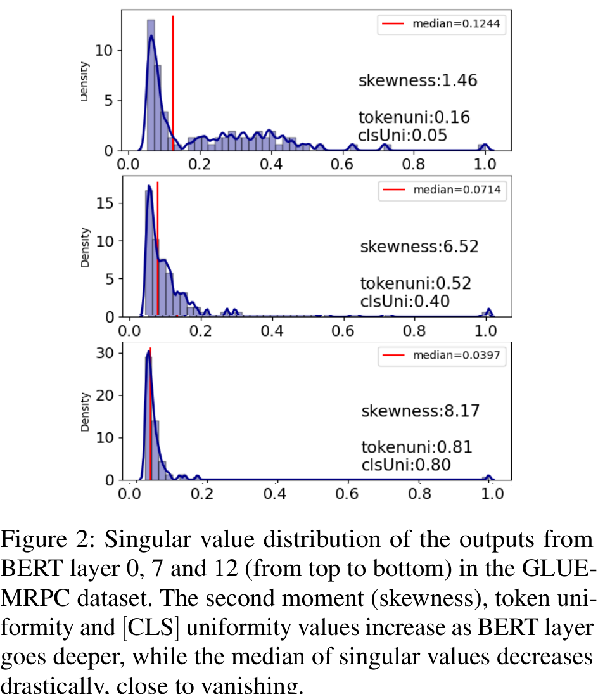
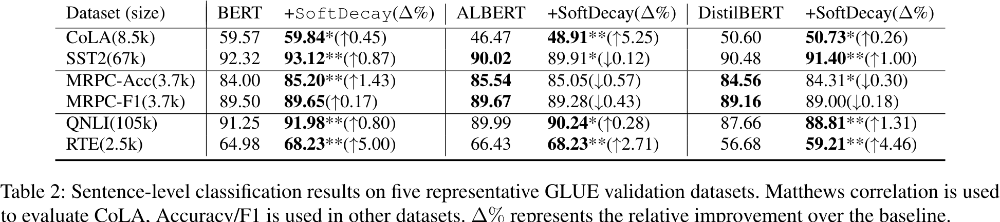
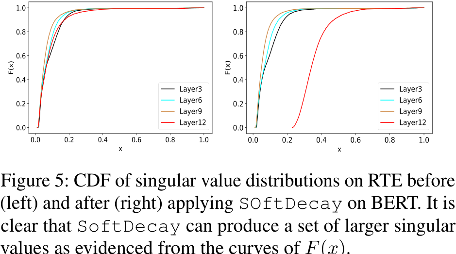
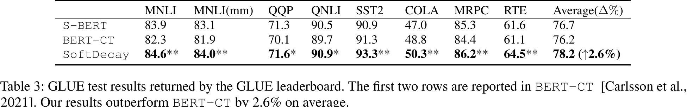
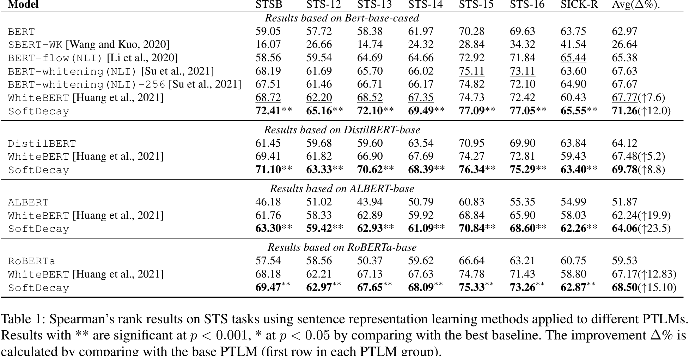

# Addressing Token Uniformity in Transformers via Singular Value Transformation

## Abstract

The "Singular Value Distribution of Transformer Block Outputs" section investigates the token uniformity problem in transformer-based language models. It explores the geometric interpretation of vanishing singular values and presents a theorem establishing a bound on the difference between token embeddings. The empirical study on BERT demonstrates the increasing degree of token uniformity with network depth, as indicated by skewed singular value distributions. This section highlights the significance of singular value distribution in understanding and addressing token uniformity.
## Introduction

The "Singular Value Distribution of Transformer Block Outputs" section explores the token uniformity problem in transformer-based models. The authors propose a novel approach to studying token uniformity by analyzing the distribution of singular values in the transformer-encoded hidden states. They provide a geometric interpretation and show that the embedding space is bounded by the largest singular value and an upper bound on the small singular values. Through an empirical study using BERT, they demonstrate that the singular value distribution becomes steeper with increasing network depth, indicating a higher degree of token uniformity. The gradual vanishing of smaller singular values is also observed. These findings suggest that the skewness of singular value distributions is indicative of token uniformity.
## Related Work

The "Singular Value Distribution of Transformer Block Outputs" section explores the token uniformity problem in transformer-based language models. The authors propose a novel approach to studying token uniformity by analyzing the distribution of singular values of the representation matrix in transformers. They provide a geometric interpretation and derive a theorem that bounds the embedding space based on singular values. An empirical study on BERT demonstrates that the singular value distribution becomes steeper with increasing network depth, indicating a higher degree of token uniformity. The findings emphasize the significance of the skewness of singular value distributions in understanding and addressing token uniformity.
## Singular Value Distribution of Transformer Block Outputs

The "Singular Value Distribution of Transformer Block Outputs" section of the paper investigates the token uniformity problem in transformer-based language models. The authors propose a novel approach to studying token uniformity by analyzing the distribution of singular values in the representation matrix of a deep network. They provide a geometric interpretation of the problem, showing that the embedding space is bounded by the largest singular value and an upper bound on the small singular values. The authors conduct an empirical study on BERT and demonstrate that the singular value distribution becomes steeper with increasing network depth, indicating a higher degree of token uniformity. They also observe the gradual vanishing of smaller singular values in deeper layers. The results highlight the significance of the skewness of singular value distributions in measuring token uniformity.
### Singular Value Vanishing in Transformer

The "Singular Value Distribution of Transformer Block Outputs" section explores the phenomenon of token uniformity in transformer-based models. The authors propose a novel approach to characterize token uniformity by studying the distribution of singular values in the outputs of each transformer layer. They emphasize the importance of preserving the local neighborhood structure while alleviating token uniformity. The section includes a geometric interpretation of the problem of vanishing singular values and presents empirical evidence of token uniformity in BERT. The results show that as the network depth increases, the singular value distribution becomes more skewed, indicating a higher degree of token uniformity. The findings highlight the need to address token uniformity and provide insights into the shape of the embedding space in transformers.
### Empirical Study of Token Uniformity in Bert

The "Singular Value Distribution of Transformer Block Outputs" section explores the token uniformity problem in transformer-based language models. The authors propose a novel approach to understanding the singular value distribution by performing Singular Value Decomposition (SVD) on the representation matrix. They establish a bound that shows how the embedding space is bounded by the largest singular value and an upper bound for small singular values. The authors conduct an empirical study on BERT, demonstrating that as the network depth increases, the singular value distribution becomes steeper, indicating a higher degree of token uniformity. The results highlight the significance of the skewness of singular value distributions in assessing token uniformity.
## Transformation Function

In the "Transformation Function" section, the paper focuses on designing a desirable singular value transformation function to address the token uniformity problem. The desired properties of the transformation function are discussed, including reducing skewness and preserving the local neighborhood structure. The paper proposes a novel singular value transformation function and applies it to popular transformer-based language models (BERT, ALBERT, RoBERTa, and DistilBERT). The improved performance is observed in semantic textual similarity evaluation and a range of GLUE tasks. However, specific details about the proposed transformation function and its application are not provided in this section.
### Motivation

In this section, the paper introduces a novel transformation function to address the token uniformity problem by adjusting the skewness of singular value distributions. The motivation behind this transformation function is to modify small singular values and prevent dimension vanishing, which is a common issue in existing normalization methods.

The proposed transformation function aims to alleviate the token uniformity problem by modifying the singular value distribution. Unlike previous normalization methods that only preserve the trace of the covariance matrix, this transformation function controls higher moments of the distribution, such as the skewness. By adjusting the skewness, the function ensures a more balanced distribution of singular values and avoids a large imbalance.

The key technical details of the transformation function are not explicitly mentioned in this section but are likely explained in subsequent sections of the paper. However, the significance of this transformation function lies in its ability to address the token uniformity problem by adjusting the distribution of singular values. This innovation contributes to the field by providing a new approach to mitigate token uniformity and improve the performance of transformer-based models in various NLP tasks.
### Properties of desirable singular value transformation

The "Properties of desirable singular value transformation" section discusses the properties that an ideal singular value transformation function should possess to alleviate the token uniformity problem in PTLMs. The authors propose three desirable properties for the transformation function: (1) monotonicity, where the function should preserve the original order of the singular values; (2) balance, where smaller singular values should have larger increments to reduce the gap between larger and smaller singular values; and (3) preservation of the largest singular value, where the function should keep the largest singular value unchanged. These properties ensure that the transformed singular value distribution is more balanced while preserving the important characteristics of the original data manifold.
### Softdecay Function

The "Transformation Function" section of the paper introduces the evaluation criteria for the transformed features. The authors argue that the evaluation should consider both the uniformity and the preservation of the local neighborhood structure in the original embedding space.

To measure the distribution uniformity, three methods are proposed. The first method, called "TokenUni," calculates the cosine similarity between transformed features. The second method uses the Radial Basis Function (RBF) kernel to measure feature similarity. The third method, called "EV\({}_{k}\)," compares the variances in different directions or singular values.

For evaluating the preservation of the local neighborhood structure, the authors propose the Local Structure Discrepancy Score (LSDS). This score measures how well the transformed feature preserves the linear combination of its original neighbors in the transformed space.

These evaluation criteria provide a comprehensive assessment of the transformed features, considering both their uniformity and their ability to preserve the local neighborhood structure.
### Transformed Feature Evaluation

The "Transformation Function" section of the paper focuses on evaluating the transformed features in terms of uniformity and the preservation of the local neighborhood structure in the original embedding space.

To measure distribution uniformity, the paper proposes three methods. The first method, called "TokenUni," measures the cosine similarity between transformed features. The second method uses the Radial Basis Function (RBF) kernel to calculate feature similarity. The third method, called "EV\({}_{k}\)" (Explained Variance), compares the difference of variances in different directions or singular values. A high value of EV\({}_{k}\) indicates a more isotropic embedding space.

To assess the preservation of the local neighborhood structure, the paper introduces the Local Structure Discrepancy Score (LSDS). LSDS measures how well the transformed features maintain their relationships with their original neighbors in the transformed space. It calculates the Euclidean distance between a transformed feature and the linear combination of its original neighbors in the transformed space.

These evaluation metrics provide a comprehensive assessment of the transformed features, considering both their uniformity and preservation of local structure.

The significance of these technical details lies in their ability to evaluate the quality of the transformation function. By measuring uniformity and preserving local structure, researchers can determine if the transformation function successfully addresses the token uniformity problem while maintaining important information in the original embedding space. These metrics contribute to the understanding and improvement of text representation learning.
## Experiments

The experimental section of the paper focuses on implementing the proposed transformation functions on four transformer-based Pre-Trained Language Models (PTLMs): BERT, ALBERT, RoBERTa, and DistilBERT. The evaluation is conducted on semantic textual similarity (STS) datasets and General Language Understanding Evaluation (GLUE) tasks.

To ensure the scientificity, reliability, and validity of the experimental methods, the authors provide model training details and additional results in the supplementary material. This allows for transparency and reproducibility of the experiments.

The specific experimental setups, data acquisition, and processing techniques are not explicitly mentioned in this section. However, it can be inferred that the PTLMs are pretrained on large-scale datasets and fine-tuned on specific tasks. The evaluation metrics used for the semantic textual similarity datasets and GLUE tasks are not specified in this section but are likely to be standard metrics used in NLP research.

Overall, the experimental section plays a crucial role in validating the effectiveness of the proposed transformation functions. By applying these functions to various PTLMs and evaluating their performance on different tasks, the authors demonstrate the practical applicability and generalizability of their approach.
### Unsupervised Evaluation on STS

The paper conducts unsupervised evaluations on the Semantic Textual Similarity (STS) task to assess the effectiveness of the proposed SoftDecay method in addressing token uniformity. The experiments are performed on seven STS datasets, including SICK-R and various STS tasks. The paper compares SoftDecay with other unsupervised methods for adjusting anisotropy in STS tasks, such as BERT-flow, SBERT-WK, BERT-whitening, and WhiteBERT.

The results in Table 1 show that SoftDecay outperforms the baselines significantly, with a 23.5% improvement over the base PTLMs and a 5% improvement over the best baseline on BERT-based methods. Whitening-based methods, which transform representations to be perfectly isotropic, also perform well. The improvements are more significant for ALBERT-based models (23%) compared to DistilBERT-based models (8%), as token uniformity is more likely to occur in deeper models.

To understand how SoftDecay alleviates token uniformity, the paper visualizes the cumulative density functions (CDF) of singular values from DistilBERT and ALBERT before and after applying SoftDecay. It is observed that the singular value distribution of the last layer output of ALBERT becomes less skewed after applying SoftDecay, indicating the mitigation of token uniformity.

Additionally, the paper evaluates the characteristics of desirable features for the STS task using t-SNE visualization and proposed metrics. BERT-Whitening transforms features into a perfectly isotropic distribution but fails to preserve the local neighborhood structure. SoftDecay significantly improves uniformity while maintaining a similar distribution shape and preserving the local neighborhood structure, leading to superior results.

Overall, the experimental techniques involve comparing different methods on STS datasets, analyzing singular value distributions, and evaluating feature characteristics. These techniques provide empirical evidence for the effectiveness of SoftDecay in addressing token uniformity and preserving desirable feature properties.
### Supervised Evaluation on Glue Datasets

The authors conducted supervised evaluations on five sentence-level classification datasets from the GLUE benchmark. These datasets include grammar acceptability assessment (CoLA), sentiment classification (SST2), paraphrase detection (MRPC), natural language inference (QNLI), and recognizing textual entailment (RTE). To evaluate their proposed method, SoftDecay, the authors applied it on top of the last encoder layer in BERT, ALBERT, and DistilBERT models, and fine-tuned the weights along with the hyperparameter \(\alpha\) for different tasks.

In addition to the PTLMs, two baselines were included for comparison: Sentence-BERT (S-BERT) and BERT-CT. S-BERT adds a pooling operation to the output of BERT to derive a sentence embedding and fine-tunes a siamese BERT network structure on sentence pairs. BERT-CT incorporates contrastive loss in the training objective to retain a semantically distinguishable sentence representation.

The authors submitted the trained models to the GLUE leaderboard to obtain the test results, as the GLUE dataset does not release the test set. The test results returned by the leaderboard are shown in Table 3.

The results indicate that SoftDecay is more effective on BERT-based models compared to DistilBERT. BERT performs better than the other models on most single-sentence tasks, except for MRPC (sentence-pair paraphrase detection). All three models achieve better results on inference tasks, particularly on the smaller RTE dataset. The effectiveness of SoftDecay is further supported by the cumulative distribution function (CDF) of singular value distributions on RTE before and after applying SoftDecay.

The authors also observed that models trained on larger training sets tend to generate more similar representations. On MRPC, SoftDecay is effective on BERT but slightly reduces performance on ALBERT and DistilBERT, possibly due to the smaller training set size. Overall, SoftDecay outperforms both S-BERT and BERT-CT across all tasks in the GLUE test results.
## Conclusion and Future Work

The paper addresses the issue of token uniformity in transformer-based models, where tokens share similar information after going through self-attention layers. The authors propose using the distribution of singular values to characterize token uniformity and introduce a transformation function to alleviate the problem. They demonstrate the effectiveness of their method in improving the performance of transformer-based language models. Future research directions include exploring the application of the proposed method in encoder-decoder structures and language generation tasks.