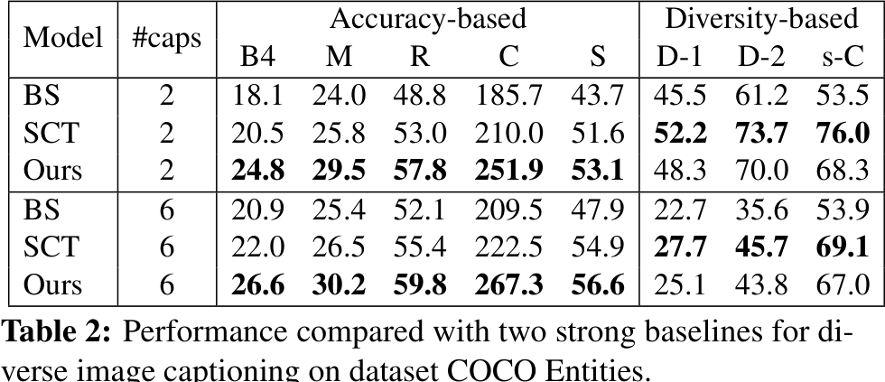
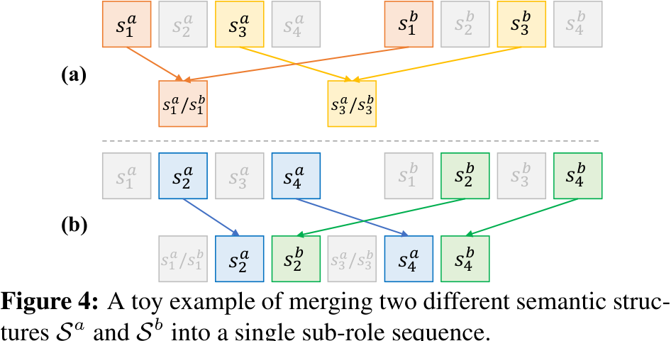
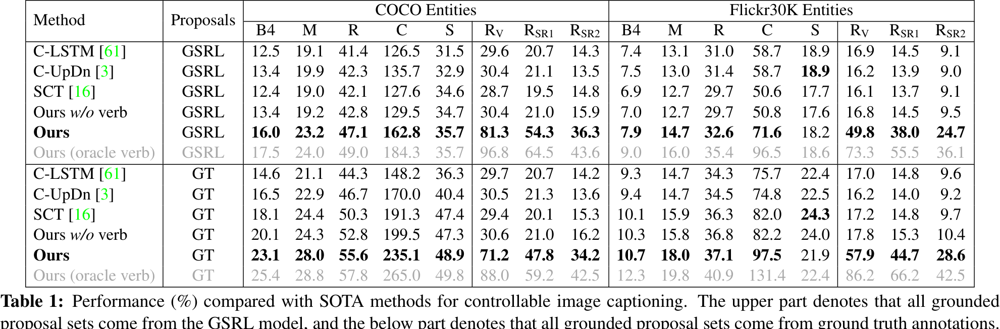
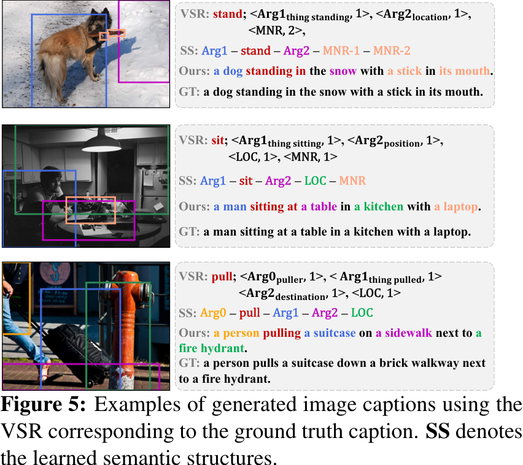
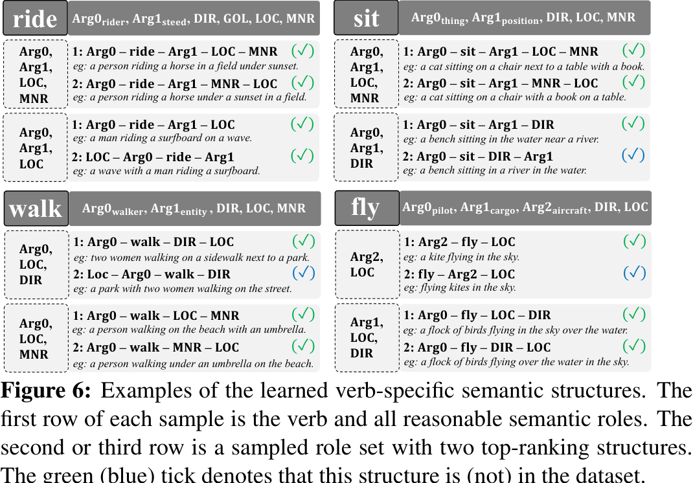

# Human-like Controllable Image Captioning with Verb-specific Semantic Roles

## Abstract

This paper proposes a novel approach for controllable image captioning using Verb-specific Semantic Roles (VSR) as control signals. The VSR consists of a verb and semantic roles that represent the targeted activity and the roles of entities involved in the activity. The proposed approach consists of three components: Grounded Semantic Role Labeling (GSRL), Semantic Structure Planner (SSP), and Role-shift Caption Generation. The GSRL component uses an object detector to extract object proposals from the image and calculates a similarity score between each semantic role and proposal set. The SSP component includes an S-level SSP and an R-level SSP to learn a sequence of general semantic roles and rank sub-roles within the same semantic role. Sinkhorn networks are used to learn a soft permutation matrix for ranking the sub-roles. The Role-shift Caption Generation component generates the final caption based on the semantic structure sequence and proposal feature sequence. An adaptive attention mechanism is used to control the shift of sub-roles, and a two-layer LSTM is employed to generate words based on the focused sub-role and grounded region set. The proposed framework can generate captions based on one or multiple VSRs as control signals, achieving better controllability and generating diverse captions.
## Introduction

The paper proposes a novel approach for controllable image captioning using Verb-specific Semantic Roles (VSR) as control signals. The VSR consists of a verb and semantic roles that represent a targeted activity and the roles of entities involved in the activity. The proposed approach consists of three components: Grounded Semantic Role Labeling (GSRL), Semantic Structure Planner (SSP), and Role-shift Caption Generation. The GSRL component uses an object detector to extract object proposals from the image and calculates a similarity score between each semantic role and proposal set. The SSP component includes an S-level SSP and an R-level SSP, which learn a sequence of general semantic roles and rank sub-roles within the same semantic role, respectively. The Role-shift Caption Generation component generates the final captions by focusing on specific sub-roles and their grounded region sets. The training stage involves training each component separately using specific objectives, while in the testing stage, the framework can be extended to multiple VSRs as control signals. The proposed approach offers better controllability in generating customized captions and enables the generation of diverse captions. Experimental results on challenging benchmarks demonstrate the effectiveness of the proposed framework.
## Related Work

The proposed approach focuses on controllable image captioning using Verb-specific Semantic Roles (VSR) as the control signal. It consists of three main components: Grounded Semantic Role Labeling (GSRL), Semantic Structure Planner (SSP), and Role-shift Caption Generation. GSRL utilizes an object detector to extract object proposals and calculates a similarity score between semantic roles and proposal sets. SSP includes an S-level SSP and an R-level SSP to learn the sequence of semantic roles and rank sub-roles within each role. Role-shift Caption Generation generates captions based on the learned semantic structure and grounded region features. The approach can be extended to handle multiple VSRs as control signals.
## Proposed Approach

This paper presents a novel approach, Verb-specific Semantic Roles (VSR), for controllable image captioning. VSR is a control signal that considers event-compatibility and sample-suitability requirements. The proposed approach consists of three components: Grounded Semantic Role Labeling (GSRL), Semantic Structure Planner (SSP), and Role-shift Caption Generation. GSRL grounds semantic roles to visual regions, SSP learns the semantic structure of the sentence, and Role-shift Caption Generation generates the final captions. Each component is trained separately with specific objectives, and a two-stage training scheme is used for the captioning model. In the testing stage, the framework can be extended to multiple VSRs.
## Experiments

The research utilizes two benchmark datasets: Flickr30K Entities and COCO Entities. The datasets contain images with associated captions, and the annotations include semantic roles and visual regions. The proposed approach is evaluated on these datasets using metrics such as BLEU, METEOR, CIDEr, and ROUGE. The results show that the proposed approach outperforms baselines in terms of controllability and caption diversity.
## Conclusions & Future Works

This paper proposes a novel approach for controllable image captioning using Verb-specific Semantic Roles (VSR) as control signals. The proposed approach consists of three components: Grounded Semantic Role Labeling (GSRL), Semantic Structure Planner (SSP), and Role-shift Caption Generation. Experimental results demonstrate the effectiveness of the proposed approach in achieving better controllability and generating diverse captions. Future work includes improving the captioning model, extending VSR to other tasks, and designing a more general framework for images without verbs.