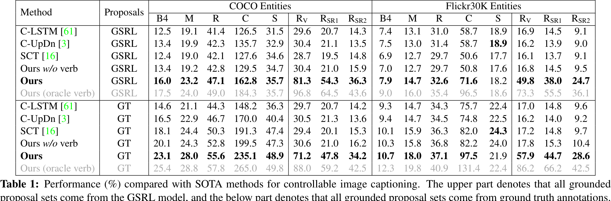
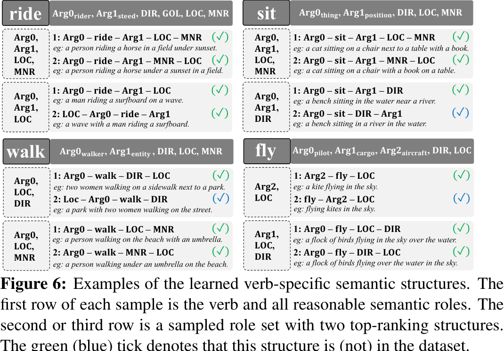
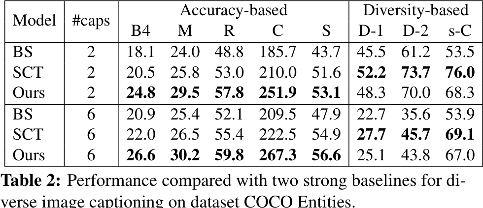

# Human-like Controllable Image Captioning with Verb-specific Semantic Roles

- Authors: Long Chen2,3*,  Zhihong Jiang1*    Jun Xiao\({}^{1\dagger}\)   Wei Liu4
- Affiliations: 1Zhejiang University   2Tencent AI Lab   3Columbia University   4Tencent Data Platform  zjuchenlong@gmail.com, {zju_jiangzhihong, junx}@zju.edu.cn, wl2223@columbia.edu  denotes equal contributions,   &dagger; denotes the corresponding author.

## abs
The paper introduces Controllable Image Captioning (CIC) and proposes a new control signal called Verb-specific Semantic Roles (VSR) to address the limitations of existing objective control signals. The VSR ensures event-compatibility and sample-suitability, improving the controllability of caption generation. The proposed framework consists of a Grounded Semantic Role Labeling (GSRL) model, a Semantic Structure Planner (SSP), and a Role-shift Captioning model. Extensive experiments on COCO Entities and Flickr30K Entities datasets demonstrate the effectiveness of the framework in achieving better controllability and generating diverse captions. Future work includes extending VSR to other text generation tasks and developing a more general framework for images without verbs.
## intro
The paper introduces Controllable Image Captioning (CIC) and proposes a new control signal called Verb-specific Semantic Roles (VSR) to address the limitations of existing objective control signals. The proposed framework consists of a grounded semantic role labeling (GSRL) model, a semantic structure planner (SSP), and a role-shift captioning model. Extensive experiments on COCO Entities and Flickr30K Entities datasets demonstrate that the proposed framework achieves better controllability and generates diverse captions. Future work includes improving the captioning model, extending VSR to other tasks, and designing a more general framework.
## related work
This paper introduces the Verb-specific Semantic Roles (VSR) as a control signal for Controllable Image Captioning (CIC). The VSR ensures event-compatibility and sample-suitability, addressing limitations in existing objective control signals. The proposed framework includes a grounded semantic role labeling model, a semantic structure planner, and a role-shift captioning model. Extensive experiments on COCO Entities and Flickr30K Entities datasets demonstrate that the VSR-guided framework achieves better controllability and generates diverse captions compared to strong baselines. Future work includes improving the captioning model, extending VSR to other tasks, and designing a more general framework.
## 3 Proposed Approach
This paper introduces Controllable Image Captioning (CIC) and proposes a new control signal called Verb-specific Semantic Roles (VSR) to improve controllability. The VSR control signal ensures event-compatibility and sample-suitability. The proposed framework includes a grounded semantic role labeling (GSRL) model, a semantic structure planner (SSP), and a role-shift captioning model. Extensive experiments on COCO Entities and Flickr30K Entities datasets demonstrate that the proposed framework achieves better controllability and can generate diverse captions. Future research directions include improving the captioning model, extending VSR to other text generation tasks, and designing a more general framework for images without verbs.
## experiment
This paper presents a novel approach for Controllable Image Captioning (CIC) using Verb-specific Semantic Roles (VSR) as a control signal. The VSR consists of a verb and semantic roles, ensuring event-compatibility and sample-suitability. The proposed framework includes a grounded semantic role labeling (GSRL) model, a semantic structure planner (SSP), and a role-shift captioning model. Extensive experiments on COCO Entities and Flickr30K Entities datasets demonstrate that the proposed framework achieves better controllability and generates diverse captions compared to baseline models. The results show significant improvements in accuracy-based metrics, and the diversity of the captions is slightly behind one baseline. Future research directions include improving the captioning model, extending VSR to other text generation tasks, and developing a more general framework for images without verbs.
## conclusion
This paper introduces a novel control signal, Verb-specific Semantic Roles (VSR), for controllable image captioning (CIC). The authors argue that existing control signals overlook the importance of being event-compatible and sample-suitable. VSR consists of a verb and semantic roles, ensuring event compatibility and sample suitability. The proposed framework includes a grounded semantic role labeling (GSRL) model, a semantic structure planner (SSP), and a role-shift captioning model. Experimental results on COCO Entities and Flickr30K Entities datasets demonstrate that the proposed framework achieves better controllability and generates diverse captions compared to baselines. Future work includes improving the captioning model, extending VSR to other tasks, and designing a more general framework.